# 用这个 VS 代码扩展改进你的 Docker 工作流程

> 原文：<https://dev.to/azure/improve-your-docker-workflow-with-this-vs-code-extension-j60>

在 [Twitter](https://twitter.com/chris_noring) 上关注我，很乐意接受您对主题或改进的建议/Chris

> 作为 Docker 工作流程的一部分，您需要做很多事情。您将在终端上花费大量时间，并花费大量时间编写 Dockerfiles 和/或 docker-compose.yaml。幸运的是，有一个扩展可以极大地帮助您完成上述所有工作以及部署到云

## 你的码头工作流程

在与 Docker 打交道时，我们会不断采取一些行动。这些是:

*   **创作**a dock file 或 docker-compose.yml
*   **管理**，在这里我们可以做任何事情，从管理、标记、推送到回购等等
*   **运行/启动/停止/移除您的容器**，如果我们对每个容器/图像都这样做，这里会涉及到相当多的动作。幸运的是，我们有 Docker Compose 可以对组进行操作。
*   将你的 Docker 镜像部署到类似 Docker Hub 或云中的某个地方
*   **投入生产**，这可以在内部完成，也可以使用某种云解决方案

除非我们有像 Docker Kitematic 这样的工具或类似的工具，否则我们可能会在终端上花费大量时间。

## 资源

下面是一组资源，这样您不仅可以加深对 Docker 的了解，还可以在云环境中与 Docker 打交道:

*   [注册一个免费的 Azure 账户](https://azure.microsoft.com/en-us/free/?wt.mc_id=devto-blog-chnoring)要使用云中的容器并部署到云中，你需要一个免费的 Azure 账户
*   我们在本文中描述的 Docker 扩展为你做了很多事情，比如创作、管理、部署，如果你对 Docker 很认真的话，非常值得安装
*   5 部分 Docker 系列这个系列实际上涵盖了 Docker 的大部分内容，像图像、容器、网络、体积等基本概念
*   [云中的容器](https://docs.microsoft.com/en-gb/azure/containers/?wt.mc_id=devto-blog-chnoring)这是一个很棒的概述页面，展示了关于云中容器的其他信息
*   [在云中部署您的容器](https://docs.microsoft.com/en-gb/azure/container-instances/container-instances-tutorial-prepare-app?wt.mc_id=devto-blog-chnoring)教程展示了利用您现有的 Docker 技能并让您的服务在云中运行是多么容易
*   [创建容器注册表](https://docs.microsoft.com/en-gb/azure/container-instances/container-instances-tutorial-prepare-acr?wt.mc_id=devto-blog-chnoring)您的 Docker 映像可以在 Docker Hub 中，也可以在云中的容器注册表中。将您的图像存储在某个地方，并能够在几分钟内从该注册表创建一个服务，这不是很棒吗？
*   [使用微服务和无服务器创建 GraphQL API](https://dev.to/azure/learn-how-you-can-build-a-serverless-graphql-api-on-top-of-a-microservice-architecture-233g)这展示了使用 Docker 和使用 graph QL 的容器化
*   [将微服务和 GraphQL API 部署到云中](https://dev.to/azure/learn-how-you-can-build-a-serverless-graphql-api-on-top-of-a-microservice-architecture-part-ii-deploy-it-to-the-cloud-26b6)这展示了如何将 Docker 容器推送到云中，以及如何创建和部署无服务器功能

## Docker 扩展

本文的重点是展示一个能够真正帮助您的工作流的 Visual Studio 代码扩展。那么它能做什么呢？

*   **创作**，它帮助生成 Docker 文件以及 Docker 合成文件。此外，它还能帮助你自动完成，甚至链接你的文件等等。
*   **管理**，它装载了一组命令，可以帮助从文件生成到管理您的图像和容器的一切
*   **浏览存储库**，它允许你浏览你的 Docker Hub 以及云中的容器注册表
*   **部署到云**，该工具使您能够一键部署到云，只需选择您的映像，就可以了，就像您希望的部署一样简单

## 安装

我们像安装任何扩展一样安装它。我们打开 Visual Studio 代码，按下扩展按钮并键入`Docker`，就像这样:
[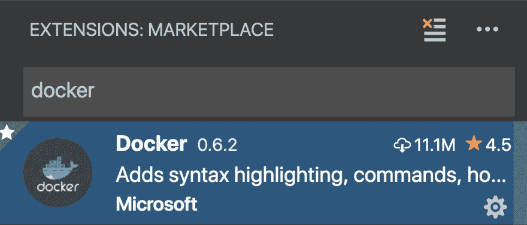](https://res.cloudinary.com/practicaldev/image/fetch/s--JV0GrOHo--/c_limit%2Cf_auto%2Cfl_progressive%2Cq_auto%2Cw_880/https://thepracticaldev.s3.amazonaws.com/i/51dg7315a7sbyyp4wfzn.png)

## 创作

有两种方法可以解决这个问题:

*   创建我们的`Dockerfile`或`docker-compose.yml`文件并开始创作
*   让扩展为我们生成文件，让我们展示后者。

### 生成文件

在 Mac 上调出你的命令菜单`CMD +SHIFT + P`，开始输入`Docker`。它应该给你看这个
[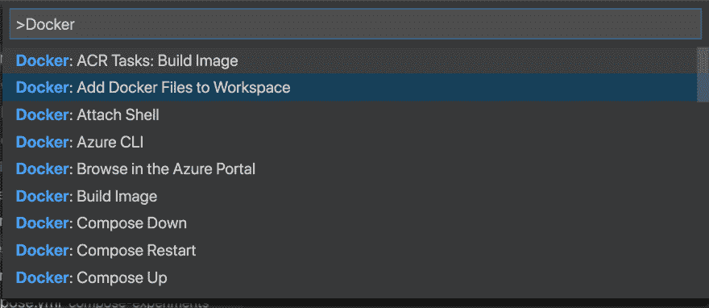](https://res.cloudinary.com/practicaldev/image/fetch/s--2ugjt1xo--/c_limit%2Cf_auto%2Cfl_progressive%2Cq_auto%2Cw_880/https://thepracticaldev.s3.amazonaws.com/i/edbe6u57002aull326gz.png) 
选择`Add Docker Files to Workspace`

然后我们被提示使用下面的`Select platform`
[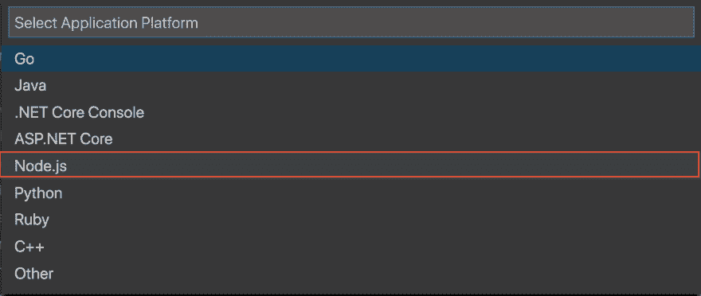](https://res.cloudinary.com/practicaldev/image/fetch/s--XMl5wxe---/c_limit%2Cf_auto%2Cfl_progressive%2Cq_auto%2Cw_880/https://thepracticaldev.s3.amazonaws.com/i/o5aqovvkf6pg6lt6nze3.png) 
我们使用`Node.js`因为这就是我们想要构建的。如果你有机会。Net 核心项目，请选择该项目。

最后，我们被要求选择一个端口，我们选择默认的建议端口`3000`。

[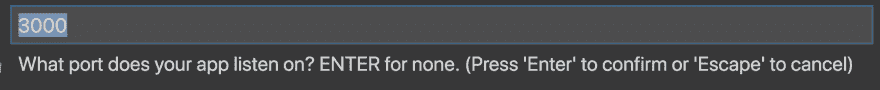](https://res.cloudinary.com/practicaldev/image/fetch/s--dCsfskl9--/c_limit%2Cf_auto%2Cfl_progressive%2Cq_auto%2Cw_880/https://thepracticaldev.s3.amazonaws.com/i/cds98m9u7crht0wt1vic.png)

> 选择平台后，您需要完成的对话框可能因平台的不同而有所不同

#### 生成的文件

好吧，那么，我们从中得到了什么？
我们得到了:

*   坞站-组合. yml
*   坞站-复合调试. yml
*   Dockerfile
*   。dockerignore

不仅仅是文件，还加载了内容。

**docker file**T3】让我们以`Dockerfile`为例来看看

```
FROM node:10.13-alpine
ENV NODE_ENV production
WORKDIR /usr/src/app
COPY ["package.json", "package-lock.json*", "npm-shrinkwrap.json*", "./"]
RUN npm install --production --silent && mv node_modules ../
COPY . .
EXPOSE 3000
CMD npm start 
```

上面我们看到一切都为我们做好了。它有

*   **选中**一幅图像
*   **设置**一个环境变量
*   **Set** a workdir
*   **复制了** `package.json`和`package-lock.json`
*   **已安装**我们的图书馆
*   **复制了**我们的申请文件
*   **暴露了**一个端口
*   **发出了**一个命令，将在容器中启动我们的应用程序

相当可观！。当然，我们仍然需要创作我们的应用程序

**docker-compose . yml**T3】接下来我们来看看`docker-compose.yml`文件:

```
version: '2.1'

services:
  articles:
    image: articles
    build: .
    environment:
      NODE_ENV: production
    ports:
      - 3000:3000 
```

它已经为如何构建映像、设置环境变量和映射端口做好了一切准备

**docker-compose.debug.yml**

**。dockerignore**
这个文件包含了很多好的模式，这些模式匹配我们不想复制的文件，比如`node_modules`、`.git`、`.env`、`Dockerfile`。您可能希望调整该文件以满足您的需要。

### 使用自动完成功能创作

好的。让我们看一个场景，我们从头开始做所有的事情。让我们从创建一个`Dockerfile`开始。

让我们开始输入`FROM`。正如你在下面看到的，我们得到了输入命令的帮助，以及它应该是什么样子

[](https://res.cloudinary.com/practicaldev/image/fetch/s--94Lyy4WL--/c_limit%2Cf_auto%2Cfl_progressive%2Cq_auto%2Cw_880/https://thepracticaldev.s3.amazonaws.com/i/v32cydz3qx9vzjlcglcr.png)

我们继续键入我们的`baseImage`的名字，在这种情况下，我们正在寻找`Node.js`图像，所以我们开始键入字符`n`。下面我们得到一个与我们输入的内容相匹配的选项列表。它按受欢迎程度列出了基本图片，还添加了一些有用的信息，以便我们了解我们得到了什么:

[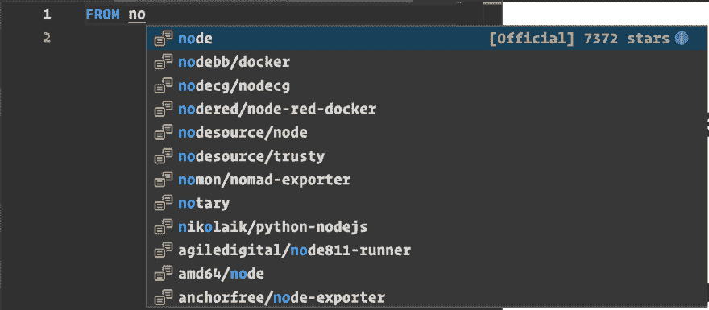](https://res.cloudinary.com/practicaldev/image/fetch/s--i8cuzFYa--/c_limit%2Cf_auto%2Cfl_progressive%2Cq_auto%2Cw_880/https://thepracticaldev.s3.amazonaws.com/i/bhowko7dniiyo1yiom6a.png)

接下来我们尝试输入的是`ENV`，但是在它开始提示我们正在编写什么命令以及如何输入之前，我们只到了`E`:

[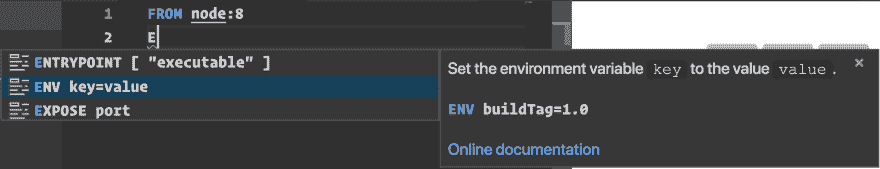](https://res.cloudinary.com/practicaldev/image/fetch/s--oSiSwvR4--/c_limit%2Cf_auto%2Cfl_progressive%2Cq_auto%2Cw_880/https://thepracticaldev.s3.amazonaws.com/i/c42tk2ws9y464qanp8vf.png) 
正如你所看到的，它对我们应该如何键入命令很有帮助。

接下来是`WORKDIR`，它向我们展示了:
[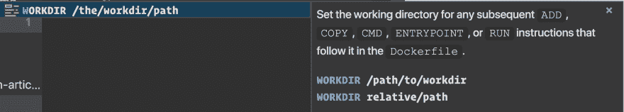](https://res.cloudinary.com/practicaldev/image/fetch/s--aIzmx8uo--/c_limit%2Cf_auto%2Cfl_progressive%2Cq_auto%2Cw_880/https://thepracticaldev.s3.amazonaws.com/i/cu8ldevt8ori764sqalm.png) 
它不仅告诉我们如何键入命令，还告诉我们它会影响像`COPY`和`ADD`等命令。

在这一点上，我们想告诉它在运行像*安装库*这样的命令之前复制一些我们可能需要的文件:

[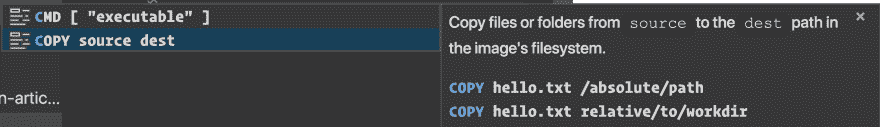](https://res.cloudinary.com/practicaldev/image/fetch/s--CmLfEE9b--/c_limit%2Cf_auto%2Cfl_progressive%2Cq_auto%2Cw_880/https://thepracticaldev.s3.amazonaws.com/i/e7u9bd54gm4p3wlncqqv.png) 
这给了我们两种不同的方式来复制东西`relative`或`absolute`。

如前所述，我们想运行一个命令，这样我们就可以安装东西。我们的自动完成告诉我们以下内容:

[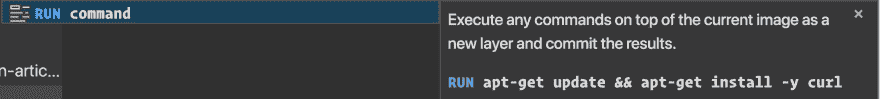](https://res.cloudinary.com/practicaldev/image/fetch/s--uBGQK3p2--/c_limit%2Cf_auto%2Cfl_progressive%2Cq_auto%2Cw_880/https://thepracticaldev.s3.amazonaws.com/i/ckdv05evl8asuqi7f2pw.png) 
它再次暗示了那可能是什么样的命令。

到目前为止，在`Dockerfile`中，我们可能想要`COPY`我们的应用程序文件，我们已经向您展示了如何使用自动完成功能，所以让我们看看`EXPOSE` :
[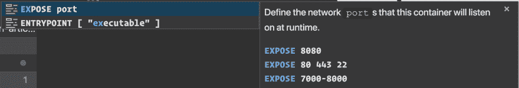](https://res.cloudinary.com/practicaldev/image/fetch/s--WY6x-sdN--/c_limit%2Cf_auto%2Cfl_progressive%2Cq_auto%2Cw_880/https://thepracticaldev.s3.amazonaws.com/i/7qjwdsp37oqq2ef5s9k6.png)

如您所见，它展示了导出端口的所有不同方式，非常有教育意义。

好的，在这一点上通常还需要一个命令，或者我们使用一个`CMD`或者`ENTRYPOINT`来启动我们在容器中的应用程序:

[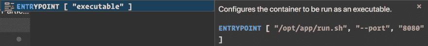](https://res.cloudinary.com/practicaldev/image/fetch/s--HI25uTKE--/c_limit%2Cf_auto%2Cfl_progressive%2Cq_auto%2Cw_880/https://thepracticaldev.s3.amazonaws.com/i/9al1hhbhpz7gg384fwy3.png)

## 管理

我们将在这里使用命令选项板。它让我们调用的命令数量多得近乎荒谬。不过，让我们试着按主题提及它们。命令面板由一长串 Docker 命令组成。我们能

*   **构建** Docker image 图像
*   **运行**一个容器
*   **参见**日志
*   **停止/移除**一个容器
*   **停止/删除**一幅图像
*   **显示**日志和更多内容..

让我们专注于让应用程序启动并运行。

### 打造 app

好了，这是一个非常简单的应用程序，让我们在终端上运行
，把它变成 Node.js 应用程序

```
npm init -y 
```

然后运行:

```
npm install express 
```

随后将以下内容添加到`app.js` :

```
const express = require('express')
const app = express()
const port = 3000

app.get('/', (req, res) => res.send('Hello World!'))
app.listen(port, () => console.log(`Example app listening on port ${PORT}!`)) 
```

最后，通过向`scripts`添加以下内容来更新`package.json`:

```
"start":  "node.app.js" 
```

现在我们准备好了！

> 对于以下所有命令，从菜单中用`View / Command Palette`调出命令面板或调用短命令，对于 Mac，它是`CMD + SHIFT + P`

### 建立形象

开始输入`Docker: Build`，自动完成将缩小选择范围。调用建议的命令。

这将询问我们是否要使用我们所站的 Dockerfile 文件，以及用什么来标记图像。在我们完成选择后，它将下拉基本图像并执行`Dockerfile`中的所有命令。
一旦完成，你应该可以通过键入`docker images`看到新构建的图像，并寻找你给它的标签名，它应该列在顶部。

### 运行图像

开始键入`Docker: Run`并接受它建议的命令。这将为您提供一个可以运行的 Docker 图像列表。查看它在终端中调用的命令，看起来是这样的:`docker run --rm -d -p 3000:3000/tcp articles:latest`

### 复合坞站

当然，我们可以利用 Docker Compose 的功能，无论是向上还是向下。

开始键入`Docker: Compose Up`，这将在第一次运行时创建 Docker 映像，然后运行容器。用`docker ps`验证这一点。此外，我们还有`Docker: Compose Down`和`Docker Compose Restart`。

## 浏览仓库

在你的动作栏的底部，你应该有一个看起来像码头鲸的图标。点击它，你会看到:

[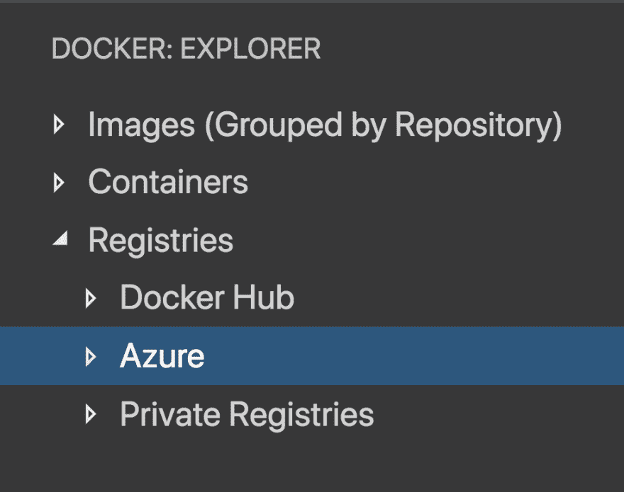](https://res.cloudinary.com/practicaldev/image/fetch/s--CvZXHRHs--/c_limit%2Cf_auto%2Cfl_progressive%2Cq_auto%2Cw_880/https://thepracticaldev.s3.amazonaws.com/i/2fu61gtvykrbg0owks91.png) 
正如你在上面看到的，你可以查看你机器上的所有图像，但你也可以查看不同的注册表，如 Docker Hub、Azure，如果你添加了任何私人注册表。要使用 Azure one，你需要安装`Azure Account`扩展。安装完成后，您应该会看到类似这样的内容:

[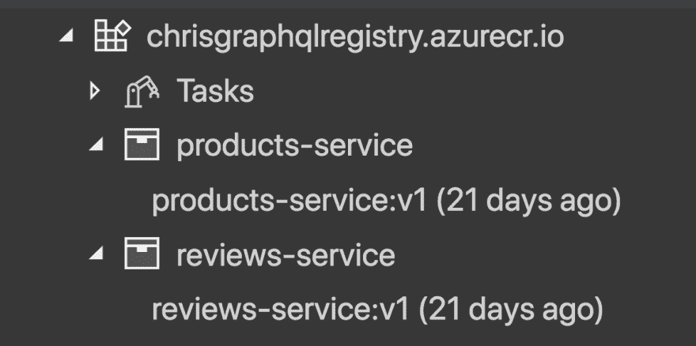](https://res.cloudinary.com/practicaldev/image/fetch/s--JyjmvfDt--/c_limit%2Cf_auto%2Cfl_progressive%2Cq_auto%2Cw_880/https://thepracticaldev.s3.amazonaws.com/i/34mzt866dok07b6truqt.png)

如果我们在 Azure 的容器注册表中右键单击一个 Docker 图像，我们可以执行更多的命令:
[](https://res.cloudinary.com/practicaldev/image/fetch/s--SG9Kr9BK--/c_limit%2Cf_auto%2Cfl_progressive%2Cq_auto%2Cw_880/https://thepracticaldev.s3.amazonaws.com/i/cash211cd6zsy7ov5w7r.png) 
如您所见，我们可以在门户中查看我们的资源。我们可以删除整个存储库，但是我们也可以将其中的任何内容下载到我们的本地机器上。

## 部署到云

有一种方法可以部署到云:

*   从 Docker Hub 部署

本文[涵盖了这个扩展](https://code.visualstudio.com/docs/azure/docker)的文章说从容器注册中心部署应该是可能的。我肯定是，我只是不知道如何从扩展中做到这一点。我会尽快更新我的文章。

无论如何，要从 Docker Hub 进行部署，您只需登录并右键单击您的 Docker 映像，然后选择 Deploy，就像这样:

[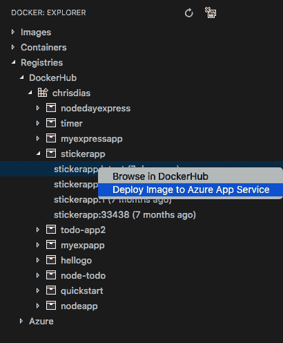](https://res.cloudinary.com/practicaldev/image/fetch/s--4lawcvVL--/c_limit%2Cf_auto%2Cfl_progressive%2Cq_auto%2Cw_880/https://thepracticaldev.s3.amazonaws.com/i/xo7nbt86ducbm7ofoggz.png)

## 总结

我们已经向您展示了使用这个 Visual Studio 代码扩展可以做的许多事情。您可以管理您的映像、容器，并使用它们做各种事情，如构建、运行、查看日志，甚至将它们带到云中。

我希望您觉得这很有用，并尝试一下这个扩展。