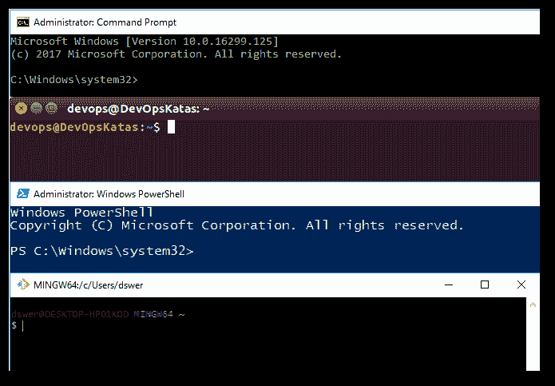

# 为命令行辩护

> 原文：<https://dev.to/dswersky/in-defense-of-the-command-line-3pnh>

我已经长大到足以记得与 PC 交互的唯一方式是通过命令行。IBM 个人电脑上的 DOS 是我接触计算机的起点。SYS 是挡在我和最新的 PC 游戏之间的配置。那是一段令人兴奋的时光，我们也不例外。

我年纪也够大了，还记得预装 Windows *的 PC 的新奇感。*“这是什么巫术？”我沉思着，穿过小小的独立电脑商店。“我要 Windows，我就自己装！”就这样开始了渐行渐远，在 PC 平台上，来自*叶的旧* DOS 提示。不幸的是，Windows 的拖放特性似乎超越了最终用户 PC 市场，进入了 Windows Server 用户群。就我而言，我在某种程度上是被这股潮流拖着走的。虽然我保留了一些基本的命令行能力，但随着时间的推移，我的终端/DOS 肌肉肯定萎缩了。

与此同时，Linux 和 Mac 社区在那个不错的老终端窗口中静静地继续他们的工作。两个用户群之间开始出现裂痕:一个严重依赖图形界面，另一个不太依赖图标和鼠标。随着时间的推移，我认为这已经成为微软人和其他人之间区别的标志。当然，这是一种概括。然而，我认为我们可以同意，在 Powershell 推出之前，Windows 对命令行工具的支持与 Linux 变体相比还有许多不足之处。

直到最近，这还是我作为微软员工的亲身经历。NET 开发人员和 Windows adept。然后我决定[写一本关于 DevOps 工具的书](http://www.leanpub.com/devopskatas)。随着我写这本书，我清楚地意识到我需要提供的不仅仅是指导。我需要为我要求我的读者进行的学习提供一个平台。我开始构思一个免费的*学习虚拟机*。当然，我的第一个问题是，什么操作系统？

不管是好是坏，Windows 都不是一个免费资源的选择。免费设备的唯一选择，比如我想到的那个，是 Linux。我面临着一个挑战:我最终必须学习 Linux 吗？经过一番苦思冥想，我决定，是的，我必须这么做。随之而来的是不可避免的:生活在命令行上。Linux 首先是 CLI，其次是阿桂。我一头扎进去……令我惊讶的是，我重新发现了我久违的对命令行工作的热爱。

* * *

所有这些思考都回避了一个问题:命令行有什么本质上更好的地方吗？GUI 的批评者仅仅是憎恨者，寻找不喜欢 Windows 及其用户的地方吗？也许吧，但我认为事情远不止如此。我确实相信图形界面和命令行界面之间存在数量上的差异。

所有的抽象都会泄漏，有些是有用的

*——未知*

不管喜欢与否，图形界面是一种抽象。他们对你隐瞒事情。有时候，他们当着你的面撒谎。

相比之下，命令 shell(无论哪一个恰好是您最喜欢的)非常诚实。如果有什么东西爆炸了，你会马上知道。

这是我在命令提示符下强迫自己回归生活时重新发现的现实。当前的 DevOps 技术，包括 Docker、Kubernetes、Git、vagger、Packer、Chef、Puppet 等等，都主要是命令行工具。当工具主要是命令行界面(CLI)时，它们往往更简单、更直接，并且*肯定*更适合自动化。)

由于对现代软件交付工具和技术的研究，我又回到了指挥领域。信息技术的世界正在飞速变化。DevOps 和站点可靠性工程将开发人员、管理员和操作员的角色融合成一个超级角色。这些作业积极地在命令提示符下*活*；这是没有办法的。现在，可以说命令行的力量在所有平台上都是平等的(微软在这方面的巨大进步值得称赞。)现在是重新投入的最佳时机。准备好你的键盘。

* * *

出于各种原因，我们中的一些人比其他人更习惯使用 CLI 工具。如果你不太舒服，但你想提高你的技能，请允许我提供一些建议。

学习 Linux(反正你会想学的。)
毫无疑问——Linux 已经占据优势多年，它的时代已经到来。(我自己最近也换成了 Mac，所以我完全转换成了一个 Linux 变种，再高兴不过了。)在现代软件基础设施中，很难避免 Linux。Linux 甚至正在入侵最彻底的、同质的微软环境；这完全是微软的设计。对 Linux 的支持像野火一样蔓延到整个微软产品生态系统。

**学习**[**Docker**](https://www.docker.com/)
Docker 是在 Linux 中长大的，Linux 是学习 Docker 的地方。docker 99%是命令行。启动容器、管理运行中的容器，当然还有定义新容器都是命令行任务。您还将学到更多关于 Linux 内部的知识，因为 Docker Hub 上的大多数容器都是基于 Linux 的。

安装 [**ConEmu**](https://conemu.github.io/en/Downloads.html)
关于 Windows 上的命令行体验，我个人最讨厌的一点是，虽然它同样强大，但与 Linux 和 OSX 相比，它还是很难看。然而，事情并不一定是那样的。Windows 控制台模拟器 ConEmu 提供了几乎无限的视觉和环境定制。

**为 Linux 安装** [**Windows 子系统**](https://docs.microsoft.com/en-us/windows/wsl/install-win10)
你可能会注意到这里的一个模式(咳咳，Linux。)是的，一个完整的 [Linux 子系统](https://docs.microsoft.com/en-us/windows/wsl/install-win10)现在可以用于 Windows 10 周年纪念版和更高版本。可以安装 Ubuntu 或者 SUSE Linux。它不仅仅是一个 shell——它是一个完整的 Linux 子系统，包含 Linux 开发人员和管理员使用的所有内置命令和实用程序。

**使用** [**巧克力**](https://chocolatey.org/)
“在 Windows 中，像 Linux 用户那样做。”这是原话吗？无论如何，Linux 使用命令行软件包系统是有原因的:自动化。像所有优秀的 DevOps 实践者一样，从命令行开始安装您的工具，您将很快创建定制的开发人员环境。

**学习**[**Powershell**](https://docs.microsoft.com/en-us/powershell/)
Powershell 和 bash 一样能干，但是它使用了非常不同的命令结构。这是在 Windows 中实现自动化的首选方法。学习 Powershell，您将成为任何 IT 环境中的宝贵资产。

> 您想了解一些很棒的命令行 DevOps 工具吗？
> [http://www.devopskatas.com](http://www.devopskatas.com)