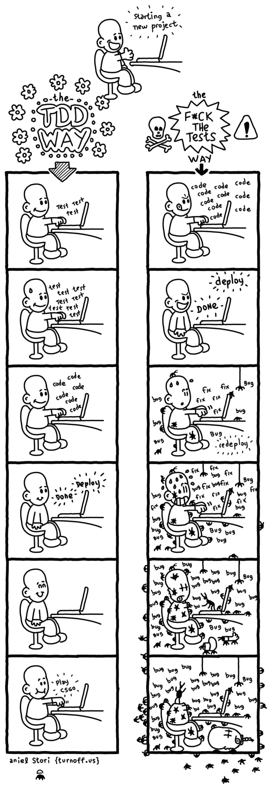

# 在我们信任的测试中

> 原文：<https://dev.to/anapaulagomes/in-tests-we-trust-2nbf>

## 那么，你想做些测试，对吗？

不久前，当我开始我的程序员生涯时，我听到其他程序员谈论两件事:重构和单元测试。老实说，他们只是谈论重构来解释为什么应该避免这种做法(以及他们有多害怕这样做)，并谈论单元测试来说它们一开始就太昂贵了，它们花了很多时间，等等。单元测试听起来确实像一个乌托邦梦想。

作为初学者，我不知道该怎么想。几年后，尽管感觉自己总是一个初学者，我还是想给你一个关于 Python 的 TDD 以及如何进行单元测试和如何安全重构的简单介绍。

## 单元测试和 TDD？

可能有数百万篇关于这个主题的博客帖子。但是让我们从我的角度谈一点吧！😅

单元测试是一些测试输入、输出和代码行为的代码片段。你可以随时写。

但是*测试驱动开发*是一种思考(和写作)的策略！)**先测试**。

[](https://i.giphy.com/media/EvWx1BeeRyyJi/giphy.gif)

让我更好地解释一下——用一个例子(最后是代码！).

## 自由女神

想象一下，一个客户有一个网站，他通过这个网站从潜在客户那里获得了很多联系。过了一段时间，他意识到对企业来说，识别消费者的特征很重要:年龄、性别、工作等等。但是网站只收到名字和电子邮件。

他们雇你根据一个人的名字来辨别他/她的性别。幸运的是，有一个神奇的 API 叫做 [Genderize.io](//Genderize.io) 可以识别可能的性别。并且你很快开发了你的 API 连接:

```
requests.get('https://api.genderize.io/?name=ana') 
```

然而，客户要求您编写单元测试，您对 TDD 很好奇。我们的旅程从这里开始！

## 婴儿步伐

API 非常简单，你的工作几乎已经完成了。但是对于 TDD，我们需要首先考虑测试。有时开始可能会很艰难，但这完全没关系。真的。

回到代码，用*小步*思考，我们可以对返回性别的函数(方法/类)做什么样的更小的测试？

*你思考的时间*

概括一下:我们有一个名字作为输入，我们需要返回一个性别作为输出。所以，较小的测试是:给定一个名字，返回一个性别。

**输入** : Ana【姓名】
T3】输出:女【性别】

> -匈奴...我们是不是要写一个测试来检查给定的`Ana`是否应该返回`female`？
> 
> -没错！
> 
> -但我们没有任何代码！
> 
> -我们没有！
> 
> -😵

## 关于单元测试的重要方面

让我们编写我们的第一个测试！

```
def test_should_return_female_when_the_name_is_from_female_gender():
    detector = GenderDetector()
    expected_gender = detector.run('Ana')

    assert expected_gender == 'female' 
```

有一些细节需要注意。第一个是**测试名**。这些测试可以被认为是你的活文档。我们需要对它进行描述，并说明什么是预期的，什么是我们正在测试的。在这种情况下我们明确地说:`should return female when the name is from a female`。

测试文件名应该跟在模块名的后面。例如，如果我们的模块是`gender.py`，我们的测试名应该是`test_gender.py`。理想的做法是将测试文件夹与产品代码(实现)分离开来，并且有这样的东西:

```
mymodule/
-- module.py
-- another_folder/
---- another_module.py
tests/
-- test_module.py
-- another_folder/
---- test_another_module.py 
```

另一件要关心的事情是结构。广泛使用的约定是 AAA: **安排、行动和断言**。

*   **整理**:你需要整理执行那段代码(输入)所需的数据；
*   **Act** :这里你将执行被测试的代码(练习行为)；
*   **Assert** :执行完代码后，你会检查结果(输出)是否和你预期的一样。

现在您可以执行测试了。我建议自由党做这件事。但是你可以自由选择你喜欢的任何东西。

耶！我们进行了第一次测试。很美但是失败了。这太棒了。

## 循环往复

我希望此时你没有放弃这篇文章，因为这是一个关于 TDD 的重要事情的例子:循环。

该循环由三个步骤组成:

*   🆘写一个单元测试，让它失败(它需要失败，因为功能不在那里，对不对？如果这个测试通过了，就打电话给捉鬼敢死队，真的)
*   ✅写的特点，使测试通过！(之后可以跳舞)
*   🔵重构代码——第一个版本不需要很漂亮(不要害羞)

使用小步骤，您可以在每次添加或修改代码中的新特性时经历这个循环。

说到特性…让我们开始循环吧！

我们让测试失败了。厉害！现在是实现该特性的时候了。用循序渐进的方式思考，我们的实现应该遵循相同的规则，好吗？那么，**需要什么才能让这个测试通过**？不要考虑整个特性，只考虑测试。

*你思考的时间*

我们只需要写出返回正确答案的方法:女！

```
def run(self, name):
    return 'female' 
```

[](https://res.cloudinary.com/practicaldev/image/fetch/s--Kbf8ztnG--/c_limit%2Cf_auto%2Cfl_progressive%2Cq_auto%2Cw_880/https://giphy.com/gifs/gcjmXVppGVhKw)

再次运行测试。是绿色的！！！🍀

好吧，好吧，这看起来很奇怪，也许你认为我疯了。但是想想婴儿学步…现在我们需要在试卷上写下每一部分。

## TDD 不是关于钱的测试

比起任何检查，我们需要首先考虑我们的软件设计。

关于 TDD 让我惊讶的一件事是我们如何有意识地并且很好地发展我们的软件设计，仅仅构建通过测试所需要的东西。当我们编写测试时，我们被迫首先考虑设计，以及如何将它分成小块。

让我们再写一个测试。除了女性名字，我们还需要识别男性名字。

```
def test_should_return_male_when_the_name_is_from_male_gender():
    detector = GenderDetector()
    expected_gender = detector.run('Pedro')

    assert expected_gender == 'male' 
```

但是当我们运行它的时候，它会失败，因为我们只是返回`female`，对吗？让我们用我们的*真正的*代码来修复它。

```
import requests

def run(self, name):
    result = requests.get('https://api.genderize.io/?name={}'.format(name))
    return result['gender'] 
```

现在我们的测试通过了！耶！

[](/img/tests-passing.png)

我们还有一些其他的场景，比如空名字，API 异常等等。但这将是你的家庭作业。

[](https://res.cloudinary.com/practicaldev/image/fetch/s--2Xo5f6Xu--/c_limit%2Cf_auto%2Cfl_progressive%2Cq_auto%2Cw_880/https://turnoff.us/image/en/tdd-vs-ftt.png)

## 外卖

我希望这对你来说是有趣的！要记住:

*   关于 TDD 的最大优势是先完成**软件设计**
*   你的代码将会更加可靠:在一次改变之后，你可以平静地运行你的测试
*   开始可能很难，但这没关系。你只需要**练好**！

这篇文章中使用的例子，有更多的测试，可以在 GitHub 的这个库上找到。

深入 TDD 的两本书:

*   [测试驱动开发:举例](https://www.amazon.com.br/Test-Driven-Development-Kent-Beck/dp/0321146530)
*   [在测试的引导下开发面向对象的软件](https://www.amazon.com.br/Growing-Object-Oriented-Software-Guided-Tests/dp/0321503627)

玩得开心！

* * *

我们对这个代码有疑问。每次我们运行它时，代码都会向 API 发出真正的请求，这需要很长时间。我们将在下一篇关于**模仿**的帖子中学习如何处理这个问题。