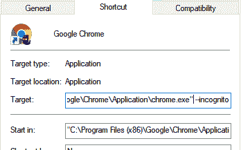

# chrome 中的匿名模式

> 原文：<https://dev.to/0xshetty/incognito-mode-in-chrome-32nn>

使用 chrome 浏览器时，我们至少可以使用隐名模式。因此，这里有一种方法总是在隐姓埋名模式下打开 chrome，使用这个参数作为应用程序的快捷方式。

`--incognito`

打开应用程序快捷方式的属性，更改如下

下面是隐姓埋名模式的作用和大多数人的想法正好相反。所以，隐姓埋名只是确保当你关闭窗口时，像历史记录和 cookie 这样的数据被删除。它不会对 ISP 或运行在您操作系统中的软件隐藏您正在浏览的内容，如键盘记录器或杀毒软件等。,

浏览愉快！有点隐姓埋名👽😜

-照片由布雷登·安德森在 Unsplash 上拍摄