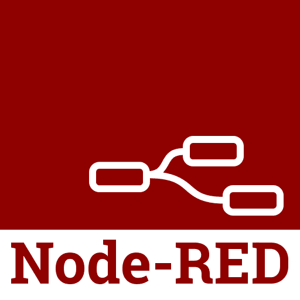

# 通过使用 API 打开数据来提高生产力

> 原文：<https://dev.to/coda/increasing-productivity-by-opening-your-data-with-apis-2jc6>

消费者想要“拥有”他们的 dataーbut，这是一个不同的故事。通过保持你的数据私有，不允许你的其他平台处理和分析你的数据，你可能会在你的行业中失去竞争优势。此外，如果不能通过 API 方便地访问数据，您可能会损失很多生产力。当然，在竞争激烈的行业工作可能意味着你的数据*是你的竞争优势*，但对许多企业来说，向世界开放你的数据意味着更多的用户和客户可以与你的企业互动。

### 消除数据录入或复制粘贴

没有什么比手动将数据输入到电子表格或其他分析工具中更能降低工作效率了。将数据从一个源复制并粘贴到另一个源意味着源之间可能存在重复数据和差异。Coda 的核心原则之一是让我们的开发者有能力开发应用程序，而这一愿景的基石之一是将其他开发者已经在使用的应用程序与他们的 Coda doc 连接起来。

我们通过…你猜对了…API 来做到这一点。您在公司使用的日常应用程序，如 Gmail、Google Calendar 和 Slack，可以与 Coda doc 集成。这意味着您可以将谷歌日历中的最新会议*拉*到文档中以供进一步分析，或者可以安排将新会议*推*到谷歌日历中。这里的关键点是，没有复制粘贴或手动数据输入，因为你在其他应用程序上的数据会自动与你的 Coda 文档同步。

### 上下文切换扼杀生产力

有大量的报告和研究表明多任务处理实际上对生产力并没有那么大的好处。假设您正试图与您公司的团队共享您在 Excel 中创建的表格。这样做的一种常见方式可能包括以下内容:

1.  在 Excel 中复制表格
2.  打开您的 Outlook 或 Gmail 应用程序
3.  创建新的电子邮件
4.  将表格粘贴到电子邮件编辑器的邮件中
5.  请注意，有些列太宽，或者格式没有流过，所以您需要在 Excel 中编辑一些格式
6.  重复步骤 1–5

通过在这种情况下使用 [Gmail API](https://developers.google.com/gmail/api/) ，您可以在不同的界面中处理格式、电子邮件撰写，甚至发送电子邮件，而不必“启动”Gmail 应用程序。以上步骤是您在公司可能遇到的许多工作流中的一个，各种应用程序的 API 允许您将不同的应用程序混合在一起。对谷歌来说，创建 Gmail API 是让更多用户和开发者使用 Gmail 的关键策略。一个帮助你连接不同 API 的家庭手工业让你的工作流程自动化变得非常简单。阅读 Coda 关于[通过 Coda 包将你的数据](https://blog.coda.io/connecting-the-doc-9be7fc1fd571)连接在一起的观点。

### 开放数据鼓励社区内的创新

Coda 还决定创建一个 API，让用户能够进一步将他们的应用程序和数据连接在一起。当你的社区拥有建立图书馆所需的工具时，创新就发生了，如果你的数据在付费墙后面，图书馆就不存在了。

例如，一个社区成员利用 Coda API 构建了一个 [PHP 库](https://github.com/danielstieber/CodaPHP)，允许人们在 web 开发项目中从他们的文档中访问数据。还没有 Coda 文档作为网站或 CMS 后端的用例，但是有了这个库，它就成为了现实。由社区成员构建的库也是开源的，因此任何人都可以提交问题、功能请求并对项目做出贡献。

把数据和物理世界联系起来怎么样？Node-RED 是由 IBM 新兴技术团队创建的一个编程工具，它让用户能够将 API 与硬件连接起来。该工具主要用于物联网用例，但社区已经找到了有趣的方式来[连接工作流](https://nodered.org/)。

一个 Coda 社区用户也发现需要构建一个库，将他们的 Coda 文档与 Node-RED 工具连接起来，并创建了这个[库](https://github.com/serene-water/node-red-contrib-coda-io)来解决这个问题。此外，用户在 npm 上创建了一个[包，这是 Javascript 最流行的包管理器，使库更容易访问。](https://www.npmjs.com/package/node-red-contrib-coda-io)

### 结论

通过上面两个例子，两个用户用一个对公众开放的 API 进行创新，可以在不同的 API 之间建立更多的连接，这些 API 以前彼此不说话。最终目标是什么？提高工作效率，自动化工作流程，并鼓励他人以前所未有的新方式进行构建和创新。

构建和测试 API 也应该是一个无缝的自动化过程。我已经展示了 IBM 正在用 Node-RED 工具进行创新，因为它允许我们社区中的成员构建其他令人惊奇的工具。

使用像 IBM 的 API Connect Test and Monitor 这样的工具是非常重要的，它使得测试和监控 API 变得非常简单。它不需要任何代码，并且消除了其他工具通常需要的大量手工工作。

API 连接测试和监控永远免费—开始:[http://ibm.biz/apitest](http://ibm.biz/apitest)

* * *