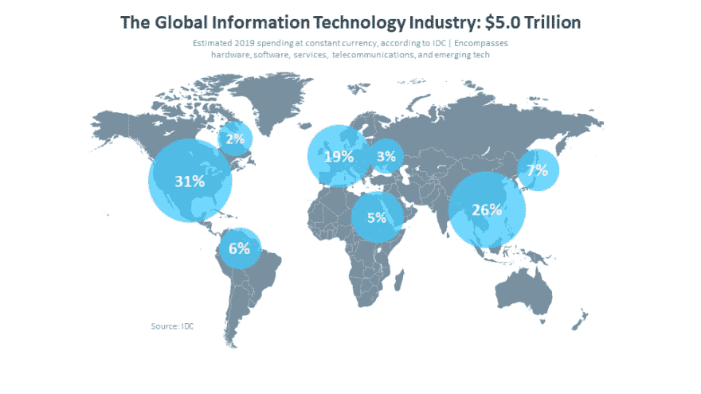

# 关于巴西 T.I .的信息至少是“好奇”的

> 原文：<https://dev.to/lleonardogr/informaes-sobre-ti-no-brasil-que-so-no-mnimo-curiosos-181l>

我博客中的葡萄牙语原文:[https://wp.me/paJQm5-2r](https://wp.me/paJQm5-2r)

很难说哪一个领域的历史像计算和信息系统领域一样短，但不难否认，巴西仍在努力理解这一领域在商业、生产力或人员管理方面的重要性，因此我提供了一些在巴西发现的有趣信息...

## 拉丁美洲的科技支出预计为 300 亿美元。

通过阅读 Comptia 的[文章](https://www.comptia.org/resources/it-industry-trends-analysis)，对世界 IT 行业投资的估计，美洲拉丁美洲将投资约 300 亿美元(约占巴西 GDP 的 0.8%)，但相比美国，其价值约为 1.3 万亿美元(约占该国 GDP 的 14%)。

 资料来源:IDC(根据 Comptia 的文章)

这表明巴西确实有很多机会发现技术上的不足，而且不仅仅是美国，日本的花费比整个拉丁美洲都要多一点，所以很可能我们国家有很多地方需要技术。

## 圣保罗不在世界十大科技城市之列。

尽管我们在世界上最大的 5 个大都市中名列前茅，但圣保罗与世界上最具科技和创新的城市相去甚远，商业内幕报道了 50 个城市，没有一个巴西城市。通过这一点，我们可以看到我们的城市中有多少技术挑战，主要涉及**物联网**不仅在设备方面，而且在创新人口的采用方面，我们有一些公司已经在与此合作，如优步、Nubank、Yellow、Airbnb 和 Fifth Floor。

> Cities are evaluated based on 31 segments of their industries and economy and 162 indicators of innovation. However, the company's data analysts compile the index score of each city in 60 of three major factors: cultural assets, human infrastructure, and networked markets.
> 
> -商业内幕

## 到 2019 年，巴西的 IT 专业人才缺口将达到 16.1 万人

由 site [CIO](https://cio.com.br/deficit-de-profissionais-de-ti-no-brasil-sera-de-161-mil-ate-2019/) 提供的数据显示，虽然巴西充满了技术增长的选择，但巴西似乎在技术教育方面缺乏培训，这是一个事实，巴西的 it 专业人员缺口很大，缺乏熟练的专业人员和更多的教育选择，因此除了设备、服务和系统的机会，巴西仍然可以在技术教育方面投入大量资金。有许多公司正在这样做，从创客学校到编程，除此之外还有专业的技术学校，如 Udacity，它为来自世界各地的学生提供服务，甚至离开巴西，Digital House，Alura，提供他们的代码屋书籍和课程，以及专注于巴西正在发展的技术的大学。

### [结论/意见]

将技术引入巴西仍有很大的空间，我们的国家似乎在这方面落后太多，也许引入世界范围内已经存在的模型、研究和创新可以有很大帮助，有时，更发达的国家已经拥有更成熟的技术，可以在 Tupiniquins 的土地上带来好处。

### [来源(非常重要)]

[https://canaltch . com . br/career/radio-o-ti-no-Brazil-e-a-demand-per-qualifying professionals/](https://canaltech.com.br/carreira/Raio-X-o-setor-de-TI-no-Brasil-e-a-demanda-por-profissionais-qualificados/)
[https://CIO . com . br/deficit-de-ti-no-Brazil-sera-161-000-ate-2019/】](https://cio.com.br/deficit-de-profissionais-de-ti-no-brasil-sera-de-161-mil-ate-2019/)