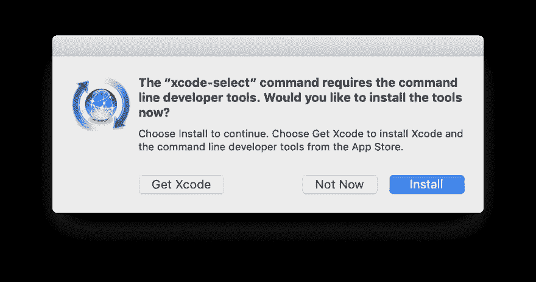
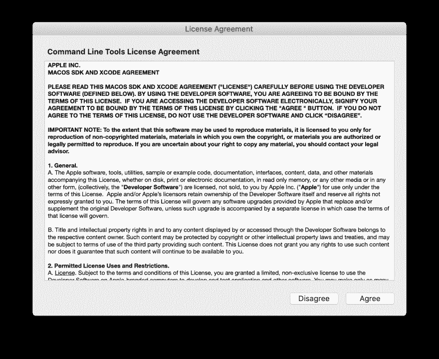
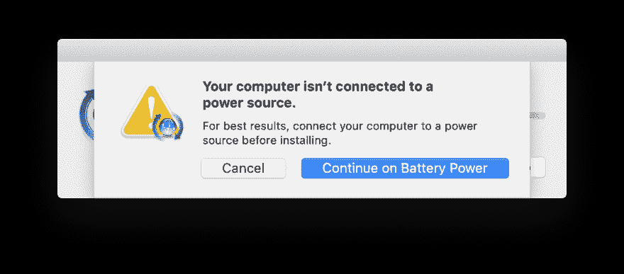
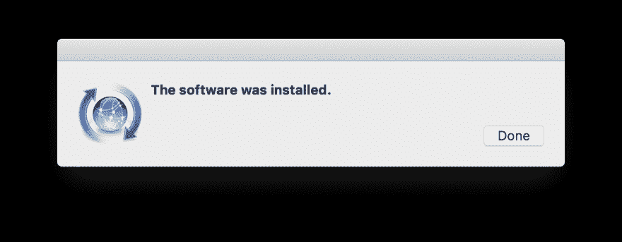
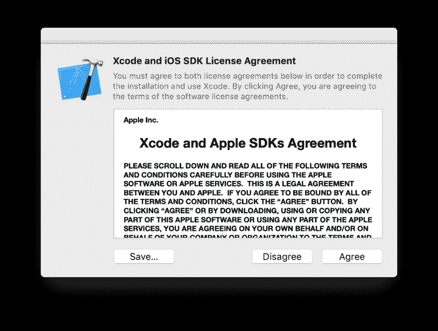

# 在 MacOS Mojave 上安装自制软件

> 原文：<https://dev.to/berry_clione/install-homebrew-on-macos-mojave-4m3m>

> 在 Mac 上安装自制软件

## 环境

*   麦克 OS X 10.14.2 莫哈韦
*   zsh

## 如何安装

*   安装`command line tools for Xcode`

```
$ xcode-select --install
xcode-select: note: install requested for command line developer tools 
```

Enter fullscreen mode Exit fullscreen mode

*   上面的命令显示了一个“安装命令行开发工具”的窗口，所以点击“安装”

[](https://res.cloudinary.com/practicaldev/image/fetch/s--x5__z6_V--/c_limit%2Cf_auto%2Cfl_progressive%2Cq_auto%2Cw_880/https://thepracticaldev.s3.amazonaws.com/i/lqwqdkn2ko7d0uj5j7tx.png)

*   弹出“许可协议”和“同意”
    *   如果您的 Mac 使用电池电源，则会显示一个提示，因此“继续使用电池电源”。

[](https://res.cloudinary.com/practicaldev/image/fetch/s--LA1OMxDn--/c_limit%2Cf_auto%2Cfl_progressive%2Cq_auto%2Cw_880/https://thepracticaldev.s3.amazonaws.com/i/ui18rp3wmo4wjxrzro6x.png)

[](https://res.cloudinary.com/practicaldev/image/fetch/s--MIsM_6v0--/c_limit%2Cf_auto%2Cfl_progressive%2Cq_auto%2Cw_880/https://thepracticaldev.s3.amazonaws.com/i/u25ohfi7dezy8oltro87.png)

[](https://res.cloudinary.com/practicaldev/image/fetch/s--J5cvmLHh--/c_limit%2Cf_auto%2Cfl_progressive%2Cq_auto%2Cw_880/https://thepracticaldev.s3.amazonaws.com/i/qmkbrvv2qo71enpichvk.png)

*   通过下面的命令安装 homebrew
    *   [https://brew.sh/](https://brew.sh/)

```
$ /usr/bin/ruby -e "$(curl -fsSL https://raw.githubusercontent.com/Homebrew/install/master/install)" 
```

Enter fullscreen mode Exit fullscreen mode

*   但是，一个错误发生了...

```
You have not agreed to the Xcode license.
Before running the installer again please agree to the license by opening
Xcode.app or running:
    sudo xcodebuild -license 
```

Enter fullscreen mode Exit fullscreen mode

*   所以，打开 Xcode 并“同意”，或者执行“sudo xcodebuild -license”

[](https://res.cloudinary.com/practicaldev/image/fetch/s--f3-QsRGb--/c_limit%2Cf_auto%2Cfl_progressive%2Cq_auto%2Cw_880/https://thepracticaldev.s3.amazonaws.com/i/3m6lqgdzuex3qmza9a8y.png)

*   再次执行 homebrew 安装命令。

```
$ /usr/bin/ruby -e "$(curl -fsSL https://raw.githubusercontent.com/Homebrew/install/master/install)"

==> This script will install:
/usr/local/bin/brew
/usr/local/share/doc/homebrew
/usr/local/share/man/man1/brew.1
/usr/local/share/zsh/site-functions/_brew
/usr/local/etc/bash_completion.d/brew
/usr/local/Homebrew

Press RETURN to continue or any other key to abort
==> Downloading and installing Homebrew...
remote: Enumerating objects: 36, done.
remote: Counting objects: 100% (36/36), done.
remote: Compressing objects: 100% (30/30), done.
remote: Total 116179 (delta 9), reused 13 (delta 5), pack-reused 116143
Receiving objects: 100% (116179/116179), 27.37 MiB | 10.71 MiB/s, done.
Resolving deltas: 100% (84823/84823), done.
From https://github.com/Homebrew/brew
 * [new branch]          master     -> origin/master
 * [new tag]             0.1        -> 0.1
 * [new tag]             0.2        -> 0.2
 * [new tag]             0.3        -> 0.3
 * [new tag]             0.4        -> 0.4
 * [new tag]             0.5        -> 0.5
 * [new tag]             0.6        -> 0.6
 * [new tag]             0.7        -> 0.7
 * [new tag]             0.7.1      -> 0.7.1
 * [new tag]             0.8        -> 0.8
 * [new tag]             0.8.1      -> 0.8.1
 * [new tag]             0.9        -> 0.9
 * [new tag]             0.9.1      -> 0.9.1
 * [new tag]             0.9.2      -> 0.9.2
 * [new tag]             0.9.3      -> 0.9.3
 * [new tag]             0.9.4      -> 0.9.4
 * [new tag]             0.9.5      -> 0.9.5
 * [new tag]             0.9.8      -> 0.9.8
 * [new tag]             0.9.9      -> 0.9.9
 * [new tag]             1.0.0      -> 1.0.0
 * [new tag]             1.0.1      -> 1.0.1
 * [new tag]             1.0.2      -> 1.0.2
 * [new tag]             1.0.3      -> 1.0.3
 * [new tag]             1.0.4      -> 1.0.4
 * [new tag]             1.0.5      -> 1.0.5
 * [new tag]             1.0.6      -> 1.0.6
 * [new tag]             1.0.7      -> 1.0.7
 * [new tag]             1.0.8      -> 1.0.8
 * [new tag]             1.0.9      -> 1.0.9
 * [new tag]             1.1.0      -> 1.1.0
 * [new tag]             1.1.1      -> 1.1.1
 * [new tag]             1.1.10     -> 1.1.10
 * [new tag]             1.1.11     -> 1.1.11
 * [new tag]             1.1.12     -> 1.1.12
 * [new tag]             1.1.13     -> 1.1.13
 * [new tag]             1.1.2      -> 1.1.2
 * [new tag]             1.1.3      -> 1.1.3
 * [new tag]             1.1.4      -> 1.1.4
 * [new tag]             1.1.5      -> 1.1.5
 * [new tag]             1.1.6      -> 1.1.6
 * [new tag]             1.1.7      -> 1.1.7
 * [new tag]             1.1.8      -> 1.1.8
 * [new tag]             1.1.9      -> 1.1.9
 * [new tag]             1.2.0      -> 1.2.0
 * [new tag]             1.2.1      -> 1.2.1
 * [new tag]             1.2.2      -> 1.2.2
 * [new tag]             1.2.3      -> 1.2.3
 * [new tag]             1.2.4      -> 1.2.4
 * [new tag]             1.2.5      -> 1.2.5
 * [new tag]             1.2.6      -> 1.2.6
 * [new tag]             1.3.0      -> 1.3.0
 * [new tag]             1.3.1      -> 1.3.1
 * [new tag]             1.3.2      -> 1.3.2
 * [new tag]             1.3.3      -> 1.3.3
 * [new tag]             1.3.4      -> 1.3.4
 * [new tag]             1.3.5      -> 1.3.5
 * [new tag]             1.3.6      -> 1.3.6
 * [new tag]             1.3.7      -> 1.3.7
 * [new tag]             1.3.8      -> 1.3.8
 * [new tag]             1.3.9      -> 1.3.9
 * [new tag]             1.4.0      -> 1.4.0
 * [new tag]             1.4.1      -> 1.4.1
 * [new tag]             1.4.2      -> 1.4.2
 * [new tag]             1.4.3      -> 1.4.3
 * [new tag]             1.5.0      -> 1.5.0
 * [new tag]             1.5.1      -> 1.5.1
 * [new tag]             1.5.10     -> 1.5.10
 * [new tag]             1.5.11     -> 1.5.11
 * [new tag]             1.5.12     -> 1.5.12
 * [new tag]             1.5.13     -> 1.5.13
 * [new tag]             1.5.14     -> 1.5.14
 * [new tag]             1.5.2      -> 1.5.2
 * [new tag]             1.5.3      -> 1.5.3
 * [new tag]             1.5.4      -> 1.5.4
 * [new tag]             1.5.5      -> 1.5.5
 * [new tag]             1.5.6      -> 1.5.6
 * [new tag]             1.5.7      -> 1.5.7
 * [new tag]             1.5.8      -> 1.5.8
 * [new tag]             1.5.9      -> 1.5.9
 * [new tag]             1.6.0      -> 1.6.0
 * [new tag]             1.6.1      -> 1.6.1
 * [new tag]             1.6.10     -> 1.6.10
 * [new tag]             1.6.11     -> 1.6.11
 * [new tag]             1.6.12     -> 1.6.12
 * [new tag]             1.6.13     -> 1.6.13
 * [new tag]             1.6.14     -> 1.6.14
 * [new tag]             1.6.15     -> 1.6.15
 * [new tag]             1.6.16     -> 1.6.16
 * [new tag]             1.6.17     -> 1.6.17
 * [new tag]             1.6.2      -> 1.6.2
 * [new tag]             1.6.3      -> 1.6.3
 * [new tag]             1.6.4      -> 1.6.4
 * [new tag]             1.6.5      -> 1.6.5
 * [new tag]             1.6.6      -> 1.6.6
 * [new tag]             1.6.7      -> 1.6.7
 * [new tag]             1.6.8      -> 1.6.8
 * [new tag]             1.6.9      -> 1.6.9
 * [new tag]             1.7.0      -> 1.7.0
 * [new tag]             1.7.1      -> 1.7.1
 * [new tag]             1.7.2      -> 1.7.2
 * [new tag]             1.7.3      -> 1.7.3
 * [new tag]             1.7.4      -> 1.7.4
 * [new tag]             1.7.5      -> 1.7.5
 * [new tag]             1.7.6      -> 1.7.6
 * [new tag]             1.7.7      -> 1.7.7
 * [new tag]             1.8.0      -> 1.8.0
 * [new tag]             1.8.1      -> 1.8.1
 * [new tag]             1.8.2      -> 1.8.2
 * [new tag]             1.8.3      -> 1.8.3
 * [new tag]             1.8.4      -> 1.8.4
 * [new tag]             1.8.5      -> 1.8.5
 * [new tag]             1.8.6      -> 1.8.6
Checking out files: 100% (1872/1872), done.
HEAD is now at 2ff07a60c Merge pull request #5458 from Homebrew/readme-remove-coverage
==> Homebrew is run entirely by unpaid volunteers. Please consider donating:
  https://github.com/Homebrew/brew#donations
==> Tapping homebrew/core
Cloning into '/usr/local/Homebrew/Library/Taps/homebrew/homebrew-core'...
remote: Enumerating objects: 4894, done.
remote: Counting objects: 100% (4894/4894), done.
remote: Compressing objects: 100% (4698/4698), done.
remote: Total 4894 (delta 49), reused 303 (delta 4), pack-reused 0
Receiving objects: 100% (4894/4894), 4.02 MiB | 7.59 MiB/s, done.
Resolving deltas: 100% (49/49), done.
Checking out files: 100% (4911/4911), done.
Tapped 2 commands and 4678 formulae (4,936 files, 12.5MB).
==> Migrating /Library/Caches/Homebrew to /Users/foo/Library/Caches/Homebrew...
==> Deleting /Library/Caches/Homebrew...
Already up-to-date.
==> Installation successful!

==> Homebrew has enabled anonymous aggregate formulae and cask analytics.
Read the analytics documentation (and how to opt-out) here:
  https://docs.brew.sh/Analytics

==> Homebrew is run entirely by unpaid volunteers. Please consider donating:
  https://github.com/Homebrew/brew#donations
==> Next steps:
- Run `brew help` to get started
- Further documentation:
    https://docs.brew.sh 
```

Enter fullscreen mode Exit fullscreen mode

*   检查自制软件的安装

```
$ brew -v
Homebrew 1.8.6
Homebrew/homebrew-core (git revision a654; last commit 2019-01-01) 
```

Enter fullscreen mode Exit fullscreen mode