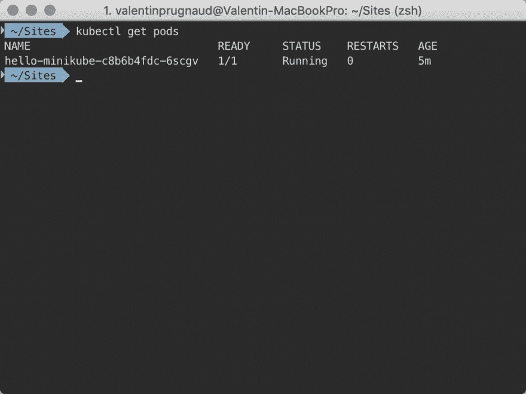

# 在 mac os 上安装 kubectl 和 minitube

> 原文：<https://dev.to/valentinprgnd/install-kubectl-and-minikube-on-mac-os-4pkg>

> **更新** : Docker 也可以帮你在本地运行 Kubernetes 集群，查阅 Docker 文档开始:【https://docs.docker.com/docker-for-mac/kubernetes/】T2

## 安装谷歌云 CLI 工具

[GCloud 快速入门 MacOS](https://cloud.google.com/sdk/docs/quickstart-macos)

## 安装立方结构

```
$ gcloud components install kubectl 
```

## 安装 minikube

```
$ curl -Lo minikube https://storage.googleapis.com/minikube/releases/v0.23.0/minikube-darwin-amd64 && chmod +x minikube && sudo mv minikube /usr/local/bin/ 
```

## 安装 minikube hyperkit 驱动程序

```
$ curl -LO https://storage.googleapis.com/minikube/releases/latest/docker-machine-driver-hyperkit \ && sudo install -o root -g wheel -m 4755 docker-machine-driver-hyperkit /usr/local/bin/ 
```

## 配置 minikube 使用 hyperkit 驱动程序

```
$ minikube config set vm-driver hyperkit 
```

## 启动 minikube

```
$ minikube start 
```

## 运行测试

```
$ kubectl run hello-minikube --image=gcr.io/google_containers/echoserver:1.4 --port=8080 $ kubectl expose deployment hello-minikube --type=NodePort $ kubectl get pods 
```

## 成功！

[](https://res.cloudinary.com/practicaldev/image/fetch/s--3qZSMYg8--/c_limit%2Cf_auto%2Cfl_progressive%2Cq_auto%2Cw_880/https://whatdafox.com/assets/static/screenshot.3fa2e4a.b08e2c5e6b45a19245b4b4eb2e869c25.png)