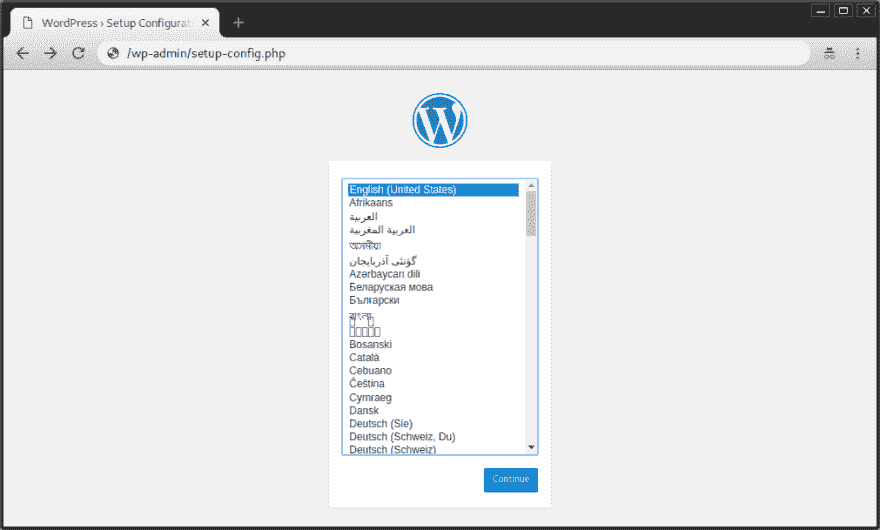
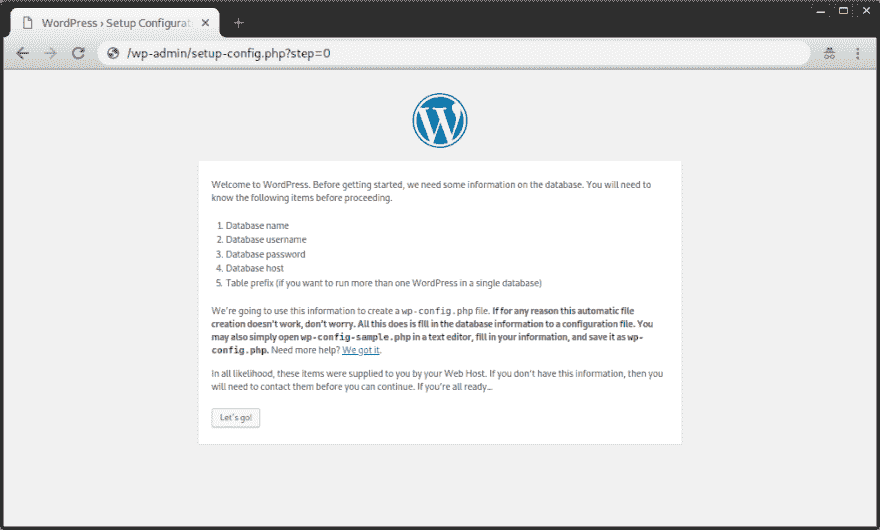
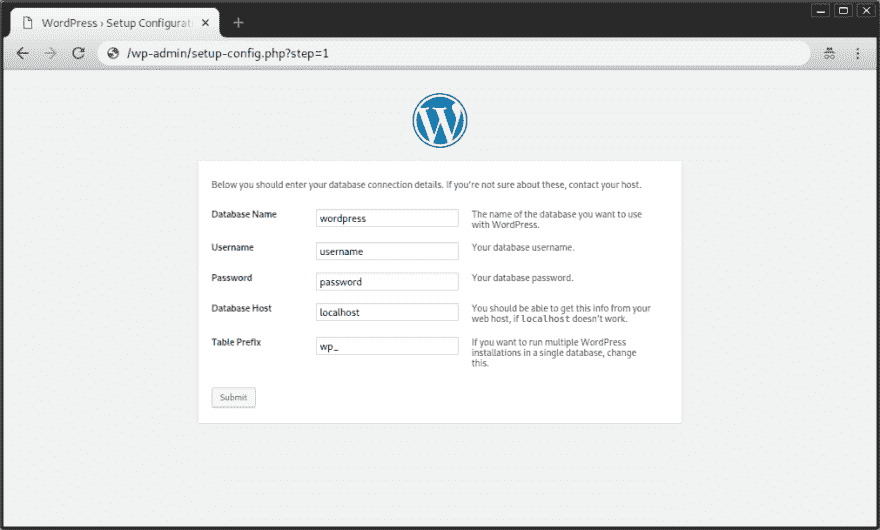
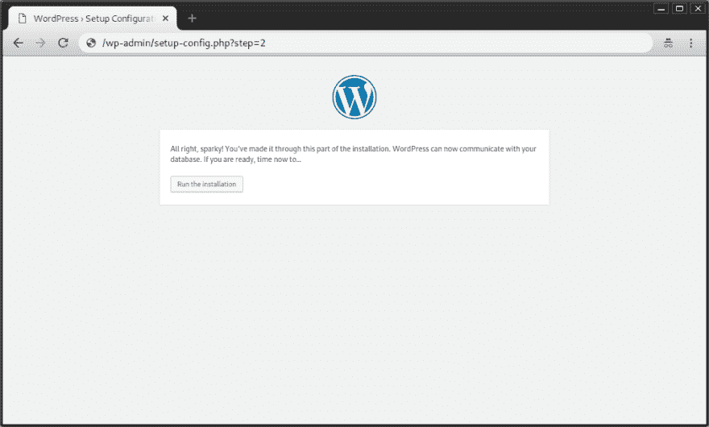
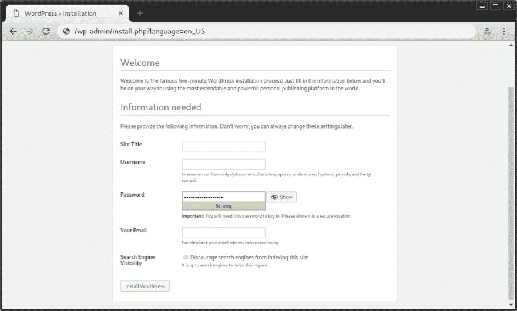
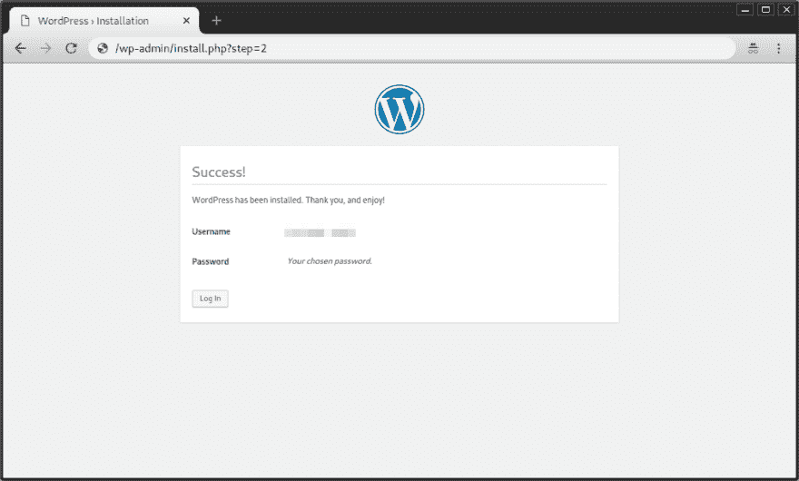
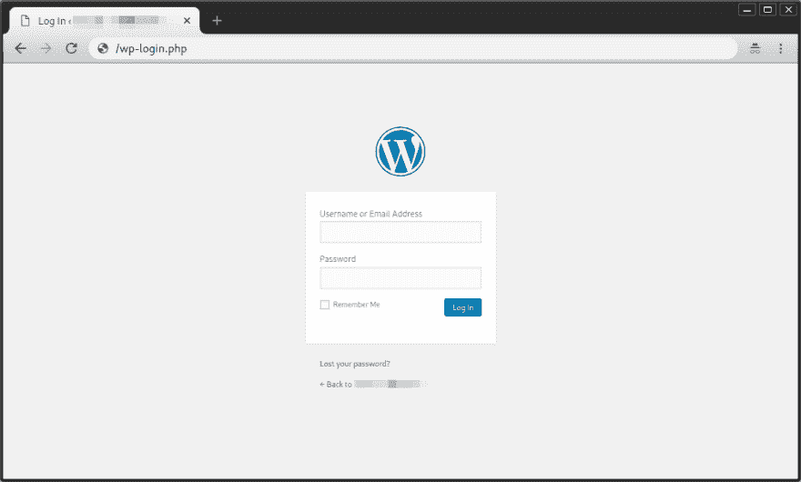
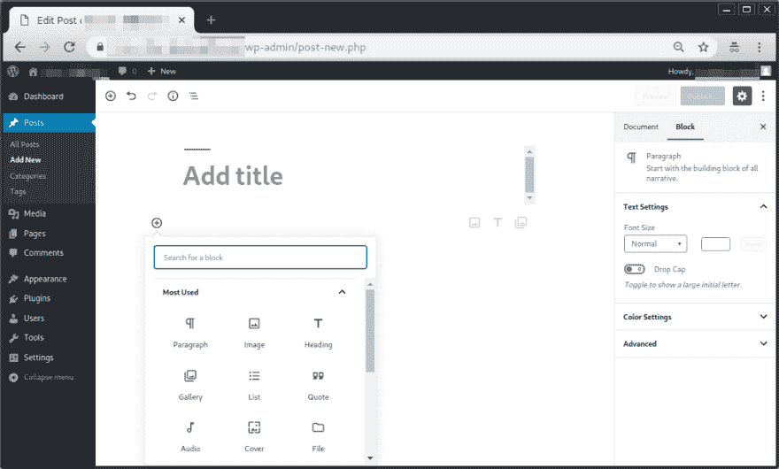

# 安装 WordPress 5.0 RC2 和 4.9.8 差不多

> 原文：<https://dev.to/nabbisen/installing-wordpress-50-rc2-is-almost-the-same-to-that-of-498-14n4>

## [T1】简介](#intro)

[据 WordPress.org](https://wordpress.org/news/2018/11/wordpress-5-0-rc2/)报道，WordPress 5.0 的第二个候选版本于 11 月 30 日发布。

我今天试着安装它，发现安装程序和 WordPress 4.9.8 几乎一样。
本帖将展示所有截图。

✿ ✿ ✿

## 步骤(截图)

**注:截图中的网址省略了域名。*

#### 语言设置(必填)

#### 欢迎&自述

#### 数据库信息(必填)

#### 确认

#### 站点信息(必填)

#### 完成

#### 登录页面

✿ ✿ ✿

## 其他

尽管 WordPress 5.0 RC2 版的安装程序与 4.9.8 几乎相同，但是 WordPress 的新编辑器 Gutenberg 的“后新”风格却完全不同。

它的块型风格让我想起了优雅的页面生成器[element 或【T1:)](https://elementor.com/)

此外，我想知道对于那些不熟悉编程的人来说，它是否比 WordPress 4.9.8 更难，至少在关于如何使用它的信息很少的时候。