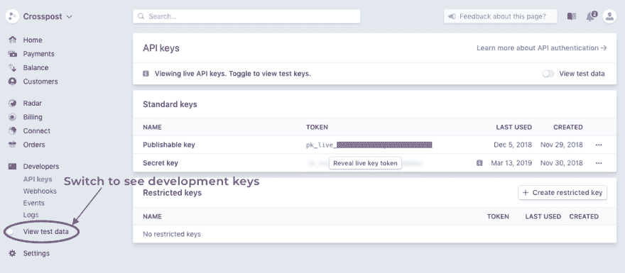
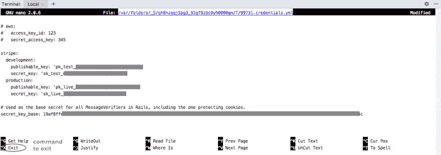
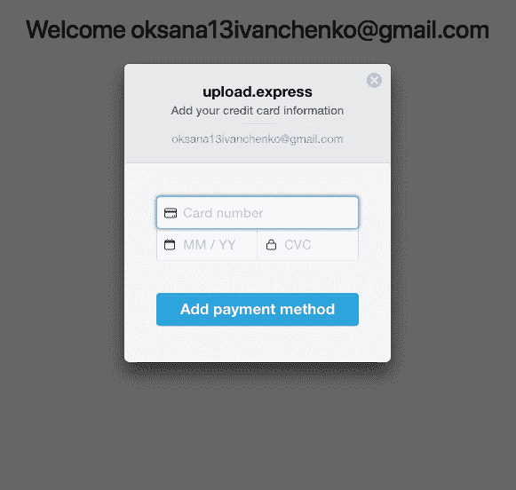
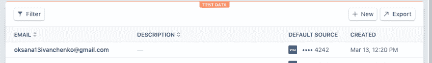

# 在你的 Ruby on Rails 应用中集成 Stripe

> 原文：<https://dev.to/ksushiva/integrate-stripe-in-your-ruby-on-rails-app-3dc4>

## 创建工作区

我们将从创建一个 Ruby on Rails 应用程序
开始

```
$ rails new tuto
$ cd tuto
$ bundle install 
```

然后，我们将借助

`rails generate`
生成一个名为 Billing 的控制器

```
$ rails generate controller Billing 
```

之后，我们将在 *config/routes.rb* :
中添加路由

```
root 'billing#index', as: :billing 
```

最后，我们必须在*app/controllers/billing _ controller . Rb*:
中创建一个空的动作索引

```
class BillingController < ApplicationController

  def index
  end

end 
```

在 *app/views/billing* 中，我们将创建一个 index.html.erb 文件，我们将在其中添加一个显示“Stripe Checkout”模式的按钮，这将让我们将信用卡与用户关联起来。在本教程中，我将(一如既往地)使用引导库。如果你也想用，别忘了在你的 app 里添加。如果你想学习如何做，你可以阅读[这篇文章](https://medium.freecodecamp.org/add-bootstrap-to-your-ruby-on-rails-project-8d76d70d0e3b)。所以在*app/views/billing/index . html . erb*:

```
<div class="container">
  <div class="row">
    <h1 class="col-md-12 mt-5 text-center">
      Are you ready to pay?
    </h1>
  </div>
  <div class="row">
    <div class="col-md-12 mt-4 text-center">
      <button class="btn btn-primary">Let's go </button>
    </div>
  </div>
</div> 
```

现在，我们将像这样保留我们的按钮，稍后我们将使用 Rails 语法来更改它。

## 用 Devise 创建用户

现在，我们将在“设计”gem 的帮助下实现基本身份验证。我们希望只有连接的用户能够访问计费页面。首先在你的*gem 文件*中添加下面一行:

```
gem 'devise' 
```

要设置设备，我们必须在终端中键入:

```
$ bundle install
$ rails g devise:install 
```

运行这两个命令后，终端将显示配置 devise 的指令。它说我们必须将这行代码添加到*config/environments/development . Rb*:

```
config.action_mailer.default_url_options = { host: 'localhost', port: 3000 } 
```

下一步是创建一个用户模型:

```
$ rails g devise User
$ rails db:migrate 
```

就是这样。我们用 devise 添加了身份验证。现在我们准备创建我们的第一个用户。我们需要在终端中运行“rails s ”,然后进入以下页面:localhost:3000/users/sign_up。创建帐户后，它会自动将我们重定向到 localhost:3000 的根页面。

我们现在希望只有登录的用户才能访问 localhost:3000。为此在*app/controllers/billing _ con roller . Rb*中我们需要添加:

```
class BillingController < ApplicationController
  before_action :authenticate_user!

  def index
   @user=current_user.email
  end

end 
```

因此，在计费控制器进行任何操作之前，它会检查用户是否已登录。同样在索引操作中，我添加了一个全局变量@user，它接收当前用户的电子邮件。我会用在*app/views/billing/index . html . erb*:

```
<div class="container">
  <div class="row">
    <div class="col-md-12 mt-4 text-center">
      <h1> Welcome  <%= @user %></h1>
    </div>
  </div>
  <div class="row">
    <h2 class="col-md-12 mt-5 text-center">
      Are you ready to pay?
    </h2>
  </div>
  <div class="row">
    <div class="col-md-12 mt-4 text-center">
      <button class="btn btn-primary">Let's go </button>
    </div>
  </div>
</div> 
```

为了检查是否一切正常，我们将转到 localhost:3000 并清除我们的 cookies。刷新页面后，您应该会被自动重定向到登录页面。

## 积分条纹

### 添加条纹凭证

首先，你必须在 Stripe 上注册。
然后，你可以在仪表盘上的 **developers = > API keys** 下找到 Stripe 的开发和生产密钥。您现在将看到的密钥是用于生产的。点击**“查看测试数据”**，查看开发密钥。
[T8】](https://res.cloudinary.com/practicaldev/image/fetch/s--2X8ynPZn--/c_limit%2Cf_auto%2Cfl_progressive%2Cq_auto%2Cw_880/https://thepracticaldev.s3.amazonaws.com/i/zhx43ftdoei1u36otcwu.png)

现在，我们将密钥添加到 rails 加密凭证中。为此，我使用默认安装在 MacOS 和 Linux 上的 GNU nano 编辑器。

`$ EDITOR=nano rails credentials:edit`

[](https://res.cloudinary.com/practicaldev/image/fetch/s--MJoILq-Z--/c_limit%2Cf_auto%2Cfl_progressive%2Cq_auto%2Cw_880/https://thepracticaldev.s3.amazonaws.com/i/21dkny3ugee7r0l7xq8t.png)

在这里，我们添加了开发和生产的密钥。

```
stripe:
  development:
    publishable_key: 'pk_test_...'
    secret_key: 'sk_test_...'
  production:
    publishable_key: 'pk_live_...'
    secret_key: 'sk_live_...' 
```

### 安装条纹

您还需要在*app/views/layouts/application . html . erb*:
中添加 stripe checkout javascript

```
<%= javascript_include_tag 'https://checkout.stripe.com/checkout.js' %> 
```

同样在*config/environments/development . Rb*中，我们添加了:

```
config.stripe.secret_key = Rails.application.credentials.stripe[:development][:secret_key]
config.stripe.publishable_key = Rails.application.credentials.stripe[:development][:publishable_key] 
```

并且在*config/environments/production . Rb*:

```
config.stripe.secret_key = Rails.application.credentials.stripe[:production][:secret_key]
config.stripe.publishable_key = Rails.application.credentials.stripe[:production][:publishable_key] 
```

最后，我们将在我们的*宝石文件*
中添加条纹宝石

```
gem 'stripe-rails' 
```

并在终端中运行“捆绑安装”。

### 设置路线

现在我们返回到 *config/routes.rb* 并添加到文件:

```
get '/card/new' => 'billing#new_card', as: :add_payment_method` 
```

### 将卡链接到用户

在*app/controllers/billing _ controller . Rb*中，我们正在创建新的动作:

```
def new_card
    respond_to do |format|
      format.js
    end
  end 
```

它会将我们发送到 *new_card.js.erb* ，我们将在 *app/views/billing* 中创建它。所以在*app/views/billing/new _ card . js . erb*:

```
var handler = StripeCheckout.configure({
    key: '<%= Rails.application.credentials.stripe[Rails.env.to_sym][:publishable_key] %>',
    //get a publishable key that we put in editor depending on environment: production or development
    locale: 'auto',
    //handle translation
    name: "upload.express",
    description: "Add your credit card information",
    email: "<%= current_user.email %>",
    panelLabel: "Add payment method",
    allowRememberMe: false,
    token: function (token) {
        var form = document.getElementById('billing-create-payment-method');
        //we will create element with this id in the next step
        var hiddenInput = document.createElement('input');
        hiddenInput.setAttribute('type', 'hidden');
        hiddenInput.setAttribute('name', 'stripeToken');
        hiddenInput.setAttribute('value', token.id);
        //creating an <input type="hidden" name="stripeToken" value="<id>"/>. We will need this information in the next steps to link a user to his card 
        form.appendChild(hiddenInput);
        //adding this input when we use a form.
        form.submit();
    }
});

handler.open();

window.addEventListener('popstate', function() {
    handler.close();
}); 
```

然后，我们将*app/views/billing/index . html . erb*中的按钮更改为 id 为“计费-创建-支付-方法”的表单:

```
<%= form_tag id: "billing-create-payment-method" do  %>
        <%= link_to "Let's go", add_payment_method_path, remote: true, class: "btn btn-primary" %>
      <% end %> 
```

然后，在终端中运行“rails s ”,点击我们的按钮后，我们应该会看到这样的内容:
[](https://res.cloudinary.com/practicaldev/image/fetch/s--Q8UFNfXU--/c_limit%2Cf_auto%2Cfl_progressive%2Cq_auto%2Cw_880/https://thepracticaldev.s3.amazonaws.com/i/7qtebr3t26ncx6e0lty9.png)

快到了！现在我们需要将当前用户与给定的卡关联起来。为此，我们必须在终端中运行以下命令，在用户模型中添加一个 string 类型的新列 stripe _ id:

```
$ rails g migration AddStripeIdToUsers stripe_id:string
$ rails db:migrate 
```

在 *config/routes.rb* 中，我们正在创建一条新路由:

```
post "/card" => "billing#create_card", as: :create_payment_method 
```

现在，在*app/controllers/billing _ controller . Rb*中的控制器中，我们正在创建动作 create_card:

```
def create_card 
    respond_to do |format|
      if current_user.stripe_id.nil?
        customer = Stripe::Customer.create({"email": current_user.email}) 
        #here we are creating a stripe customer with the help of the Stripe library and pass as parameter email. 
        current_user.update(:stripe_id => customer.id)
        #we are updating current_user and giving to it stripe_id which is equal to id of customer on Stripe
      end

      card_token = params[:stripeToken]
      #it's the stripeToken that we added in the hidden input
      if card_token.nil?
        format.html { redirect_to billing_path, error: "Oops"}
      end
      #checking if a card was giving.

      customer = Stripe::Customer.new current_user.stripe_id
      customer.source = card_token
      #we're attaching the card to the stripe customer
      customer.save

      format.html { redirect_to success_path }
    end
  end 
```

我们稍微修改了一下我们的*app/views/billing/index . html . erb*，以便在提交表单时调用一个动作 create_card。

```
<%= form_tag create_payment_method_path, id: "billing-create-payment-method" do  %>
        <%= link_to "Let's go", add_payment_method_path, remote: true, class: "btn btn-primary" %>
      <% end %> 
```

很快，我们将添加成功页面。创建路线、空操作和视图。

在 *config/routes.rb* 中:

```
get '/success' => 'billing#success', as: :success 
```

在*app/controllers/billing _ controller . Rb*:

```
def success
end 
```

在*app/views/billing/success . html . erb*:

```
<div class="container">
  <div class="row">
    <div class="col-md-12 mt-4 text-center">
      <h2>You successfully linked a credit card to your account</h2>
    </div>
  </div>
</div> 
```

现在在终端“rails s”中运行。点击网站上的“开始吧”。出于测试目的，您可以使用带有随机 CVC 代码和日期的卡 4242 4242 4242。提交后，我们应该被重定向到我们的成功页面。如果我们在 **Customers** 中访问 Stripe(不要忘记切换到测试数据),我们应该会看到用户的电子邮件和卡信息。
T3T5】

现在我们需要让顾客在注册一张卡后实际付款。这意味着我们必须订阅我们的客户。

## 订阅

首先，我们需要创造一个产品。最简单的方法是通过条纹仪表板。然后，我们将在产品上附加两个定价计划。例如，在我们的产品 upload.express 中，您可以每月支付 7 欧元，也可以每年支付 60 欧元。我们需要进入我们的**Stripe dashboard =>Billing =>Products**，点击**“New”**按钮。用两种定价方案创造你的产品。我建议您为您的定价方案昵称选择明确的定义，如“每月”和“每年”。如果您添加年度计划，不要忘记将间隔设置为“每年”。要添加定价方案，您需要点击您刚刚创建的产品，然后点击按钮**“添加定价方案”**。

现在我们想获取我们在应用程序中创建的定价计划。我们将在我们的“成功”页面上这样做。于是在*app/controllers/billing _ controller . Rb*中成功:

```
def success
    @plans = Stripe::Plan.list.data
  end 
```

现在我们需要为我们的用户订阅他将要选择的计划。因此，我们需要创建一个新的操作，将我们的客户与计划联系起来，并创建一个订阅。

在 *config/root.rb* 中:

```
post '/subscription' => 'billing#subscribe', as: :subscribe 
```

在*app/views/billing/success . html . erb*中我们添加:

```
<div class="row">
  <div class="col-md-12 mt-3 text-center">
    <h3>Now you need to choose your plan</h3>
  </div>
</div>
<!-- creating a form -->
<%=form_tag subscribe_path, method: :post do %>
<div class="row">
  <div class="col-md-4"></div>
  <div class="col-md-4 text-center">
    <div class="form-group">
      <select class="form-control" name="plan_id">
        <% @plans.each do |plan| %>
        <option value="<%= plan.id %>"><%= plan.amount/100 %>/€ <%= plan.nickname %></option>
        <!-- we pass id chosen by custmer as a value  to use it for subscription -->
        <%end%>
      </select>
    </div>
  </div>
  <div class="col-md-4"></div>
</div>
<div class="row">
  <div class="col-md-12 mt-2 text-center">
    <%= submit_tag 'Save changes', class: "btn btn-primary" %>
  </div>
</div>
<% end %> 
```

在*app/controllers/bill nig _ controller . Rb*:

```
def subscribe
      if current_user.stripe_id.nil?
        redirect_to success_path, :flash => {:error => 'Firstly you need to enter your card'}
        return
      end
      #if there is no card

      customer = Stripe::Customer.new current_user.stripe_id
      #we define our customer

      subscriptions = Stripe::Subscription.list(customer: customer.id)
      subscriptions.each do |subscription|
        subscription.delete
      end
      #we delete all subscription that the customer has. We do this because we don't want that our customer to have multiple subscriptions

      plan_id = params[:plan_id]
      subscription = Stripe::Subscription.create({
                                                     customer: customer,
                                                     items: [{plan: plan_id}], })
   #we are creating a new subscription with the plan_id we took from our form

      subscription.save
      redirect_to success_path
    end
  end 
```

准备好了。现在，我们将检查我们的应用程序。选择并提交定价计划。
要检查一切正常，请访问 Stripe，**Dashboard =>Billing =>Subscriptions**。我们的订阅应该在这里。如果您改变计划，看一看 Stripe，订阅也应该改变。

就是这样。你在你的 Rails 应用上集成了 Stripe。恭喜你！！！

这是我的第一篇技术文章，我希望它能被理解并且你喜欢它！