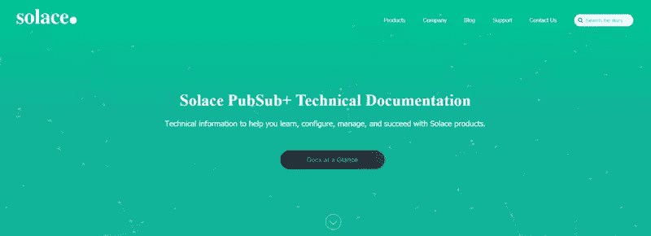
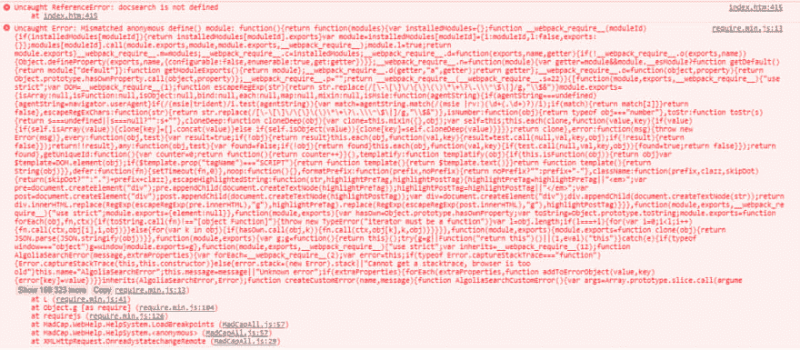

# 将 Algolia DocSearch 集成到基于 MadCap Flare 的客户文档中

> 原文：<https://dev.to/solacedevs/integrating-the-algolia-docsearch-into-madcap-flare-based-customer-documentation-3anb>

[Solace](https://solace.com/) 最近重新设计了品牌。作为该计划的一部分，所有的 web 属性都必须更新，包括我们基于 MadCap Flare 的客户文档网站。这个项目中的一个重要部分是整合 [Algolia DocSearch](https://community.algolia.com/docsearch/) 和 [MadCap Flare](https://www.madcapsoftware.com/products/flare/) 。

[](https://res.cloudinary.com/practicaldev/image/fetch/s--k8UFLkUU--/c_limit%2Cf_auto%2Cfl_progressive%2Cq_66%2Cw_880/https://cdn-images-1.medium.com/max/800/1%2A5vPlhGvJ2L_cZQ3MK_K-mQ.gif)

### 为什么要 DocSearch？

在 docs.solace.com，我们有几个外部托管的网页。由于这些网页不是 Flare 项目的一部分，它们的内容无法使用 Flare 的内部搜索引擎进行搜索，不幸的是，这是我们文档中的一个弱点。在解决这个问题的同时，我们还对拥有一个能够快速预测和找到用户搜索内容的上下文感知搜索引擎的想法感兴趣。

在做了一些研究后，我发现一些第三方搜索引擎服务可能会解决我们的问题。我们缩小了尝试 DocSearch 的决定。我们被要求申请文档搜索。一旦我们的应用程序被批准，DocSearch 团队就为我们的网站创建了一个定制的 JSON 配置。配置文件定义了要抓取或忽略的 URL，以及用于选择标题、副标题和结果摘要的 CSS 选择器。GitHub 中所有的 DocSearch 配置文件都是公开的，用户可以根据自己的文档需求对其进行定制。他们还为我们提供了 JavaScript (JS)库和代码片段，我们必须将它们添加到我们的网站上。脚本用于跟踪在搜索输入字段中键入的击键，匹配文本的结果显示为下拉列表。

因此，我们所要做的就是向配置文件添加一些自定义更新，将 JS 库和代码片段粘贴到 Flare 中的母版页，然后设计搜索 UI。听起来很简单，不是吗？不完全是。

### **整合文档搜索**

当我将 DocSearch 脚本添加到 Flare 项目中时，它立即抛出了一系列错误。Flare 有几个内置脚本，包括与 Flare 捆绑在一起的 [require.js](https://requirejs.org/) 。如果没有被 require.js 使用，许多第三方脚本会与 Flare 的基础脚本冲突。因此，为了使 DocSearch 脚本能够工作，它必须被 require.js 使用。对于一个简单的技术作者来说，这是一个棘手的问题😊。我联系了我的两位开发同事，与他们一起解决集成错误。谢谢，[黄天华](https://www.linkedin.com/in/ian-wong-105a2161/)和[邓晔](https://www.linkedin.com/in/ye-deng-3347692/)。你们太棒了！

### **解**

DocSearch 团队提供了以下 JavaScript 库和代码片段:

```
\<!-- at the end of the HEAD --\>
\<script type=”text/javascript” src=”https://cdn.jsdelivr.net/npm/docsearch.js@2/dist/cdn/docsearch.min.js"\>\</script\>

\<!-- at the end of the BODY --\>
\<script type=”text/javascript”\>
 docsearch({
 apiKey: ‘###########’,
 indexName: ‘YourIndexName’,
 inputSelector: ‘#youInputselector’,
 algoliaOptions: { ‘facetFilters’: [‘tags:docs’] },
 debug: false, // Set debug to true if you want to inspect the dropdown
});
\</script\> 
```

在我们在 Flare 中添加脚本并发布版本后，Chrome 的开发人员控制台上突出显示了以下 JS 错误:

[](https://res.cloudinary.com/practicaldev/image/fetch/s--w9GxABRF--/c_limit%2Cf_auto%2Cfl_progressive%2Cq_auto%2Cw_880/https://cdn-images-1.medium.com/max/1024/0%2AXAefhAdqz8h8Ko9y)

该脚本在 Flare 的基础 JS 之外运行时出现错误。为了解决这个问题，我们想出了一种方法来加载这些脚本作为 require.js 模块。

我们使用 require.config 方法加载 DocSearch JS 库:

```
require.config({
 paths: {
 “docsearchLib” : “https://cdn.jsdelivr.net/docsearch.js/2/docsearch.min"
 }
}); 
```

之后，我们将 docsearch 片段和 docsearchLib 嵌套在配置的 require()调用中:

```
require(["docsearchLib"], function(docsearch){
 docsearch({
 apiKey: '###########',
 indexName: 'YourIndexName',
 inputSelector: '#youInputselector',
 algoliaOptions: { 'facetFilters': ['tags:docs'] },
 debug: false,
 });
}); 
```

一旦我们添加了更新的脚本并发布了构建版本，我们的新搜索引擎就启动并运行了。

```
\<body\>
....

\<script\>

require.config({
 paths: {
 “docsearchLib” : “https://cdn.jsdelivr.net/docsearch.js/2/docsearch.min"
 }
});

require(["docsearchLib"], function(docsearch){
 docsearch({
 apiKey: '###########',
 indexName: 'YourIndexName',
 inputSelector: '#youInputselector',
 algoliaOptions: { 'facetFilters': ['tags:docs'] },
 debug: false,
 });
});

\</script\>

\</body\> 
```

你可以在[docs.solace.com](https://docs.solace.com/)看到结果。

在下一篇文章中，我将介绍文档网站重新设计的其他方面——规划、内容迁移和开发。

* * *