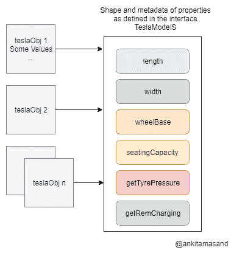

# TypeScript 中的接口:它们是什么？我们如何使用它们

> 原文：<https://dev.to/bnevilleoneill/interfaces-in-typescript-what-are-they-and-how-do-we-use-them-ppo>

[](https://res.cloudinary.com/practicaldev/image/fetch/s--6CefJWua--/c_limit%2Cf_auto%2Cfl_progressive%2Cq_auto%2Cw_880/https://cdn-images-1.medium.com/max/1024/1%2AvK1lTdXqCjv7ob_j0TePLQ.png)

JavaScript 给了开发人员很大的灵活性。初始化为整数的变量可以在运行时被赋予一个函数文字。变量的类型在 JavaScript 中是不可预测的。正如你在下面的例子中看到的，a 被初始化为一个整数，然后被赋予一个函数文字:

```
var a = 2
a = function () {
  console.log("I was initialized with a value of an integer, but now I'm a function")
} 
```

*具有整数值的变量 a 被赋予一个函数文字。*

让我们考虑建造一辆*特斯拉 Model S 汽车的实施计划。*

十名特斯拉工程师建造了他们的原型模型。在实现之前没有制定规范，所以工程师们都想出了自己的一套规范和实现模型。其中一个原型可以向用户显示汽车充电的细节，而另一个原型有轮胎监控系统。

[](https://logrocket.com/signup/)

如果预先定义了一套规范，那么这些工程师根据这些规范实现原型将会非常方便和容易。在用 JavaScript:
构建复杂的实体时，我们会处理同样的问题

```
function buildTeslaModelS (teslaObj) {
    // Implementation Details
}

buildTeslaModelS({
    length: 196,
    width: 86,
    measureTirePressure: function () {
    },
    wheelbase: 116
})

buildTeslaModelS({
    length: "196",
    width: "86",
    wheelbase: "116",
    measureRemCharging: function () {
    }
}) 
```

buildTeslaModelS 函数使用 teslaObj 中定义的参数返回一辆*特斯拉 Model S* 汽车。它对输入参数进行一些假设，并基于这些假设返回一个模型。它假设长度、宽度和轴距属性是整数*，并基于这一假设执行一些计算。然而，正如您在对 buildTeslaModelS 的第二次函数调用中看到的，这些值属于类型*字符串*，因此假设不再有效。*

 *此外，buildTeslaModelS 函数不知道它必须处理 measureRemCharging 属性，因此它完全跳过了这一部分。它假设 measureTirePressure 是一个强制属性，并且应该存在于所有这些模型中。然而，当它在第二次函数调用中没有找到这个属性时，它会在运行时抛出一个错误。

这是一个非常灵活的功能！应该有办法告诉 buildTeslaModelS 函数输入 teslaObj 参数的形状。如果有一个在编译时检查 teslaObj 上的强制属性及其类型的验证检查，事情会简单得多。

这里有 TypeScript 接口可以提供帮助！

TypeScript 具有对接口的内置支持[。接口定义了实体的规范。它列出了合同，说明*需要做什么*，但没有具体说明*将如何做*。](https://www.typescriptlang.org/docs/handbook/interfaces.html)

在上面的例子中，我们可以为 *Tesla Model S* 汽车定义一个接口，然后它的每个原型将使用这个接口为接口中定义的各种功能提出它们的实现计划。

这是特斯拉 Model S 汽车的界面:

```
interface TeslaModelS {
    length: number;
    width: number;
    wheelbase: number;
    seatingCapacity: number;
    getTyrePressure: () => number;
    getRemCharging: () => number;
} 
```

*特斯拉 Model S 的接口*

接口包含所有属性的名称及其类型。它还包括函数的签名以及参数类型和返回类型。例如，getTyrePressure 和 getRemCharging 函数返回 number 类型的值。

### 如何使用一个接口

类或函数可以实现一个接口来定义该接口中定义的属性的实现。

让我们写一个函数来实现 TeslaModelS 接口:

```
function buildTeslaModelS (teslaObj: TeslaModelS) {
}

buildTeslaModelS({
    length: "196",
    width: "86",
    wheelbase: "116",
    measureRemCharging: function () {
    }
}) 
```

teslaObj 具有 TeslaModelS 界面的形状。

当您运行上面显示的代码时，TypeScript 编译器将给出以下错误:

> 类型为`{ length: string; width: string; wheelbase: string; measureRemCharging: () => void; }`的参数不可分配给类型为`TeslaModelS`的参数。对象文字只能指定已知的属性，`measureRemCharging`在类型`TeslaModelS`中不存在。

编译器报错有两个原因:

1.  属性长度、宽度和轴距在接口中被定义为 number 类型，因此它希望它们是 number 类型而不是 string 类型
2.  接口上未定义 measureRemCharging 属性。它应该被命名为 getRemCharging，并且应该返回一个整数。实体的实现应该遵循其接口中定义的契约

要构建一个界面中定义的 Tesla Model S，我们必须这样定义函数:

```
function buildTeslaModelS (teslaObj: TeslaModelS) {
}

buildTeslaModelS({
    length: 196,
    width: 86,
    wheelbase: 116,
    seatingCapacity: 4,
    getTyrePressure: function () {
        let tyrePressure = 20 // Evaluated after doing a few complex computations!
        return tyrePressure
    },
    getRemCharging: function () {
        let remCharging = 20 // Evaluated after doing a few complex computations!
        return remCharging
    }
}) 
```

teslaObj 的上述实现正是接口所期望的！

### 如何定义界面中的可选属性

接口在确保实体按预期实现方面做得很好。但是，在某些情况下，没有必要拥有接口中定义的所有属性。这些属性被称为*可选属性*，在界面中表现为:

```
interface TeslaModelS {
    length: number;
    width: number;
    wheelbase: number;
    seatingCapacity: number;
    getTyrePressure?: () => number;
    getRemCharging: () => number;
} 
```

*在 TeslaModelS 界面中定义可选属性。*

请注意。在 getTyrePressure 属性中。问号表明 getTyrePressure 属性是可选的，而不是实体在所有模型中实现该功能所必需的。即使不在 teslaObj 参数中指定这个属性，编译器也不会报错。

编译器还会检查接口中未定义的多余属性。比方说，teslaObj 包含一个多余的属性 turningCircle，这个属性在 TeslaModelS 接口中没有指定:

```
buildTeslaModelS({
    length: 196,
    width: 86,
    wheelbase: 116,
    getTyrePressure: function () {
        let tyrePressure = 20 // Evaluated after doing a few complex computations!
        return tyrePressure
    },
    getRemCharging: function () {
        let remCharging = 20 // Evaluated after doing a few complex computations!
        return remCharging
    },
    turningCircle: 10
}) 
```

编译器给出以下错误:

> 类型为`{ length: number; width: number; wheelbase: number; getTyrePressure: () => number; getRemCharging: () => number; turningCircle: number; }`的参数不可分配给类型为`TeslaModelS`的参数。对象文字只能指定已知的属性，`turningCircle`在类型`TeslaModelS`中不存在。

### 界面中的只读属性

只读属性是指一旦初始化就不能更改的属性。例如，属性 length、width、wheelbase 和 seatingCapacity 在用某个固定值初始化后，在任何情况下都不应该修改。

我们将不得不修改我们的界面来反映这一变化:

```
interface TeslaModelS {
    readonly length: number;
    readonly width: number;
    readonly wheelbase: number;
    readonly seatingCapacity: number;
    getTyrePressure?: () => number;
    getRemCharging: () => number;
} 
```

*只读属性。*

请注意 readonly 关键字与属性名称的使用。这表明这些属性在用某个值初始化后不能被修改。

### 界面中的可索引属性

顾名思义，可索引属性用于定义索引到唯一数字或字符串中的类型。例如，我们可以将一个类型定义为:

```
interface CustomArray {
    [index: number]: string
}

let cars: CustomArray = ['Hatchback', 'Sedan', 'Land Rover', 'Tesla Model S']
console.log('Element at position 1', cars[1]) // 'Sedan' 
```

请注意 cars 变量不是一个普通的数组，所以你不能使用像 push，pop，filter 等数组内置函数。您可能会认为定义普通数组比使用可索引类型更好。当您必须定义应对同一数据类型的一系列值进行操作的自定义属性和函数时，可索引类型非常有用。

由于我们已经清楚地将*特斯拉 Model S* 汽车的规格放在一个界面中，这提高了特斯拉工程师的效率，他们现在已经准备好了第一批 100 辆汽车。现在是时候让审查委员会仔细检查每个模型，并测试它们的性能和其他因素:

```
interface TeslaModelSMap {
    engineer: string,
    model: TeslaModelS,
    readonly rating: number
}
interface TeslaModelSReview {
    [id: number]: TeslaModelSMap
}

const TeslaModelSReviewQueue: TeslaModelSReview = [
    {
        engineer: 'John',
        model: modelByJohn1, // modelByJohn1 is of type `TeslaModelS`
        rating: 2
    },
    {
        engineer: 'Ray',
        model: modelByRay1, // modelByRay1 is of type `TeslaModelS`
        rating: 3
    },
    {
        engineer: 'John',
        model: modelByJohn2, // modelByJohn2 is of type `TeslaModelS`
        rating: 4
    },
    // ... other 97 models
] 
```

TeslaModelSReview 接口将一组属性(与特定模型相关的工程模型和等级)编入唯一的数字索引。TeslaModelSReviewQueue 属于 TeslaModelSReview 类型。它列出了不同工程师制造的特斯拉模型。从上面的代码中，我们可以看到 John 构建了两个模型— modelByJohn1 和 modelByJohn2，它们分别被评为 2 和 4。

索引器的类型可以是字符串或数字。我们还可以在 TeslaModelSReview 接口中定义其他属性，但是这些属性应该返回 TeslaModelS 类型的子类型。

TeslaModelSReview 的索引可以设为只读，以防止在审阅过程中修改其值。我们必须像这样修改我们的 TeslaModelSReview 接口:

```
interface TeslaModelSReview {
    readonly [id: number]: TeslaModelS
} 
```

### 如何在接口中定义函数类型

接口也可以用来定义函数的结构。正如我们前面看到的，getTyrePressure 和 getRemCharging 函数被定义为 TeslaModelS 接口上的属性。但是，我们可以为函数定义一个这样的接口:

```
interface Order {
    (customerId: number, modelId: number): boolean 
}

let orderFn: Order = function (cId, mId) {
    // processing the order
    return true // processed successfully!
} 
```

orderFn 函数用于键入 Order。它接受两个 number 类型的参数，并返回一个 boolean 类型的值。无需在 orderFn 函数的定义中再次定义参数的类型，如上面的代码所示。编译器只是将接口中定义的参数与函数声明中定义的参数进行一对一映射。它推断 cId 映射到 customerId，其类型是数字，mId 映射到 modelId，其类型也是数字。甚至 orderFn 函数的返回类型都是从它在接口中的定义中推断出来的。

### 如何使用类的接口

到目前为止，我们已经学习了函数是如何实现接口的。现在让我们为 TeslaModelS 接口构建一个类:

```
class TeslaModelSPrototype implements TeslaModelS {
    length: number;
    width: number;
    wheelbase: number;
    seatingCapacity: number;
    private tempCache: string;

    constructor (l, w, wb, sc) {
        this.length = l;
        this.width = w;
        this.wheelbase = wb;
        this.seatingCapacity = sc;
    }

    getTyrePressure () {
        let tyrePressure = 20 // Evaluated after doing a few complex computations!
        return tyrePressure
    }

    getRemCharging () {
        let remCharging = 20 // Evaluated after doing a few complex computations!
        return remCharging
    }
}

let teslaObj = new TeslaModelSPrototype(196, 86, 116, 4)
console.log('Tyre Pressure', teslaObj.getTyrePressure()) 
```

*类 TeslaModelSPrototype 实现了接口 TeslaModelS)*

TeslaModelSPrototype 类定义了接口的所有属性。请注意，接口只定义了一个类的公共属性。从上面的代码可以看出，属性 tempCache 有一个访问修饰符 private，因此它没有在接口 TeslaModelS 中定义。

### 一个类中不同类型的变量

一个类有三种不同类型的变量

1.  **局部变量** —局部变量在函数或块级定义。它只在函数或块执行之前存在。每次函数运行时，都会在内存中创建局部变量的新副本
2.  **实例变量** —实例变量是类的成员。它们用于存储类对象的属性。每个对象都有自己的实例变量副本
3.  **静态变量** —静态变量也被称为*类变量*，因为它们与一个类整体相关联。一个类的所有对象共享静态变量的同一个副本

请注意，接口只处理类的实例部分。例如，构造函数属于静态部分。接口 TeslaModelS 没有指定任何与构造函数或静态部分相关的内容。

### 扩展接口

接口可以扩展任何其他接口并导入其属性。这有助于构建小型的可重用组件。例如，我们可以创建不同的接口来处理 Tesla 模型的不同组件，如下所示:

```
interface Wheel {
    wheelBase: number;
    controls: Array<string>,
    material: string;
}

interface Charger {
    adapter: string;
    connector: string;
    location: string;
}

interface TeslaModelS extends Wheel, Charger {
    // ... All other properties
} 
```

*扩展接口。*

TeslaModelS 接口扩展了滚轮和充电器的属性。不要把所有的属性都放在一个接口中，而是为处理不同的组件创建单独的接口是一个很好的实践。

### 类型别名和接口有什么不同？

类型别名用于为 TypeScript 中不同类型的组合命名。

例如，我们可以创建一个类型，它可以是 string 类型，也可以是 null :

```
type StringOrNull = string | null; 
```

类型别名和接口在 TypeScript 中经常互换使用。也可以使用如下类型定义`TeslaModelS`对象的形状:

```
type TeslaModelS {
    length: number;
    width: number;
    wheelbase: number;
    seatingCapacity: number;
    getTyrePressure: () => number;
    getRemCharging: () => number;
} 
```

*TeslaModelS 型。*

类似于接口如何使用关键字扩展其他接口和类型别名，类型别名也可以使用交集运算符扩展其他类型和接口。类型别名也可以由类实现。

类型别名通常用于我们必须定义不同类型的合并的情况。例如，考虑函数 renderObject:

```
function renderObject (objShape: Square | Rectangle | Triangle) {\
    // ...
} 
```

`renderObject`函数接受一个输入参数`objShape`。`Square`、`Rectangle`和`Triangle`是类型，`|`称为联合运算符。`objShape`可以是`Square`、`Rectangle`或`Triangle`类型。然而，形状的联合不能用界面来表达。

接口用于定义关于对象形状的契约；因此，它们不能用于多个形状的联合。即使是类也不能实现描述形状联合的类型。这是接口和类型别名之间重要的功能差异之一。

当我们定义两个同名的接口时，它们会合并成一个。结果接口将具有来自这两个接口的属性。但是，如果我们试图用相同的名称定义多个类型，编译器会报错。

### 接口中的混合类型

在 JavaScript 中，函数也被认为是对象，所以即使像这样在函数文字上添加属性也是有效的:

```
function manufactureCar (type) {
    const model = function getModel (type) {
        console.log('inside getModel function')
        // get the model of type as mentioned in the argument
    }
    model.getCustomerDetails = function  () {
        console.log('inside customer details function')
        // get the details of customer who has purchased this model
    }
    model.price = 100000
    model.trackDelivery = function () {
        console.log('inside trackDelivery function')
        // track the delivery of the model
    }
    return model
}

let tesla = manufactureCar('tesla')
tesla() // tesla is a function
tesla.getCustomerDetails() // getCustomerDetails is a property defined on function 
```

从上面的代码中可以看出，变量 model 被赋值为 function，getCustomerDetails、price 和 trackDelivery 作为属性附加在模型上。这是 JavaScript 中的一种常见模式。我们如何用 TypeScript 接口定义这种模式？

```
interface CarDelivery {
    (string): TeslaModelS,
    getCustomerDetails (): string,
    price: number,
    trackDelivery (): string
}

function manufactureCar (type: string): CarDelivery {
    const model = <CarDelivery> function (type: string) {
        // get the model of type as mentioned in the argument
    }
    model.getCustomerDetails = function () {
        // get the details of customer who has purchased this model
        return 'customer details'
    }
    model.price = 100000
    model.trackDelivery = function () {
        // track the delivery of the model
        return 'tracking address'
    }
    return model
}
let tesla = manufactureCar('tesla')
tesla() // tesla is a function
tesla.getCustomerDetails() // getCustomerDetails is a property defined on function 
```

CarDelivery 类型的对象是从 manufactureCar 函数返回的。接口 CarDelivery 有助于维护从 manufactureCar 函数返回的对象的形状。它确保模型的所有强制属性— getCustomerDetails、price 和 trackDelivery 都出现在模型中。

### 如何在接口中使用泛型

当我们必须创建可以在多种数据类型上工作的泛型组件时，使用 TypeScript 中的泛型。例如，我们不想限制我们的函数只接受数字作为输入参数。它应该根据用例进行扩展，并接受一系列类型。

让我们编写代码来实现一个处理通用数据类型的堆栈:

```
interface StackSpec<T> {
    (elements: Array<T>): void
}

function Stack<T> (elements) {
    this.elements = elements
    this.head = elements.length - 1

    this.push = function (number): void {
        this.elements[this.head] = number
        this.head++
    }

    this.pop = function <T>(): T {
        this.elements.splice(-1, 1)
        this.head--
        return this.elements[this.head]
    }

    this.getElements = function (): Array<T> {
        return this.elements
    }
}

let stacksOfStr: StackSpec<string> = Stack
let cars = new stacksOfStr(['Hatchback', 'Sedan', 'Land Rover'])
cars.push('Tesla Model S')

console.log('Cars', cars.getElements()) // ['Hatchback', 'Sedan', 'Land Rover', 'Tesla Model S'] 
```

接口 StackSpec 接受任何数据类型，并将其放入函数的定义中。t 用于定义类型。函数堆栈将元素数组作为输入。堆栈有方法——push 用于在原始元素数组中添加 T 类型的新元素，pop 用于移除元素数组的最顶层元素，getElements 函数返回 T 类型的所有元素。

我们已经创建了一个名为 stacksOfStr 的字符串堆栈，它接收 string 并相应地用 string 替换 T。我们可以重用这个堆栈实现来创建数字和其他数据类型的堆栈。

我们还可以创建一堆特斯拉模型。让我们看看如何做到这一点:

```
let stacksOfTesla: StackSpec<TeslaModelS> = Stack
let teslaModels = [
    {
        engineer: 'John',
        modelId: 1,
        length: 112,
        //...
    },
    // ...
]
let teslaStack = new stacksOfTesla(teslaModels)
console.log(teslaStack) // prints the value of `teslaModels` 
```

请注意，我们对 TeslaModelS 类型的数组使用了相同的堆栈实现。泛型和接口的结合是 TypeScript 中一个强大的工具。

### TypeScript 编译器如何编译接口

TypeScript 在处理 JavaScript 的奇怪部分方面做得很好。然而，浏览器不理解 TypeScript，所以它必须被编译成 JavaScript。

TypeScript 编译器将上述 TeslaModelSPrototype 类编译为:

```
var TeslaModelSPrototype = /** @class */ (function () {
    function TeslaModelSPrototype(l, w, wb, sc) {
        this.length = l;
        this.width = w;
        this.wheelbase = wb;
        this.seatingCapacity = sc;
    }
    TeslaModelSPrototype.prototype.getTyrePressure = function () {
        var tyrePressure = 20; // Evaluated after doing a few complex computations!
        return tyrePressure;
    };
    TeslaModelSPrototype.prototype.getRemCharging = function () {
        var remCharging = 20; // Evaluated after doing a few complex computations!
        return remCharging;
    };
    return TeslaModelSPrototype;
}());
var teslaObj = new TeslaModelSPrototype(196, 86, 116, 4);
console.log('Tyre Pressure', teslaObj.getTyrePressure()); 
```

我在用 [TypeScript Playground](https://www.typescriptlang.org/play/index.html) 看编译好的代码。实例变量—长度、宽度、轴距和座位容量在函数 TeslaModelSPrototype 中初始化。getTyrePressure 和 getRemCharging 方法是在函数 TeslaModelSPrototype 的原型上定义的。

上面的代码是普通的 JavaScript，所以它可以在浏览器中运行。

### 为什么要使用接口？

正如您已经了解到的，接口有助于为实体的实现定义具体的计划。除此之外，这些接口还有助于 JavaScript 引擎的性能。本节假设您对 JavaScript 引擎有所了解。在这一节中，我们将深入探讨 JavaScript 引擎的工作原理，并理解接口如何帮助提高性能。

我们先来了解一下坐在[V8(Chrome 上的 JavaScript 引擎)](https://v8.dev/)上的编译器是如何存储对象的。

TypeScript 中的接口只在编译时存在。正如您在上面由 TypeScript 编译器生成的代码中所看到的，没有提到接口。TeslaModelS 接口的属性(长度、宽度、轴距和座位容量)添加到 TeslaModelSPrototype 构造函数中，而函数类型附加在 TeslaModelSPrototype 函数的原型上。JavaScript 引擎不知道任何与接口相关的东西。

如果我们实例化数千辆 TeslaModelSPrototype 汽车，我们将不得不处理数千个 TeslaModelS 类型的对象。这些对象中的每一个都将具有类似于接口的结构。JavaScript 引擎是如何存储这几千个形状相同的对象的？它会复制成千上万份这些物品吗？制作成千上万个形状相似的副本绝对是浪费内存。JavaScript 引擎只生成 TeslaModelS 类型的一个形状，每个对象只存储 TeslaModelS 接口中定义的相应属性值。

[](https://res.cloudinary.com/practicaldev/image/fetch/s--u6f_NhTx--/c_limit%2Cf_auto%2Cfl_progressive%2Cq_auto%2Cw_880/https://cdn-images-1.medium.com/max/384/0%2AJkU1Rz6RwShucBQt.png) 

<figcaption>物体形状相同</figcaption>

对于 JavaScript 引擎来说，这是一个巨大的性能优势。

如果对象具有不同的形状，引擎将不得不为这些对象创建不同的形状，并相应地处理它们。接口有助于保持相似对象的形状不变。

### 如何与 React 一起使用接口

让我们构建一个使用 React & TypeScript 接口显示口袋妖怪列表的简单用例

下面是在 id 为 root 的 div 容器中呈现口袋妖怪列表的主要应用程序组件:

```
import React, { Component, Fragment } from 'react';
import { render } from 'react-dom';
import PokemonList from './pokemon-list';
import './style.css';

const App = () => {
  return (
    <Fragment>
        <h2>Pokemon List</h2>
        <PokemonList />
      </Fragment>
  )
}

render(<App />, document.getElementById('root')); 
```

*App 组件。*

App 组件渲染 PokemonList。

让我们检查一下口袋妖怪列表组件的实现:

```
import React, { Component } from 'react';
import { PokemonListModel } from './pokemon-model';

interface PokemonProps {}
interface PokemonState {
  pokemonList: PokemonListModel | null;
}

class PokemonList extends Component<PokemonProps, PokemonState> {

  constructor (props) {
    super(props);
    this.state = {
      pokemonList: null
    }
  }

  getPokemonList = () => {
    fetch ('https://pokeapi.co/api/v2/pokemon/?limit=50')
      .then (response => {
        return response.json();
      })
      .then (response => {
        this.setState({ pokemonList: response });
      })
  }

  render () {
    let { pokemonList } = this.state;
    return (
      <div className='pokemon-list'>
        {
          pokemonList && pokemonList.results.map (pokemon => {
            return (
              <div className='row' key={pokemon.name}>
                <span>{pokemon.name}</span>
              </div>
            )
          })
        }
      </div>
    )
  }

  componentDidMount () {
    this.getPokemonList()
  }
}

export default PokemonList 
```

*口袋妖怪组件。*

口袋妖怪列表组件使用[开源 Poke API 项目](https://pokeapi.co/)获取口袋妖怪列表。它将 pokemon API 的结果存储在组件的状态中。该组件使用接口 PokemonProps 和 PokemonState 来定义其属性和状态。接口 PokemonListModel 定义了从 Pokemon API 返回的对象的结构。

下面是 PokemonListModel 接口:

```
export interface PokemonListModel {
  count: number;
  next: string | null;
  previous: string | null;
  results: Array<Pokemon>
}

interface Pokemon {
  name: string;
  url: string;
} 
```

*口袋妖怪列表模型界面。*

请注意结果属性的类型。它使用接口 Pokemon 来定义结果的结构。下面是 Stackblitz 上的口袋妖怪应用的演示。
[https://stackblitz.com/edit/react-ts-pokemon?embed=1&view=both&](https://stackblitz.com/edit/react-ts-pokemon?embed=1&view=both&)

### 结论

接口是在 TypeScript 中定义协定的一种强有力的方式。让我们回顾一下我们在本教程中学到的所有内容:

1.  接口定义了实体的规范，它们可以通过函数或类来实现。我们可以使用？和只读属性，方法是在属性名中使用 readonly 关键字
2.  TypeScript 编译器还会检查对象上的多余属性，如果对象包含在接口中定义的属性，则会给出错误
3.  我们还学习了如何使用接口定义可索引属性
4.  类可以实现一个接口。接口只包含一个类的实例变量的定义
5.  可以使用 extends 关键字扩展接口以导入其他接口的属性
6.  我们可以通过接口使用泛型的力量，构建可重用的组件
7.  我们还学习了接口如何帮助 JavaScript 引擎的性能* * * ### Plug: [LogRocket](https://logrocket.com/signup/) ，一个用于 web 应用的 DVR

[](https://logrocket.com/signup/)

<figcaption>[https://logrocket.com/signup/](https://logrocket.com/signup/)</figcaption>

LogRocket 是一个前端日志工具，可以让你回放问题，就像它们发生在你自己的浏览器中一样。LogRocket 不需要猜测错误发生的原因，也不需要向用户询问截图和日志转储，而是让您重放会话以快速了解哪里出错了。它可以与任何应用程序完美配合，不管是什么框架，并且有插件可以记录来自 Redux、Vuex 和@ngrx/store 的额外上下文。

除了记录 Redux 操作和状态，LogRocket 还记录控制台日志、JavaScript 错误、堆栈跟踪、带有头+正文的网络请求/响应、浏览器元数据和自定义日志。它还使用 DOM 来记录页面上的 HTML 和 CSS，甚至为最复杂的单页面应用程序重新创建像素级完美视频。

[免费试用](https://logrocket.com/signup/)。

* * *

TypeScript 中的帖子 [Interfaces:它们是什么以及我们如何使用它们](https://blog.logrocket.com/interfaces-in-typescript-what-are-they-and-how-do-we-use-them-befbc69b38b3/)首先出现在[的 LogRocket 博客](https://blog.logrocket.com)上。*