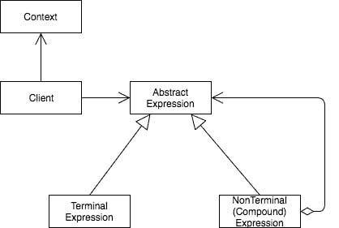

# 解释器设计模式[行为]

> 原文：<https://dev.to/itscoderslife/interpreter-design-pattern-behavioral-4k3j>

这种行为模式用来表示语言，定义它的规则以及解释这些规则的解释器。当一组问题频繁出现时，使用解释器。

我们将语法中的每个句子映射到一个特定的类型，每个类型都有助于解释句子的过程。现在让我们来看看解释器模式的设计。

表达式协议定义了一个方法需求，解释器，它接受一个上下文参数。上下文表示一个全局状态，每个表达式类型都将其用作输入和输出。我们可以有两种表达方式。终结表达式表示不包含其他表达式的表达式，而非终结表达式映射语法中的复合符号。复合表达式要么依赖于多个终端表达式，要么递归调用自身，直到到达一个终端表达式。客户端解析句子，构建终结和非终结表达式的列表，并依次调用它们的解释方法。

包含其他表达式的表达式称为非终结表达式。

> 解释器设计模式用简单的语法定义了一种语言。它提供了每个语法规则的对象表示，以及解释语法的解释器。

例子:计算器是一个很好的例子

关键的表达式是数字、加法和减法。我们确定了规则。我们从接口/协议这个表达开始。应该有一个不带参数的解释方法，它只返回一个数字。现在我们有了协议，我们可以创建符合我们定义的协议的号码类型。对于每个加减乘除，我们创建一个符合协议的表达式类型。

数字类型是终端节点，表达式类型是非终端节点。在非终结点，会有 LHS 和 RHS，它们通过各自的解释方法给出终结结果。使用这两个结果，我们计算表达式，并在表达式的解释方法中返回结果。

像计算器的例子一样，我们应该用一小组规则将领域映射到一种语言。换句话说，语法必须简单。如果我们不能用相对较少的规则集来表达领域，解释器模式可能不适合解决这个特殊的问题。

解释器的缺点是它会变得复杂。随着语言变得越来越冗长，所需类型的数量也在增加。这种复杂性会导致维护和性能问题。此外，解释器不处理解析；因此，其他方法，例如解析器生成器，可能是更好的选择。我们要看的下一个模式是迭代器。它是最受欢迎的模式之一，我们甚至不假思索地使用它。