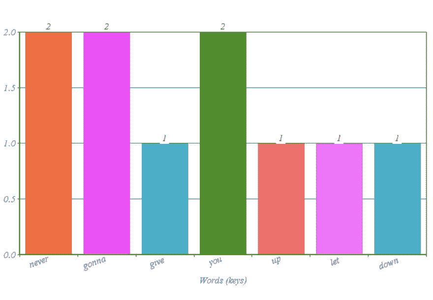
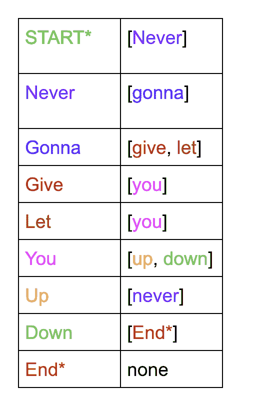
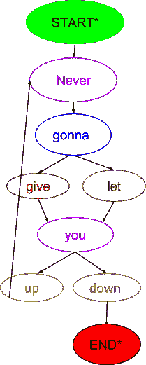
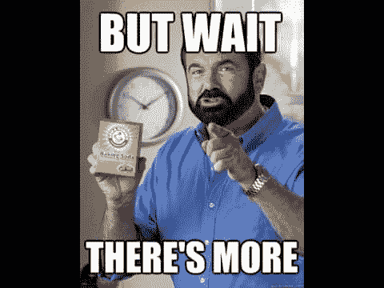
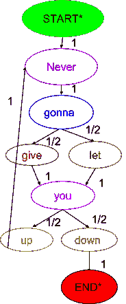
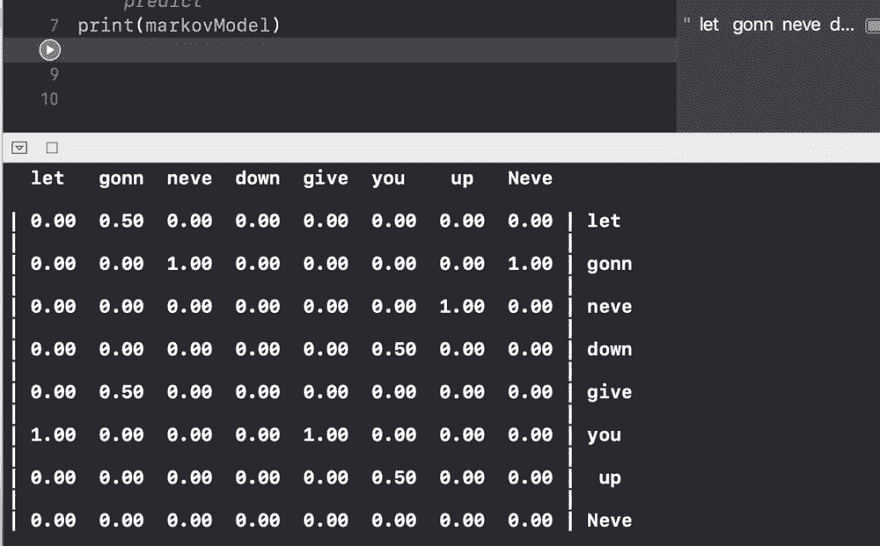

# Swift 马尔可夫模型简介

> 原文：<https://dev.to/twilio/intro-to-markov-models-with-swift-29i8>

[](https://res.cloudinary.com/practicaldev/image/fetch/s--7_PhiqD9--/c_limit%2Cf_auto%2Cfl_progressive%2Cq_auto%2Cw_880/https://lh5.googleusercontent.com/GH0KkWl0ec1r_keK69bMzNRGWHx-7-CMn9Xlz4DsDzS_ZNqScRqkwqjhGe7n05XlrRubN4qoaO8Ymvj0iThpYhLbZOgfTCJlVXLcGhKSC9_zHf-7xcyp1m4keloA851WT9hE5FHG) 
*这是在 [Twilio 博客](https://www.twilio.com/blog/intro-to-markov-models-with-swift)上交叉发布的。*
你知道 [PageRank](https://en.wikipedia.org/wiki/PageRank) 吗，谷歌用来决定搜索结果顺序的算法，就是一种马尔可夫链？我第一次了解马尔可夫链和马尔可夫模型是在我的语音合成和识别选修课中，并对它们如何用于语音识别、音乐生成和模拟序列数据以预测篮球比赛的结果感到惊讶。

# 什么是马尔可夫链和马尔可夫模型？

马尔可夫模型的最基本类型是马尔可夫链，这种模型的下一个状态仅基于其当前状态来选择。马尔可夫链用于遗传学、金融、经济学、博弈论和其他领域。一个例子是只看今天的天气而不看昨天的天气来预测明天的天气。

维基百科是这样定义的:

> 在概率论中，马尔可夫模型是一种随机模型，用于模拟随机变化的系统，其中假设未来状态仅取决于当前状态，而不取决于在此之前发生的事件(即，它假设马尔可夫属性)。

从一个状态到另一个状态的转换满足马尔可夫性质。它指出，转移到任何其他状态的概率仅基于当前状态，而不是基于它之前的状态序列，因此每个马尔可夫过程都是无记忆的。

隐马尔可夫模型是一种马尔可夫链，其中一些状态是可观察的，一些是隐藏的。它们有时可以用冰淇淋气候学方案来解释，该方案由[杰森·艾斯纳](http://www.cs.jhu.edu/~jason/)于 2002 年提出:

> 场景:你是 2799 年的气候学家，正在研究全球变暖的历史。你找不到任何关于巴尔的摩天气的记录，但是你可以找到我(杰森·艾斯纳)的日记，在日记中我孜孜不倦地记录了我每天吃了多少冰淇淋。关于那年夏天的天气，你能从中推断出什么？

[](https://i.giphy.com/media/r8Kn8NaNM3xba/giphy.gif)

我最近在想，“用什么样的方式来解释这个概念？”因为开发者是实干家，所以让我们展示一个例子，而不是讲述。

## 例句

让我们来分解一个对特维里奥有意义的句子:永远不会放弃你。

> 永远不会让你失望。
> [T3】](https://res.cloudinary.com/practicaldev/image/fetch/s--iau7ueCv--/c_limit%2Cf_auto%2Cfl_progressive%2Cq_auto%2Cw_880/https://lh6.googleusercontent.com/MYBpqYiHnqfR_WV4Zw2g9hIJXyXGE5U3APUqowKsX6_Pr43H6dyfSFFng96H1ZpB-6vifiW0iwUj2GB8UK5g2u_NwgDDwW2rL46YvdonHOmDChZlGfwTgAs26ptPIWGp-Y33lNq8)

这有十七个单词(也称为令牌)和八个唯一的单词(也称为密钥。)加权分布是一个键将出现的百分比。它基于密钥出现的总次数除以令牌总数。“从不”、“将要”和“你”的加权分布都是 2/10，如下直方图所示。
[T3】](https://res.cloudinary.com/practicaldev/image/fetch/s--7_PhiqD9--/c_limit%2Cf_auto%2Cfl_progressive%2Cq_auto%2Cw_880/https://lh5.googleusercontent.com/GH0KkWl0ec1r_keK69bMzNRGWHx-7-CMn9Xlz4DsDzS_ZNqScRqkwqjhGe7n05XlrRubN4qoaO8Ymvj0iThpYhLbZOgfTCJlVXLcGhKSC9_zHf-7xcyp1m4keloA851WT9hE5FHG)

直方图是表示加权分布的简单方法。这些键或单词也可以代表状态。每个键都可以指向另一个键:这称为转换。

## 状态间的转换

让我们想象一下每个键是如何与跟在该键后面的一组可能的标记相匹配的。
[T3】](https://res.cloudinary.com/practicaldev/image/fetch/s--xWzbmx4H--/c_limit%2Cf_auto%2Cfl_progressive%2Cq_auto%2Cw_880/https://lh6.googleusercontent.com/zn9ktrUCuoNcgdj_fCl6MnBwxaMhSAnvcNSVNYiNQdcXsNVvXkilXYtwmyAD7agdOUQ7lL1diwmE74NWhi5on5AFOP6jksp_3bwrLPQEAoUlvhZ0BmTB181Ukl5GOzZZXgIgdvma)

这里，令牌成对组织，一个状态对应于它后面的可能状态。这如何更好的可视化？
[T3】](https://res.cloudinary.com/practicaldev/image/fetch/s--GI1f9Ydn--/c_limit%2Cf_auto%2Cfl_progressive%2Cq_auto%2Cw_880/https://s3.amazonaws.com/com.twilio.prod.twilio-doimg/nevergonnalines.width-500.png)

在上图中，每个单词代表一个键或一个状态，箭头指向它后面的潜在状态。对应的色标句子看起来是这样的:
[](https://res.cloudinary.com/practicaldev/image/fetch/s--iGDMv4y2--/c_limit%2Cf_auto%2Cfl_progressive%2Cq_auto%2Cw_880/https://s3.amazonaws.com/com.twilio.prod.twilio-doimg/nevergonnacolor.width-1000.png)

但是等等！还有呢！
[T3】](https://res.cloudinary.com/practicaldev/image/fetch/s--ClwR3WY_--/c_limit%2Cf_auto%2Cfl_progressive%2Cq_auto%2Cw_880/https://lh6.googleusercontent.com/iaOUckV4UA9PQhQ9XQqOSVhBnzJ52GPInqK92lhidPwy49-BkpnDFu1FIm5YTcR6RFSYi9wuvNkaTng1Wl2a9P0v_QH67WYtpN2_e7vArSkl9kVuMCgGcAgN6daCACUYCZe602n9)

让我们尝试添加加权分布，这样每个箭头都有可能被选择作为到下一个状态的转移。

[](https://res.cloudinary.com/practicaldev/image/fetch/s--GqBCRpV2--/c_limit%2Cf_auto%2Cfl_progressive%2Cq_auto%2Cw_880/https://s3.amazonaws.com/com.twilio.prod.twilio-doimg/nevergonnagiveyouupwithprob.width-500.png)

## 使用带有迅捷操场的椰子

Swift Playgrounds 让你很快看到代码的结果。除了名为 [MarkovModel](https://github.com/db-in/MarkovModel) 的 Swift 库之外，我们还将使用它们来通过代码可视化我们的 MarkovModel 示例。

要在 Playgrounds 上使用 CocoaPods，首先创建一个新目录，然后在那里创建一个新的 XCode 项目。在目录顶层的命令行中，用`pod init`创建一个 podfile，并在其中包含以下代码:

```
target 'your-project-name' do
  # Comment the next line if you're not using Swift and don't want to use dynamic frameworks
  use_frameworks!
  pod 'MarkovModel'

end
post_install do |installer|
    installer.pods_project.build_configurations.each do |config|
        config.build_settings.delete('CODE_SIGNING_ALLOWED')
        config.build_settings.delete('CODE_SIGNING_REQUIRED')
    end

    installer.pods_project.targets.each do |target|
        target.build_configurations.each do |config|
            config.build_settings['CONFIGURATION_BUILD_DIR'] = '$PODS_CONFIGURATION_BUILD_DIR'
        end
    end
end 
```

Enter fullscreen mode Exit fullscreen mode

回到命令行运行`pod install`，并关闭项目。接下来，打开 XCode，点击*File->New->Playground*，创建一个 Swift Playground，保存在你目录的顶层。如果没有看到操场，就这样拖到工作区:
[](https://res.cloudinary.com/practicaldev/image/fetch/s--1qDcwM6F--/c_limit%2Cf_auto%2Cfl_progressive%2Cq_auto%2Cw_880/https://www.youtube.com/watch%3Fv%3DujxYr15ahro)

现在确保你打开了你的*。xcworkspace* 而不是*。xcproject* 。现在把下面的启动代码放到你的*中。游乐场*文件检查 pod 安装是否正确。

```
import MarkovModel
import Foundation 
```

Enter fullscreen mode Exit fullscreen mode

你可能需要用 *cmd-shift-k* 清理，然后用 *cmd-b* 建造，但是应该可以了！

## 马尔可夫模型与 Swift

让我们使用 MarkovModel 库中的方法将 rickrolling 语句翻译成 Swift 代码。

```
let markovModel = MarkovModel(transitions: ["Never", "gonna", "give", "you", "up", "never", "gonna", "let", "you", "down"])
markovModel.chain.next(given: "gonna") 
```

Enter fullscreen mode Exit fullscreen mode

在这里，我们创建了一个马尔可夫模型来训练和传递句子中的一组标记。我们通过调用 *next* 来计算未来状态。有了这个库，我们有三个可能的决策过程选项:*预测*、*随机*和*加权随机*。默认是*预测*。

您还可以使用
打印出每个令牌的加权分布

```
print(markovModel) 
```

Enter fullscreen mode Exit fullscreen mode

哪个输出
[](https://res.cloudinary.com/practicaldev/image/fetch/s--DsZWsEdK--/c_limit%2Cf_auto%2Cfl_progressive%2Cq_auto%2Cw_880/https://s3.amazonaws.com/com.twilio.prod.twilio-doimg/playgroundmarkov.width-1000.png)

## 接下来是什么？

[](https://res.cloudinary.com/practicaldev/image/fetch/s--vDkXfsu2--/c_limit%2Cf_auto%2Cfl_progressive%2Cq_66%2Cw_880/https://s3.amazonaws.com/com.twilio.prod.twilio-docs/original_images/thankunext.gif) 
哇！马尔可夫链是如此强大。作为金州勇士队的球迷，我想知道如何根据之前的比赛预测他们的比赛结果，或者根据之前的统计数据预测斯蒂芬·库里会如何投篮。想想可能性吧！

关于马尔可夫链和模型的更多阅读，我推荐这个[克莱姆森大学讲座](http://cecas.clemson.edu/~ahoover/ece854/refs/Ramos-Intro-HMM.pdf)或者[加州大学戴维斯分校 one](https://www.math.ucdavis.edu/~gravner/MAT135B/materials/ch12.pdf) ，这个[有趣、直观、互动的马尔可夫链解释](http://setosa.io/ev/markov-chains/)，还有这个[可汗学院视频](https://www.khanacademy.org/computing/computer-science/informationtheory/moderninfotheory/v/markov_chains)。

请继续关注下一篇文章，在这篇文章中，将使用不同的输入来训练马尔可夫模型，以生成相似的文本。同时，让我知道你会如何在评论或网上使用马尔可夫模型:
Twitter:[@ lizzie pika](https://twitter.com/lizziepika)T3】GitHub:[@ elizabethsiegle](https://github.com/elizabethsiegle)
Email:[lsiegle@twilio.com](mailto:lsiegle@twilio.com)