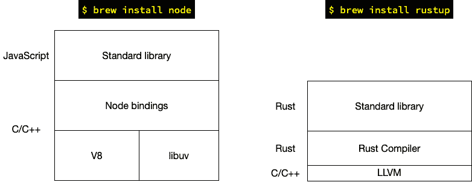
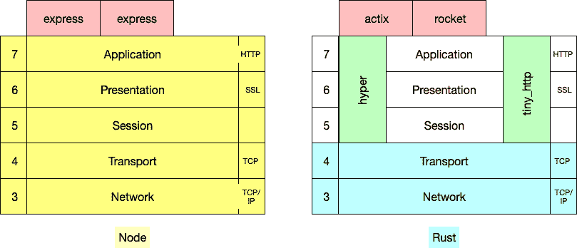
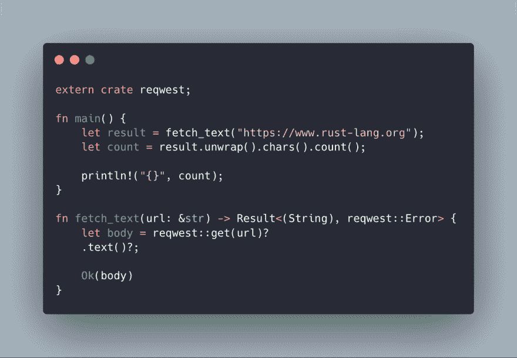

# Rust for Web 介绍面向 NodeJS 开发人员的 Rust Web 开发

> 原文：<https://dev.to/gruberb/intro-to-web-programming-in-rust-for-nodejs-developers-lp>

> 你可以在这里找到本系列的第二篇文章(“部署你的第一个 Rust 应用”)。

铁锈不一样。你可以在周末学习 Python 或 Ruby，创建第一个 CRUD 应用程序，并对结果感到满意。

有了 Rust…有了 Rust，你将很难把一个字符串传递给不同的方法，改变并返回它。然后你会订购 Rust book，看它的大小，*叹*然后开始。

在工作之余苦读了几周之后，你放弃了，等着别人创造一个简单易懂的教程。

### 这里是你的“轻松”教程

我也在纠结同样的问题。然而，生活环境给了我几个月的时间来真正关注铁锈。

接下来是第一个概述、概念和要遵循的路径。在接下来的几周和几个月里，我将发表一系列文章来帮助你从概念到产品。

### NodeJS 诉拉斯特

安装它们之后(在这个例子中我选择了 brew for macOS，方法无关紧要)，底层堆栈看起来就不一样了。NodeJS 需要来自 Google 的运行时引擎 V8 和 JavaScript 库的绑定来运行 JavaScript 代码。

铁锈几乎完全取决于铁锈本身。只是编译器用的是用 C 和 C++写的`llvm` [库](https://llvm.org/)。

### 到底有多少“网”在生锈？

Rust 中不包含标准 http 库是一个设计决策[。因此，OSI 层的覆盖范围有所不同:](https://users.rust-lang.org/t/announcing-the-http-crate/12123)

Node 涵盖了整个堆栈，并提供了 Koa 和 Express，这两个众所周知的“坚如磐石”的 web 框架可以帮助您在 HTTP 之上构建应用程序。

在 Rust 方面，Rust 内核中只实现了 [TCP](https://doc.rust-lang.org/std/net/struct.TcpStream.html) 。当前的 web 框架( [actix](https://actix.rs/actix/actix/) 和 [rocket](https://rocket.rs/) )实现了 HTTP 之前的所有东西。所以你不需要关心这是从哪里来的。

如果想在没有任何更大框架的情况下使用纯 HTTP 调用，可以安装实现 HTTP 协议的“crates”(相当于节点世界的 npm 包)(像 [hyper](https://github.com/hyperium/hyper) 和 [tiny_http](https://github.com/tiny-http/tiny-http) )。

### npm vs cargo

节点正在使用 npm 进行程序包管理:

*   `npm install`正在安装依赖项
*   `npm run xyz`正在执行`package.json`内部的脚本

另一方面，`cargo`正在[处理与你的项目](https://doc.rust-lang.org/cargo/)相关的所有事情:

*   `cargo new NAME --bin`正在创建应用程序
*   `cargo new NAME --lib`创建一个库
*   `cargo run`正在执行代码
*   `cargo build`正在创建可执行文件
*   `cargo test`正在运行项目内部的所有测试

有一个[打开 PR](https://github.com/rust-lang/cargo/issues/5586) 添加`cargo add`安装依赖项。现在你必须手动将它们添加到你的`Cargo.toml`文件中。如您所见，您不需要在`package.json`中包含脚本来运行测试或者构建和测试您的应用程序。

> 心态变化:货物在`cargo run`后取包裹，只是版本变了。所以第一次它会获取所有的包，第二次只是在版本号发生变化的时候。不像`npm i`会立即获取包，并使用`save`符号将其添加到`package.json`中。

### 生态系统

节点无缘无故不成功。生态系统丰富而繁荣。Rust 还在发展，但已经有了很多伟大的“板条箱”。网站[arewewebyet.org](http://www.arewewebyet.org/)正在跟踪进展，并向你展示铁锈世界中有趣的软件包。

还有人试图创建一个官方的 Rust Web 框架，名为 [Tide](https://github.com/rustasync/tide) 。它已经相当成熟，可以用于辅助项目。在 Rust 中，您可以自由地贡献并帮助创建一个 web 开发的良好环境。

### Asnyc 编程又名承诺又名期货

节点杀手特性是承诺。虽然并不总是容易理解和处理，但承诺和事件循环是 Node 如此有利可图的原因。

Rust 还实现了一个异步机制，这还没有在最终版本中实现。他们被称为期货。一个名为 [Tokio](https://tokio.rs/) 的库已经在提供异步运行时。你可以在[areweasynctive](https://areweasyncyet.rs/)的 Rust over 中跟踪异步编程的进展。

### 如何入门？

1.  安装铁锈:`curl https://sh.rustup.rs -sSf | sh`
2.  创建新项目:`cargo new web-app --bin`
3.  `cd web-app`

现在你可以选择你的 web 框架了。你可以从[火箭](https://rocket.rs/)或者 [actix](https://actix.rs/) 开始。您可以按照网站上的教程来运行第一个 web 应用程序。

### 平视:未定义、借用和类型

为了在我的下一篇文章之前不感到沮丧，这里有你必须习惯的关于 Rust 的四件主要事情(过一段时间后会很棒)。

1.  没有未定义的。Rust 没有真正的空值。这是一个特点。Rust 有一种叫做[选项](https://doc.rust-lang.org/std/option/index.html)的类型，它要么封装返回值，要么不封装。在这种情况下，我们使用[结果](https://doc.rust-lang.org/std/result/#result-and-option)类型返回值。你可以不返回一个字符串，而是返回一个可能有一个字符串值的选项，或者如果我们从中获取的网站不包含任何文本，则没有字符串值。一个简单的解决方案是`.unwrap()`结果，从封装中取出字符串，但在生产中不应该使用。[作业:尝试检查 GET 请求是否出错，在这种情况下返回一个错误而不是 Ok()。](https://doc.rust-lang.org/std/result/#result-and-option)
2.  你一定听说过[借](https://doc.rust-lang.org/book/ch04-02-references-and-borrowing.html)。简而言之:对非平凡类型(没有固定大小的所有类型)的每一次赋值(=)都会转移所有权。方法`fetch_text()`没有取得 url 的所有权，只是使用了对它的引用(通过`&`)。[家庭作业:找出这段代码失败的原因以及如何解决。](https://play.rust-lang.org/?version=stable&mode=debug&edition=2018&gist=d7527a2b8570393dd70c2083172d621a)
3.  你必须知道方法返回的是哪种类型。在这个例子中，我们的 HTTP crate `reqwest`正在返回一个实现某些方法的响应结构(类型)。文件，就像许多板条箱一样，非常好。[所以看看这里的](https://docs.rs/reqwest/0.9.11/reqwest/struct.Response.html#method.text)。
4.  您不必键入`return`来从方法返回值。只是不要在一个语句的末尾加上一个`;`,它将成为你的返回值。

使用这个例子来试验一下，看看在哪里可以得到错误并学习修复它们。

### 这是全部吗？

两种意见:

*   “可惜没有！”
*   “没有，但这是好事！”

你实际上必须学会相当多的铁锈才能开始。这就是我来这里的目的。在接下来的几天、几周或几个月里，我将讲述基础知识，直到创建一个可靠的 web 应用程序。

在此之前，我可以推荐 Exercism.io 上的 [Rust track 和 Rust Book，你也可以在当地书店或亚马逊找到纸质版。](https://exercism.io/my/tracks/rust)

[正如我在第一篇文章](https://medium.com/@gruberbastian/moving-from-nodejs-to-rust-in-2019-62c0b85d2fa7)中提到的，Rust 让你成为更好的开发人员，所以这条路有时会很长，但总是值得的。在 [twitter](https://twitter.com/byteadventures) 、 [Medium](https://medium.com/@gruberbastian) 或 [dev.to](https://dev.to/gruberb) 上关注我，了解最新动态！