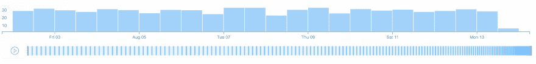

# 介绍可刷直方图

> 原文：<https://dev.to/lfacpt/introducing-brushable-histogram-1302>

嘿，只是想分享我们的第一个 React 开源组件:可刷直方图！

可刷直方图是一个时间直方图，下面是整个数据集的可刷预览。

除了 React，组件还用了很多 d3。

如果你想了解更多，你可以阅读发布会的博客文章。

你也可以查看 Github repo 的或者 T2 的演示。

如果你有任何反馈，请告诉我！