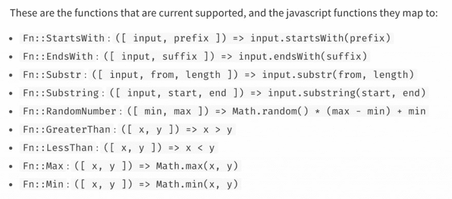

# 介绍…云形成的外部函数；-)

> 原文：<https://dev.to/theburningmonk/introducing-cloudformation-extrinsic-functions-33e1>

好吧，好吧，AWS 还没有宣布一个全新的[内在函数](https://docs.aws.amazon.com/AWSCloudFormation/latest/UserGuide/intrinsic-function-reference.html)类供你在 CloudFormation 中使用。但是如果你使用的是[无服务器框架](https://serverless.com/framework/)，那么我有一个好东西给你:-)我为无服务器框架创建了一个[插件](https://github.com/theburningmonk/serverless-plugin-extrinsic-functions)，它可以让你在你的无服务器. yml 中使用许多自定义的 Fn::函数

### 问题

这个插件的动机来自于我们在 DAZN 遇到的一个挑战。我们有一个用例，我们想要指定一个云形成条件，其行为类似于 Javascript 的 [startsWith](https://www.w3schools.com/jsref/jsref_startswith.asp) 函数。

[条件函数](https://docs.aws.amazon.com/AWSCloudFormation/latest/UserGuide/intrinsic-function-reference-conditions.html)的可用集合受到相当大的限制。即使是上面描述的简单逻辑也被证明是复杂的，代码也不容易理解。

### 【外在】功能

这个插件允许你在你的 serverless.yml 中的任何地方使用许多自定义函数，就像它们是 CloudFormation 的固有函数一样。例如，你可以把它们作为云形成条件的一部分。要实现 startsWith 逻辑，我们可以简单地使用 Fn::StartsWith 函数:

所有和所有，8 个自定义功能支持开箱即用。将来[增加对额外功能](https://github.com/theburningmonk/serverless-plugin-extrinsic-functions/blob/master/index.js#L1-L11)的支持是非常简单的。如果你有难以用 CloudFormation 的固有功能实现的用例，请在下面的评论中告诉我。也许我可以把它们作为外在功能来支持，让你的生活更轻松。

本帖[介绍…云形成的外在函数；——)](https://theburningmonk.com/2019/04/introducing-cloudformation-extrinsic-functions/)最早出现在 theburningmonk.com[上](https://theburningmonk.com)。

