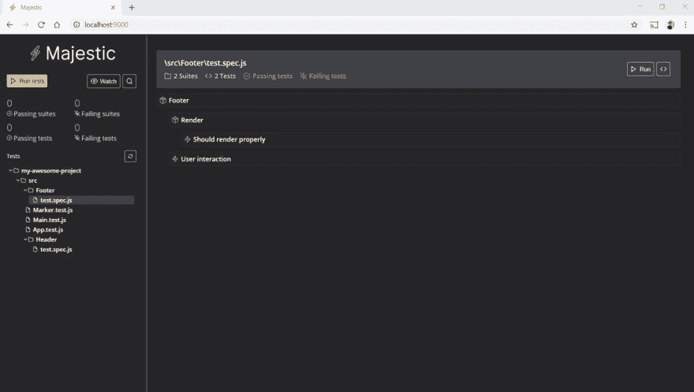
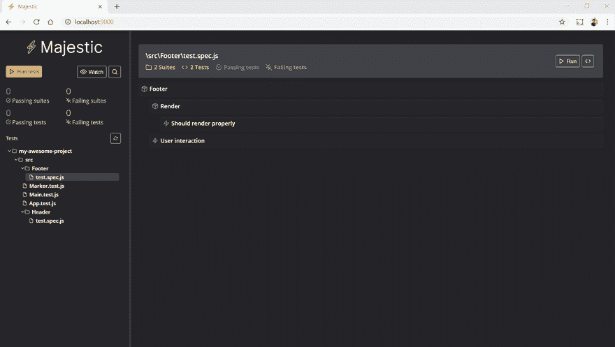
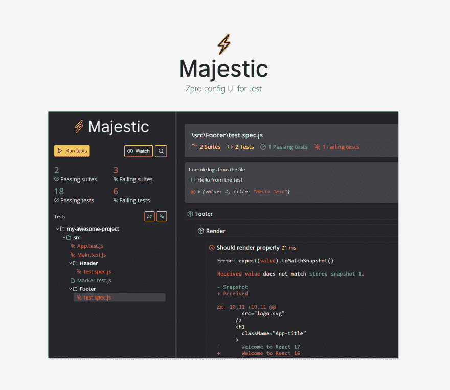

# 介绍 Majestic，Jest 的零配置 GUI

> 原文：<https://dev.to/raathigesh/introducing-majestic-a-zero-config-gui-for-jest-2l1l>

Jest 真的让测试变得不那么痛苦，就像 Javascript 生态系统中的许多工具一样，与 Jest 交互的默认界面是通过 CLI。这是最好的 CLI 之一。但是如果 Jest 也有 GUI 界面呢？

### 🕑不久前

一年前[我发布了](https://twitter.com/raathigesh/status/948150176622960640)一个叫做 **Majestic** 的开源附带项目，一个用于开玩笑的 GUI。这是一个代表你与 Jest CLI 交互的电子应用程序。这是一个概念验证，但离这样的工具还差得很远。但是我学到了很多关于技术和设计决策的知识，我想从头开始。

### 🎉全新的雄伟建筑

> <video loop="" controls=""><source src="https://video.twimg.com/tweet_video/D2f0voLVYAE3khu.mp4" type="video/mp4"></video>raathi[@ raathigesh](https://dev.to/raathigesh)⚡introducing 一个崭新的雄伟、 用于 [@fbjest](https://twitter.com/fbjest)
> 
> 的零配置 GUI📸运行测试并更新快照
> ❌在故障发生时检查故障
> ⏲Console.log()支持
> 📦作为 NPM 模块分发
> 
> ✅只要在你的项目目录里运行“npx majestic”
> 
> [github.com/Raathigesh/maj…](https://t.co/LXQWxYike2)2019 年 3 月 25 日上午 11:18[](https://twitter.com/intent/tweet?in_reply_to=1110138948259467264)[](https://twitter.com/intent/retweet?tweet_id=1110138948259467264)2[](https://twitter.com/intent/like?tweet_id=1110138948259467264)6

[**今天我非常高兴地向大家介绍全新的 Majestic，这只是一个简单的命令，`npx majestic`，出发。**](https://github.com/Raathigesh/majestic/)

[](https://res.cloudinary.com/practicaldev/image/fetch/s--gUgcOGw3--/c_limit%2Cf_auto%2Cfl_progressive%2Cq_66%2Cw_880/https://thepracticaldev.s3.amazonaws.com/i/wvjoidi4yxapejb0ncgd.gif)

Majestic 不再是一个电子 app，而是一个 npm 模块。进入配置了 Jest 的项目，在终端中运行`npx majestic`,您将看到 UI 在默认浏览器中打开。

全新的 Majestic 将允许您

*   ✅运行所有测试或单个文件
*   ⏱切换观察模式
*   📸更新快照
*   ❌在测试失败时进行检查
*   ⏲Console.log()添加到 GUI 进行调试
*   🔍搜索测试

所有这些几乎不需要额外的配置。

### 🤝帮助我们做得更好

##  [拉提格什](https://github.com/Raathigesh) / [雄伟](https://github.com/Raathigesh/majestic)

### Jest 的⚡零配置 GUI

<article class="markdown-body entry-content container-lg" itemprop="text">[](https://raw.githubusercontent.com/Raathigesh/majestic/master/./image.png)

[ ](https://github.com/Raathigesh/majestic/actions) [](https://camo.githubusercontent.com/390c11816fd58fe623d8c05c74074200c7521868/68747470733a2f2f696d672e736869656c64732e696f2f6769746875622f6c6963656e73652f526161746869676573682f6d616a65737469632e7376673f7374796c653d666c61742d737175617265) [](https://camo.githubusercontent.com/fdc40b911fcdc1e76747ff93cafc9759398adcd4/68747470733a2f2f696d672e736869656c64732e696f2f6e706d2f762f6d616a65737469632e7376673f7374796c653d666c61742d737175617265) [](https://spectrum.chat/majestic) 

Majestic 是一个用于 [Jest](https://jestjs.io/) 的 GUI

*   <g-emoji class="g-emoji" alias="white_check_mark" fallback-src="https://github.githubassets.cimg/icons/emoji/unicode/2705.png">✅</g-emoji> 运行单个文件的所有测试
*   <g-emoji class="g-emoji" alias="stopwatch" fallback-src="https://github.githubassets.cimg/icons/emoji/unicode/23f1.png">⏱</g-emoji>切换手表模式
*   <g-emoji class="g-emoji" alias="camera_flash" fallback-src="https://github.githubassets.cimg/icons/emoji/unicode/1f4f8.png">📸</g-emoji>更新快照
*   ❌在测试失败发生时进行检查
*   <g-emoji class="g-emoji" alias="timer_clock" fallback-src="https://github.githubassets.cimg/icons/emoji/unicode/23f2.png">⏲</g-emoji> Console.log()到 UI 进行调试
*   <g-emoji class="g-emoji" alias="oncoming_police_car" fallback-src="https://github.githubassets.cimg/icons/emoji/unicode/1f694.png">🚔</g-emoji>内置覆盖率报告
*   <g-emoji class="g-emoji" alias="mag" fallback-src="https://github.githubassets.cimg/icons/emoji/unicode/1f50d.png">🔍</g-emoji>搜索测试
*   <g-emoji class="g-emoji" alias="gem" fallback-src="https://github.githubassets.cimg/icons/emoji/unicode/1f48e.png">💎</g-emoji>处理流程和类型脚本项目
*   <g-emoji class="g-emoji" alias="package" fallback-src="https://github.githubassets.cimg/icons/emoji/unicode/1f4e6.png">📦</g-emoji>使用 Create react 应用程序

> 威严支持 Jest 20 及以上

### 开始

通过项目目录中的`npx`运行 majestic

```
cd ./my-jest-project # go into a project with Jest
npx majestic # execute majestic
```

或者通过 Yarn 在全球安装 majestic 并运行 Majestic

```
yarn global add majestic # install majestic globally
cd ./my-jest-project # go into a project with Jest
majestic # execute majestic
```

或者通过 Npm 在全球安装 majestic 并运行 Majestic

```
npm install majestic -g # install majestic globally
cd ./my-jest-project # go into a project with Jest
majestic # execute majestic
```

### 作为应用程序运行

…

</article>

[View on GitHub](https://github.com/Raathigesh/majestic)

如果你对贡献感兴趣或者只是想知道在引擎盖下是什么力量，

*   Majestic frontend 是用 React JS 和 Appolo qrahphQL 写的
*   本地后端运行一个 NodeJS qrahphQL 服务器，并将 Jest 作为子进程运行并与之交互

试试看。如果你有一个功能请求或者遇到了一个问题，要么在 [github 库](https://github.com/Raathigesh/majestic/)中创建一个问题，要么来我们的社区聊天【https://spectrum.chat/majestic T2】看看

干杯