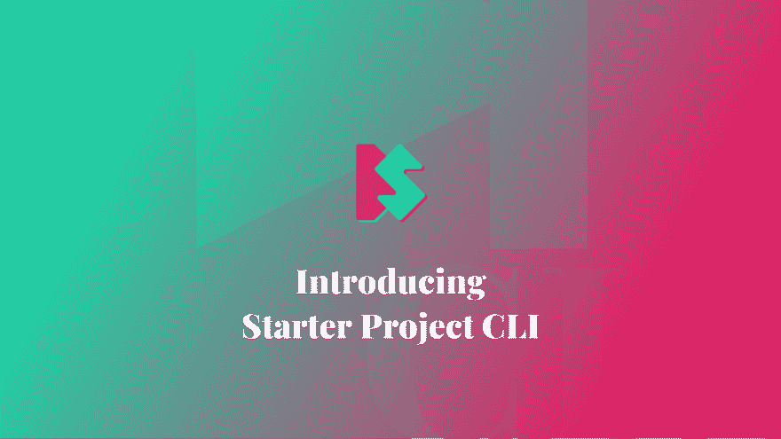
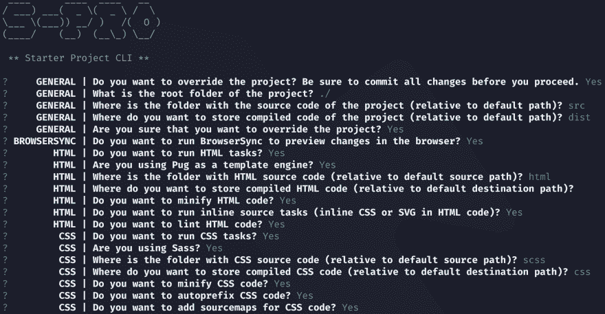
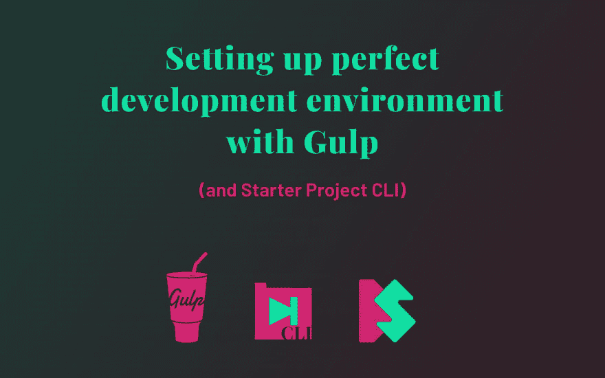

# 介绍 SPRO

> 原文：<https://dev.to/starbist/introducing-spro-2p4>

[](https://www.silvestar.codes/articles/introducing-spro/)

*这篇文章最初发表于 [silvestar.codes](https://www.silvestar.codes/articles/introducing-spro/) 。*

**<small>(publians/es-pro/)</small>，或者 Starter Project CLI，是你下一个项目的最佳起点。SPRO 的目标是通过了解你的项目架构来建立一个完美的开发环境，然后为你的所有需求建立 Gulp 任务。**

 **它非常灵活，可以节省您通常花费在项目配置上的大量时间。

*👉SPRO 正处于早期阶段，每一个建议，反馈或帮助将不胜感激！*

## 为什么一饮而尽

在前端开发人员 Slack 组(现已弃用，移至 [Discord](https://discord.gg/aBx8dcu) )中对构建工具有很大的讨论。一些开发人员更喜欢 package，因为它很快而且很好用(他们这么说)，一些开发人员喜欢[编写 npm 脚本](https://medium.freecodecamp.org/why-i-left-gulp-and-grunt-for-npm-scripts-3d6853dd22b8)以避免新的抽象层次，一些开发人员喜欢使用 CodeKit 或 Makefiles，这些我以前都不知道。

在另一篇优秀的文章[为什么 npm 脚本](https://css-tricks.com/why-npm-scripts/)中，Damon Bauer 说得很好:

> "...如果您对当前的构建系统满意，并且它完成了您需要它做的所有事情，您可以继续使用它！”
> 
> —达蒙·鲍尔，[为什么 npm 脚本](https://css-tricks.com/why-npm-scripts/)

在其他伟大的构建工具中，像 Grunt、Webpack、Parcel 甚至 npm 脚本，我最喜欢的是 Gulp，因为我最熟悉这个神奇的工具。我喜欢每个任务都可以被隔离的想法，项目文件可以作为独立的实体使用。然而，切换到 npm 脚本是值得考虑的。

## 关于 SPRO

大约一年前，我开始做我的副业项目，[启动项目](https://starter.silvestarbistrovic.from.hr/)。Starter Project 被认为是一个将最新的最佳实践打包在一起的样板文件。与其将代码从一个项目复制粘贴到另一个项目，为什么不用一个简单的配置文件就可以在不同的项目中重用呢？

> ...为什么不用一个简单的配置文件就可以在不同的项目中重用这个包呢？

在去年的介绍文章中阅读更多关于 Starter Project package 试图解决的想法和可能的问题[。](https://www.silvestar.codes/articles/starter-project-a-set-of-latest-best-practices-packed-in-gulp-tasks/)

## 工作原理

人们对 SPRO 的看法有所不同。我没有手动调整配置文件，而是构建了一个命令来启动关于项目结构的问卷调查。

[](https://res.cloudinary.com/practicaldev/image/fetch/s--7qrMBsYx--/c_limit%2Cf_auto%2Cfl_progressive%2Cq_auto%2Cw_880/https://thepracticaldev.s3.amazonaws.com/i/c7qdiz2joyp372dtylb0.png)

当你回答所有问题时，SPRO 会将信息存储到`.starter-project.json`文件中。它还会根据您的回答准备一个安装所有依赖项的命令。

除了主配置文件，SPRO 还会在`gulpfile.js`目录中添加 Gulp 任务文件和其他配置文件。

> “节点的模块解析允许您用名为`gulpfile.js`的目录替换您的`gulpfile.js`文件，该目录包含被视为`gulpfile.js`的`index.js`文件。这个目录可以包含您的各个任务模块。
> 
> — [Gulp.js 4 文档](https://gulpjs.com/docs/en/getting-started/javascript-and-gulpfiles#splitting-a-gulpfile)

SPRO 中定义的任务可以处理您的 HTML、CSS、JavaScript、字体、favicon 和图形文件。Gulp 任务将基于`gulpfile.js`目录中的配置文件处理所有文件。

SPRO 在一个地方有很多特色，所以你不要忘记给你的项目添加一些东西。这些功能包括提取关键的 CSS，添加 BrowserSync 以方便开发，林挺您的 HTML，Sass 和 JavaScript 文件，以及添加 sourcemaps 和 pug 模板引擎。

吞咽任务在第一次尝试时很有可能对你有用。但是如果你运气不好，不要犹豫:通过调试问题和更新单独的配置文件，大多数错误可以在几分钟内得到解决。你可以观看视频，了解 SPRO 是如何运作的。

## 安装

SPRO 作为 npm 模块提供，您可以在本地或全球安装它。

```
npm install starter-project-cli 
```

Enter fullscreen mode Exit fullscreen mode

*👉专业提示:[使用静音选项](https://stackoverflow.com/questions/34426332/how-to-suppress-output-when-running-npm-scripts)、`--silent`或`-s`安装，因为抑制输出会加快安装进度。*

现在，您应该能够从终端运行该命令，这将在将来为您节省大量时间。

## 命令

要检查该命令是否可用，请尝试运行以下命令:`spro --version`和`node_modules/.bin/spro --version`，分别用于全局和本地安装。您应该在终端中看到版本号。

[](https://res.cloudinary.com/practicaldev/image/fetch/s--VzD8YZVi--/c_limit%2Cf_auto%2Cfl_progressive%2Cq_66%2Cw_880/https://thepracticaldev.s3.amazonaws.com/i/9h4koqyhpce516o1u7yx.gif)

您想要运行的命令是`spro start`。应该会提示您回答关于项目结构的问题，如前所述。

## 依赖关系

一旦你回答了所有的问题，SPRO 就会显示(并复制到剪贴板)为你的项目安装依赖项的命令。

我最初的想法是把所有可能依赖 SPRO 的因素都包括在内。更彻底的思考后，我得出了一个结论，不是正确的方法。这种方法没有经过优化。相反，您可以只安装运行所选任务所需的依赖项。

要检查所有可能的依赖关系，请访问 SPRO 的 GitHub 页面。

## 任务

不同的开发类型有三个主要的 Gulp 任务:

*   `gulp default`用于运行所有任务(对更彻底的开发过程有用)，
*   `gulp build`用退出进程运行所有任务(例如，对 Netlify 构建有用)，以及
*   `gulp dev`仅用于运行基本任务(对基本开发过程有用)。

这些任务是许多其他子任务的集合。子任务将根据全局配置选项运行。如果您选择不运行 CSS 任务，基于 CSS 的子任务将被跳过(并且 Gulp 依赖项将被忽略)。

所有子任务都按照文件类型和主要功能来划分。与 CSS 相关的子任务可以在`gulpfile.js/css.js`文件中找到，与提取关键 CSS 相关的子任务可以在`gulpfile.js/critical.js`文件中找到。

每个子任务都有自己的配置文件。CSS 特定配置可以在`gulpfile.js/.css.json`文件中找到，关键 CSS 相关配置可以在`gulpfile.js/.critical.json`文件中找到。

*👉您可以手动编辑每个单独的配置文件。但是，不应手动编辑主配置文件`.starter-project.json`文件。您的项目很有可能没有运行 Gulp 任务的所有依赖项。而是再次启动`spro`命令。*

## 航向

我已经开设了一门课程，在这里你可以更多地了解 SPRO。

[](https://skl.sh/2EcUlRt)

该课程是免费的，但你需要有一个 [Skillshare](https://skl.sh/2EcUlRt) 账户才能观看所有课程。请务必完成课程项目并对课程进行评分。🆓

## 结论

我鼓励每个人都尝试 SPRO。我将感谢任何反馈，即使 SPRO 不是你的项目很好的匹配。

如果 SPRO 对你和你的项目有用，我们可以引入更多的选项或任务，为任何开发者创造更好的体验。例如，我目前正在考虑将 [siteaudit](https://github.com/thecreazy/siteaudit) 设置添加到包中。

请通过在 [Github](https://github.com/maliMirkec/starter-project-cli) 上主演该项目，或者在 [Twitter](https://twitter.com/intent/tweet?url=https://github.com/maliMirkec/starter-project-cli/&text=Starter%20Project%20CLI%20creates%20a%20perfect%20Gulp%20development%20environment%20for%20everyone%20within%20a%20few%20minutes.%20%F0%9F%94%A5%20Try%20it%20today!%20%F0%9F%92%AF&via=malimirkeccita) 上分享来表示你的支持。🙏

或者通过创建[一个新问题](https://github.com/maliMirkec/starter-project-cli/issues/new)或[一个拉动式请求](https://github.com/maliMirkec/starter-project-cli/compare)来为项目做贡献。**