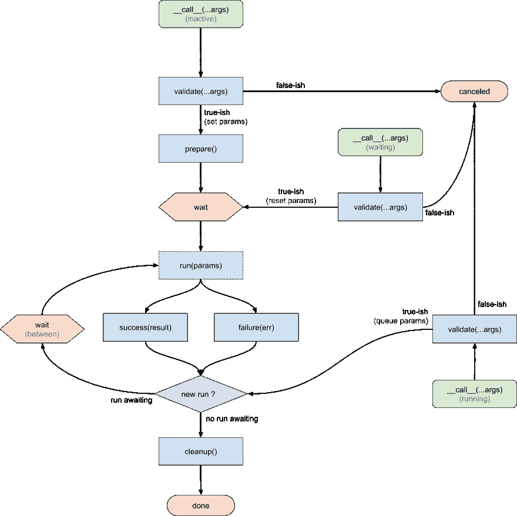

# 引入异步谴责模式

> 原文：<https://dev.to/xowap/introducing-the-async-debounce-pattern-36ff>

*回调地狱*。这是 Javascript 开发人员最害怕的事情。尤其是在处理像 jQuery 或节点标准库这样的遗留 API 时。幸运的是，解决方案已经到位。像 Angular 这样的框架出现了，它简化了 HTML 的呈现。Promises 带来了处理异步函数的标准而简单的方法。现在`async` / `await`使得用非线性路径编写异步代码变得容易了。

然而，现在这一层稳定到了它的最终形状，开始考虑如何构建可以用于 UI 开发的高级模式是一个好主意。

任何典型的 UI 基本上都可以分为两件事。除了用于导航/过滤/更改这些信息的输入之外，还有许多信息。所有这些都发生在服务器端，前端只是一个视图。这意味着前端和 API 必须经常通信才能对用户输入做出反应。如果你已经做了足够长的时间，你应该知道:

*   它不是即时的，你需要警告用户正在进行的操作
*   用户往往很愚蠢，没有耐心，在加载过程中点击按钮无数次
*   有时会发生错误，而您总是忘记在某个时候捕捉它们，通常会导致整个系统崩溃，并使 UI 处于不良状态

当然还有很多其他的问题，但我把重点放在这些问题上，因为它们都与上述每个人最喜欢的语言中的一个特殊性有关。把你的脑袋缠在异步代码上真他妈的难。让你的用户明白这一点就更难了。

## 预期流量

好吧，那我们就别做了。或者说，一劳永逸，然后坚持一个更简单的思维模式。

假设你正在做一些类似即时搜索的 UI。你输入一个输入，结果就显示在下面。把边缘的箱子放好。你认为这是什么心理模型？

1.  用户事件触发呼叫(`__call__()`)
2.  您检查请求是否有效(`validate()`)
3.  然后确保向用户显示加载器(`prepare()`)
4.  此时，您可以运行请求(`run()`)
5.  根据结果，您可以处理结果(`success()`)或错误(`failure()`)
6.  现在所有东西都已加载，您可以禁用加载器(`cleanup()`)

为什么会更复杂？记住这个模型并实现每一个钩子，然后你就可以开始了。多亏了承诺，无论`run()`做什么任务都可以像那样被抽象掉。尤其是因为大多数情况下，它是通过`axios`或另一个已经返回承诺的 HTTP 库的单个 API 调用。

当然，如果用户在`run()`期间点击会发生什么？如果你想在做第一个请求之前等待呢？我考虑了可能的边缘情况，然后想出了这个图表:

[](https://res.cloudinary.com/practicaldev/image/fetch/s--w8Ykfm6F--/c_limit%2Cf_auto%2Cfl_progressive%2Cq_auto%2Cw_880/https://thepracticaldev.s3.amazonaws.com/i/a7p23s1vluk5wn0cxj07.png)

需要全部了解吗？也许是，也许不是。所有的箭头、连接和挂钩都被仔细考虑过，尽可能的正交，所以如果需要的话，可以推得更远。如果那是你想做的，那么你显然需要理解它。如果没有，就按照说明做，把简化的模型记在心里，一切都会好的！

## 代码示例

当然，我没有停留在图表上。代码才是最重要的，对吗？

介绍[wasync/去抖](https://github.com/WithIO/wasync)！

就本例而言，我们将浏览一些受[去抖演示](https://github.com/WithIO/wasync/blob/develop/demo/Debounce.vue)启发的代码。

我们在进行模拟搜查。你输入一些东西，它进入一个模拟函数，1 秒钟后回显查询，然后你显示结果。所有这些都使用 Vue 组件。

模板非常简单:

```
 <div class="debounce">
        <div>
            <input type="text" v-model="search">
        </div>

        <ul>
            <li>Search = {{ search }}</li>
            <li>Result = {{ result }}</li>
            <li>Loading = {{ loading }}</li>
        </ul>
    </div> 
```

Enter fullscreen mode Exit fullscreen mode

我们依赖几个变量:

*   `search`是搜索查询文本
*   `result`是该查询的结果
*   `loading`是表示当前装载状态的标志

现在让我们将去抖插入组件:

```
import {ObjectDebounce} from 'wasync';

export default {
    // ...

    watch: {
        search: new ObjectDebounce().func({
            // insert code here
        })
    },
} 
```

Enter fullscreen mode Exit fullscreen mode

从现在开始，我们将把`new ObjectDebounce().func()`的输出称为*去抖功能*。

正如您所看到的，去抖功能可以直接用于观察 Vue 值(在本例中是搜索文本)。感谢 Vue 监视系统，每当`search`值改变时，该值将作为参数传递给`search()`函数。

```
 validate(search) {
                return {search};
            }, 
```

Enter fullscreen mode Exit fullscreen mode

用于调用去抖动函数的参数——在本例中是搜索值——被一字不差地传递给`validate()`钩子。这个钩子做两件事:

1.  **验证输入**。如果输入值不好，那么它需要返回一个假值。
2.  **生成运行参数**。`validate()`的返回值将作为参数传递给`run()`。如果你要返回一个对象，确保它是一个**副本**，在运行过程中不会有变异的风险。

```
 prepare() {
                this.loading = true;
            }, 
```

Enter fullscreen mode Exit fullscreen mode

这里的`prepare()`钩子可以让你准备加载 UI。在这种情况下，只需将`loading`标志设置为`true`。

```
 cleanup() {
                this.loading = false;
            }, 
```

Enter fullscreen mode Exit fullscreen mode

另一方面，当函数运行结束时，我们想要禁用加载程序，我们只需将`loading`设置为`false`即可。

```
 run({search}) {
                return doTheSearch({search});
            }, 
```

Enter fullscreen mode Exit fullscreen mode

那是主菜。这是我们实际工作的地方。这里用`doTheSearch()`函数来表示，但是你可以做任何你想做的异步工作。

*   如果`run()`返回一个`Promise`，那么它将被等待。
*   `run()`的第一个也是唯一一个参数是`validate()`的返回值。
*   如果在运行时调用了去抖功能，只有最近的调用会导致另一个`run()`，其他的都将被丢弃。
*   所有异常和承诺拒绝将被捕获，并将触发`failure()`钩子

```
 success(result) {
                this.result = result;
            }, 
```

Enter fullscreen mode Exit fullscreen mode

成功接收来自`run()`的返回/解析值作为第一个也是唯一的参数。那就看你怎么处理了！

```
 failure(error) {
                alert(error.message);
            }, 
```

Enter fullscreen mode Exit fullscreen mode

事情并不总是按计划进行。如果`run()`引发异常或被拒绝，那么异常将作为`failure()`的第一个也是唯一的参数被传递。

### 重述

最后，这就是我们的组件的样子:

```
<template>
    <div class="debounce">
        <div>
            <input type="text" v-model="search">
        </div>

        <ul>
            <li>Search = {{ search }}</li>
            <li>Result = {{ result }}</li>
            <li>Loading = {{ loading }}</li>
        </ul>
    </div>
</template>

<script>
import {ObjectDebounce} from 'wasync';

function doTheSearch({search}) {
    return new Promise((resolve) => {
        setTimeout(() => resolve(`You searched "${search}"`), 1000);
    });
}

export default {
    data() {
        return {
            search: '',
            result: '',
            loading: false,
        };
    },

    watch: {
        search: new ObjectDebounce().func({
            validate(search) {
                return {search};
            },
            prepare() {
                this.loading = true;
            },
            cleanup() {
                this.loading = false;
            },
            run({search}) {
                return doTheSearch({search});
            },
            success(result) {
                this.result = result;
            },
            failure(error) {
                alert(error.message);
            },
        })
    },
}
</script> 
```

Enter fullscreen mode Exit fullscreen mode

虽然这看起来微不足道，但它实际上是久经沙场的代码，无论用户的操作是什么，它都将为用户提供流畅的体验！

请注意，由于有了 [vue-cli](https://cli.vuejs.org/guide/prototyping.html) ，您可以测试独立的 Vue 组件。

## 结论

一些与异步资源和用户交互相关的常见问题可以通过一种非常复杂的模式来解决，但幸运的是，这种模式被分解到了`wasync`包中的一个通用库中。

这在一个简单的 Vue 组件中用非常简单的代码表现出来，实际上与您在生产中使用的代码非常接近。

它来自几个项目的经验，这些经验最终被分解成一个库。我渴望得到每个人对此的反馈，其他已经使用过的解决方案，如果你认为你能把它应用到你的需要！