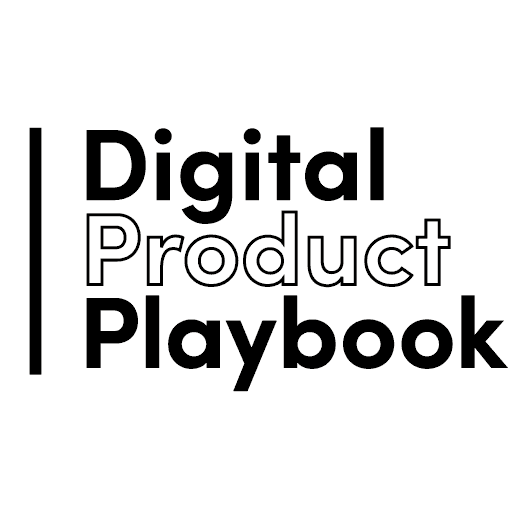

# 介绍数字产品行动手册

> 原文：<https://dev.to/steadfast/introducing-the-digital-product-playbook-4i1b>

《数字产品行动手册》是一份月度行动手册，包含关于构建和发展数字产品的有见地的文章和想法。

你可能已经在本月早些时候通过我们的[对讲机看到了我们的剧本预告:在启动](https://dev.to/steadfast/intercom-on-starting-up-4l9o)书籍赠品时，通过注册进入。我们现在可以宣布这本书的获胜者是索菲！(它在路上了，苏菲！).

> 我们为什么要启动数字产品行动手册？

作为我们对数字产品的基本热爱的一部分，我们发现自己越来越多地受到前人写的书籍、文章和视频内容的推动。我们喜欢学习增长策略、发展思想，以及阅读创始人关于人们如何将其想法发展成可持续企业的故事。

我们希望阅读、实施和整理最好的想法，那些真正对我们自己的产品或我们客户的产品产生影响的想法，并与志同道合的人分享。

你可以在[thedigitalproductplaybook.com](http://thedigitalproductplaybook.com)跟随。如果你认为你有一篇有趣的文章或想法，我们应该知道，发送给 pete@steadfastcollective.com。

介绍数码产品剧本的帖子[最早出现在](https://steadfastcollective.com/articles/introducing-the-digital-product-playbook/)[踏实的集体](https://steadfastcollective.com)上。