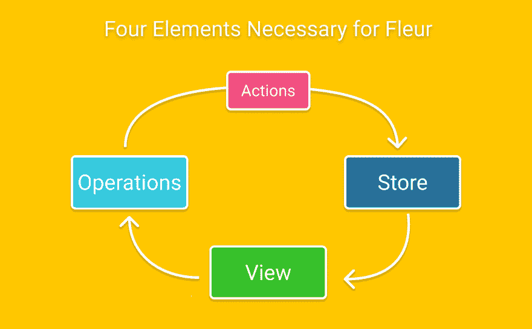
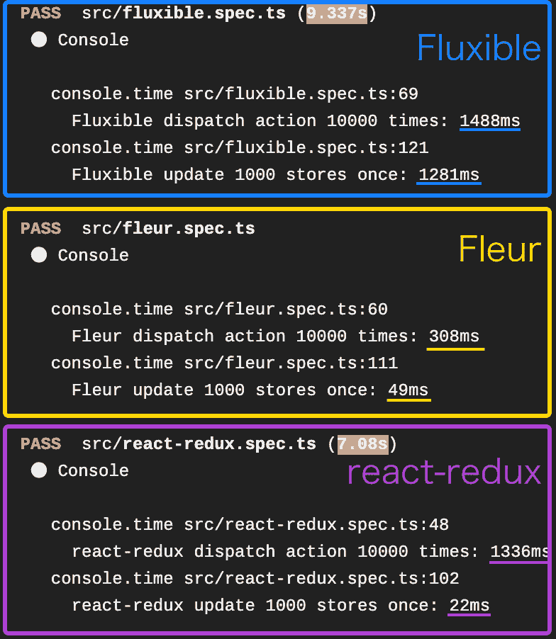

# Fleur 简介-这是一个新的通量框架

> 原文：<https://dev.to/hanakla/introduction-of-fleur-it-s-a-new-flux-framework-19d9>

这是自译的文章。来源:[https://inside.pixiv.blog/ragg/7050](https://inside.pixiv.blog/ragg/7050)T3】

大家好！我是[哈娜克拉](https://github.com/hanak1a_)，她是位于 pixiv 的 [VRoid Hub 的前端工程师🙌](https://hub.vroid.com/)

这次介绍一下[“Fleur”(NPM js:@ fluer/Fleur)](https://github.com/ra-gg/fleur)的设计和使用方法，这是我用了一年左右时间开发的一个 flux 框架！

# 目录

*   什么样的框架？
*   使用
*   问题
*   最后

# 什么样的框架？

参考了 [pixiv Sketch](https://sketch.pixiv.net) 中采用的 [Fluxible](https://fluxible.io/) ，我用打字稿打了个满满的刮痕，重点强调两点:“写的轻松”和“采用现代特色”。(我认为 Fluxible 是我所知道的♨最“完整”的框架)

虽然还没有在 Fleur 的大规模生产中采用，但是已经在一个名为“Delir”的性能敏感型[基于 Web 的 VFX 应用产品中，通过调整 API 和性能，开发了一年。](https://github.com/ra-gg/Delir)

## 特征

*   服务器端渲染(SSR)就绪
    *   集成测试，如 [express + Fleur SSR 验证测试](https://github.com/ra-gg/fleur/blob/master/packages/fleur-react/src/ssr.spec.tsx)和 [Todo MVC SSR 实现](https://translate.googleusercontent.com/translate_c?depth=1&rurl=translate.google.com&sl=ja&sp=nmt4&tl=en&u=https://github.com/ra-gg/fleur/tree/master/packages/example-todomvc&xid=17259,15700023,15700186,15700190,15700256,15700259&usg=ALkJrhgr7z2SOE68p8jOuNOcMtiHfYgd6A)
*   反应挂钩兼容(`useFleurContext()`、`useStore()`等)。)
*   舒适地编写代码
*   标准支持异步处理
*   immer.js 内置商店
*   SSR 兼容路由器
    *   考虑 API 获取的设计支持通过动态导入延迟组件加载(不需要代码转换)
*   性能接近 redux + react-redux
    *   有些基准测试可能比 react-redux 更快
*   Redux DevTools 兼容性
    *   与跳过操作不兼容

### 寻找更容易编写且健壮的 Flux 框架。

首先让我们来看看芙蓉中动作/运营/店铺的定义。

```
// Action
import { actions, action } from '@fleur/fleur'

export const CounterActions = actions('CounterAction', {
    increase: action<{ amount: number }>(),
    decrease: action<{ amount: number }>(),
})

// Operations
import { operations } from '@fleur/fleur'
import { CounterActions } from './actions.ts'

export const CounterOps = operations({
  async increase({ dispatch }, amount: number) {
    dispatch(CounterActions.increase, { amount })
  },

  async decrease({ dispatch }, amount: number) {
    dispatch(CounterActions.decrease, { amount })
  }
})

// Store
import { listen, Store } from '@fleur/fleur'
import { CounterActions } from './actions.ts'

type State = {
  count: number
}

export class CountStore extends Store<State> {
    public state: State = { count: 0 }

    private handleIncrease = listen(CounterActions.increase, (payload) => {
        this.updateWith(draft => draft.count += payload.amount)
    })

    private handleDecrease = listen(CounterActions.decrease, (payload) => {
        this.updateWith(draft => draft.count -= payload.amount)
    })

    public get count() {
        return this.state.count
    }
} 
```

因为动作本身的定义和它的类型定义是集成的，所以减少了没有分散的描述和必须为定义一个动作编写多个代码的过程。行动的定义在芙蓉内部被称为`Action Identifier`。

Operations 从一开始就支持异步处理。所以没必要选 thunk 或者 saga。

商店的特点是`listen()`和`.updateWith()`。`listen()`根据动作标识符推断动作处理程序的参数类型。在 Fluxible 中，动作类型及其处理程序方法的名称是在名为 handlers 的属性中指定的，但由于考虑到代码更简单且类型推断友好，所以它是这样一个 API。(功能`reducerStore()`可参照[米脂/硬脂减速器](https://github.com/mizchi/hard-reducer)创建。)

### 也想要一个基于真实场景设计的路由器。

Fleur 的标准路由器`@fleur/route-store-dom`是基于 pixiv Sketch、VRoid Hub 等 SSR 服务的生产代码设计的。

根据我的调查，目前 React 周围存在的路由器库似乎普遍存在“API 请求的最佳实践不存在”的问题。即使在使用`react-router`的 VRoid Hub 中，它的实现也是相当脏的。在这方面，Fluxible 的`fluxible-router`有一个接近理想解决方案的 API，所以 Fleur 采用了它。

在 React 世界中拥有一个可以不同步的进程这个事实，本该是同步处理的，目前还不能兼容，而且我觉得就算把 React 悬疑也不一定能让 SSR 有一段时间的痛苦状态。😔 😔(还有一种理论认为 [Googlebot 引擎更新](https://webmasters.googleblog.com/2019/05/the-new-evergreen-googlebot.html)不会要求 SSR)

作为一个`fluxible-router`没有的特性，在 Fleur 中实现了对组件动态导入的支持。在现有的路由器库中，可以使用 react-loadable 来努力工作，或者使用大规模的方法，例如使用 babel transform 来分离 SSR 和 CSR 代码等。然而，在 Fleur 中，路由是在 React 生命周期之外执行的。无需任何代码转换就可以处理动态导入。

```
import { createRouteStore } from '@fleur/route-store-dom'

export const Router = createRouteStore({
  userShow: {
    path: '/user/:id',
    // Can be API fetching before page load.
    action: ({ executeOperation }, route) =>
      Promise.all([
        executeOperation(fetchUser, { id: route.param.id }),
      ]),
    // And support dynamic import.
    handler: () => import('./routes/User'),
  },
}) 
```

# 用法

Fleur 创建一个应用程序至少需要四个元素:动作、存储、操作和视图。对很多人来说感觉是 a，但我认为如果你写一个中等规模的 app，你可以支付相对较好的费用。(看起来 Redux 的动作创建器是分动作和操作的。)

[](https://res.cloudinary.com/practicaldev/image/fetch/s--zbEXyhW5--/c_limit%2Cf_auto%2Cfl_progressive%2Cq_auto%2Cw_880/https://thepracticaldev.s3.amazonaws.com/i/cbph6p21m05hkdgcnpmp.png)

推荐的目录结构如下:

```
app/ 
  └ components/
  └ domains/
    └ Entity
    └ actions.ts
    └ operations.ts
    └ store.ts 
```

从现在开始，我们将添加示例代码来解释这个流程。

## 动作

Fleur 中的操作现实只是一个类型库，一个什么也不做的函数。`action()`函数接受有效载荷类型作为参数，并返回一个实际上无法调用的函数。

在 Fleur 中，此时生成的函数实例被称为`Action Identifier`，在调度时，它触发与函数实例严格等价的存储监听器。(这是一个 JavaScript 诡计)

```
// Actions definition (actions.ts)
import { action } from '@fleur/fleur'

export const CounterActions = actions('CounterAction', {
    increase: action<{ amount: number }>(),
    decrease: action<{ amount: number }>(),
}) 
```

## 商店

在 Store 中，使用`listen()`函数来指定要处理的动作。

```
// store.ts
import { listen, Store } from '@fleur/fleur'
import { CounterActions } from './actions.ts'

type State = {
  count: number
}

export class CountStore extends Store<State> {
    public state: State = { count: 0 }

    private handleIncrease = listen(CounterActions.increase, (payload) => {
        this.updateWith(draft => draft.count += payload.amount)
    })

    private handleDecrease = listen(CounterActions.decrease, (payload) => {
        this.updateWith(draft => draft.count -= payload.amount)
    })

    public get count() {
        return this.state.count
    }
} 
```

商店有两个特点。

1.  上述`Action Identifier`推断出`payload`类型。
2.  `this.updateWith()`。因为这个方法实际上是 immer.js 的包装器，所以即使你改变了草稿，更新状态也是不可变的。返回值被 Fleur 忽略，所以不需要像`draft => { ... }`那样加大括号。

`.updateWith()`更新状态并通知视图端这个变化，但是这个更新通知是使用`requestAnimationFrame` (*1，*2)缓冲的，所以在一个处理程序`.updateWith()`中多次使用也将最小化对 UI 的阻塞。

有关 listen 函数如何将操作与处理程序相关联的详细信息，请参考以下代码。

`listen()`内容:[fleur/src/store . ts # L12](https://github.com/ra-gg/fleur/blob/4c452cd/packages/fleur/src/Store.ts#L12)T3】链接动作:[fleur/src/app context . ts # L116](https://github.com/ra-gg/fleur/blob/4c452cd/packages/fleur/src/AppContext.ts#L116)

*1 即使多个商店的状态在一次发货中发生变化，它们也会被分组和缓冲。

Store # updateWith 的实现方式:[fleur/src/Store . ts # L47](https://github.com/ra-gg/fleur/blob/4c452cd/packages/fleur/src/Store.ts#L47)
变更通知缓冲:[fleur/src/Store context . ts # L12](https://github.com/ra-gg/fleur/blob/4c452cd/packages/fleur/src/StoreContext.ts#L12)

*2 SSR 不执行缓冲，而是同步处理。

## 操作

这是 Fleur 中唯一的一个名称，但它是一个导致与 API 通信和副作用的层。对应`redux-thunk`等。如果在这一层通过将规范化处理切割成函数或者使用 [`normalizr`](https://github.com/paularmstrong/normalizr) 来完成，那么实体规范化也很容易处理。

```
// operations.ts
import { operations } from '@fleur/fleur'
import { CounterActions } from './actions.ts'

export const CounterOps = operations({
  async increase(context, amount: number) {
    context.dispatch(CounterActions.increase, { amount })
  },

  async decrease(context, amount: number) {
    context.dispatch(CounterActions.decrease, { amount })
  }
}) 
```

`{dispatch, getStore}`在每个方法的`context`中传递，也可以从操作内部引用存储的状态。例如，在“进行 API 请求时需要商店中用户的认证信息”的情况下，它很有用。`operations()`函数本身只是用于类型推断，并不做什么特别的事情。

操作支持 Promise 作为标准，所以可以少用 async / await。

## 视图

接下来，将这些连接到视图。

```
// App.tsx
import React, { useCallback } from 'react'
import { useFleurContext, useStore } from '@fleur/fleur-react'
import { CounterOps } from './operations'
import { CountStore } from './store'

export const App = () => {
  const { executeOperation } = useFleurContext()

  const { count } = useStore([CountStore], getStore => ({
    count: getStore(CountStore).getCount(),
  }))

  const handleCountClick = useCallback(() => {
    executeOperation(CounterOps.increase, 10)
  }, [])

  return <div onClick={handleCountClick}>{count}</div>
} 
```

视图使用`useStore()`和`useFleurContext()`。

`useStore()`第一个参数 useStore 中要监控的存储类和第二个参数中从存储中检索状态的函数，当有存储更新时，将执行组件更新。(这个类似 react-redux 的`connect()`)

`useFleurContext()`是返回`{ getStore, executeOperation }`的钩子。当执行一些依赖于用户动作的操作时，将你想要执行的操作及其参数传递给`executeOperation`。`getStore`对于“不影响外观但希望回调店铺状态”的场景有用。(基本上应该在运营部内完成)

最后，编写应用程序的启动部分就完成了整个流程！

```
// client-entry.tsx
import Fleur from '@fleur/fleur'
import { FleurContext } from '@fleur/fleur-react'
import React from 'react'
import ReactDOM from 'react-dom'

import AppRoot from './App'
import { CountStore } from './store'

const app = new Fleur({ 
  stores: [ CountStore ] 
})

const context = app.createContext()

window.addEventListener('DOMContentLoaded', () => {
  const root = document.querySelector('#root')

  ReactDOM.render(
    <FleurContext value={context}>
      <AppRoot />
    </FleurContext>
  , root)
}) 
```

# 问题

## 路由器？

关于示例路由器，请参见@fleur/route-store-dom 的[自述文件。](https://github.com/ra-gg/fleur/tree/master/packages/route-store-dom)

SSR 的样本是什么？在这篇文章中我将省略它，但是请看看这个例子。

*   [route-store-DOM/readme . MD](https://github.com/ra-gg/fleur/blob/master/packages/route-store-dom/README.md)
*   [todo MVC 的 SSR 实现](https://github.com/ra-gg/fleur/tree/master/packages/example-todomvc)

在大规模环境中运行时会发生内存泄漏吗？希望你能给我们反馈，因为没有足够的测试。

## 性能，数值上呢？

感觉就像 Travis CI 上的 Fleur vs Floible vs react-redux 的标杆。

[](https://res.cloudinary.com/practicaldev/image/fetch/s--fXbaDDGz--/c_limit%2Cf_auto%2Cfl_progressive%2Cq_auto%2Cw_880/https://thepracticaldev.s3.amazonaws.com/i/15zu8xoi5bkduwlzfnwp.png)

由于优化了性能，它比 Fluxible 快得多，而性能却很低，甚至超过了 react-redux。

Fleur 在内部进行了三项主要优化:

商店内短时间内批量通知 updateWith()调用
跨商店短时间内批量通知多个派单
组件端反弹多个商店监听的变更通知
反正我是在“用 React 重渲染时被提重了！！！另一个什么都不是！！!"

# 终于

我刚刚发布了一个主要版本，我认为仍然有改进，因为关于 React 悬念和 GraphQL 的知识很少，但我认为我现在可以应对大多数问题。

如果你觉得“为什么 21 世纪变得不情愿，但我们正在编写我们在 20 世纪不必再编写的路由？”你会感觉很好🔫☺

感谢阅读！干杯~~