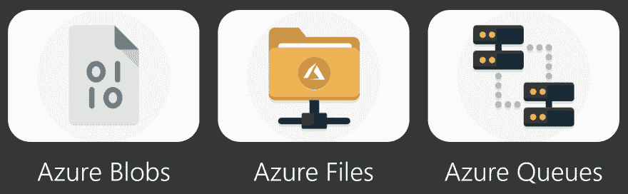
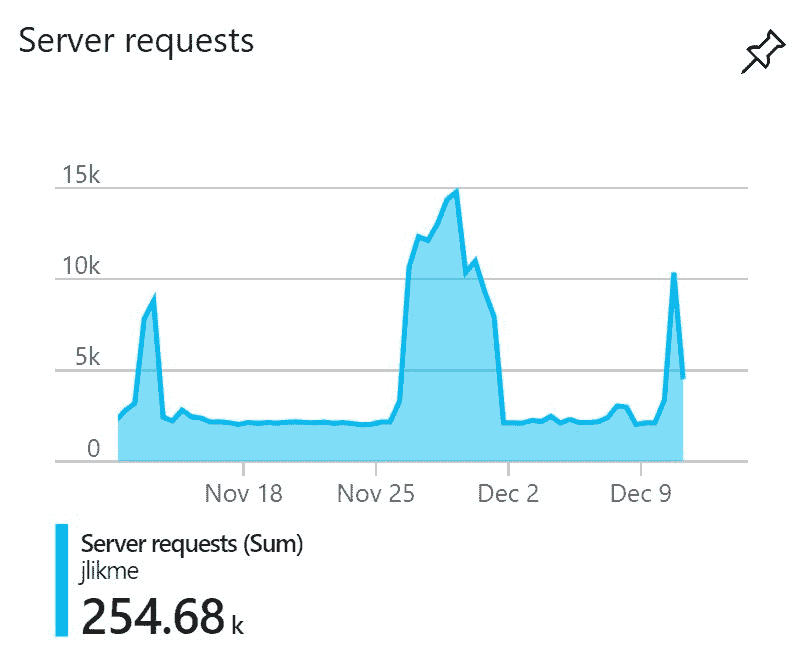
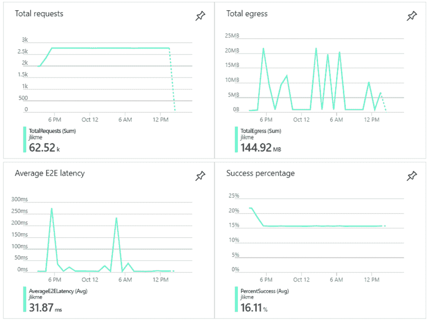

# 面向开发人员的云存储介绍

> 原文：<https://dev.to/azure/introduction-to-cloud-storage-for-developers-2hig>

当面临存储应用程序数据的挑战时，大多数开发人员会立即想到数据库作为解决方案。关系型(SQL)和非关系型、基于文档的(NoSQL)数据库是企业中经过验证的解决方案。然而，对于某些类型的数据，有另一种选择可以以相对较低的成本提供令人难以置信的好处。云存储通常比托管数据库便宜几个数量级，并且可以适应各种应用程序架构。

[](https://res.cloudinary.com/practicaldev/image/fetch/s--8E3ABMRg--/c_limit%2Cf_auto%2Cfl_progressive%2Cq_auto%2Cw_880/https://thepracticaldev.s3.amazonaws.com/i/s1umfwthgodaqd5x5ieh.png)

所有主要的云提供商都提供存储服务，并且大多数功能都是相似的。对于本文，我们将重点关注 Azure 存储，因为它价格便宜，易于上手，也是我最了解的。你还可以[获得一个免费的 Azure 账户](https://jlik.me/etb)来关注并学习如何为你自己的应用程序使用云存储。

# Azure 存储简介

Azure Storage 是基于云的存储服务。你可以在这里阅读完整文档: [Azure 存储文档](https://jlik.me/etc)。Azure 云存储帐户旨在:

1.  耐用且可用
2.  高度安全
3.  可扩展以满足您的需求
4.  全面管理
5.  可从任何平台或语言访问

要开始使用存储，您需要创建一个存储帐户。

# 存储账户

存储帐户是您可以使用的各种资源的保护伞。把它看作是你的资源的规模单位。您在帐户级别确定弹性策略(即，数据是存储在本地还是自动复制到远处的区域，以便在数据中心停机时提供可用性)。帐户提供各种资源，包括:

*   **Blob 存储**:存储非结构化数据，包括文档、图像和视频
*   **文件存储**:兼容服务器消息块(SMB)的基于云的文件系统，可以安装在 Windows、Linux 和 macOS 系统上
*   **队列存储**:能够处理数百万条消息的消息存储，支持 peek(查看一条消息而不将其从队列中删除)和 pop(查看一条消息并将其从队列中删除以防止其他客户端访问它)操作

这些存储资源为以下场景提供解决方案:

*   为您的应用程序存储和检索文件、文档和视频
*   维护重要文档的版本历史
*   实施文档的不变性(例如，与法律案件相关的文档不能被修改或删除)
*   托管静态网页
*   在云中托管设计用于与本地文件系统交互的遗留应用程序
*   为开发人员提供包含公共资源和工具的共享文件夹
*   大规模处理应用程序之间的消息传递

存储帐户也是您确定应用程序复制级别的地方。每个级别都是高可用性的高成本和改进的弹性之间的权衡。可用的存储复制选项包括:

*   **本地冗余(LRS)**99.9999999%(11 个 9)的可用性分布在本地副本上。数据中心的丢失意味着数据的丢失。
*   **区域冗余(ZRS)** 在一个区域内有多个群集，具有 12 个 9 的可用性。在数据中心宕机时防止数据丢失，但在整个区域宕机时则不会。
*   **地理冗余(GRS)** 具有 16 个 9 的可用性，辅助区域距离主区域数百英里。这是最高成本的最高可用性。

困惑还是担心成本？Azure 提供了一个[价格计算器](https://jlik.me/ety)，你可以用它来估算你账户的月费用。

要查看一个实际的“真实世界”示例(我使用一个存储帐户运行一个[链接缩短器](https://jlik.me/et3)看看[的这条推文](https://twitter.com/jeremylikness/status/1072534557193310209):

> Jeremy likness⚡️[@ Jeremy likness](https://dev.to/jeremylikness)每月更新一次费用(在月末随便抢)运行我的[# server less](https://twitter.com/hashtag/serverless)[# azure](https://twitter.com/hashtag/azure)link shorter 它每月处理超过 25 万个请求，我的存储帐户使用地理冗余存储(多个相距数百英里的复制集群)。💲3.37 美元2018 年 12 月 11 日下午 16:52[](https://twitter.com/intent/tweet?in_reply_to=1072534557193310209)[](https://twitter.com/intent/retweet?tweet_id=1072534557193310209)3[](https://twitter.com/intent/like?tweet_id=1072534557193310209)4

如果你准备好开始，这里有一个[快速入门:创建一个 Azure 存储帐户](https://jlik.me/et0)。我建议创建一个`V2`账户。

# 斑点存储

Blob 是 inary**L**arge**OB**object 的首字母缩写。Blob 存储旨在处理少量到大量的非结构化数据。非结构化数据的示例包括:

*   可能直接提供给浏览器的图像或文档
*   需要分布式访问的文件
*   流媒体视频和音频
*   日志文件
*   备份和恢复(灾难恢复和/或归档)
*   用于以后分析的数据

在 Azure 中，blob 存储被组织到类似文件夹的*容器*中。您可以在容器级别控制安全参数以及默认行为。

例如，在我的存储帐户中，我创建了一个可公开访问的`presentations`容器。[此链接](https://jlik.me/etz)将下载我上传到容器的存储演示的完整幻灯片(PowerPoint 格式)。我推荐你去看看，因为这是我这篇文章的基础。

blob 存储有三种主要类型:

*   **Block**blob 用于存储大小高达数 TB 的文本或二进制数据
*   **追加**blob 针对追加操作进行了优化，即写出日志
*   Azure 在内部为磁盘使用 blobs

Blob 存储为您提供了存储数据的灵活性和控制力。存储 blob 时，您可以通过设置默认值或覆盖来选择三个*访问层*:

*   **热**存储用于频繁访问的数据。存储成本最高，但访问数据的成本最低。经常写入和/或读取的数据将放在这里。
*   **冷**存储用于访问频率较低的数据。存储数据的成本最低，但访问数据的成本最高。例如，为以后的处理准备大量数据将是这一层的候选。
*   **归档**存储用于保存必须保存但不常访问的文档。这是存储数据成本最低的选项，但访问成本最高。访问是通过从**存档**切换到**热**或**冷**存储来实现的，可能需要长达 15 个小时的处理时间。医疗记录和税务文档是对归档层有意义的两个示例。

您可以进一步细化 blob 存储如何使用访问和存储策略。例如，您可以指定当 blobs 被覆盖时，总是保留旧版本的副本。您可以锁定 blobs 以防止其他客户端在您更新它们时进行修改，甚至可以将它们置于法律保留状态以防止对与正在进行的案例相关的文档进行任何更改。

Azure storage 附带了一个软件开发工具包(SDK ),可以更容易地从代码中与存储进行交互。有对的支持。NET、Java、Python 和 Node.js 以及其他流行的语言和平台。

下面是连接到存储帐户并访问容器的示例代码。如果容器不存在，代码会创建一个容器。

```
if (container == null)
{
    blobClient = storageAccount.CreateCloudBlobClient();
    container = blobClient.GetContainerReference(Globals.CONTAINER);
    await container.CreateIfNotExistsAsync(
        BlobContainerPublicAccessType.Blob,
        null,
        null);
} 
```

下一个代码片段将一个文件上传到 blob 存储，并检索`Uri`来访问它。

```
string fileName = $"{shortname}.jpg";
var blob = container.GetBlockBlobReference(fileName);
await blob.UploadFromStreamAsync(image);
var uri = blob.Uri.ToString(); 
```

所有 Azure 存储选项都提供了详细的使用指标。以下是 Blob 存储指标的示例:

[](https://res.cloudinary.com/practicaldev/image/fetch/s--NFfOzFmp--/c_limit%2Cf_auto%2Cfl_progressive%2Cq_auto%2Cw_880/https://thepracticaldev.s3.amazonaws.com/i/ul2egovg3aruw71j3ukk.png)

## 静态网站

blob 存储的一个独特功能是托管静态网站的能力。许多前端框架生成文件，浏览器下载这些文件来运行您的单页应用程序(SPA)。静态资产包括 HTML 文件、CSS 样式表和图像。通过创建一个特殊的`$web`容器，您可以上传静态资产并通过 web 访问它们，而不必配置(或支付)web 服务器。这可以节省大量成本。

这是我的一个同事写的一篇博文，带你了解如何使用静态网站创建和托管一个 SPA 应用:[在 Azure Storage 静态网站中托管一个 Blazor 应用](https://jlik.me/et1)。Blazor 使用 WebAssembly 来托管。浏览器中的. NET 应用。

# Azure 文件

Azure 文件允许您创建可挂载的基于云的文件共享，可以从 Linux、macOS 和 Windows 访问。开发人员最常见的用例是将遗留应用程序迁移到 web 上，即使它们依赖于文件系统访问。您可以创建一个文件共享，并从运行您的传统应用程序的虚拟机装载它，它甚至可以在“不知道”它在云中的情况下运行。

你可以自己试一试，然后[创建你的第一个 Azure 文件共享](https://jlik.me/et2)。

# 蔚蓝色的队列

Azure 队列为你的应用程序提供了一种轻量级、廉价的消息处理方式。队列处理任意格式的单个消息，最大 64 千字节，可能包含数百万条消息。常见的方法包括将消息存储为纯文本字符串或包含 JSON 格式数据的字符串。默认情况下，邮件会在 7 天后自动从队列中过期。

队列对于跟踪积压的信息非常有用，这些信息应该按照先到先得的原则进行处理。它们对于在基于云的客户端之间发送消息也很有用。

我如何使用队列的一个例子是我的链接缩短工具。当用户请求一个短链接时，我想尽可能快地重定向他们，这样他们就不会有任何延迟。该应用程序跟踪点击，这样我就可以运行分析来确定哪些主题更受欢迎，哪些链接人们通常不会点击，因为他们不感兴趣。在处理重定向的代码中，我使用了一个[无服务器绑定](https://jlik.me/et4)来访问队列:

```
[Queue(queueName: Utility.QUEUE)]IAsyncCollector<string> queue 
```

向队列中添加一个条目只需要一行代码。在这个例子中，我使用管道(`|`)分隔的字符串来存储短链接、长链接、时间戳、引用 URL 和用户代理。

```
await queue.AddAsync($"{shortUrl}|{redirectUrl}|{DateTime.UtcNow}|{referrer}|{userAgent}"); 
```

项目是异步添加的，用户会立即被重定向。然后，队列中的条目触发另一段代码:

```
 [FunctionName("ProcessQueue")]
 public static void ProcessQueue(
    [QueueTrigger(queueName: Utility.QUEUE)]string request,
    TraceWriter log)
{
    log.Info($"Received message from queue: {request}");
} 
```

用队列消息调用代码，消息会自动从队列中弹出或删除，因此没有其他客户端会访问它。然后，代码在一个单独的线程上处理队列数据，而不会影响用户体验。

在 GitHub 上浏览[链接缩写代码。](https://jlik.me/euk)

# 结论

数据库不是存储数据的唯一地方！云存储解决方案提供了廉价的存储，易于使用现有的 SDK 和/或 REST APIs 进行编程。您可以创建分布式集群，而无需接触任何硬件，甚至不必了解复制是如何工作的，并且可以完全控制您的数据是在数据中心内部冗余还是在整个大陆的不同地方冗余。最重要的是，您开箱即可获得耐用性、弹性、可扩展性和安全性。考虑为你的下一个应用程序使用云存储。

[了解有关 Azure 存储的更多信息](https://jlik.me/etc)。

[](https://res.cloudinary.com/practicaldev/image/fetch/s--HyMwwQ2z--/c_limit%2Cf_auto%2Cfl_progressive%2Cq_66%2Cw_880/https://jeremylikness.com/signature.gif)