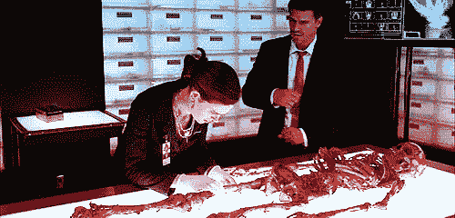
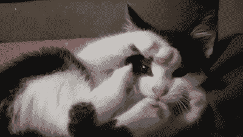

# 计算机取证简介

> 原文：<https://dev.to/terceranexus6/introduction-to-computer-forensics-4md1>

嘿！你好吗今天我给你们带来一个挑战，也给我自己。我对计算机取证非常感兴趣，因为我的一个同事的主要任务是与取证相关的，我对这个主题没有任何概念，所以我开始了一个在线课程来学习它，我想与你分享一些基本概念。

[](https://i.giphy.com/media/3o6gbaeZ4EGzj8IvVS/giphy.gif)

首先计算机取证是**计算机取证的处理方法**为犯罪调查获取信息。它基本上有三个部分:

*   **数据采集**:从原始来源获取数据而不破坏或修改数据的安全过程。有几个工具可以做到这一点，这取决于操作系统和其他细节(如证据的状态)，但我们将解释基于 Linux 的工具。
*   **数据保存**:获取的数字证据必须使用加密哈希算法以原始状态保存。
*   **数据分析**:通过分析所获得的数据并从中提取信息来理解这些数据。它本身有几个步骤，如识别分区，MAC 时间等。

分析后，负责人被要求写一份报告。

## 数据采集

我们可以将需要获取的数据分成两部分，**易失性数据和非易失性数据**。因此，根据我们关注的焦点，我们将使用不同种类的工具。如果我们关闭可疑机器，我们将使用易失性数据，所以如果可能的话，应该在关闭机器之前获取这些数据。如果嫌疑人在收到正常关机命令后安装了 rootkits 来销毁证据，就有可能丢失重要内容。啊！我忘了说监管链。**监管链**记录了证据是如何处理的，以便进一步报告。现在，监管链随着证据处理的开始而开始。

开始之前，我们应该准备好工具:

*   一张可启动的 live CD，因为可疑工具不可信。
*   对调查者来说是一台强大的机器

我们应该首先获取最不稳定的数据，因为它是不断变化的。我们实际上是在收集数据的同时改变它，所以我们应该尽量少留下足迹。这是一项艰巨的任务，因为我们不能使用普通的工具，例如使用 CP 会修改原始文件的访问时间。那么，我们能用什么呢？我们来看看一些选项:

```
$ lsof 
```

Enter fullscreen mode Exit fullscreen mode

该工具将列出属于任何活动进程的所有打开的文件。我们也可以使用不同的选项，如`lsof -i IP_adress`，将列出属于给定 IP 地址的互联网连接。但是，哈！还可以找`lsof`来查找使用隐藏磁盘空间的恶意进程！

```
$ nc 
```

Enter fullscreen mode Exit fullscreen mode

Netcat /ᐠ｡_｡ᐟ\将使用 TCP 或 UDP 读取和写入网络连接。它可以用于将数据传输或检索到法医工作站。

[](https://res.cloudinary.com/practicaldev/image/fetch/s--oenmt6oZ--/c_limit%2Cf_auto%2Cfl_progressive%2Cq_66%2Cw_880/https://media1.giphy.com/media/IvCPbxFrF6iVG/giphy.gif)

其他要看的趣事:`uname -a`、`ifconfig`、`date`、`uptime`。所有这些都应该重定向到 USB 来收集证据。哦！我们可以使用`w`来检查攻击者是否仍然保持联系。

对于内存获取，我们可以使用 [lime](https://github.com/504ensicsLabs/LiME) open tool，这是一个可加载的内核模块(LKM ),允许从 Linux 获取易失性内存。

现在，转到非易失性数据，我们将使用`dd`。大多数 Linux 系统都有这个工具。例如，为了准备取证磁盘，用全零擦除驱动器/dev/hda，我们可以使用`dd if=/dev/zero of=example`。我们去取证吧。记得我们说过使用`cp`不是一个选项吗？我们可以使用 dd 复制证据，如下`dd if=stuff of=evidence/stuff.dd`。如果我们对 netcat 使用`dd`,首先我们设置监听器，然后向它发送数据。

这里，收听者终端:

```
$ nc -l 8888 > nc_info 
```

Enter fullscreen mode Exit fullscreen mode

这里，transmiter 终端:

```
$ dd if=stuff | nc localhost 8888 
```

Enter fullscreen mode Exit fullscreen mode

## 数据保存

取证使用加密哈希算法来保存证据。法医应该证明证据与原始来源相同，为此，他们只需要计算他们的哈希值。如果哈希值相同，两个图像必须相同。

[](https://res.cloudinary.com/practicaldev/image/fetch/s--m9PsKyD6--/c_limit%2Cf_auto%2Cfl_progressive%2Cq_auto%2Cw_880/https://i.kym-cdn.com/entries/icons/mobile/000/023/397/C-658VsXoAo3ovC.jpg)

为此，我们可以使用 MD5 或 SHA。让我们来探索一下`md5sum`命令。我们正在创建一个包含“hello there”字符串的文件，名为 ex_file，然后用 cat 查看原始内容，然后计算散列。

```
$ echo "hello there" > ex_file
$ cat ex_file
hello there
$ md5sum ex_file
2d01d5d9c24034d54fe4fba0ede5182d  ex_file 
```

Enter fullscreen mode Exit fullscreen mode

如你们所见，这很简单。如果我们修改文件，比如在字符串中添加“hiya ”,散列将会改变。

```
$ echo "hiya" >> ex_file
$ cat ex_file
hello there
hiya
$ md5sum ex_file
ddfdaf6c131be9a522038488f6823537  ex_file 
```

Enter fullscreen mode Exit fullscreen mode

看到了吗？不一样。另一方面，如果我们有两个内容相同但名称不同的文件...

```
$ echo "hello world" > file1
$ echo "hello world" > file2
$ md5sum file1
6f5902ac237024bdd0c176cb93063dc4  file1
$ md5sum file2
6f5902ac237024bdd0c176cb93063dc4  file2 
```

Enter fullscreen mode Exit fullscreen mode

同样的哈希。这是因为改变元数据不会改变散列。另一个例子是更改权限。

```
$ chmod g-r file2
$ md5sum file2
6f5902ac237024bdd0c176cb93063dc4  file2 
```

Enter fullscreen mode Exit fullscreen mode

## 数据分析

现在，现在，获取有用的数据信息是一项重要的任务。当然，我们是在复制工作。一个好的开始方式是使用`fdisk our_device`来识别分区。之后我们可以使用`dd`来雕刻有趣的分区。我们可以使用 [Sleuthkit](https://rationallyparanoid.com/articles/sleuth-kit.html) 的`mmls`来获取分区信息，例如使用`mmls our_file.dd`。我们也可以使用`-t`选项指定媒体类型，如`mmls -t dos our_file.dd`所示。安装也很重要，为此我们将使用`mount`，当然。现在，要小心因为对于调查的震动，它应该是一个**只读**安装。法医必须始终证明数据没有改变。

```
mount –o ro,loop /my_file.dd/mnt/example 
```

Enter fullscreen mode Exit fullscreen mode

现在，苹果时代。这很有用，因为这类信息为我们提供了不同类型操作时间，比如创建或修改文件。这应该在其他事情之前运行，因为此信息对变化非常敏感。为此，我们结合使用了`fls`命令和`mactime`。

```
$ fls -f ext3 -m "/" -r images/root.dd > data/body
$ mactime -b filename [time] 
```

Enter fullscreen mode Exit fullscreen mode

m 表示显示的日期时间是最后一次修改时间；a 表示显示的日期和时间是最后一次访问时间；c 表示最后一次更改信息节点的时间。

在调查中还有许多其他的东西要看，例如日志。但是让我们把它留在这里吧！

我希望你喜欢！更好地了解计算机法医调查是如何进行的是非常有趣的...现在你可以去检测 CSI 系列的谎言了。:p