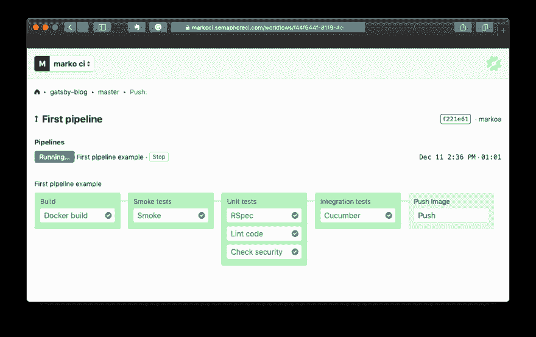
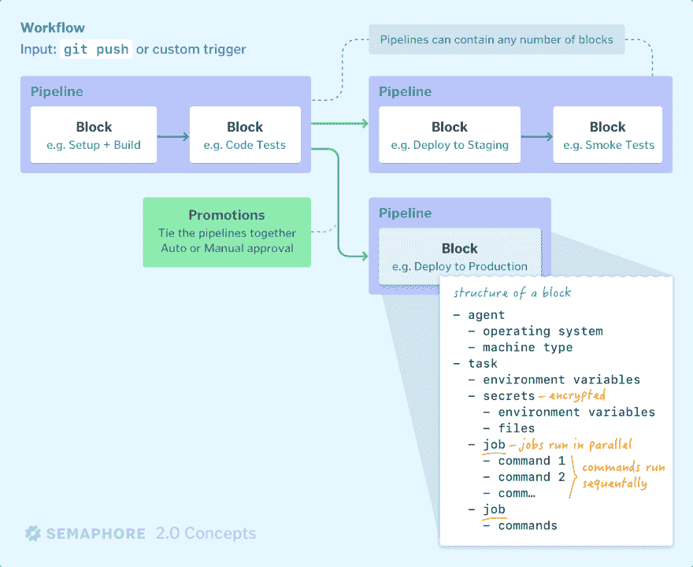
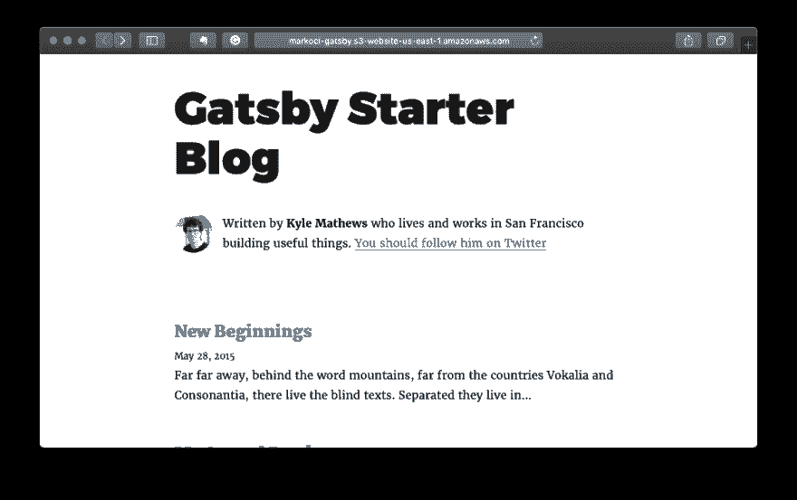
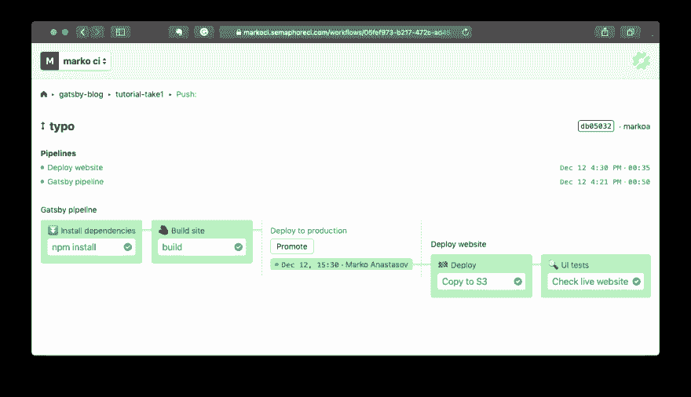

# Semaphore 2.0 持续集成和交付简介

> 原文：<https://dev.to/markoa/introduction-to-continuous-integration-and-delivery-with-semaphore-20-3k0m>

[最近推出的 Semaphore 2.0](https://semaphoreci.com/blog/2018/11/06/semaphore-2-0-launched.html?utm_source=dev.to&utm_medium=blog)具有 CI/CD 管道，可针对任何工作流和现收现付定价模式进行定制。无论您过去是否使用过 Semaphore，它都带来了许多新事物。

在本帖中，我们将通过为静态网站建立一个构建、测试和部署管道来了解基本特性。我很想知道你希望在未来的文章中看到什么样的项目/堆栈——请在评论中告诉我。

## 信号量到底是什么？

Semaphore 是一个基于云的自动化服务，用于构建、测试和部署软件。换句话说，您使用它来实现持续集成(CI)和持续交付(CD)管道。

Semaphore 的第一个版本于 2012 年推出，被称为“为速度和简单性而构建的托管 CI ”,作为对使用复杂且需要大量维护的工具的解毒剂。相反，Semaphore 不需要维护，是最快的基于云的 CI。

Semaphore 2.0 通过引入作为代码的*管道进一步发展了这一概念，这使得建模任何软件交付过程而不扯你的头发成为可能。它还消除了你可以运行多少构建的限制，并且*可以自动扩展到任何工作负载*，按每秒执行次数计价，类似于 AWS Lambda。*

## 一个你好的世界

从[注册你的 GitHub 账户](https://semaphoreci.com?utm=todo)开始。这会让你每月获得 20 美元的免费贷款，这对小规模项目来说已经足够了。

此时，Semaphore 将向您展示在您的终端中运行的三个命令。首先，安装您将用来创建项目的 SEM CLI:

```
curl https://storage.googleapis.com/sem-cli-releases/get.sh | bash 
```

Enter fullscreen mode Exit fullscreen mode

将 sem 连接到您的新组织帐户:

```
sem connect ORGANIZATION.semaphoreci.com ACCESS_TOKEN 
```

Enter fullscreen mode Exit fullscreen mode

最后，在 Git 存储库中运行`sem init`。该命令在 GitHub 上创建一个 deploy key 和 webhook，这样 Semaphore 就可以在代码发生变化时访问您的代码，并创建一个管道定义文件`.semaphore/semaphore.yml`。

按照最后一条指令对文件进行`git push`操作后，您应该会在浏览器中看到管道正在运行。咻！

[](https://res.cloudinary.com/practicaldev/image/fetch/s--HRWf4eDl--/c_limit%2Cf_auto%2Cfl_progressive%2Cq_auto%2Cw_880/https://thepracticaldev.s3.amazonaws.com/i/7jmo1f37zh1ij5b8pynn.png)

让我们解开这里发生的事情。

## 管道的积木

在我们的 hello world 示例中，我们有一个带有四个不同的*块*的*管道*，它们按顺序运行。

如果我们想在流程中引入一些条件，例如只在主分支上运行部署，或者在块失败时关闭临时基础设施，我们可以定义一个*提升*。促销可以是自动的或手动触发的，并通向其他渠道。

通过这种方式，我们可以链接任意多的管道。通常，每个`git push`触发一个新的信号量*工作流*，它包含一个或多个管道。

现在，我们的代码在块内运行。一个块包含至少一个*作业*，它是一个命令序列。我们可以定义更多的作业，然后它们可以并行运行。每个作业对它自己来说都是一个世界——一个完全隔离的虚拟机，它在一秒钟内启动，并继承其“父块”的配置，加上我们提供给它的任何额外内容。您可以运行本机代码、Docker 容器或更改任何系统包。在我们的 hello world 示例中，第三个块包含三个并行作业。

[](https://res.cloudinary.com/practicaldev/image/fetch/s--T57Cx0v_--/c_limit%2Cf_auto%2Cfl_progressive%2Cq_auto%2Cw_880/https://thepracticaldev.s3.amazonaws.com/i/h3d50vem7j9u1060x9l0.png)

## 定义我们项目的构建管道

上图提到了更多的概念，但我们已经涵盖了很多理论基础，所以让我们做一些实践，并在此过程中学习更多。

在这个演示中，我的目标是构建和部署一个 [Gatsby.js](https://www.gatsbyjs.org) 博客。我从 [gatsby-starter-blog](https://github.com/gatsbyjs/gatsby-starter-blog) 模板开始，这个过程包括以下内容:

*   获取代码
*   安装依赖项
*   建立网站
*   在主分支机构的每次变更时，将网站部署到 S3
*   额外收获:在实时网站上运行一些用户界面测试

让我们打开我们的`.semaphore.yml`，把它剥光:

```
# .semaphore/semaphore.yml
version: v1.0
name: Gatsby build pipeline
agent:
  machine:
    type: e1-standard-2
    os_image: ubuntu1804

blocks:
  - name: ⏬ Install dependencies
    task:
      jobs:
      - name: npm install
        commands:
          - checkout
          - npm install 
```

Enter fullscreen mode Exit fullscreen mode

注意`agent`属性:Semaphore 为[提供了几种具有不同 CPU/内存容量的机器类型](https://docs.semaphoreci.com/article/20-machine-types?utm_source=dev.to&utm_medium=blog)供选择。例如，这允许您使用功能更强大的机器进行繁重的集成测试，使用最小的机器进行部署工作。

目前，Semaphore 提供了一个基于 Ubuntu 18.04 LTS 的虚拟机镜像，未来还会有更多。这对我们这个项目很有好处。

我们“构建代码”工作中的第一个命令是`checkout`。每当您处理源代码时，这是一个必需的命令—它下载与工作流相关联的修订。这个命令实际上是一个[开源](https://github.com/semaphoreci/toolbox)的脚本。

### 缓存依赖关系

出于演示目的，我们将在一个单独的块中构建我们的网站。让我们来看看*不会像*预期的那样工作:

```
blocks:
  - name: ⏬ Install dependencies
    task:
      jobs:
      - name: npm install
        commands:
          - checkout
          - npm install

  - name: 🧱 Build site
    task:
      jobs:
      - name: build
        commands:
          - checkout
          - npm run build --prefix-paths #EEEK 💥 
```

Enter fullscreen mode Exit fullscreen mode

`npm run`命令会报错，抱怨缺少依赖关系。这是因为在一个作业或块中创建的文件默认情况下不会在任何地方共享，除非我们明确地这样做。

我们想要的是缓存 node_modules 目录，并跨管道和块重用它。信号量环境提供了一个[缓存 CLI](https://docs.semaphoreci.com/article/54-toolbox-reference?utm_source=dev.to&utm_medium=blog#cache) ，它可以基于每个项目管理共享文件:

```
blocks:
  - name: ⏬ Install dependencies
    task:
      jobs:
      - name: npm install
        commands:
          - checkout
          # Try to restore node modules from a previous run,
          # first for the current version of package.lock, but if that fails
          # get any previous bundle:
          - cache restore node-modules-$(checksum package-lock.json),node-modules-
          - npm install
          # Store new content in cache:
          - cache store node-modules-$(checksum package-lock.json) node_modules

  - name: 🧱 Build site
    task:
      jobs:
      - name: build
        commands:
          - checkout
          - cache restore node-modules-$(checksum package-lock.json),node-modules-
          - npm run build --prefix-paths 
```

Enter fullscreen mode Exit fullscreen mode

通过这种配置，我们可以根据`package-lock.json`的内容动态生成一个缓存键。我们还使用了一个回退键，`cache restore`可以尝试部分匹配。因此，大多数工作流都会遇到缓存命中，从而将 CI 运行时间减少 20 秒以上。

注意:为了使`npm run build`能够在不将 gatsby-cli 作为全局包安装的情况下工作，我修改了`package.json`以将其包含在依赖项列表中:

```
"dependencies":  {  "gatsby":  "^2.0.19",  "gatsby-cli":  "^2.0.19"  } 
```

Enter fullscreen mode Exit fullscreen mode

并链接了二进制:

```
"scripts":  {  "gatsby":  "./node_modules/.bin/gatsby"  } 
```

Enter fullscreen mode Exit fullscreen mode

## 为持续部署配置促销

在`.semaphore.yml`中定义的构建管道的最后，我们已经在`public/`目录中生成了可以上传的网站文件。是时候设置一个将在主分支上触发部署管道的提升了。我们对构建管道的最终配置如下:

```
# .semaphore/semaphore.yml
version: v1.0
name: Gatsby build pipeline
agent:
  machine:
    type: e1-standard-2
    os_image: ubuntu1804

blocks:
  - name: ⏬ Install dependencies
    task:
      jobs:
      - name: npm install
        commands:
          - checkout
          - cache restore node-modules-$(checksum package-lock.json),node-modules-
          - npm install
          - cache store node-modules-$(checksum package-lock.json) node_modules

  - name: 🧱 Build site
    task:
      jobs:
      - name: build
        commands:
          - checkout
          - cache restore node-modules-$(checksum package-lock.json),node-modules-
          - npm run build --prefix-path
          # Store the website files to be reused in the deployment pipeline:
          - cache store website-build public

promotions:
  - name: Deploy to production
    pipeline_file: production-deploy.yml
    auto_promote_on:
      - result: passed
        branch:
          - master 
```

Enter fullscreen mode Exit fullscreen mode

在我们的例子中，我们使用了`auto_promote_on`属性来定义一个提升，每当管道在主分支上成功运行时，该提升就会自动运行。更多的选项可用，[如信号量文档](https://docs.semaphoreci.com/article/50-pipeline-yaml?utm_source=dev.to&utm_medium=blog#promotions)中所述。我们将在一个新的管道配置文件`production-deploy.yml`中定义接下来会发生什么。

### 部署管道

我们将把网站部署到 S3 自动气象站。在 AWS 上为此做准备的细节超出了本文的范围，但是基本上您需要:

*   创建新的存储桶；
*   在权限>公共访问设置选项卡中，禁用所有公共访问限制。
*   在“权限”>“访问控制列表”选项卡中，允许所有人列出存储桶内容。
*   启用“静态网站托管”属性。

您可以在 [AWS 文档](https://docs.aws.amazon.com/console/s3/hostingstaticwebsite)中找到更多详细信息。

一旦存储桶准备好了，我们需要执行类似于:
的代码

```
aws s3 sync "public" "s3://name-of-our-bucket" --acl "public-read" 
```

Enter fullscreen mode Exit fullscreen mode

`aws s3 sync`当您安装了 AWS CLI 并连接到有效帐户时，此功能才有效。 [Semaphore 环境预装了 AWS CLI](https://docs.semaphoreci.com/article/32-ubuntu-1804-image?utm_source=dev.to&utm_medium=blog)，剩下的就是提供凭证了。一个安全的方法是创建一个*秘密*，并将其安装在我们的部署管道上。

### 用秘密管理敏感数据

API 密钥或部署凭证等私有信息不应该存储在 Git 中。在 Semaphore 上，您使用 sem CLI 将这些值定义为[秘密。秘密由组织中的所有项目共享。](https://docs.semaphoreci.com/article/66-environment-variables-and-secrets?utm_source=dev.to&utm_medium=blog)

假设您想将您的本地`~/.aws`凭证传递给 Semaphore，执行下面的命令:

```
sem create secret aws-credentials \
  --file ~/.aws/config:/home/semaphore/.aws/config \
  --file ~/.aws/credentials:/home/semaphore/.aws/credentials 
```

Enter fullscreen mode Exit fullscreen mode

你可以检查一个秘密的定义来验证——你会看到 base64 编码的文件的内容:

```
$ sem get secret aws-credentials
apiVersion: v1beta
kind: Secret
metadata:
  name: aws-credentials
  id: 5d41c356-7d72-491b-b705-6a86667c50f3
  create_time: "1544622386"
  update_time: "1544622386"
data:
  env_vars: []
  files:
  - path: /home/semaphore/.aws/config
    content: W2RlZmF1bHRdCnJlZ2lvbiA9IHFzLWVhc3QtMQo=
  - path: /home/semaphore/.aws/credentials
    content: W2RlZmF1bHRdCmF3c19hY2Nlc3Nfa2V5X2lkID... 
```

Enter fullscreen mode Exit fullscreen mode

看起来不错——如果我们在管道配置中包含了`aws-credentials`秘密，我们的`~/.aws`文件将在 Semaphore 的 VM 的主目录中可用，并且所有的`aws`命令都将按预期工作。

秘诀是一个可编辑的资源:您可以运行`sem edit secret aws-credentials`来添加环境变量或附加文件。

### 生产部署流水线

最后，让我们定义我们的生产部署管道:

```
# .semaphore/production-deploy.yml
version: v1.0
name: Deploy website
agent:
  machine:
    type: e1-standard-2
    os_image: ubuntu1804
blocks:
  - name: 🏁 Deploy
    task:
      secrets:
        - name: aws-credentials
      jobs:
        - name: Copy to S3
          commands:
            - cache restore website-build
            - aws s3 sync "public" "s3://bucket-name" --acl "public-read" 
```

Enter fullscreen mode Exit fullscreen mode

因为我们将升级定义为仅在主分支上自动运行，所以如果您第一次在功能分支中推送此文件，部署管道将不会运行。但是，您仍然可以通过单击“Promote”按钮从用户界面手动触发它。

请注意缺少`checkout`命令，因为此时我们不需要源代码。

你的桶的网址是`http://bucket-name.s3-website-us-east-1.amazonaws.com`。将`bucket-name`替换为您的存储桶的名称，将`us-east-1`替换为另一个地区的代码，以防您没有使用默认代码。如果一切顺利，您应该会看到您的网站:

[](https://res.cloudinary.com/practicaldev/image/fetch/s--LWuvmslf--/c_limit%2Cf_auto%2Cfl_progressive%2Cq_auto%2Cw_880/https://thepracticaldev.s3.amazonaws.com/i/532dqxpiy6ac9bc57mip.png)

所以从现在开始，你博客源代码的每一个变化都会被自动部署。🎉

## 运行部署后 UI 测试

作为奖励，让我们扩展我们的部署管道来多做一件事——针对实时网站运行测试。

我们将使用 [Nightwatch.js](http://nightwatchjs.org) ，所以首先将它添加到您的`package.json`依赖列表:

```
"dependencies":  {  "nightwatch":  "^0.9.21"  } 
```

Enter fullscreen mode Exit fullscreen mode

同样在同一个文件中，定义一个脚本快捷方式:

```
"scripts":  {  "nightwatch":  "./node_modules/.bin/nightwatch"  } 
```

Enter fullscreen mode Exit fullscreen mode

用`npm install`更新依赖列表。

下一步是创建一个测试文件。为了简单起见，我们只需验证预期的页面标题是否存在。你可以在 Nightwatch 文档中找到更多关于测试网页的信息。

```
// tests/postdeploy.js
module.exports = {
  'Test live website' : function (client) {
    client
      .url('http://bucket-name.s3-website-us-east-1.amazonaws.com')
      .waitForElementVisible('body', 1000)
      .assert.title('Gatsby Starter Blog')
      .end();
  }
}; 
```

Enter fullscreen mode Exit fullscreen mode

当然，记得用你的 S3 桶的名字替换`bucket-name`。

为了测试夜视，我们需要硒。下载最新的 Selenium 驱动程序，并将其放在项目中的一个新目录下:

```
mkdir .bin
wget https://selenium-release.storage.googleapis.com/3.141/selenium-server-standalone-3.141.59.jar
mv selenium-server-standalone-3.141.59.jar .bin/selenium.jar 
```

Enter fullscreen mode Exit fullscreen mode

从 [Nightwatch 入门指南](http://nightwatchjs.org/gettingstarted#settings-file)中复制示例`nightwatch.json`文件，并修改`selenium`设置，以便在基于我们的本地服务器文件
运行测试时自动启动 Selenium 服务器

```
//  nightwatch.json  "selenium"  :  {  "start_process"  :  true,  "server_path"  :  ".bin/selenium.jar"  } 
```

Enter fullscreen mode Exit fullscreen mode

最后，让我们用另一个块来扩展我们的部署管道:

```
# .semaphore/production-deploy.yml
version: v1.0
name: Deploy website
agent:
  machine:
    type: e1-standard-2
    os_image: ubuntu1804
blocks:
  - name: 🏁 Deploy
    task:
      secrets:
        - name: aws-credentials
      jobs:
        - name: Copy to S3
          commands:
            - cache restore website-build
            - aws s3 sync "public" "s3://bucket-name" --acl "public-read"

  - name: 🔍 UI tests
    task:
      jobs:
        - name: Check live website
          commands:
            - checkout
            - cache restore node-modules-$(checksum package-lock.json),node-modules-
            - npm run nightwatch 
```

Enter fullscreen mode Exit fullscreen mode

当您提交和推送所有新文件和更改时，您的部署管道应该运行测试，输出如下:

```
npm run nightwatch

> gatsby-starter-blog@1.0.0 nightwatch /home/semaphore/gatsby-blog
> nightwatch

Starting selenium server... started - PID:  3239

[Postdeploy] Test Suite
===========================

Running:  Test live website
 ✔ Element <body> was visible after 98 milliseconds.
 ✔ Testing if the page title equals "Gatsby Starter Blog".

OK. 2 assertions passed. (2.891s) 
```

Enter fullscreen mode Exit fullscreen mode

您的完整信号量工作流如下所示:

[](https://res.cloudinary.com/practicaldev/image/fetch/s--3HKFprhA--/c_limit%2Cf_auto%2Cfl_progressive%2Cq_auto%2Cw_880/https://thepracticaldev.s3.amazonaws.com/i/mje86phclzffi8vhjh9t.png)

太棒了。我们已经成功地建立了一个连续的交付管道，包括一个自动测试的安全网，如果我们破坏了什么，它会提醒我们。我们应该喝一杯。🍻🥂🥃🥛🥤

* * *

所有代码和配置都可以在 GitHub 上获得:

##  [马尔科阿](https://github.com/markoa) / [盖茨比-博客](https://github.com/markoa/gatsby-blog)

### 一个使用信号量的静态网站的简单 CI/CD 项目。

<article class="markdown-body entry-content container-lg" itemprop="text">

# 带有 Semaphore 2.0 和 Gatsby.js 的 CI/CD 项目示例

*   应用:[盖茨比入门博客](https://github.com/gatsbyjs/gatsby-starter-blog)
*   CI/CD: [信号量](https://semaphoreci.com)
*   部署到 S3 ( [观看演示](http://markoci-gatsby.s3-website-us-east-1.amazonaws.com))

本地运行:

```
npm install
npm run start
npm run nightwatch 
```

要获得完整的分步指南，请阅读关于开发至的[文章。](https://dev.to/markoa/introduction-to-continuous-integration-and-delivery-with-semaphore-20-3k0m)

</article>

[View on GitHub](https://github.com/markoa/gatsby-blog)

感谢阅读！希望这篇文章能帮助你入门 CI/CD 和 [Semaphore 2.0](https://semaphoreci.com/?utm_source=dev.to&utm_medium=blog) 。如果有一个 CI/CD 项目你想在以后的文章中看到，请在评论中告诉我。✌️