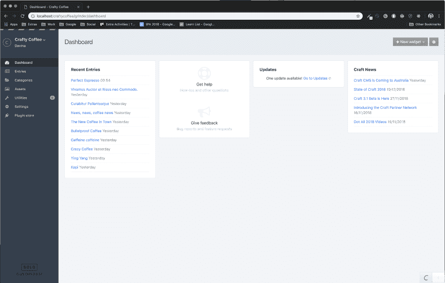
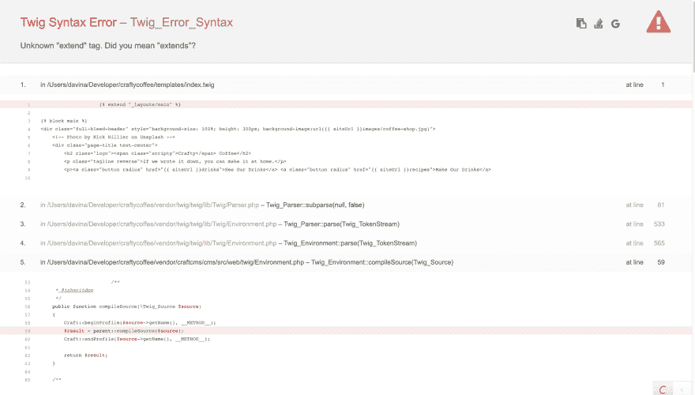
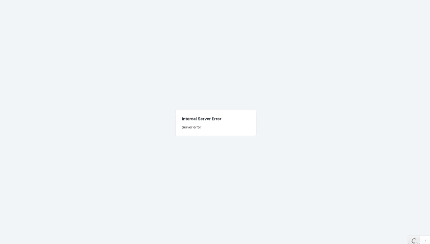
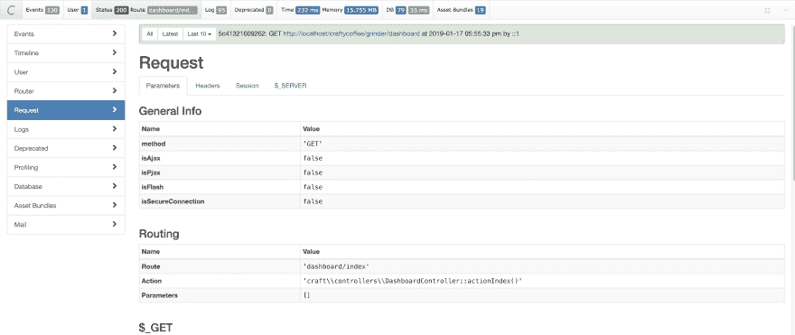
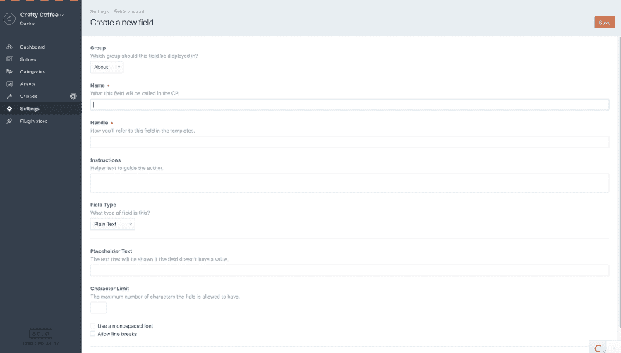
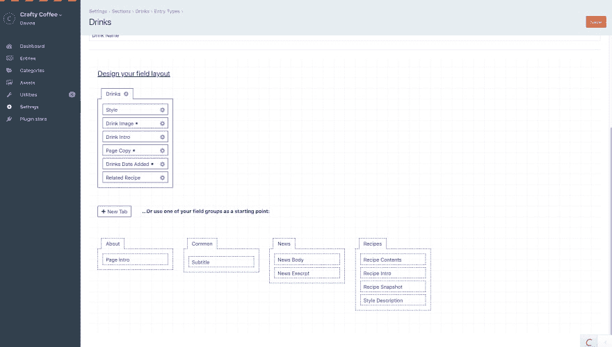
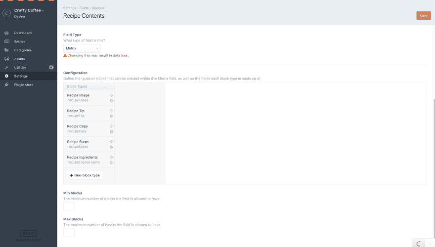
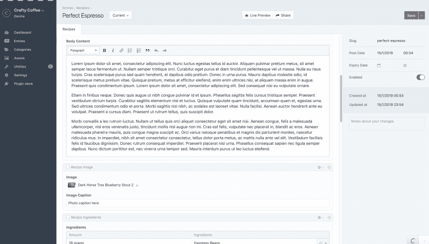
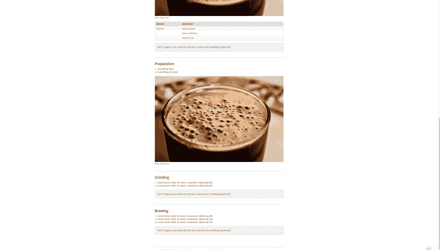

# 工艺介绍

> 原文：<https://dev.to/davinaleong/introduction-to-craftcms-1n9a>

我第一次在工作中偶然发现 [Craft](https://craftcms.com/) 是在做一个小项目的时候。这是我跟随的[教程](https://craftquest.io/courses/craft-cms-3-tutorials)。

# 本地环境设置

*   [安培数](https://www.ampps.com/)
*   街头流氓
*   PHP 7.1
*   关系型数据库
*   工艺 3

# 第一印象

我必须说，我对 Craft 的易用性印象深刻。我在安装过程中确实遇到了一些问题，尤其是关于插件商店的问题。但这更多是因为我缺乏 AMPPS(类似于 MAMP、XAMPP 等)的经验，而不是工艺本身。*(我会单独写一篇文章，讲述我所面临的问题以及我的解决方案。但是一旦我把它安装好并运行起来，使用它就是一种享受！*

# 演练

设置完成后，您将进入管理仪表板。
[T3】](https://res.cloudinary.com/practicaldev/image/fetch/s--hTTWXaiu--/c_limit%2Cf_auto%2Cfl_progressive%2Cq_auto%2Cw_880/https://thepracticaldev.s3.amazonaws.com/i/53r1nu46vxxcyqldffth.png)

你的大部分开发工作将在管理面板这里完成。只有在创建模板来显示内容时，才需要编码。即便如此，模板创建也是轻而易举的事情。事实上，在探索 Craft 时，我没有接触过任何 PHP 代码(除了配置)。以下是一些示例代码:

主布局，`/layouts/main.twig` :

```
<!doctype html>
<html>
<head>
  Website
</head>
<body>
  <h1>Website</h1>

  
  

  <footer>Website, 2019</footer>
</body>
</html> 
```

Enter fullscreen mode Exit fullscreen mode

关于页面，`/about/index.twig` :

```



<h2>About</h2>

<p>Lorem ipsum</p>
 
```

Enter fullscreen mode Exit fullscreen mode

## 仪表盘

无论如何，回到管理仪表板。有几件事你应该马上注意(除了那些明显的小部件):侧边栏顶部的黄色虚线，你当前的许可证(稍后会详细介绍)以及“C”和“ [](https://res.cloudinary.com/practicaldev/image/fetch/s--hTTWXaiu--/c_limit%2Cf_auto%2Cfl_progressive%2Cq_auto%2Cw_880/https://thepracticaldev.s3.amazonaws.com/i/53r1nu46vxxcyqldffth.png)

## DevMode

黄色虚线表示`devMode`当前在 Craft 中设置为`true`。要删除黄色虚线，打开`/config/general.php`并将`dev`下的`devMode`设置为`false`。

```
// Dev environment settings
'dev' => [
    // Base site URL
    'siteUrl' => null,

    // Dev Mode (see https://craftcms.com/support/dev-mode)
    'devMode' => true, // <= set this to false
], 
```

Enter fullscreen mode Exit fullscreen mode

在`devMode`中，当你的代码中有错误时，Craft 会给你一个堆栈跟踪。虽然这对于调试很有用，但显然会带来安全隐患。
[](https://res.cloudinary.com/practicaldev/image/fetch/s--KF-CqK3---/c_limit%2Cf_auto%2Cfl_progressive%2Cq_auto%2Cw_880/https://thepracticaldev.s3.amazonaws.com/i/f86qjyaujgvcuk713u8h.png)

在`devMode`设置为`false`的情况下，Craft 只是抛出一个 HTTP 错误。
T3T5】

## Yii 工具栏

【C】[](https://res.cloudinary.com/practicaldev/image/fetch/s--ss7sXHZE--/c_limit%2Cf_auto%2Cfl_progressive%2Cq_auto%2Cw_880/https://thepracticaldev.s3.amazonaws.com/i/1zsbag4x7jn3xlgmsyaa.png)

扩展了
[](https://res.cloudinary.com/practicaldev/image/fetch/s--RDD0otRv--/c_limit%2Cf_auto%2Cfl_progressive%2Cq_auto%2Cw_880/https://thepracticaldev.s3.amazonaws.com/i/sn8zklweab6o6szxzyv1.png)

你已经可以看到关于这个页面的各种信息，比如它的状态，内存使用等。您也可以展开它来查看更多细节！不过我还没有用过，所以我不能对此发表太多评论。但乍一看，这个工具栏似乎有可能取代 Chrome 的 DevTools。

## 牌照

Craft 有 3 个许可证:Solo、Pro 和 Enterprise。到目前为止，我所看到的 Solo 和 Pro 许可证之间的主要区别是在 Pro 中拥有多个管理员帐户的能力。至于企业许可证，我认为它是用于定制解决方案的。

## 内容创建

正如我以前说过的，你的大部分内容创建将在管理面板上完成。下面是字段创建表单的屏幕截图。
[T3】](https://res.cloudinary.com/practicaldev/image/fetch/s--oEl_mMXq--/c_limit%2Cf_auto%2Cfl_progressive%2Cq_auto%2Cw_880/https://thepracticaldev.s3.amazonaws.com/i/mxyfmkvq16wu88frz9di.png)

Craft 的内容创建工作流程(通常)是这样的:**部分>字段>条目**。版块是网站内容的类型或种类，如新闻、帖子等。字段是您创建的地方，从字面上看，字段将用于创建要显示的部分的内容，如新闻的标题和正文。条目是从这些字段创建的内容的实际记录。

(据我所知)那么，你们有一个新闻栏目。然后创建允许用户输入新闻标题和正文内容的字段，新闻标题和正文的记录是一个新闻条目。这也是您可能看到角色分离的地方！该功能可通过 Pro 许可证获得。[更多阅读](https://docs.craftcms.com/v3/sections-and-entries.html)
[](https://res.cloudinary.com/practicaldev/image/fetch/s--Pr6lLBZ0--/c_limit%2Cf_auto%2Cfl_progressive%2Cq_auto%2Cw_880/https://thepracticaldev.s3.amazonaws.com/i/79nq939wgx6uhum5vg6z.png)

事情是这样的，工艺领域是与部门分开的。这意味着您可以在其他部分重用字段。假设现在你有一个博客版块。嗯，博客通常有帖子和评论。每个博客帖子也(至少)有一个标题和正文内容。在这种情况下，您可以在博客内容创建中重用用于新闻标题和正文内容创建的字段。然后创建特定于 blog 的字段，比如封面图片的字段。

## 矩阵字段

我将特别指出 Craft 中这个非常酷的特性:矩阵域。

创建矩阵字段
[](https://res.cloudinary.com/practicaldev/image/fetch/s--biocZyby--/c_limit%2Cf_auto%2Cfl_progressive%2Cq_auto%2Cw_880/https://thepracticaldev.s3.amazonaws.com/i/ebkg6j4m1gp5boaflrid.png)

使用矩阵字段
[](https://res.cloudinary.com/practicaldev/image/fetch/s--Nd-0vROr--/c_limit%2Cf_auto%2Cfl_progressive%2Cq_auto%2Cw_880/https://thepracticaldev.s3.amazonaws.com/i/l94rbpum862z748l42le.png)

矩阵字段内容
[](https://res.cloudinary.com/practicaldev/image/fetch/s--jOrbsvqe--/c_limit%2Cf_auto%2Cfl_progressive%2Cq_auto%2Cw_880/https://thepracticaldev.s3.amazonaws.com/i/bteie4djiodovr1gvnd6.png)

“配方快照”下的所有内容都由矩阵字段生成。这允许你按照你喜欢的方式排列和分类你的内容。更好的是，你只需要为每个内容块定义一次模板，Craft 就会知道为该内容使用模板。在上面的截图中，例如“tips”div 的模板只定义了一次！

```
{# Recipe Tip end #}
  
    <div class="panel tip">
        <p>{{ block.tipContent }}</p>
    </div>
{# Recipe Tip end #} 
```

Enter fullscreen mode Exit fullscreen mode

很酷吧？！

好了，这就结束了我对工艺的介绍！

# 链接

**相关**

*   [飞船](https://craftcms.com/)
*   [树枝](https://twig.symfony.com/)
*   [教程:启动并运行 Craft](https://craftquest.io/courses/craft-cms-3-tutorials)
*   [安培数](https://www.ampps.com/)

**其他**

*   [好的](https://www.yiiframework.com/)
*   [CraftQuest(工艺教程)](https://craftquest.io/)
*   [教程:工艺思维](https://craftquest.io/courses/the-craft-mindset)