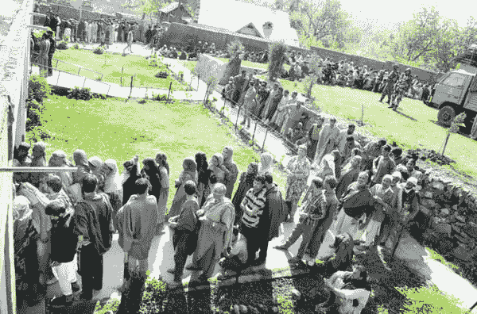

# 数据结构介绍(队列)

> 原文：<https://dev.to/andreanidouglas/introduction-to-data-structures-queues-5b8o>

# 数据结构介绍(队列)

计算机科学中最容易被忽视的概念之一是数据结构。对它的概念、设计和应用有一个很好的理解可以使你从一个简单的程序员变成一个更有能力和足智多谋的专业人员。

人们可以简单地将通用数据结构概括为一种以有组织方式在存储器中存储数据的手段。为此，有几种类型的结构，每一种都有其特定的用例及场景。

## 队列

[](https://res.cloudinary.com/practicaldev/image/fetch/s--tgy0CnBr--/c_limit%2Cf_auto%2Cfl_progressive%2Cq_auto%2Cw_880/http://www.dailyexcelsior.com/wp-content/uploads/2014/05/page1-19.jpg)

想象一下，你正兴奋地在公园的这个新景点骑车。你到达的时候，有一百个人在排队等同一趟车。

当您想要按顺序处理数据时，队列会非常有用。**先进先出** or (FIFO)。每个数据元素都必须在末尾插入，并从顶部移除。

```
struct element {
    int data;
    struct element *next;
};

typedef struct {
    struct element *start;
    struct element *end;
}queue;

queue* q;

void newqueue(queue* q){
    q->start = NULL;
    q->end = NULL;
}

/// Add element to the queue. O(1)
void enqueue(struct element* e){

    if(q->start == NULL){
        q->start = e;
        q->end = e;
    } else {
        struct element* aux;
        q->end->next = e;
        q->end = e;
        e->next = NULL;
    }
}

/// Remove element from the queue O(1)
void dequeue(struct element* e){
    e = q->start;
    q->start = e->next;
}

/// Get size of the queue. O(n)
int size(){
    int s = 0;
    struct element* curr;
    curr=q->start;
    while(curr->next != NULL){
        curr = curr->next;
        s++;
    }
    return ++s;
}

/// Peek at the nth element of the queue. O(n)
void peek(int n, struct element* e){
    int s = 0;
    struct element* curr;
    curr=q->start;
    e = NULL;
    while(curr->next != NULL){
        if (n==s) e = curr;

        curr = curr->next;
        s++;
    }
} 
```

上面给出的形式是最标准的实现。您可以在动态数组上实现仅移动元素的队列，但是这将导致队列/入队操作的效率降低到 O(n)。

## 队列有用的例子

既然您已经理解了队列及其实现。我们来讨论一下在哪里实现它们。

队列实现最常见的情况是在生产者/消费者场景中。生产者将生成要消费的数据，并且它可能比消费者更快。因此，消费者处的队列将组织数据收入，允许按照从最老到最新的数据顺序消费数据。