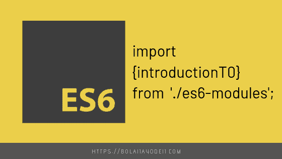
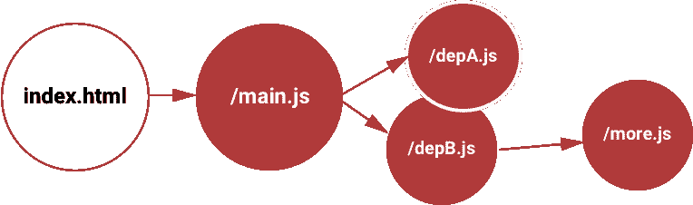
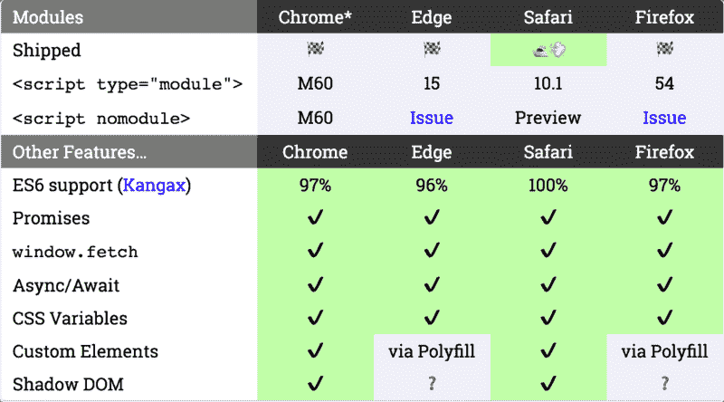

# ES6 模块简介

> 原文：<https://dev.to/bolajiayodeji/introduction-to-es6modules-5a04>

[](https://res.cloudinary.com/practicaldev/image/fetch/s--lpzxv60e--/c_limit%2Cf_auto%2Cfl_progressive%2Cq_auto%2Cw_880/https://cdn-images-1.medium.com/max/800/1%2ADDHE2Adf04v4EYcYbAUWSg.png)

软件工程的一个重要方面是效率。每一个成功的
应用都需要一个坚实的架构，允许它在所有级别扩展
而不会中断。在这方面，一些技术和模式
被用来确保代码效率。

在本文中，我将向您介绍 ES6 模块、它们是什么、如何使用它们以及为什么您应该关注{0[]0}

### **模块到底是什么？**

在 JavaScript 中，**“模块”**一词指的是独立的小单元，
可重用代码。它们是许多 JavaScript 设计模式的基础，在构建任何基于 JavaScript 的
应用程序时，
是至关重要的。

更简单地说，模块帮助你在模块中编写代码，并且**只暴露
那些应该被
代码的其他部分**访问的代码部分**。**

JavaScript 很久以前就有模块了。然而，它们是通过
库实现的，而不是内置在语言中。ES6 是 JavaScript
第一次内置模块。

*   每个模块都是一段代码，一旦加载了 JavaScript 文件，就会执行这段代码。
*   在该代码中，可能有声明(变量、函数、类等)。
*   默认情况下，该文件中每个声明都位于该模块的本地，不能在其他模块中访问，除非模块文件导出它们。

* * *

### ES6 模块是什么？

在此之前，不可能在另一个文件中直接引用或包含一个 JavaScript 文件
，因此，开发人员求助于替代选项
,比如多个 HTML 脚本标签

```
<script src="app.js"></script>
<script src="search.js"></script>
<script src="user.js"></script>
<script>
console.log('inline code');
</script> 
```

Enter fullscreen mode Exit fullscreen mode

这是一种不好的做法，因为每个脚本都会发起一个新的 HTTP 请求，这会影响页面性能，并在运行时中断进一步的处理。

假设我们有一个文件，`app.js`,这个文件中包含一个函数，
检查一个数的每个极限，如果是偶数或奇数，则返回。

```
function showNumbers(limit) {
 (let i = 0; i <= limit; i++) {
const message = (i % 2 === 0) ? 'EVEN' : 'ODD';
console.log(i, message);
  }
} 
```

Enter fullscreen mode Exit fullscreen mode

现在这个功能只在`app.js`内可用。无论你在哪里需要这个
函数，你都必须重写函数或者再次附加脚本。

这就是 **ES6 模块**发挥作用的地方:)

> 使用 ES6 模块，您可以将所有脚本连接到一个主脚本中，方法是将其中一些脚本标记为导出，然后其他模块可以导入它们。

[](https://res.cloudinary.com/practicaldev/image/fetch/s--wgUsPMcQ--/c_limit%2Cf_auto%2Cfl_progressive%2Cq_auto%2Cw_880/https://cdn-images-1.medium.com/max/800/1%2ArJdvreyM4VKoMpMOjn4gLA.png)

ES6 模块如何工作。

* * *

在 ES2015 发布之前，至少有 3 个主要模块与标准竞争:

*   **异步模块定义(AMD)**
*   **所需模块**
*   **普通模块**

因此，在 **ES6 (ES2015)中提出了单一的本地模块标准。**

ES6 模块是一个非常强大的概念，尽管并不是到处都有支持，但使用它的一种常见方式是转换成 ES5。你可以使用
[Grunt](https://gruntjs.com/) ， [Gulp](https://gulpjs.com/) ，
[Webpack](https://webpack.js.org/) ， [Babe](https://babeljs.io) l 或者其他
transpiler 在构建过程中编译模块。

> **Transpilers** ，或源到源编译器，是读取用一种编程语言编写的源代码
> ，并用另一种
> 语言生成等价代码的工具。(维基百科)

*支持 ES6 模块的浏览器，2017 年 5 月。
【*】来源* ]*

[](https://res.cloudinary.com/practicaldev/image/fetch/s--bxh5fc9B--/c_limit%2Cf_auto%2Cfl_progressive%2Cq_auto%2Cw_880/https://cdn-images-1.medium.com/max/800/1%2AXzKcB3WRsVg3K2TapBbghg.png)

### 你该知道的！

*   默认情况下，ES6 模块中的所有东西都是私有的，并且以严格模式运行(不需要`'use strict'`)。
*   使用`export`公开公共变量、函数和类。
*   使用`import`将暴露的模块调用到其他模块中
*   模块必须包含在带有`type="module"`的 HTML 中，它可以是一个
    内联或外部脚本标签。

    // or an inline script
*   模块被

    延迟，仅在文件加载后运行

要深入了解 ES6 模块，请在此阅读

* * *

### 如何使用 ES6 模块

对于本文，让我们创建三个文件，(`app.js`、`math.js`和`max.js`)

在`math.js`中，我们来写一个基本的算术算法

```
let sumAll = (a, b) => {return a + b;}

let subtractAll = (a, b) => {return a - b;}

let divideAll = (a, b) => {return a / b;}

let multiplyAll = (a, b) => {return a * b;}

let findModulus = (a, b) => {return a % b;} 
```

Enter fullscreen mode Exit fullscreen mode

现在为了让这个模块可以被我们代码的其他部分访问，我们需要
`export`它们。有几种方法可以做到这一点；

*   您可以单独导出每个模块:

```
export let sumAll = (a, b) => {return a + b;}

export let subtractAll = (a, b) => {return a - b;}

export let divideAll = (a, b) => {return a / b;}

export let multiplyAll = (a, b) => {return a * b;}

export let findModulus = (a, b) => {return a % b;} 
```

Enter fullscreen mode Exit fullscreen mode

*   一种更好的方法是使用单个导出语句:

```
let sumAll = (a, b) => {return a + b;}

let subtractAll = (a, b) => {return a - b;}

let divideAll = (a, b) => {return a / b;}

let multiplyAll = (a, b) => {return a * b;}

let findModulus = (a, b) => {return a % b;}

 export {sumAll, subtractAll, divideAll, multiplyAll, findModulus}; 
```

Enter fullscreen mode Exit fullscreen mode

*   您也可以导出默认值

```
export default {sumAll, subtractAll, multiplyAll, divideAll}; 
```

Enter fullscreen mode Exit fullscreen mode

> **注意:**你只导出你想在代码的其他部分使用的模块，
> 你不一定要导出这个脚本中的每个模块

现在要使用我们导出的模块，我们需要在`app.js`中导入它们，也有几种方法可以做到这一点；

*   您可以单独导入

```
import {sumAll} from './math.js'; 
```

Enter fullscreen mode Exit fullscreen mode

让我们测试我们的导入

```
console.log(sumAll(9, 8)); //17 
```

Enter fullscreen mode Exit fullscreen mode

*   您可以一次导入多个模块:

```
import {sumAll, subtractAll, divideAll} from './math.js'; 
```

Enter fullscreen mode Exit fullscreen mode

*   您可以将模块作为别名导入

> 在一些计算机操作系统和**编程**语言中，**别名**
> 是
> 定义的数据对象的替代名称，通常更容易理解或更有意义。更多详情
> [此处](https://searchmicroservices.techtarget.com/definition/alias)

```
import * as math from './math.js'; 
```

Enter fullscreen mode Exit fullscreen mode

这里我们已经导入了`math.js`中的所有模块，并将它们分配给了
别名`math`。为了使用这个导入的模块，我们这样做:

```
console.log(math.sumAll(50, 10)); // 60

console.log(math.subtractAll(50, 10)); // 40

console.log(math.multiplyAll(50, 10)); // 500

console.log(math.divideAll(50, 10)); // 5

console.log(math.findModulus(50, 15)); // 5 
```

Enter fullscreen mode Exit fullscreen mode

*   您也可以导入默认值

```
import math from './math.js';
 console.log(math.sumAll(5, 2)); // 7 
```

Enter fullscreen mode Exit fullscreen mode

这里我们将`math.js`中的`sumAll()`导入，并赋予别名
`math`。这里不用加`* as`了。

> 如果你不导出为`default`并且你使用这个方法导入，你将得到
> 这个错误:

```
Uncaught SyntaxError: The requested module './math.js' does not
 provide an export named 'default' 
```

Enter fullscreen mode Exit fullscreen mode

要使用此方法，您必须将`sumAll()`导出为`default`

```
export default {sumAll}; 
```

Enter fullscreen mode Exit fullscreen mode

*   还可以使用绝对路径导入模块，以引用在另一个域上定义的模块:

```
import {sumAll} from 'https://bolaji-module.glitch.me/sumAll.js';
 console.log(sumAll(50, 10)); // 60 
```

Enter fullscreen mode Exit fullscreen mode

> **注意:**模块是使用
> 和 [CORS 提取的。](https://developer.mozilla.org/en-US/docs/Web/HTTP/CORS)这意味着
> 如果你引用其他域的脚本，它们必须有一个有效的 CORS 头文件
> 允许跨站点加载。
> 
> 模块通过绝对或相对引用导入，并且必须以“/”开头。/"或"../".

```
import {sumAll} from 'math.js'; ❌
import {sumAll} from 'lib/max.js'; ❌

import {sumAll} from './math.js'; ✔️
import {sumAll} from '../max.js'; ✔️
import {sumAll} from 'https://bolaji-module.glitch.me/sumAll.js'; ✔️ 
```

Enter fullscreen mode Exit fullscreen mode

*   你可以从不同的文件中导入几个模块，在我们的`max.js`中添加这个:

```
let max = (a, b) => {
return (a > b) ? a : b;
}
export {max}; 
```

Enter fullscreen mode Exit fullscreen mode

现在可以在`app.js`T3 中一起导入`max.js`和`math.js`

```
import * as math from './math.js';
 import {max} from './max.js';

console.log(max(50, 10)); // 50

console.log(math.subtractAll(50, 10)); // 40

console.log(math.multiplyAll(50, 10)); // 500

console.log(math.divideAll(50, 10)); // 5 
```

Enter fullscreen mode Exit fullscreen mode

> 你可以导入多个文件，但是我们也必须记住，拥有多于一个的模块会降低我们应用的性能，只在需要的时候使用模块。

* * *

### 使用模块的一些优点

*   代码可以被分割成具有独立功能的较小文件。
*   可以连接多个脚本，从而提高性能。
*   调试变得更加容易。
*   任何引用模块的代码都知道它是一个依赖项。如果模块文件被更改或移动，问题会立即显现出来。
*   模块(通常)有助于消除命名冲突。模块 1 中的函数`sumAll()`不能与模块 2 中的函数`sumAll()`冲突。别名在这里很有用，就变成了`module1.sumAll()`和`module2.sumAll()`。
*   ES6 模块总是在`strict mode`执行，所以不需要`‘use strict’`。
*   ES6 模块帮助你更好地组织你的代码

* * *

### 结论

ES6 模块是现代浏览器中引入的最大特性之一。像 Vue JS 和 React JS 这样的现代 JavaScript 框架就使用了这个特性。

你也应该知道 **ES6 模块并不是所有浏览器都支持的。**对于
生产应用程序，使用 Webpack 和 Babel 等 transpilers 将
我们的代码从 ES6 转换到 ES5，以确保跨浏览器兼容性

> 关于这篇文章，我明天会再写两篇文章，向你展示如何使用 **[Babel](http://babel.io)** 作为你的 transpiler(这篇文章
> 将介绍如何安装和设置 Babel)以及如何在开发和生产中
> 有效地与`node_modules`一起工作。
> 
> 点击这里订阅我的时事通讯[，当它下降的时候得到通知
> ！](https://eepurl.com/geCCfL)

所以，就这样吧，在你等待**‘Babel trans piler 文章’**的时候，练习你
从这篇文章中学到的所有东西，在不同的项目中使用它，并尝试所有解释过的方法
来更好地掌握 ES6 模块。

**你需要做的两件事**

> 使用实时服务器运行 HTML 文件。
> 
> 在这里下载**chrome 的网络服务器**
> 
> 你也可以在你的代码编辑器中使用实时服务器扩展:
> [VScode](https://marketplace.visualstudio.com/items?itemName=ritwickdey.LiveServer) ，
> [Atom](https://marketplace.visualstudio.com/items?itemName=ritwickdey.LiveServer)
> 
> 添加主脚本时，不要忘记添加`type="module"`
> 
> 当你使用 transpilers 时，你就不需要这些了。

# 订阅我的时事通讯[在这里](https://eepurl.com/geCCfL)当我写了一些很酷的东西时会收到通知。