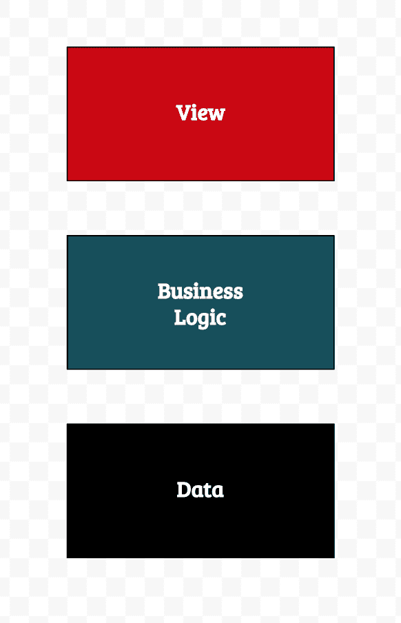
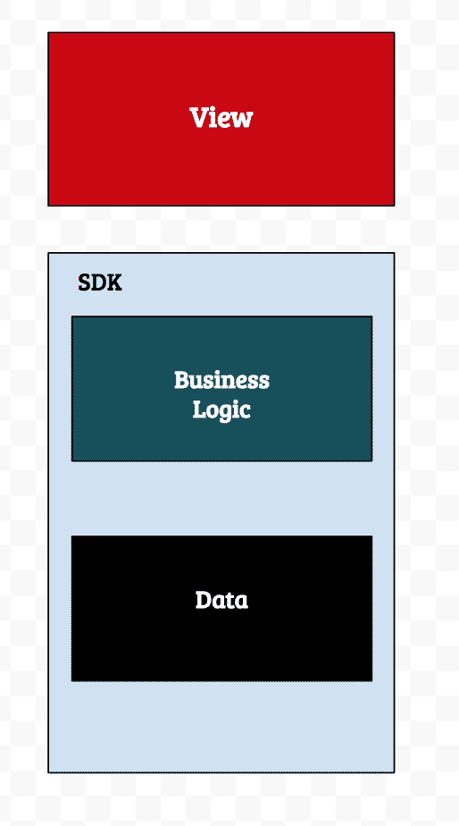

# to Gomobile 简介

> 原文：<https://dev.to/_tink3r/introduction-to-gomobile-19af>

这篇文章最初发表在 [blog.koundinya.xyz](//blog.koundinya.xyz)

当有人阅读 Go 编程语言时，他们可能会看到 Rob Pike 的著名演讲“并发不是并行”，或者他们可能会发现 Docker 和 Kubernetes 以及许多其他云基础工具都是用 Go 编写的(Go 被称为“云的语言”)。我想写一个关于围棋中鲜为人知的工具——Gomobile。Gomobile 是一个用 Go 编写的移动应用程序开发工具，旨在开发跨平台的应用程序。

### 你为什么会尝试 Gomobile？

我可以听到你们的集体抱怨，“又一个跨平台的移动开发解决方案”。我同意，事实上，我想表达我的观点。有时候，与跨平台框架提供的次等体验相比，拥有单一代码库的好处就相形见绌了。

那我们为什么要讨论 Gomobile 呢？

Gomobile 提供了两种发展策略

1.  使用-
    `gomobile build`开发整个移动应用程序

2.  使用-
    `gomobile bind`开发可由移动应用程序使用的库

使用 Gomobile 作为可以插入应用程序的 SDK 的生成器，这与谷歌和 Dropbox 等公司如何进行跨平台开发非常相似。 [Google 在收件箱](https://arstechnica.com/information-technology/2014/11/how-google-inbox-shares-70-of-its-code-across-android-ios-and-the-web/)用了 J2OBJC
，Dropbox 有 [Djinni](https://www.youtube.com/watch?v=ssqhz_1pPI4) 。
`gomobile bind`是一个选项，如果您的应用程序有很多业务逻辑，您不希望在多个平台中重写。

### 机动绑定

`gomobile bind`为 Java 和 Objective-C 生成语言绑定。使用绑定开发移动应用程序的一个简单模式是用本地语言开发视图层，然后与生成的 sdk 通信以获得模型对象。

#### 手机 App 架构

Android 和 iOS 中有相当多的移动应用架构模式，如 MVC、MVP、MVVM 和 VIPER。所有这些架构设计都可以用三个层次来概括。

##### 查看图层

这一层负责用户交互和数据呈现。Android 和 iOS 中的 Activity 和 ViewController 类分别是通常与该层相关联的类类型。

##### 业务逻辑层

这一层包含核心应用程序逻辑。来自视图的交互被发送到该层，该层被处理并用于调用数据层。

##### 数据层

数据层控制所有的数据访问操作。这可以是从访问本地 SQLite 数据库到与网络交互的任何事情。

有了`gomobile bind`，业务逻辑和数据层可以移动到 Go，在 iOS 和 Android 应用之间共享。这样，业务逻辑只需要编写一次，操作系统之间的数据访问协议是相似的。您也不会失去用户体验，这是大多数跨平台解决方案的常见缺点。

## 参考文献

这里有一些参考资料，您可能会对开始使用 Gomobile 感兴趣

1.  [https://godoc.org/golang.org/x/mobile/cmd/gomobile](https://godoc.org/golang.org/x/mobile/cmd/gomobile)
2.  [https://www.youtube.com/watch?v=ZLq0Zeoyu6Y](https://www.youtube.com/watch?v=ZLq0Zeoyu6Y)
3.  [https://medium . com/@ matryer/tutorial-calling-go-code-from-swift-on-IOs-and-versa-with-gomobile-7925620 c17 a4](https://medium.com/@matryer/tutorial-calling-go-code-from-swift-on-ios-and-vice-versa-with-gomobile-7925620c17a4)
4.  [https://medium . com/@ rakyll/calling-go-from-swift-be 88709942 C3](https://medium.com/@rakyll/calling-go-from-swift-be88709942c3)