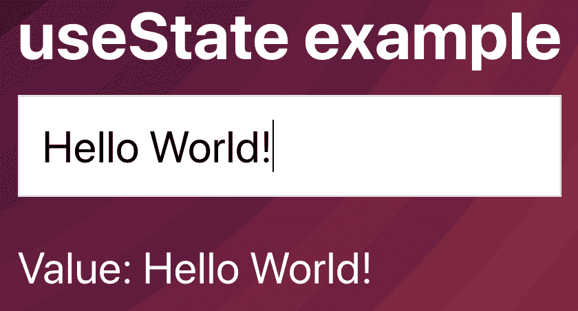
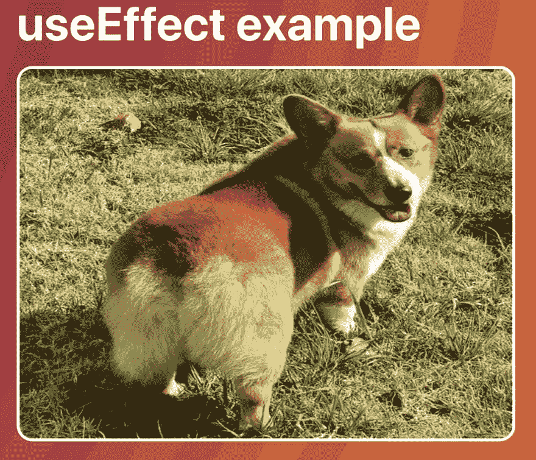

# React 挂钩简介

> 原文：<https://dev.to/christopherkade/introduction-to-react-hooks-1e0l>

React Hooks 已经在每个人的脑海中出现了一段时间，现在炒作已经平息了，我认为就它们写一个简短的介绍并通过具体的用例会很好。

React 钩子已经在 React 版本 16.8 中引入，它们允许我们使用曾经保留给类组件的特性(比如内部状态、生命周期钩子等等)。)在功能组件中。

这很好，因为编写功能组件通常是社区的首选，因为它们提供了优势，即:代码更容易阅读和维护，更容易测试，并且通常遵循更好的实践。例如，创建表示、容器和业务逻辑**功能**组件比使用基于类的组件更容易。

**今天，我们只讨论两个最常用的钩子:`useState`和`useEffect`。**

> 确保您已经掌握了 React 的基础知识，以便充分利用本课程，尤其是内部状态和生命周期挂钩的概念。

为了跟进，请随意克隆下面的[库](https://github.com/christopherkade/hooks-example)，在这里我们将使用这两个钩子将类组件转换成功能组件。这些组件可以在`/components/ExampleUS`和`/components/ExampleUE`下找到。

## 使用状态

好的，我们有以下基于类的组件:

```
class ExampleUS extends React.Component {
  state = {
    value: ''
  }

  onChange = event => {
    this.setState({
      value: event.target.value
    })
  }

  render() {
    return (
      <article>
        <h1>useState example</h1> 
        <input
          type="text"
          value={this.state.value}
          onChange={this.onChange}
        /> 
        <p>
          Value: {this.state.value}
        </p>
      </article>
    )
  }
} 
```

Enter fullscreen mode Exit fullscreen mode

它所做的只是允许用户输入一些内容，这些内容保存在组件的内部状态中，并显示如下，如下所示:

[](https://res.cloudinary.com/practicaldev/image/fetch/s--4J0mVIoZ--/c_limit%2Cf_auto%2Cfl_progressive%2Cq_auto%2Cw_880/https://user-images.githubusercontent.com/15229355/57177519-cb69bc00-6e64-11e9-9871-5cf31f4c874e.png)

这个组件需要一个**内部状态**，所以在 16.8 之前使用一个基于类的方法是有意义的，但是`useState`钩子将允许我们把它转换成它的对应函数。

### 使用状态语法

`useState`的语法非常容易掌握:

```
const [value, setValue] = useState('') 
```

Enter fullscreen mode Exit fullscreen mode

其中`value`是我们将绑定状态的变量，`setState`是更新它的方法，传递给`useState`的参数是状态的默认值。很简单，对吧？

### 变换组件

从一个类组件到一个功能组件需要两个简单的步骤:

1)首先，我们将组件的声明更改为功能声明

```
// Changed the declaration of the component
const ExampleUS = () => {
  state = {
    value: ''
  }

  // onChange is now assigned to a constant variable
  const onChange = event => {
    this.setState({
      value: event.target.value
    })
  }

  // Removed the render method,
  // Functional components directly return the JSX to be rendered
  return (
    <article>
      <h1>useState example</h1>
      <input
        type="text"
        value={this.state.value}
        onChange={this.onChange}
      />
      <p>
        Value: {this.state.value}
      </p>
    </article>
  )
} 
```

Enter fullscreen mode Exit fullscreen mode

2)现在让我们移除类的上下文(this)和状态
的所有痕迹

```
const ExampleUS = () => {
  // Removed the state declaration

  // Removed the call to this.setState()
  const onChange = event => {}

  // Removed all calls to the context
  return (
    <article>
      <h1>useState example</h1>
      <input
        type="text"
        onChange={onChange}
      />
      <p>
        Value:
      </p>
    </article>
  )
} 
```

Enter fullscreen mode Exit fullscreen mode

### 最终结果

好了，我们现在可以用前面提到的语法使用`useState`来创建一个内部状态。

下面是最终组件的样子(别忘了导入钩子):

```
import React, { useState } from "react"

const ExampleUS = () => {
  // We declare the state and the method to update it
  const [value, setValue] = useState('')

  // On input, call setValue with the new state value
  const onChange = event => {
    setValue(event.target.value)
  }

  // Bind the input to the state value and display it
  return (
    <article>
      <h1>useState example</h1>
      <input
        type="text"
        value={value}
        onChange={onChange}
      />
      <p>
        Value: {value}
      </p>
    </article>
  )
} 
```

Enter fullscreen mode Exit fullscreen mode

## 使用效果

对于这个例子，我们有以下组件:

```
class ExampleUE extends React.Component {
  state = {
    url: ''
  }

  /**
   * Fetch a random dog photo and save its URL in our state
   */
  componentDidMount() {
    fetch("https://dog.ceo/api/breeds/image/random")
      .then((res) => res.json())
      .then(data => this.setState({
        url: data.message
      }))
  }

  render() {
    return (
      <article>
        <h1>useEffect example</h1>
         
      </article>
    )
  }
} 
```

Enter fullscreen mode Exit fullscreen mode

在 mount 上，我们获取一张图片，将它保存在内部状态并显示它，它看起来像这样:

[](https://res.cloudinary.com/practicaldev/image/fetch/s--XYqhOH_v--/c_limit%2Cf_auto%2Cfl_progressive%2Cq_auto%2Cw_880/https://user-images.githubusercontent.com/15229355/57177873-0110a400-6e69-11e9-820e-727f47c5192d.png)

焦点是生命周期钩子`componentDidMount`,每当组件被挂载时(意味着每当它被插入到 DOM 树中时)都会被调用。我们将使用`useEffect`钩子做完全相同的事情，但是是在一个功能组件中。

### 使用效果语法

同样，这个钩子的语法很容易理解和使用:

```
useEffect(() => {
  // ...
}) 
```

Enter fullscreen mode Exit fullscreen mode

它的第一个参数是一个回调，每次组件被渲染时都会触发这个回调。

但是在我们的例子中，我们只希望在组件安装后触发一次，对吗？

为此，我们可以向`useEffect`传递第二个参数，这是一个变量数组，只有当它们被修改时才会触发回调(而不是在组件的每次呈现时触发)。我们也可以传递一个空数组(`[]`)来告诉回调只在组件挂载和卸载时触发，看起来像这样:

```
useEffect(() => {
  // ...
}, []) 
```

Enter fullscreen mode Exit fullscreen mode

### 变换组件

我们将跳过这一部分，因为它与之前的迭代没有太大的变化。

### 最终结果

```
// Don't forget to import both hooks
import React, { useState, useEffect } from "react"

const ExampleUE = () => {
  const [url, setUrl] = useState('')

  // On component mount, the callback is called
  // Fetch retrieves a picture and saves it in our internal state
  // The second parameter tells useEffect
  // to only be triggered on mount and dismount
  useEffect(() => {
    fetch("https://dog.ceo/api/breeds/image/random")
      .then((res) => res.json())
      .then(data => setUrl(data.message))
  }, [])

  return (
    <article>
      <h1>useEffect example</h1>
      
    </article>
  )
} 
```

Enter fullscreen mode Exit fullscreen mode

## 包装完毕

React Hooks 是对这个库的一个很好的补充，它们提供了相当多的优势，让开发人员的体验更加流畅。

需要注意的一件重要事情是，[还有许多其他的](https://reactjs.org/docs/hooks-reference.html)钩子，有些比其他的更常用，我邀请你仔细阅读官方文档，因为它制作得非常好。

其他参考资料包括:

*   Robin Wieruch 的[“如何用 React 钩子获取数据？”](https://www.robinwieruch.de/react-hooks-fetch-data/)
*   Matthieu Lux 的[《React Hooks，我的简介》](https://medium.zenika.com/react-hooks-my-introduction-81b15e6eff20)

感谢您的阅读，如果您学到了什么，请随时在 Twitter 上关注我， [@christo_kade](https://twitter.com/christo_kade) ,因为我会分享我所有关于 React、Vue 和整个❤️js 生态系统的新博客帖子