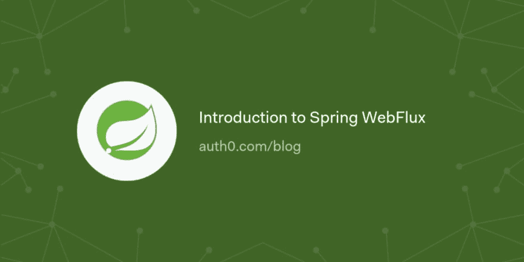

# Spring WebFlux 简介

> 原文：<https://dev.to/auth0/introduction-to-spring-webflux-3g0b>

在本文中，您将了解反应式编程，为什么它很重要，以及何时将它应用到您的项目中。您将通过 Spring WebFlux API 了解反应式编程是如何出现的，以及它在 Spring Boot 的实现。为了更好地理解这些概念，您将使用 Spring WebFlux 构建一个反应式 RESTful API，并使用 OAuth 2.0 保护它。

[读下去🍃](https://auth0.com/blog/introduction-getting-started-with-spring-webflux-api/?utm_source=dev&utm_medium=sc&utm_campaign=spring_webflux)

