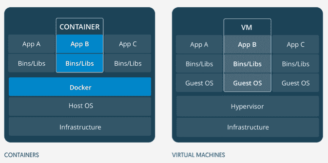
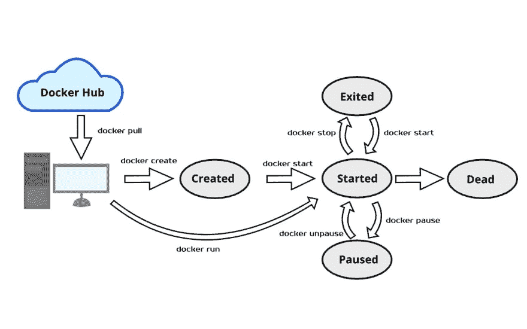

# Docker 生命周期简介

> 原文：<https://dev.to/dhanushkadev/introduction-to-the-docker-life-cycle-4e6j>

维护一个大型软件应用程序并不是一件容易的事情，因为它可能有许多依赖项和与操作系统相关的配置。如果您可以创建一个已经包含运行您的应用程序所需的库和配置的操作系统映像，会怎么样？这样，软件部署人员就可以很容易地在云上部署他们的应用程序，而不需要完成设置操作系统环境的繁琐任务。克服这个问题的一个可能的解决方案是使用虚拟机。您可以安装所有库，设置配置并拍摄映像。当您需要部署应用程序时，您可以简单地使用该映像启动机器。VM 提供完整低级机器来运行操作系统。但是由于虚拟机的操作开销，它的执行速度并不快。在这种情况下，集装箱技术来拯救。

## 集装箱 vs 虚拟机

[](https://res.cloudinary.com/practicaldev/image/fetch/s--m9Ah8wUT--/c_limit%2Cf_auto%2Cfl_progressive%2Cq_auto%2Cw_880/https://cdn.hashnode.com/res/hashnode/image/upload/v1551545546828/lw1W7f2Xs.png)

VM 只不过是一台执行程序的计算机。虚拟机运行在称为虚拟机管理程序的软件之上。在这里，物理计算机称为主机，运行虚拟机管理程序的虚拟机称为来宾机。容器的行为与虚拟机相同，但区别在于容器使用主机操作系统而不是硬件可视化来作为虚拟机运行。每个容器都有自己的用户空间，运行在主机操作系统之上。这使得容器比虚拟机快得多。

关于 docker 的另一件事是，您可以将 docker 图像保存在一个中央存储库中。这个库被称为 Docker Registry。Docker Registry 的工作方式与 GIT Repository 相同。您可以将当前容器提交为一个图像，并将其推入 Docker 注册表。你也可以从 Docker 注册表中取回图片。Docker Hub 就是这样一个 Docker 注册表，你可以保存图片。下列服务也被广泛用作 Docker 注册中心。

1.  [码头](https://quay.io/)
2.  [谷歌容器注册表](https://cloud.google.com/container-registry/)
3.  [AWS 容器注册表](https://aws.amazon.com/ecr/)

[](https://res.cloudinary.com/practicaldev/image/fetch/s--INQXD3zl--/c_limit%2Cf_auto%2Cfl_progressive%2Cq_auto%2Cw_880/https://cdn.hashnode.com/res/hashnode/image/upload/v1550292571285/2T44LpBlf.jpeg)

容器可以与操作系统中的进程相比较。进程是正在执行的计算机程序的实例。一个进程可以运行多个线程。容器也像流程一样工作，但是不同之处在于容器是在它们的完整环境中进行处理的。容器可以有以下状态。

*   **已创建**:已创建的容器。但没有开始
*   **重启**:正在重启的容器
*   **启动**:当前正在运行的容器
*   **暂停**:进程已经暂停的容器
*   **退出**:运行并完成的容器
*   **Dead** :守护进程尝试停止但失败的容器(通常是由于繁忙

### Docker 生命周期中的常用命令

下面是用来改变 docker 状态的命令列表。

```
docker pull [OPTIONS] NAME[:TAG|@DIGEST] 
```

从远程 docker hub 获取一个图像，并将其保存在您的本地机器上。该命令的工作原理与 Git pull 命令相同。

```
docker create [OPTIONS] IMAGE [COMMAND] [ARG...] 
```

这个命令通过指定的图像创建一个新的 Docker 容器。

```
docker start [OPTIONS] CONTAINER [CONTAINER...] 
```

该命令用于将已退出的或新创建的容器启动到运行状态。

```
docker run [OPTIONS] IMAGE [COMMAND] [ARG...] 
```

此命令创建一个新容器，并在新创建的容器中运行映像。“docker 创建”和“docker 启动”命令都可以通过这个命令来执行。

```
docker stop [OPTIONS] CONTAINER [CONTAINER...] 
```

该命令停止正在运行的容器。这将把容器状态从运行更改为激活。

```
docker pause CONTAINER [CONTAINER...] 
```

该命令通过发出 SIGSTOP 命令来暂停运行容器中正在运行的进程。

```
docker unpause CONTAINER [CONTAINER...] 
```

该命令将挂起的进程恢复到运行状态。

在 Twitter 上关注我 [@Dhanushkamadus2](https://twitter.com/Dhanushkamadus2) ，很高兴接受您对主题或改进的建议