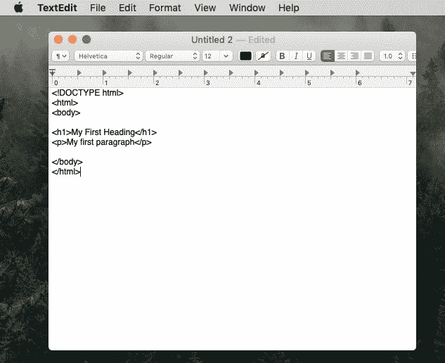
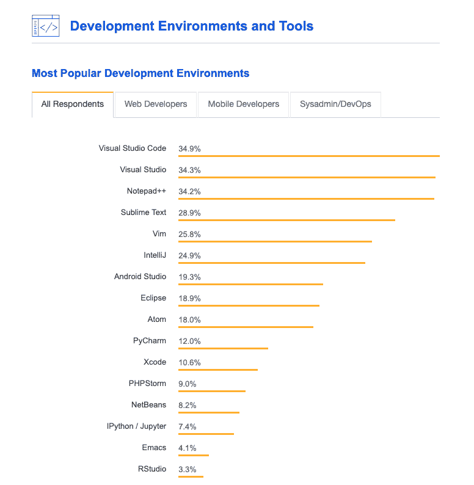
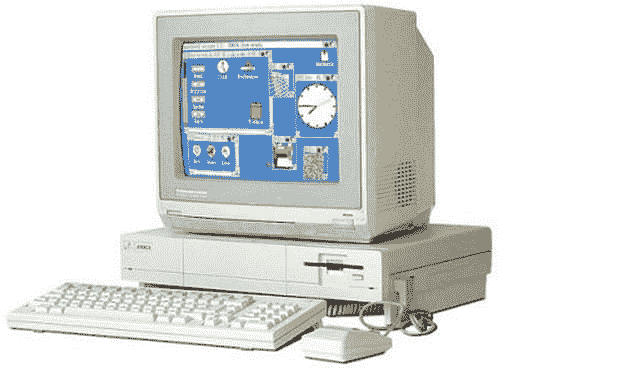

# 入侵者来了

> 原文：<https://dev.to/halented/invader-vim-2h32>

最近，每天都是代码探索的新冒险。我在使用电脑的真实目的中长大:电子游戏。从如何安装视频游戏到如何玩游戏，我在如何操作电脑方面的知识一直都很丰富。直到大约 6 个月前，我对代码产生了兴趣。现在，电脑就是电子游戏，而且复活节彩蛋太多了，我的篮子都快满了。

作为另一个参考框架，回到九月份，我正在通读我的第一段代码，它告诉我，我可以将一些东西复制并粘贴到我最喜欢的文本编辑器中。于是我打开了 Mac 的轻量级记事本 Text Edit。

“我是黑客高手，”我想。没多久我就发现这不是文本编辑器的意思，所以我用一个新奇的*代码*文本编辑器(VS 代码)重新定位自己。

如今，对于使用哪种文本编辑器有大量的选择。老实说，我只是选了最受欢迎的。查看 StackOverflow 上的这张图表 [2018 年顶级编辑](https://insights.stackoverflow.com/survey/2018#development-environments-and-tools):

在文本编辑器中导航，对我来说是一个超级新的实践，我想象我的祖父第一次尝试使用键盘时的感觉。猎啄，猎啄。最近在我的编码之旅中，我观察到我的一位导师*飞快地通过他的文本编辑器，操纵代码行的速度比我以前见过的任何东西都要快。在整个讲座过程中，我写下了一大串问题，问他到底是如何这么快就找到答案的——如何跳到单词的前面？线的尽头？文档的结尾？选择括号内的？这份名单还在继续。*

## 原来，所有这些问题都指向同一个答案:Vim。

Vim 于 1991 年 11 月 2 日首次发布。如果你注意到上面的图表，27 年后，Vim 仍然是第五大流行的文本编辑器。2015 年，是第 3 届。“但是等等，”我的大脑抗议道，“那个家伙不是在用 Vim，他是在用 VS 代码。”

这个谜的答案始于 Vim 最初并不是为 mac 构建的。Vim 是为 Amiga 设计的，这是有史以来外观最炫的电脑:

看看那个软盘端口就知道了。Vim 在当时被用来在命令行中以一种高效、清晰的方式编辑您的代码。这种设置(使用 QWERTY 键盘最流畅，但也完全可以使用你想要的任何键盘)旨在让你不必使用鼠标就可以在页面上跳跃。目前，Vim 已经移植到许多不同的设备上，您肯定可以将它作为主要的文本编辑器。它没有像 Atom 或 Sublime 这样的新编辑器那样的花哨功能，但它完成了自己的工作，而且做得非常好。好了，下一个问题:

我的讲师所做的是*在他特定的文本编辑器中用扩展来模拟*Vim 命令。根据他的说法，大多数文本编辑器都有一些模仿 Vim 的方法，因为它太 OG 了。

我将模拟器添加到我自己的 VS 代码扩展中，但是为了向我的编程前辈致敬，我决定也检验一下真实的交易。我赶紧问谷歌，互联网在哪里保持活力。令我惊讶的是，谷歌回复道:

“看里面。是你有活力。”

显然，Vim 预装在任何基于 Unix 的操作系统中(比如 Mac OS 或 Linux)。我觉得这有点冒犯，但它确实让使用变得非常简单。首先，你只需要进入你的终端，用命令“vim filename.ext”打开一个文件。

## 学习 Vim 基础知识

一开始，我试着即兴发挥。虽然精通 Vim 的优势是不可否认的，但是如果没有帮助，理解 Vim 中到底发生了什么有点太难了，所以我转而寻求一些教程。

最重要的是要知道 Vim 有两种主要模式:**正常**和**输入**。Normal 是导航模式，而 input 更像是一种常规的输入模式。您可以使用 *i* 和 *esc* 键在两种模式之间切换。第三种模式，**视觉**模式，主要用于选择命令。

以下超级快速提示是在 Vim 正常模式下可以使用的一些关键示例:

*   分别用于左右移动的 *h* 和 *l* 键
*   分别用于上下移动的 *k* 和 *j* 键
*   按 *w* 键跳到下一个单词
*   按 *b* 键跳到上一个单词

当然还有很多其他命令，但是要点 hay day 并不是很好的博客内容。你可以从[这个超级有用的页面](https://www.fprintf.net/vimCheatSheet.html)中找到关于 Vim 命令的备忘单，并且你可以使用[这个交互式 Vim 教程](https://www.openvim.com/)开始你的导航之旅。

然而更重要的是，电子游戏。实际上，你可以通过这款仅允许你使用 Vim 命令的一流复古式冒险游戏来达到 Vim 素养。

这个关于 Vim 和键盘导航的小历史给了我一股令人愉快的怀旧之情，也让我对文本编辑器是什么和做什么有了更深的理解。在阅读关于 Vim 的文章和评论时，你可以真切地感受到人们对这个项目的喜爱。很容易看出软肋是如何开发的——27 年后，Vim 总共只发布了 8 个版本，因为它一开始就构建得非常好。失陪了，我要去我的维姆冒险了！