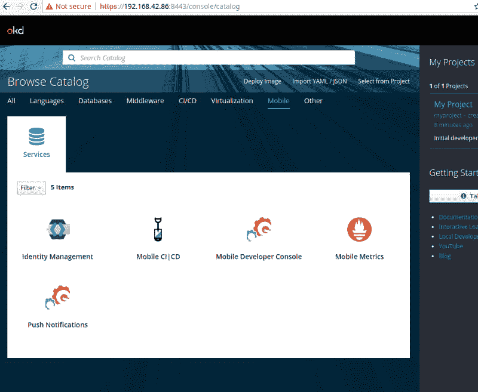
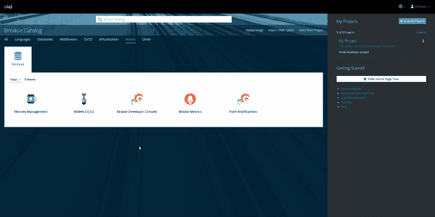
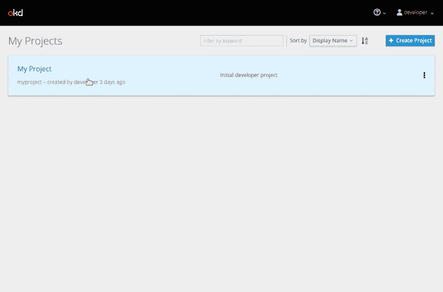
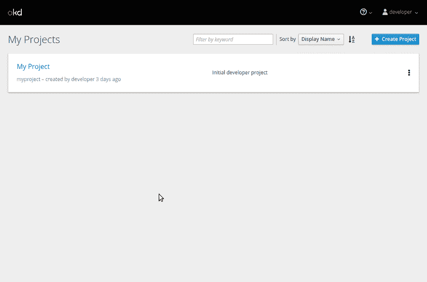
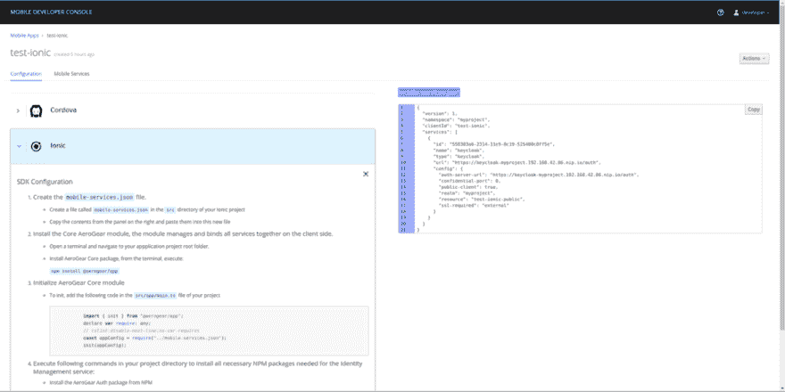
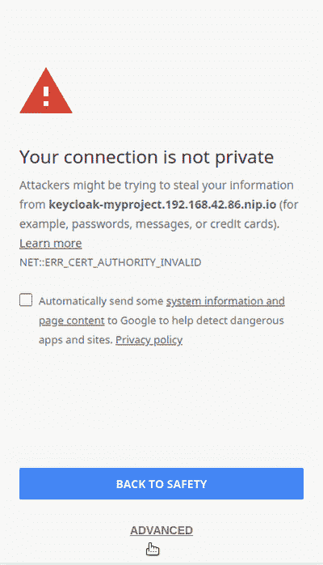

# Openshift 上的 Ionic 和 Aerogear 移动开发人员控制台

> 原文：<https://dev.to/aerogear/ionic-and-the-aerogear-mobile-developer-console-on-openshift-16bi>

**注意**:我已经对最新版本进行了测试，其中一些说明不再像预期的那样有效，因为 MDC 正在开发中，将在未来对文章进行修订。

我想开发一个 Ionic 移动应用程序，并在 Openshift 上使用 Aerogear MDC 提供的服务。入门指南

> [离子型](https://ionicframework.com/getting-started#cli)
> 
> [Openshift(Minishift)](https://www.okd.io/minishift/)
> 
> [Aerogear 移动开发者控制台](https://docs.aerogear.org/aerogear/latest/getting-started.html)

## 设置 Aerogear 移动开发者控制台

我不会深入设置 Minishift，对于 Aerogear 移动开发人员控制台，您可以克隆 MDC 签出 release 标签的 repo 并运行设置脚本

```
git clone https://github.com/aerogear/mobile-developer-console.git
cd mobile-developer-console
git checkout 1.0.0
./scripts/minishift.sh 
```

Enter fullscreen mode Exit fullscreen mode

**注意**:该脚本破坏了默认的[小型轮班配置文件](https://docs.okd.io/latest/minishift/using/profiles.html)并创建了一个新的

完成后，您应该会在 Openshift 的服务目录中看到以下手机标签。

[](https://res.cloudinary.com/practicaldev/image/fetch/s--caFBYk_d--/c_limit%2Cf_auto%2Cfl_progressive%2Cq_auto%2Cw_880/https://cdn-images-1.medium.com/max/800/1%2AnKS69-5ve95zKg7VR2F4ow.png%3Fstyle%3Dcenterme)

接下来，单击 MDC 图标，按照步骤完成安装，选择要添加 MDC 的项目，此时不要绑定。

[](https://res.cloudinary.com/practicaldev/image/fetch/s--cmMtvK4I--/c_limit%2Cf_auto%2Cfl_progressive%2Cq_66%2Cw_880/https://cdn-images-1.medium.com/max/1200/1%2AqO5gWmxvWjCKmMRmOy6cIA.gif%3Fstyle%3Dcenterme)

完成后，您将能够从您部署它的项目中访问 MDC。

## 在移动开发者控制台中创建移动应用后端

[](https://res.cloudinary.com/practicaldev/image/fetch/s--4kBlFGkl--/c_limit%2Cf_auto%2Cfl_progressive%2Cq_66%2Cw_880/https://cdn-images-1.medium.com/max/800/1%2Ai5bVnbRphc8RVH_z2EYB4A.gif%3Fstyle%3Dcenterme)

## 添加身份管理服务

将身份管理服务添加到 app mobile 应用程序。这创建了一个 Keycloak 实例和一个 Postgres 服务器，它为你做了很多设置工作，比如创建领域和设置管理员用户和密码。

**注意**:此时更改您的管理员密码

[](https://res.cloudinary.com/practicaldev/image/fetch/s--KrIZE7IK--/c_limit%2Cf_auto%2Cfl_progressive%2Cq_66%2Cw_880/https://cdn-images-1.medium.com/max/800/1%2AY096A8DsHyyx6u8FsI3oBQ.gif%3Fstyle%3Dcenterme)

一旦部署了 Keycloak 和 Postgres，您需要将身份管理服务绑定到您的移动后端。

[](https://res.cloudinary.com/practicaldev/image/fetch/s--zGCyfqcb--/c_limit%2Cf_auto%2Cfl_progressive%2Cq_66%2Cw_880/https://cdn-images-1.medium.com/max/800/1%2AUt20OhUmYQ4K81m1WdOQRw.gif%3Fstyle%3Dcenterme)

## 创建 Ionic 应用并使用身份管理服务

在启动 ionic 应用程序之前，你需要配置 Keycloak 实例，这在[这里](https://docs.aerogear.org/aerogear/latest/identity-management.html#configuring-Identity%20Management)有记录。只需设置**有效重定向 URIs** 和 **Web 源**指向 Cordova 标签 URL。

在配置 ionic 应用程序时，我将使用 ionic 入门指南中的一个模板应用程序

```
ionic start test-ionic tabs
cd test-ionic 
```

Enter fullscreen mode Exit fullscreen mode

在中创建新文件。名为 **mobile-services.json** 的 ionic 项目的/src 目录

将内容 mobile-services.json 从移动开发人员控制台(应用程序的配置选项卡)复制到这个新文件中。

**注意** : Minishift url 不是公共的，所以我们的 auth url 在本地主机之外不能工作。

[](https://res.cloudinary.com/practicaldev/image/fetch/s--jN-mM0Oq--/c_limit%2Cf_auto%2Cfl_progressive%2Cq_auto%2Cw_880/https://cdn-images-1.medium.com/max/1200/1%2AWbox4_jYlxT1zk4RsPaT0Q.png%3Fstyle%3Dcenterme)

在 ionic 项目中安装以下 npm 包

```
npm install @aerogear/app --save
npm install @aerogear/auth --save
npm install @types/node --save-dev 
```

Enter fullscreen mode Exit fullscreen mode

**注**:我只测试了 *@aerogear/app 2.3.1*
编辑**。/src/tsconfig.app.json** 并添加一个类型“节点”，这是一个有点棘手的问题，因为你不能使用 **require** 而不这样做

```
{  "extends":  "../tsconfig.json",  "compilerOptions":  {  "outDir":  "../out-tsc/app",  "types":  ["node"]  },  "exclude":  [  "test.ts",  "**/*.spec.ts"  ]  } 
```

Enter fullscreen mode Exit fullscreen mode

将以下部分添加到。/src/main.ts 文件

```
import { enableProdMode } from '@angular/core';
import { platformBrowserDynamic } from '@angular/platform-browser-dynamic';

import { AppModule } from './app/app.module';
import { environment } from './environments/environment';

//==========================add the following lines of code=====================
import { init } from "@aerogear/app";
import { Auth } from "@aerogear/auth";

const appConfig = require("./mobile-services.json");
const app = init(appConfig);

const authService = new Auth(app.config);
//let initOptions = { onLoad: "login-required" };

authService.init({ onLoad: "login-required" })
.then(() => {
    // successful init & authentication
    console.log('keycloak init');
})
.catch((err) => {
    // initialization error
    console.log('keycloak init failure', err);
});

//========================end of code block======================================
if (environment.production) {
  enableProdMode();
}

platformBrowserDynamic().bootstrapModule(AppModule)
  .catch(err => console.log(err)); 
```

Enter fullscreen mode Exit fullscreen mode

现在，通过从项目的根目录运行 ionic 应用程序，我们的应用程序受到了身份管理服务测试的保护

```
ionic serve 
```

Enter fullscreen mode Exit fullscreen mode

[](https://res.cloudinary.com/practicaldev/image/fetch/s--8UZAqTeQ--/c_limit%2Cf_auto%2Cfl_progressive%2Cq_66%2Cw_880/https://cdn-images-1.medium.com/max/800/1%2AGn64vq8aoK2SqgymyUdstg.gif%3Fstyle%3Dcenterme)

我正在使用我在 Keycloak 管理控制台上设置的用户登录。

[我的博客](https://austincunningham.ddns.net)