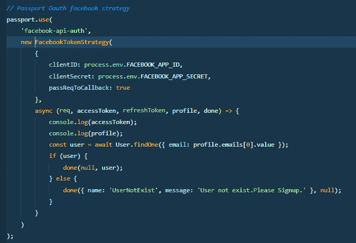

# Node.js 中的 IOS 和 Android API Oauth 实现

> 原文：<https://dev.to/mehraas/ios--android-api-oauth-implementation-in-nodejs-157m>

我是移动 API 开发的新手&我必须在我的 ios 和 Android API 中集成 fb oauth。这是在 API 中实现 fb oauth 的正确方法吗？

