# 物联网——符合规范的流行传感器

> 原文：<https://dev.to/logeshpalani98/iot-popular-sensor-with-the-specification-1bg4>

**简介**

在本文中，我们将讨论物联网平台中最流行的传感器及其特性。如今传感器在电气设备中占有最重要的地位。**传感器—****将物理量转换成电信号或数字信号。**

**目标受众—* *初学者

**主题**

*   湿度和温度传感器
*   温度传感器
*   接近传感器

    *   感应传感器
    *   电容式传感器
    *   光学传感器
    *   超声波传感器
*   加速计

*   PIR 运动传感器

*   图像传感器

*   气敏元件

    *   空气质量传感器
    *   烟雾传感器
*   红外传感器

*   液位传感器
    **<u>湿度和温度传感器</u>**

    ```
     The Humidity and Temperature Sensor are used to measure the moisture and temperature of the surrounding air. The different temperature sensors are designed based application with analog and digital output. Example LM35 and DHT11, DHT22\. The Automation application widely used DHT11 sensor, because of output in digital form. The digital data comes from the data pin in every 2 seconds. In here we discuss the specification of DHT11 
    ```

**DHT11 引脚图**

**[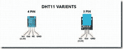](https://lh3.googleusercontent.com/-oycMA0A16OY/XCu_6r27ssI/AAAAAAAAMDI/88xgLVYZQd4ibwAwsXe-tk_F_tkZ1d-BACHMYCw/s1600-h/clip_image002%255B3%255D)T4】**

图 1 DHT11 传感器
**引脚定义**

1.  VCC–输入电压
2.  GND–接地引脚
3.  NC–非连接引脚(此引脚需要添加 SOIC14 制造)
4.  输出数字数据输出。

**规格**

|工作电压| 3.3 至 5V DC |
|测量范围| 20-95%RH(相对湿度)；0-50℃ |
|分辨率| 8 位湿度、8 位温度|
|接口| 3 针接口、4 针接口|
| PCB 尺寸| 22.0mm X 20.5mm X 1.6mm |

**<u>温度传感器</u>**

```
 This sensor used to measure the temperature of the surrounding and the output voltage linearly-proportional to Centigrade temperature. The operating voltage is 4 – 30V and it is an analog sensor. Based on an application designed various transistors. 
```

**引脚图规格**

**[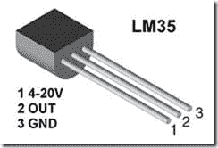](https://lh3.googleusercontent.com/-9ivvttPPkbc/XCu__N0HRGI/AAAAAAAAMDQ/XINLbWKchxY9AzhXxWZFFlkBQ9nZJcfygCHMYCw/s1600-h/clip_image004%255B3%255D)T4】**

图 2lm 35
T1】规格

|工作电压(V) | 4-30 |
|工作温度(°C)|-40 至 110，-55 至 150，0 至 100，0 至 70 |
|电源电流(uA) | 114 |
|输出|模拟输出|

**<u>接近传感器</u>**

```
 The sensor is able to detect a range of objects with the help of emitting an electromagnetic field or a beam of electromagnetic radiations without any physical contact. It can also be used to recognize air gestures and hover-manipulations. 
```

[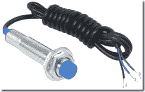](https://lh3.googleusercontent.com/-OWfoFufRjlI/XCvAC48r1JI/AAAAAAAAMDY/D5bCBBerh5gn0aDSFP43U08ZqCRi_NYzQCHMYCw/s1600-h/clip_image005%255B3%255D)

**图** **3** **接近传感器**
引脚示意图

1.  VCC–5V 电源
2.  out–数据输出
3.  GND-地面有 4 种接近传感器
4.  **电感式接近传感器**——是一种不接触金属物体进行探测的电磁传感器，工作原理线圈和高频振荡器。线圈和振荡器在周围表面产生磁场。基于线圈尺寸的检测范围。它只能探测金属物体。**** *应用* *停车场工业应用。
5.  **电容式接近传感器**–它是一种非接触金属物体和非金属物体，如水、塑料。可以测量传感器和物体之间的电容变化以及一微英寸的距离范围。物体靠近时传感器电容增加，物体远离时电容减小。** ** *应用** ** **手机笔记本电脑电脑显示器
6.  **光学接近传感器**–这是一种非金属传感器，用于检测物体并测量物体与传感器之间的距离。光学传感器的**工作原理**是光的运动由发射器(光源)和接收器(光探测器)组成。当发射器发射光源而物体会反射光源时，物体反射成为接收器(光电二极管)。**应用**安全汽车距离测量水平感测
7.  **超声波传感器**–超声波传感器或超声波换能器是物联网许多应用中最常用的传感器之一。** ** **工作原理:**发射器在前进方向的空气中发射超声波，当有物体存在时，会向接收器反射。接收器(光电二极管)接收超声波。** **

**距离=速度 x 时间**
T3】现在，我们应该知道速度和距离，然后计算物体的距离。

[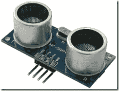](https://lh3.googleusercontent.com/-0eIkxZvQgvU/XCvAF4n56qI/AAAAAAAAMDg/PQnHn_0adDUkWSZFYNwJib09EDT5TPfGACHMYCw/s1600-h/clip_image007%255B3%255D)

图 4 超声波传感器
**引脚定义**

| 1 | Vcc | 5V 电源|
| 2 | Trig |触发引脚是输入引脚。它将在 10uS |
| 3 | Echo |输出引脚保持高电平。|
| 4 | GND |地钉

**规格**

|理论测量距离| 2cm 至 450cm |
|实际测量距离| 2cm 至 80cm |
|精度| 3mm |
|工作电流| < 15mA |
|频率| 40Hz |

**应用程序**

*   机器人
*   车辆
    **<u>加速度计</u>**

    ```
     This sensor now presents in millions of smart devices. Like a smartphone, anti-theft protection, etc. Working Principle is the mechanical energy converts into the electrical signal output. It is defined by the rate of change of velocity with respect to time. 
    ```

[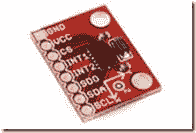](https://lh3.googleusercontent.com/-rccElCj09wc/XCvAJjkHDgI/AAAAAAAAMDo/YjJbGABgWsg3X0LvdzDQYF4ddYP6tQnTwCHMYCw/s1600-h/clip_image009%255B3%255D)

图 5 加速度计
**引脚定义**

**[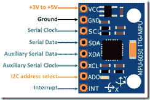](https://lh3.googleusercontent.com/-v_WsAOdMGOE/XCvAMqE-gwI/AAAAAAAAMDw/JFCZx47pPosXQkTuhiBU6XSdC7G3RUJ4gCHMYCw/s1600-h/clip_image010%255B3%255D)T4】**

图 6 加速度计引脚图

| Vcc | **+** 3 至+5V |
|地|系统地|
| SCL |串行时钟通过 I2C 通信|
| SDA |串行数据通过 I2C 通信|
| XCL |时钟接口其他 I2C 模块(可选)|
| <u>XDA</u> |数据接口其他 I2C 模块|
|<u>ADO</u>| MCU 中有 1 个以上的传感器，则此引脚用于改变地址|
| <u>中断</u>

**规格**

*   沟通——I2C 协议
*   16 位模数转换器
*   接口其他 I2C
*   可配置的 ICC 地址

**应用程序**

*   汽车
*   雄蜂
*   智能手机
    **<u>PIR 运动传感器</u>**

    PIR 运动传感器代表被动红外传感器。它可以检测人或动物的存在。传感器的输出电压为 3.3V。它有一个可重复和不可重复模式的触发部分。在可重复模式下，检测人的输出引脚电压变低，但不可重复模式不会变低。当对象移出范围时，输出会变低。传感器内部安装了热电传感器。

[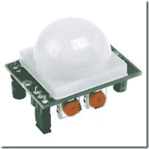](https://lh3.googleusercontent.com/-eE0-3IKXEgc/XCvAPpX9xPI/AAAAAAAAMD4/so402m2IlboZ_AQdECWLl-Z-9KhJWzaAQCHMYCw/s1600-h/clip_image012%255B3%255D)

图 7 PIR 运动传感器
**引脚图规格**

[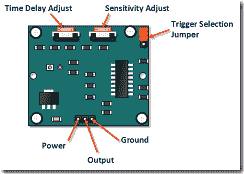](https://lh3.googleusercontent.com/-grPJCwEhpQY/XCvAS0DPCrI/AAAAAAAAMEA/Q6p8SiYpB1o6V4AxMHA1-e3ZXA1UJztCgCHMYCw/s1600-h/clip_image013%255B3%255D)

|电源| 4.5–12V |
|输出功率| 3.3V 当运动检测输出为低电平时(0V) |
|接地|接地|
|延时|旋转调整|
|灵敏度|旋转调整|
|触发选择|可重复和不可重复模式|
|感应角度| 110 到 90 度|

**应用程序**

*   安全摄像头
*   警告
*   花园警报器
*   自动化控制
    **<u>图像传感器</u>**

    图像传感器用于将光学图像转换为电信号，摄像设备用于捕捉光线。色盲 CMOS 传感器能够对各种颜色的光做出反应。微透镜用于聚焦入射信号。它是业内流行的传感器之一。

    [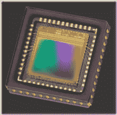](https://lh3.googleusercontent.com/-mpGMlb2IWr8/XCvAXKjwYOI/AAAAAAAAMEM/LyDsBbGqIM8hVia71s-eKUHJO5mMhvf7ACHMYCw/s1600-h/clip_image015%255B3%255D) 

    **应用**

*   雷达

*   声纳

*   夜视设备

*   汽车制造业
    **<u>气体传感器</u>**

    ```
     It is used to monitor changes in air quality and to detect the presence of various gases. In this sensor mostly used in manufacturing industries, Space station, and chemical industries. The alternative gas sensor is available but the mostly MQ2 used in IoT industries. 
    ```

不同气体传感器

*   二氧化碳传感器
*   呼气测醉器
*   一氧化碳探测器
*   催化珠传感器
*   氢气传感器
*   空气污染传感器
*   氮氧化物传感器
*   氧气传感器
*   臭氧监测器
*   电化学气体传感器
*   气体检测器
*   湿度计

**MQ2 传感器**

**[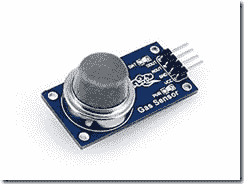](https://lh3.googleusercontent.com/-G-c9g50GVGg/XCvAbp97AqI/AAAAAAAAMEY/v1PjKxCPS24-VnLunaBe3rvh-omK_7MqgCHMYCw/s1600-h/clip_image016%255B3%255D)T4】**

| DOUT |数字输出 0 至 5V |
| AOUT |模拟输出 0 至 5V |
| GND |地|
| Vcc | 5V |

**应用程序**

*   实验室
*   化学工厂
*   工业等。
    **<u>红外传感器</u>**

    用于电视遥控器等远程应用的红外传感器。传感器 LED 发射红外辐射，光电二极管可以接收红外辐射。红外辐射是透明的。

[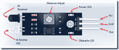](https://lh3.googleusercontent.com/-LAg1QjcAtj8/XCvAfRmuOqI/AAAAAAAAMEk/Buo5v9eCsKIdkyLF16fhbMv9Gic4io-lgCHMYCw/s1600-h/clip_image017%255B3%255D) 
**引脚定义**

| Vcc | +5V |
| GND |地|
| Out |数字输出|
|电流供应| 20mA |
|红外发射器| LED |
|红外接收器|光电二极管|
|触发器|调整距离|
|电源 LED |设备状态|
|障碍物 LED |障碍物检测通知|
|范围|最远 20cm |

**应用程序**

*   远程控制
*   工业安全
    **<u>液位传感器</u>**

    ```
     The level sensor used to monitor the level or amount of liquid. It only indicates whether the substances are above or below of sensing level. The different types of level sensor are manufactured based on application. 
    ```

**类型**

*   电容水平
*   超声波水准仪
*   振动水平仪
*   光学水准仪
*   微波等级
    [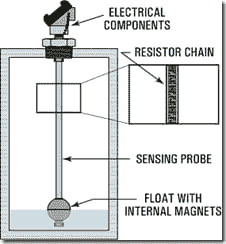](https://lh3.googleusercontent.com/-rXVYFCRleBU/XCvAjWVXDtI/AAAAAAAAMEw/x7vJVYKwjrcx_re8Y2PdvydSmfcEz6pewCHMYCw/s1600-h/clip_image018%255B3%255D) 

    **应用**

*   石油制造厂

*   水处理

*   发电厂

*   废料处理工业。

**结论**

我希望我们正在学习物联网中一些流行的传感器及其特性。感谢您阅读这篇文章。