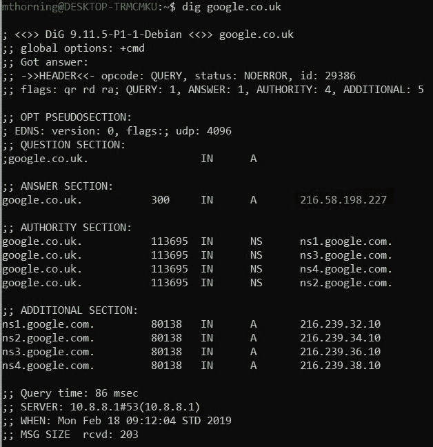
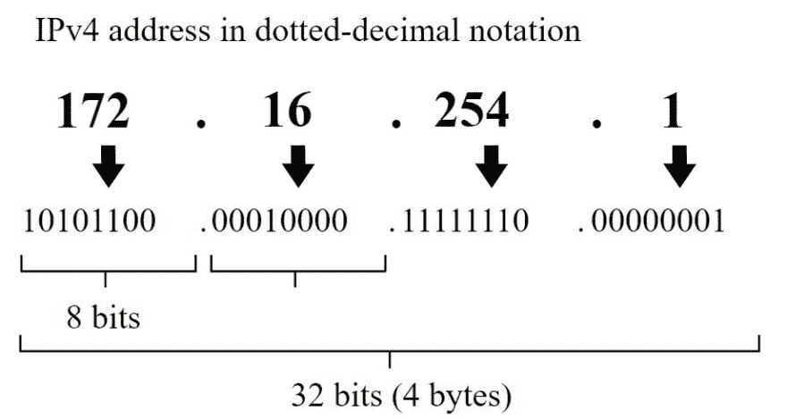

# IP 地址

> 原文：<https://dev.to/thorning_m/ip-addresses-4lln>

作为一名 web 开发人员，对互联网如何工作有一个基本的了解大概是有益的！这不是我很了解的事情，我总是认为这是理所当然的，所以我决定写一些帖子来加深我自己的理解；我认为 IP 地址将是一个很好的起点。像往常一样，如果你看到任何不准确的地方，或者认为我错过了任何应该包括的东西，你可以在 Twitter 上找到我。

每台连接到互联网的设备都需要一个 IP 地址。IP 代表*互联网协议*,这是一组设备如果要能够通过互联网相互通信就需要遵守的规则。当你用浏览器访问一个网站时，你实际上是在浏览一个 IP 地址；幸运的是，我们有一个现成的系统，这意味着我们不必记住我们访问的所有网站的 IP 地址。

## 域名系统

当你在浏览器中输入一个网址时，它首先被域名系统(DNS)转换成一个 IP 地址。DNS 查询有四个步骤，它们是:

1.  *DNS 递归器*—“递归解析器”充当客户端(网络浏览器)和域名系统之间的中间人。它保存以前解析的查询的缓存；如果所请求的域名在缓存中，则可以直接解析 IP 地址，如果不在缓存中，则从根域名服务器开始，从以下三个域名服务器请求数据。
2.  *根域名服务器* -根域名服务器会将解析器指向相关的*顶级域名(TLD)* 域名服务器，该服务器维护所请求域名扩展的信息(这是*)。com，co.uk，。org* 部分网址)。
3.  *TLD 域名服务器*-TLD 域名服务器拥有所有权威域名服务器的位置，这些服务器拥有顶级域名网站的信息。*。com* 。
4.  *权威域名服务器* -最终，解析器获得了权威域名服务器的位置，并可以请求在浏览器中输入的网址的 IP 地址。

因此，你可以看到，DNS 的工作原理是系统地缩小搜索范围，就像在工业区搜索一罐油漆一样；首先你找到 B&Q，然后你找到油漆通道，然后你找到架子上的油漆罐。

可以使用 Linux 实用程序 *dig* 询问 DNS 名称服务器，它会告诉我们域名的 IP 地址以及提供 IP 地址的权威名称服务器。

## 了解地址

最常用的 IP 地址版本是 IPv4。这使用 32 位地址(4 个字节)，将 IP 地址的总数限制为 2 32 (大约 43 亿)个地址。这似乎是很多 IP 地址，但当你考虑到目前全球人口约为 77 亿，你会意识到这可能是不够的！幸运的是，并不是所有的设备都需要直接连接到互联网，这将在一分钟内解释，有一个新版本的互联网协议(IPv6)是 128 位，导致 2 128 或 340 十亿分之一(3400 亿亿亿亿亿！)地址。

IPv4 地址使用*点分十进制符号*书写。有 4 个由点分隔的部分，每个部分是 1 个字节(8 位)。在十进制中，你能达到的最大数是 255，在二进制中是 11111111。

IPv6 地址仍然使用点标记法，但他们使用十六进制数代替十进制数，每段使用 16 位代替 8 位。作为比较，这意味着每个点分隔部分的十进制等价最大数量是 65535，而 IPv4 是 255。除此之外，IPv6 使用 8 个点分隔的部分，而不是 IPv4 的 4 个！以下是 IPv6 地址的一个示例:

### **2001:0db 8:0000:0000:0000:ff00:0042:8329**

为了方便起见，可以删除一个部分中的一个或多个前导零，并用双冒号替换连续的零部分(每个地址仅一次),使我们的上述示例看起来像这样:

### **2001:db8::ff00:42:8329**

不是很难忘，我很高兴我们有域名系统！

IPv6 的目标是每台设备都能够被分配到自己唯一的地址，而不会像 IPv4 那样有耗尽地址池的风险。

## 我们怎么还在用 IPv4？

IPv4 地址耗尽问题应该意味着我们很久以前就用完了 IPv4 地址。事实上，从 20 世纪 80 年代起，人们就已经预料到了！我们仍然能够使用 IPv4 的一个主要原因是因为私有 IP 地址。像我一样，你家里可能有很多连接到无线路由器的设备。这是您的互联网接入点，因此是您家中唯一需要公共 IP 的设备。当设备连接到路由器时，*动态主机配置协议(DHCP)* 会为其分配一个私有 IP 地址。这些地址在您的*局域网(LAN)* 中是唯一的，可能看起来像是 *192.168.xxx.xxx* 或 *10.xxx.xxx.xxx* 。当您的一台设备发出请求时，路由器会将报头中的私有 IP 替换为公共 IP，并将发送设备的详细信息记录在表中。当数据包返回时，路由器在表中查找保存的引用，并将数据包转发到正确的私有 IP 地址。处理这种情况的协议称为*网络地址转换(NAT)* 。

## 端口

另一个与 IP 地址相关的重要话题是端口。端口允许我们的设备在同一个 IP 地址上监听许多不同的服务。思考 IP 地址、端口和 NAT 如何相互作用的一个好方法是用下面的类比。

我在一栋大楼里工作，该大楼向许多不同的企业出租办公室。当我从亚马逊订购一个新玩意时，邮递员会把它送到我们大楼的接待处。接待员把我的包裹和我公司的所有其他包裹放在一个盒子里，然后由我的一个在我们公司工作的同事取走。我的同事知道我在哪一个部门工作，并友好地把我的包裹交给我。

我包裹上的地址包含我工作的大楼的街道地址和我工作的公司名称。在这个类比中，街道地址是 IP 地址，公司名称是端口号。请注意，包裹上没有任何信息表明我在哪一个办公桌工作，这些信息保存在内部，由好心人将我的包裹送到我的办公桌上(NAT)。

有许多常见的端口号(80 是 HTTP，22 是 SSH，20 是 FTP，25 是 SMTP)，但它们也可以根据需要进行分配。要访问特定的端口，可以在 URL 后面加上一个冒号，后跟端口号。如果没有提供端口号，那么它将默认为端口 80 (HTTP)。当我们写*google.co.uk*时，我们实际上指的是*216.58.198.227:80*

* * *

这就是我想在这篇文章中介绍的全部内容。我们还可以讨论更多的内容，比如子网、类、MAC 地址和 ARP，但是我希望这篇文章简短一些，所以我可能会在以后的某个时间写第 2 部分。我希望这篇文章对你有用，如果有任何意见或问题，请随时联系我们，下次见。😃