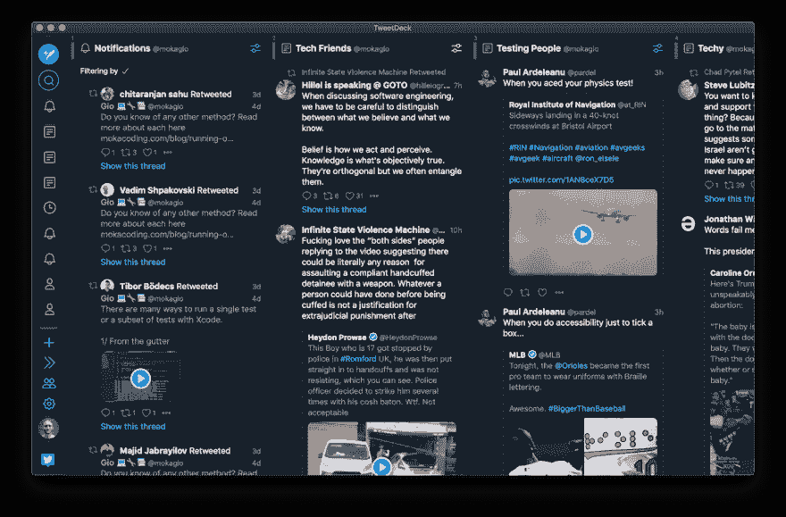
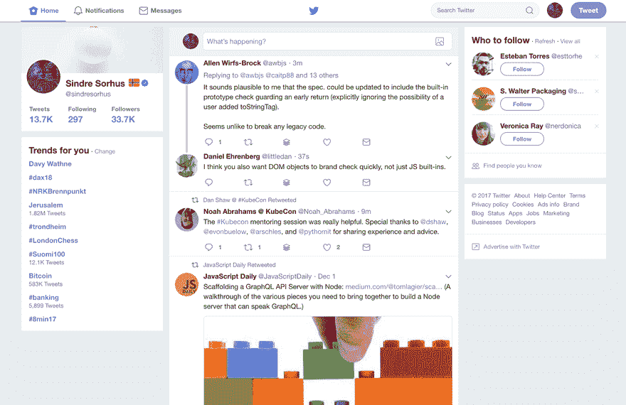

# 社交媒体负责你的日程安排吗？

> 原文：<https://dev.to/mokagio/is-social-media-in-charge-of-your-schedule-19h6>

一个简单的生活事实是，一天只有 24 小时。不管你对高效的定义是什么，实现它的一个关键部分就是尽你所能地度过这 24 小时。

普通互联网用户每天花在社交媒体上的时间超过 2 小时。我敢打赌，这些人中的大多数可以更好地度过这段时间。

但我不是来对社交媒体发动战争的，不是来鼓吹你今天应该删除所有账户。
相反，如果你认为一个或多个平台对你有用，你应该继续使用它。
我想关注的是*如何*使用它们。

我就用 [Twitter](https://twitter.com/mokagio) 作为个人的例子。
我已经很久没用脸书和 Instagram 了，但我几乎每天都看 Twitter。
这是我的科技新闻来源之一，是我分享工作的一种方式，也是我与科技界朋友保持联系的一个地方。

另一方面，我浏览 Twitter 可以很快退化为无意识的滚动寻找可以点击的东西，在我知道之前，我已经浪费了半个小时。

为我辩护，这不全是我的错。
这不仅仅是意志力的问题。
Twitter 和所有其他社交媒体和信息娱乐平台花费了数年时间来定制他们的网页和应用程序，使其变得引人入胜和令人上瘾。
这些技术利用我们大脑的缺点，让我们与他们呆得更久，并经常回来，这样我们就可以看到为他们带来收入的广告。设计伦理学家特里斯坦·哈里斯的这篇文章很好地介绍了他们使用的技术。

我们如何有效地利用社交媒体、信息娱乐网站、流媒体平台和互联网时代的所有其他发明？我们怎样才能从它们身上得到我们需要的东西而不被吸进去？

## 社交媒体运营流程

卡尔·纽波特在他的书[中介绍了*标准操作程序*的概念。](https://geni.us/7HNOJAz)

在商业行话中，一个标准的操作程序是“一套由一个组织编制的帮助工人进行复杂的常规操作的逐步说明” [2](#fn2) 。

应用于社交媒体和其他娱乐平台，这些规则描述了何时以及如何使用这些技术。

通过明确定义我们与任何给定网站或应用程序的交互方式，我们可以平衡科技巨头如何优化他们的产品以使我们上瘾。

有了这些规则，我们可以更有意识地使用社交媒体等，将控制权重新掌握在自己手中。

这里有一个具体的例子。以上是我对 Twitter 的操作流程。

### 推特操作程序

*   一天只查两次推特；午饭后和下班后。
*   周末没有推特，这是和家人一起度过和休息的时间。
*   远离主页及其参与度优化；请改用列表。
*   只在独处时查看推特，不要让它分散你对其他人的注意力。
*   不要在手机上使用 Twitter，以避免无聊时使用它的诱惑。

我主要通过桌面应用程序浏览 Twitter。
我喜欢它，因为它允许你显示列表、通知等。一个挨着一个，根本不用访问主页。 [*](#fn3)

在网络上，我使用[改进的 Twitter 插件](https://github.com/sindresorhus/refined-twitter)来消除 UI 中的许多噪音。

由于这些简单的规则和调整，我已经失去了冲动，我很少会盲目地滚动，而不必放弃我在平台中找到的有价值的东西。

## 如何制定自己的操作规程

标准操作程序的目标是优化您对给定技术的使用。

您应该开发自己的程序，从平台中获得更多价值，同时减少负面影响。

看看你是如何使用这项技术的，并思考是否有更好的方法来从中获取价值。你可以使用过滤器只显示你真正喜欢的内容，或者将你想关注的页面加入书签，使它们更容易访问，同时切断主页的干扰。为了跟上新闻的发展，你可以绕过肤浅的信息娱乐新闻聚合器，订阅一些精心策划的时事通讯。

此外，想想你不喜欢某项技术或你如何使用它，有没有一种方法可以最小化？在[数字极简主义](https://geni.us/7HNOJAz)中，作者分享了他的一个读者如何只和他们的伴侣一起看网飞，以避免孤立自己和疯狂观看。
我的一个朋友喜欢电子游戏，但也担心它们会让你沉迷其中。
他每周安排几个小时不间断的游戏，在此期间他完全沉浸在游戏中。这足以让他乐在其中，并且知道他没有降低自己的工作效率给他带来了极大的满足感。此外，他还要期待下一个预定的会议，这使会议更加愉快。

## 有时限

优化你的技术交互的一个有用的方法是在一天中的特定时间触发它们或者对它们进行时间限制。

通过安排你与社交媒体互动的时间，你可以增加一层额外的控制和意图。这些技术的一大危险是，它们需要你在白天不断地使用它们来赚钱。预定时间去拜访他们是抑制快速浏览冲动的一种方式。

对我来说，只在预先设定的时间查看 Twitter 是一种从被动到主动的转变。我现在想的不是“我觉得有点无聊，让我无意识地滚动吧”，而是“是时候赶上我的进度了。”你不仅会更难上瘾，还会更喜欢这项技术，因为你会有意识地使用它，而不是对无聊的刺激做出反应。

同样，给你的互动设定时间框是确保这些技术不会占据你的时间表的一种方式。诚然，时间拳击需要意志力。说“再等几分钟”很容易，很快就会忘记时间。

一种使时间框更容易的方法是自动化它。
看看这些工具，设定与应用程序和网站互动的时间限制。

*   StayFocused 是一个浏览器插件，用于限制在网站黑名单上停留的时间。
*   [Freedom](https://freedom.to/) 是一款跨网站和其他应用程序设置时间限制的软件。
*   在 iOS 12 中，苹果引入了设置[应用特定时间限制](https://9to5mac.com/2018/10/16/time-limit-app-limit-iphone-ipad/)的功能。

## 自由的约束

对这种计划方法的一个普遍担忧是，它最终会吸走生活中所有的自发性。

结果恰恰相反。给社交媒体和其他任务分配时间，让我一天中有更多的时间进行真正自发的活动，比如散步、给朋友写信，或者和我的儿子挠痒痒。

我越是按照惯例和仪式来安排我的日子，我就越发现自己放松了，并且处于控制之中。正是在我的计划被打乱的日子里，我最终变得心慌意乱，效率低下。

如果在一天中的任何时候，我想访问 Twitter，知道我已经为它安排了一个时间之后，我就会下定决心，避免可能会耗费时间和精力的事情。

* * *

作为软件开发人员，很容易有尝试每个新应用和工具的冲动。花时间研究这个行业中的其他人在做什么，通常感觉是值得的。
闪亮的新对象综合症不仅适用于框架和工具，也适用于社交媒体、应用和信息娱乐网站。

数字极简主义哲学鼓励我们采取深思熟虑的方法来使用我们生活中的技术。

批判性地评估你使用的每一个平台，只保留那些真正有用并且符合你价值的平台。对于那些，理想情况下为数不多的，成功的技术，采取额外的步骤，确保你优化使用它们的方式，使它们成为创造价值的工具，而不是耗费时间的上瘾品。

对我来说，Twitter 是一项有潜力创造价值的技术。但是为了实现这种潜力，我需要成为负责互动的人，而不是相反。
定义一个操作程序是确保 Twitter 仍然是我的工具，而我不会成为 Twitter 的工具的一种方式。

我们做的每件事都要有目的性和当下性，这是过上美好生活的秘诀。有意识地与技术互动是朝着这个方向迈出的一步。

你找到贵重物品有哪些技术？你有和他们互动的操作程序吗？
我很乐意收到你的来信，请在下面留言或在推特上联系 [@mokagio](https://twitter.com/mokagio) 。

### 脚注

[*每天在社交媒体上超过 2 小时。*](#social-media-two-hours) ”数据来自 [2019 GlobalWebIndex](https://www.globalwebindex.com/) 报告，转自[数字信息世界](https://www.digitalinformationworld.com/2019/01/how-much-time-do-people-spend-social-media-infographic.html)。

[*由一个组织编制的一套分步说明，帮助工人进行复杂的常规操作*](#sop) 。”来源:[维基百科](https://en.wikipedia.org/wiki/Standard_operating_procedure)。

。如果 Twitter 很快移除列表功能和日落 TweetDeck 来迫使用户与他们的算法时间线进行交互，我这个愤世嫉俗的人不会感到惊讶。只有时间能证明一切。