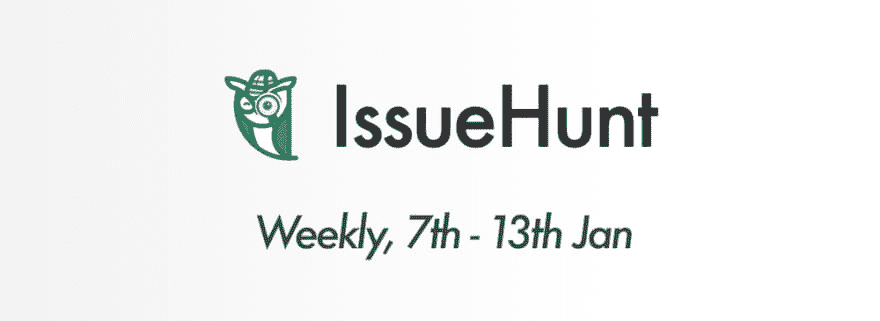
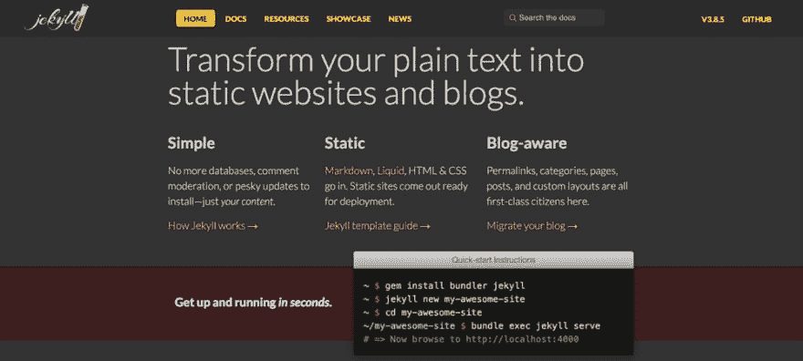
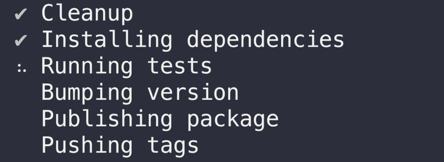

# 1 月 7 日至 13 日发行周刊🦉

> 原文：<https://dev.to/issuehunt/issuehunt-weekly-on-jan-7th-to-13th--ff5>

IssueHunt 是一个面向开源项目的基于问题的赏金平台。

[https://issuehunt.io](https://issuehunt.io)

* * *

# 特色项目

### 哲基尔

🌐Jekyll 是一个支持博客的 Ruby 静态站点生成器

[查看发行号](https://issuehunt.io/repos/65252)

### np

更好的`npm publish`
金额:580 美元

[查看发行号](https://issuehunt.io/repos/40806530)

* * *

# 上周 10 大融资问题

*   1，$200 / gifski-app: [增加取消转换的能力](https://issuehunt.io/repos/119822304/issues/5)

*   2，$200 / gifski-app: [添加预定义大小的下拉菜单](https://issuehunt.io/repos/119822304/issues/36)

*   3，$100 / DockProgress: [让进度动画更流畅](https://issuehunt.io/repos/123488065/issues/1)

*   4、100 美元/回收站:[使用较新的 IFileOperation 接口](https://issuehunt.io/repos/44226889/issues/1)

*   5、$100 / caprine: [暂停模式](https://issuehunt.io/repos/42574339/issues/103)后 App 在恢复时停止更新

*   6，$100 / xo: [详细模式](https://issuehunt.io/repos/40053602/issues/188)

*   7、$80 / eslint-plugin-unicorn: [偏爱`event.key`胜过`event.keyCode`](https://issuehunt.io/repos/55832243/issues/118)

*   8、$80/ ow: [添加`optional`谓词](https://issuehunt.io/repos/105227249/issues/58)

*   9，$100 / react-native-offline: [为这个包添加 TypeScript 类型。](https://issuehunt.io/repos/86369462/issues/131)

*   10，$50 / [可以给 bot 添加电报提醒吗？](https://issuehunt.io/repos/54808920/issues/736)

[查看更多](https://issuehunt.io/issues)

* * *

# 当前排行榜

*   1，$500 / NW.js: [Mac MAS(签名)对于 0.19.5 以外的版本](https://issuehunt.io/repos/3100121/issues/6794)

*   2、$ 450/MongoDB-awesome-backup:[funded support Google 云存储作为备份存储](https://issuehunt.io/repos/114969039/issues/8)

*   3，$336 / ant-design: [添加道具到配置日期选择器年份格式](https://issuehunt.io/repos/34526884/issues/10644)

*   4、336 美元/蚂蚁设计:[改进键盘 UX](https://issuehunt.io/repos/34526884/issues/4102)

*   5、$320 / react-native-offline: [示例用法](https://issuehunt.io/repos/86369462/issues/21)

*   6，$316 / code-settings-sync: [功能请求:增加一个登录(账号)选项，使用账号](https://issuehunt.io/repos/47984369/issues/506)同步所有设置

*   7，$306 / fluent-bit: [处理来自嵌套 JSON 字符串的多行](https://issuehunt.io/repos/29933948/issues/337)

*   9，$296 / NW.js: [有关于自动更新的计划吗？](https://issuehunt.io/repos/3100121/issues/233)

*   10，$291 / Vuls: [WordPress 漏洞扫描(核心、插件、主题)](https://issuehunt.io/repos/54808920/issues/689)

…以及按收到金额排名的前 5 名项目。
1、[蚂蚁设计($4800)](https://issuehunt.io/repos/34526884)
2、 [MaterialUI ($1290)](https://issuehunt.io/repos/23083156)
3、 [NW.js ($2474)](https://issuehunt.io/repos/3100121)
4、 [cyclejs ($960)](https://issuehunt.io/repos/26316966)
5、 [xo ($640)](https://issuehunt.io/repos/40053602)

[发现更多项目](https://issuehunt.io/repos)

* * *

# 关于发行的材料

我们已经提供了几份发行材料。

*   GitHub 自述文件的按钮和屏幕
*   登录页面的功能区

请随意使用这些东西，并收集赞助商！

[发行库存材料](https://github.com/BoostIO/issuehunt-materials)

* * *

# 关于赞助计划

[对于开源可持续发展:引入 IssueHunt 赞助计划](https://medium.com/issuehunt/for-open-source-sustainability-introducing-issuehunt-sponsorship-program-ac80e0e331e2)

我们正在寻找 OSS 的两种赞助商。

*   ①月订阅:使企业能够每月资助在 IssueHunt 上上市的开源。发行机构将募集的资金分配给有前途的 OSS 项目。
*   ②IssueHunt Fest:我们在每年的 4 月和 12 月组织为期一个月的 OSS 赞助活动。我们为愿意支持这项活动的公司提供三种赞助选择。

[> > >申请资助< < <](https://issuehunt.io/sponsorship)

* * *

谢谢你，
发行团队

