# 都 2019 年了！让我们结束关于图标字体 vs SVG 图标的争论

> 原文：<https://dev.to/lambdatest/it-s-2019-let-s-end-the-debate-on-icon-fonts-vs-svg-icons-21k>

在现代网络世界中，图标已经成为 UI 设计不可或缺的一部分。从导航菜单到社交媒体图标、符号和指示器，图标在互联网上的几乎每一个网站和应用程序中都有大量出现，其受欢迎程度没有任何迹象表明会很快减弱。因此，每个开发人员都必须面对这个难题——他们应该使用哪个图标集？

传统上，开发人员只能依靠图像格式来满足他们的需求。然而，在渲染质量和分辨率方面，使用图像作为图标的表现非常糟糕。但是现在开发者有两种选择——图标字体和 SVG 图标(可缩放矢量图形)。这是一场没有减弱迹象的辩论，它将开发社区一分为二。这两种图标格式的支持者认为两者各有千秋。然而，近来对 SVG 图标格式已经有了普遍的共识和动力。SVG 图标系统确保了更好的性能、更高的可访问性标准、高渲染质量、无与伦比的灵活性和广泛的定制。在这篇文章中，我们将简要探讨网络图标的历史，字体图标和 SVG 图标的优缺点。

你可以选择图标字体或 SVG，但你应该确保你的设计是响应性的，所以如果你正在寻找一个免费的下一代浏览器来构建、测试和调试移动网站，你可以尝试 LT Browser 这是一个开发友好的浏览器，你可以在 Android 和 iOS 分辨率上看到你的网站的移动视图，并检查其响应性。

## 网络图标简史

## 时代的图像

在图标字体 vs SVGs 的讨论之前，当浏览器没有 CSS 支持时，图像是开发人员使用经典字体展示图标的唯一方式

标签。下面是一个图像图标的例子–

```
 <a href=”contact-us.html”>

    

    </a> 
```

Enter fullscreen mode Exit fullscreen mode

## 哪里出了问题？

但是这项技术有太多的缺点。使用图像显示 web 图标的最大缺点是缺乏可扩展性。像 PNG 和 JPEG 这样的图像格式在放大或缩小时会遭受渲染质量的巨大损失。另一个主要缺点是，如果一个网页使用多个图像作为图标，每个图像都会触发一个新的 HTTP 请求，这会严重降低性能。最后，由于图像不可缩放，每个图像图标需要有多种分辨率格式以适应不同的屏幕尺寸。此外，如果图像图标具有悬停效果，那么需要使用 Javascript/jQuery 单独加载其悬停状态的新图像。尽管使用图像作为图标仍然很普遍，但这是一种必须不惜一切代价避免的可怕做法。

## 影像精灵的崛起

2000 年初开始了一个新的趋势，图像精灵。一个图像精灵仅仅是一组独立的单独图像的集合，它们被放在一起形成一个单独的图像。Image sprite 将所有图标排列在一个 GIF 或 PNG 文件中，并作为 CSS 背景图像加载。通过调整 CSS 背景属性，只显示所需的图标。Sprites 通过解决由单个图像触发生成多个 HTTP 服务器请求的恶意问题，被证明是 web 字体的革命。这节省了带宽，提高了网站加载速度。此外，许多可访问性问题也得到解决，因为背景图像对文本浏览器和屏幕阅读器是不可见的，不像图像那样被视为内容。

[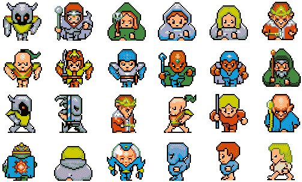](https://res.cloudinary.com/practicaldev/image/fetch/s--H_cN9Nw3--/c_limit%2Cf_auto%2Cfl_progressive%2Cq_auto%2Cw_880/https://cdn-images-1.medium.com/max/2000/0%2ACmH1EHHQA1sGHrz0.png)

这里我们有一个图像精灵—**“last-guardian-sprites _ 0 . png”**包含一些角色图标。我们不使用 24 个单独的图像，而是使用单个精灵图像来减少服务器请求的数量和带宽。

使用 CSS，我们可以玩背景位置属性，只显示我们想要的图标，隐藏其他的。请注意， **img_trans.gif** 只是一个很小的透明图像，因为“src”属性不能为空。

```
 <!DOCTYPE html>
    <html>
    <head>
    <style>
    #char1 {
     width: 75px;
     height: 75px;
     background: url([https://opengameart.org/sites/default/files/last-guardian-sprites_0.png](https://opengameart.org/sites/default/files/last-guardian-sprites_0.png)) 0 0;
    }

    #char2{  width: 75px;
     height: 75px;
     background: url([https://opengameart.org/sites/default/files/last-guardian-sprites_0.png](https://opengameart.org/sites/default/files/last-guardian-sprites_0.png)) -85px 0;
    }
    </style>
    </head>
    <body>

    <br><br>
    

    </body>
    </html> 
```

Enter fullscreen mode Exit fullscreen mode

[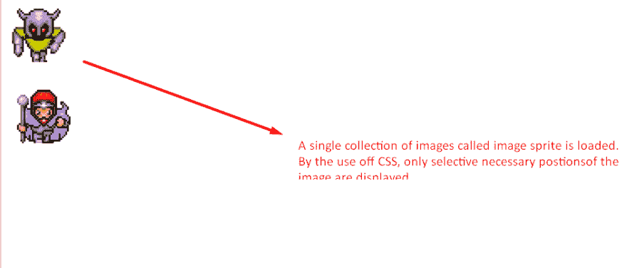](https://res.cloudinary.com/practicaldev/image/fetch/s--t7dOhTLg--/c_limit%2Cf_auto%2Cfl_progressive%2Cq_auto%2Cw_880/https://cdn-images-1.medium.com/max/2000/1%2AottwRNBxTw0jRVQk_f44FQ.png)

通过将背景位置设置为 0，0 并将容器的宽度和高度分别设置为 75px，我们能够显示第一个字符图标。将背景位置的值改为-85px 0，我们可以显示图像精灵中的第二个图标。一个有用的生成图像精灵的免费工具是[to tal Sprite Generator](https://www.toptal.com/developers/css/sprite-generator/)。

## 革命图标字体！

网络图标的下一个发展阶段是在 2012 年，以图标字体的形式出现。与图像和精灵不同，图标字体能够完美地放大到任何分辨率，而不会降低或损失视觉质量。即使图像精灵是一个巨大的进步，它仍然有很多缺点。如果你需要改变图标的颜色或分辨率，那就意味着需要一个全新的图像。另一方面，图标字体本质上是简单的文本。我们可以使用 CSS 样式规则来轻松地更改和修改颜色、大小/分辨率、应用框阴影、应用 CSS 动画和过渡。这是一个使用字体真棒库的图标字体的例子

*   去字体牛逼官网。使用 CDN 或在您的系统上下载库文件。

*   将字体 Awesome CSS 样式表链接到您的网页。

*   访问图标字体库页面，复制你想要使用的每个图标的类名。

```
 <!DOCTYPE html>
    <html>

    <head>
       <link rel="stylesheet" href="[https://use.fontawesome.com/releases/v5.7.2/css/all.css](https://use.fontawesome.com/releases/v5.7.2/css/all.css)" integrity="sha384-fnmOCqbTlWIlj8LyTjo7mOUStjsKC4pOpQbqyi7RrhN7udi9RwhKkMHpvLbHG9Sr"
           crossorigin="anonymous">
       <style>
           body {
               background-color: rgba(66, 117, 156, 0.123);
           }

    h1, .icon-fonts {
               text-align: center;
           }

    i {
               font-size: 75px;
               display: inline-block;
               margin: 0 10px;
           }

    .fa-facebook {
               color: #3b5998;
           }

    .fa-twitter {
               color: #38A1F3;
           }

    .fa-instagram {
               background: -moz-linear-gradient(45deg, #f09433 0%, #e6683c 25%, #dc2743 50%, #cc2366 75%, #bc1888 100%);
               background: -webkit-linear-gradient(45deg, #f09433 0%, #e6683c 25%, #dc2743 50%, #cc2366 75%, #bc1888 100%);
               background: linear-gradient(45deg, #f09433 0%, #e6683c 25%, #dc2743 50%, #cc2366 75%, #bc1888 100%);
               -webkit-background-clip: text;
               background-clip: text;
               color: transparent;
           }
       </style>
    </head>

    <body>
       <h1>ICON FONTS USING FONT AWESOME LIBRARY</h1>
       <div class="icon-fonts">
           <i class="fab fa-facebook"></i>
           <i class="fab fa-twitter"></i>
           <i class="fab fa-instagram"></i>
       </div>
    </body>

    </html> 
```

Enter fullscreen mode Exit fullscreen mode

[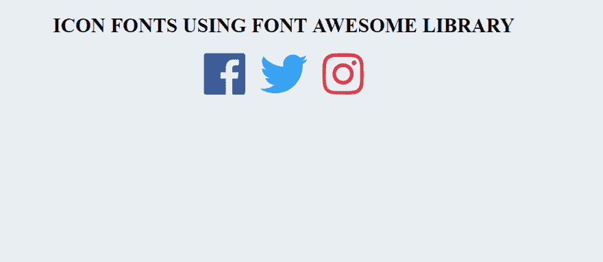](https://res.cloudinary.com/practicaldev/image/fetch/s--wEHJ04um--/c_limit%2Cf_auto%2Cfl_progressive%2Cq_auto%2Cw_880/https://cdn-images-1.medium.com/max/2398/1%2Anjq7KqRhOKye6lb7MSPjwQ.png)

有很多网站提供免费的图标字体包

*   [字体牛逼](https://fontawesome.com/)

*   icmoon

*   [Icofont](https://icofont.com/)

*   [喷泉](http://fontello.com/)

*   [Flaticon](https://www.flaticon.com/)

如果你想使用不同库中的图标创建一个自定义图标字体包，请访问 [Icomoon](https://icomoon.io/app) 应用页面。从您的系统导入图标文件或从 icomoon 库中挑选图标来构建您自己的自定义图标包。这样，你只需要在你的项目中添加你需要的图标，而不是包含几千个图标的臃肿的库文件。这将通过减少文件大小和服务器请求的数量来提高网站的性能。

图标字体无疑是网络图标最广泛的解决方案。然而，就像 CSS 图像精灵一样，图标字体正在失去 SVG 的支持。尽管图标字体是矢量，使它们可以缩放到任何分辨率，但它们仍然存在缺陷。使用图标字体会导致生成多个服务器请求，还会导致在字体库仍在加载期间不可见的文本闪烁。如果浏览器由于某种原因不能理解图标字体，就会显示一个空格。这就是为什么很多开发人员在图标字体和 SVG 图标中更喜欢后者的原因。

## 眼花缭乱的 SVG 图标！

正如我在介绍中所说的，SVG 代表“可伸缩矢量图形”。SVG 图标的主要目的是定义 XML 格式的矢量图形。SVG 图标正在慢慢赢得网络字体和图像新标准的地位。SVG 不是字体或图像，而是直接提供给浏览器的 XML 代码块，浏览器以预期的方式呈现它。越来越多的开发人员不再使用图标字体，而是采用 SVG。不仅提供 SVG 提供了无与伦比的能力，可以缩放到任何大小，没有任何质量下降，而且比图标字体更好的抗锯齿。此外，与传统的图标字体不同，您可以对 SVG 图标的每一位进行编辑、着色或制作动画。此外，由于 SVG 图标只是一个代码块，它们的大小要比基于图像的 PNG JPEG 图标小得多。尽管在文件大小方面，图标字体甚至超过了 SVG。稍后我会在博客中详细比较图标字体和 SVG 图标。

尽管使用 SVG 有多种方式，但我们最感兴趣的是**“Inline SVG”**。使用内嵌 SVG 图标而不是外部 SVG 图标的主要好处是，它不会增加服务器请求，这可能会对您的站点性能产生不利影响。这是一个内嵌 SVG 图像的例子——

```
<!DOCTYPE html>
<html>

<body>

   <h1>INLINE SVG</h1>

   
       <rect width="100%" height="100%" stroke="#9b59b6" stroke-width="5" fill="#2ecc71" />
       <circle cx="250" cy="250" r="150" fill="#f1c40f" stroke="#e74c3c" stroke-width="5" />
       <text x="250" y="250" font-size="20" text-anchor="middle" fill="black">THIS IS AN INLINE SVG</text>
       Sorry, your browser does not support inline SVG.
   

</body>

</html> 
```

Enter fullscreen mode Exit fullscreen mode

[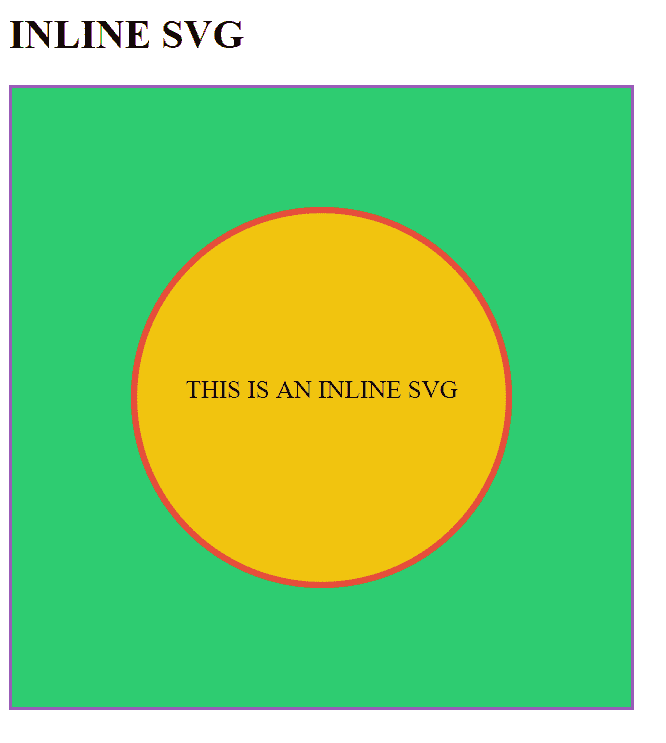](https://res.cloudinary.com/practicaldev/image/fetch/s--k09tlAI4--/c_limit%2Cf_auto%2Cfl_progressive%2Cq_auto%2Cw_880/https://cdn-images-1.medium.com/max/2000/1%2AQZiHyVHSpyg_Pbh3Au6E8Q.png)

***你知道吗？[用户选择无](https://www.lambdatest.com/web-technologies/user-select-none?utm_source=devto&utm_medium=organic&utm_campaign=jun15_sd&utm_term=sd&utm_content=web_technologies)描述了一种使用 CSS 防止文本/元素被选中的方法。它可以在所有主流浏览器上运行，包括 IE7 和更高版本。***

## 比较图标字体与 SVG 图标

现在倒叙已经结束了。我将比较图标字体和 SVG 图标。我们将着眼于 8 个关键指标来比较图标字体和 SVG 图标。

## 1。文件大小

当涉及到文件大小时，图标字体比 SVG 略胜一筹。如果在外部 SVG 图标文件上使用内联 SVG，您的文件可能会大得多。其中一个主要原因是，与外部 SVG 不同，浏览器不缓存内联 SVG。减小文件大小的一种方法是 SVG 精灵。然而，SVG 精灵只能使用过滤器或遮罩着色，这受到浏览器支持的影响。对于多色图标，使用 Inline-svg 是必要的。

**图标字体与 SVG 图标的评判** —文件大小:就文件大小而言，图标字体比 SVG 略占优势。然而，文件大小的差异并不显著，可以忽略不计。

## 2。易接近

SVG 图标相对于图标字体的一个主要优势是其卓越的可访问性。SVG 配备了内置的语义元素——比如< title >和< desc >,这使得它可以被屏幕阅读器和文本浏览器访问。与图标字体不同，SVG 被视为图像，而不是文本。此外，SVG 兼容 [WAI-ARIA](https://www.w3.org/WAI/intro/aria) 规范——aria-label edby 属性。

**对图标字体 vs SVG 图标的评判** —可访问性:当谈到可访问性时，SVG 是明显的赢家。

## 3。表演

正如我们之前所讨论的，图标字体是标准字体，可以很容易地被缓存并提高加载速度。然而，这个优点受到一个主要缺点的困扰——它需要额外的 HTTP 服务器请求来进行缓存。另一方面，内联 SVG 的情况正好相反。内联 SVG 不做任何额外的服务器请求，但是它不能被浏览器缓存，因为它被认为是 HTML 代码块。这可以通过使用外部 SVG 文件来解决。选择适合你的图标系统完全取决于你的需求——如果你需要几个没有任何彩色修改和动画的图标，那么图标字体是正确的选择。然而，如果你使用大量的彩色和动画图标，那么 SVG 应该是正确的选择。图标字体的另一个问题是它们可能会偶尔出现故障。加载错误会留下黑色空间，这会对页面设计产生不利影响。

**对图标字体与 SVG 图标的评判** —性能:SVG 稍有优势，因为图标字体容易偶尔出现故障。

## 4。可量测性

正如我们之前讨论的，图标字体被浏览器视为常规字体。因此，图标字体易受浏览器实施的抗锯齿技术的影响，这会影响图标的视觉质量，使其模糊不清。另一方面，浏览器将 SVG 视为图像，因此没有反走样规则应用于 SVG。这确保了 SVG 在所有分辨率下都是清晰的和像素完美的，而不会遭受任何明显的退化。

**对图标字体 vs SVG 图标的评判** —可扩展性:在可扩展性方面，SVG 比图标字体有很大的优势。

## 5。动画

虽然与图像图标相比，图标字体允许使用标准 CSS 样式规则进行适当程度的定制，但就灵活性而言，静态图标字体是有限的。CSS 样式修改仅限于单色、大小、标准变换和动画。SVG 不仅拥有与图标字体相同的 CSS 控件，还拥有额外的 CSS 笔画属性和过滤器。SVG 图标中的每一个单独的笔画都可以单独制作动画。例如时钟图标动画、邮件打开/关闭动画、通知铃声动画。SVG 允许修改向量的各个部分，以创建多色图标和图像，甚至可以单独为每个单独的笔画添加动画。

**对图标字体与 SVG 图标的评判** —动画:在修改和样式控制方面，SVG 比图标字体具有更高的通用性。

## 6。配置

由于图标字体是使用伪元素插入的，因此它们的定位有时很有挑战性。您可能需要调整不同的 CSS 属性，如字体大小、行高、单词间距、字母间距、垂直对齐，以将图标字体对齐到所需的位置。对于 SVG，定位要简单得多。您只需要指定大小。

**对图标字体和 SVG 图标的判断** —定位:与图标字体相比，定位 SVG 要容易得多。

## 7。部署

使用@font-face 规则、cdn 或 CSS 样式表，图标字体通常被认为部署起来更快、更简单。另一方面，有多种方法可以将 SVG 用作常规

图像、背景图像、对象或内嵌 SVG。内联 SVG 是目前最流行的部署 SVG 图标的方式，因为它允许高度的修改，而不会触发额外的服务器请求来消耗性能。

**图标字体与 SVG 图标的判决** —部署:没有明确的赢家。图标字体稍微容易部署，但是 SVG 的修改程度更高，性能更好。

## 8。跨浏览器兼容性

关于跨浏览器兼容性，图标字体比 SVG 有明显的优势。图标字体完全支持所有桌面和移动浏览器以及所有浏览器版本，包括传统的 IE6 到 IE8。尽管 SVG(基本支持)提供了除 IE8 及以下版本之外的所有浏览器的跨浏览器兼容性。类似的情况也出现在一些古老版本的 Android 浏览器、Firefox 和 Safari 上。

[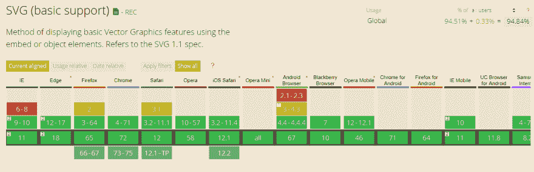](https://res.cloudinary.com/practicaldev/image/fetch/s--OU-ayBoi--/c_limit%2Cf_auto%2Cfl_progressive%2Cq_auto%2Cw_880/https://cdn-images-1.medium.com/max/3168/0%2Ab8pxvo9ByfDQ9MGb.png)

如果我们着眼于大规模实现 SVG，那么跨浏览器兼容性将是一个重大挑战。例如:

HTML 的 SVG 效果

[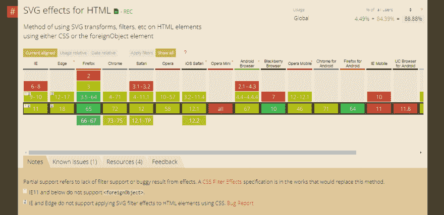](https://res.cloudinary.com/practicaldev/image/fetch/s--bjcWfXSN--/c_limit%2Cf_auto%2Cfl_progressive%2Cq_auto%2Cw_880/https://cdn-images-1.medium.com/max/2690/0%2AX-_G1g35WCZNZwP8.png)

如果你计划在 HTML 中使用 SVG 效果，那么一定要进行全面的跨浏览器测试。

→同样， **SVG Favicons** 也要求进行[跨浏览器兼容性测试](https://www.lambdatest.com/feature?utm_source=devto&utm_medium=organic&utm_campaign=jun15_sd&utm_term=sd&utm_content=webpage)。

[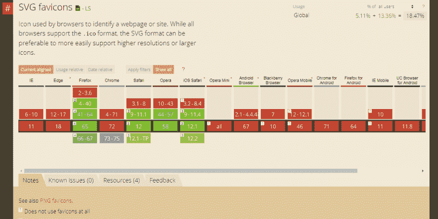](https://res.cloudinary.com/practicaldev/image/fetch/s--KBb_k2d---/c_limit%2Cf_auto%2Cfl_progressive%2Cq_auto%2Cw_880/https://cdn-images-1.medium.com/max/2610/0%2AJIYCvWrK_Gb6z9NG.png)

→或者，即使我们谈论 **SVG SMIL 动画**。众多浏览器版本仍然面临着浏览器兼容性问题。

[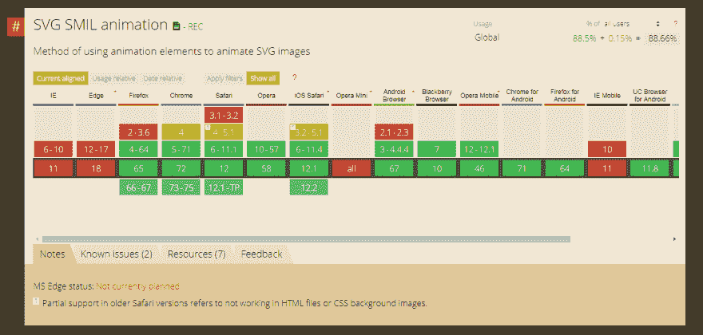](https://res.cloudinary.com/practicaldev/image/fetch/s--AIu4qbHc--/c_limit%2Cf_auto%2Cfl_progressive%2Cq_auto%2Cw_880/https://cdn-images-1.medium.com/max/2640/0%2AZ-2bG3T8ZgpBSjrD.png)

与图标字体相比，这是使用 SVG 的一个小缺点，图标字体享有全面的浏览器支持。还有一点担心，IE9–11 和 Microsoft edge 有时不能以正确的方式缩放 SVG，尽管这可以通过调整一些 CSS 规则很容易地纠正。

对于 SVG 爱好者来说，这看起来有点可怕和不幸。幸运的是，我们有[自动化跨浏览器测试工具](https://www.lambdatest.com/selenium-grid-online?utm_source=devto&utm_medium=organic&utm_campaign=jun15_sd&utm_term=sd&utm_content=webpage)，如 LambdaTest，它可以帮助我们快速识别任何异常，通过云上的 Selenium Grid 在 3000 多个真实浏览器和浏览器版本上渲染 SVG，并通过由 [LambdaTest](https://www.lambdatest.com/?utm_source=devto&utm_medium=organic&utm_campaign=jun15_sd&utm_term=sd&utm_content=webpage) 云服务器托管的 VM 加载到您所需的操作系统/浏览器配置上，对您的 web 应用进行手动实时交互测试。

**对图标字体与 SVG 图标的评判** —跨浏览器兼容性:与 SVG 相比，图标字体享有更广泛的跨浏览器兼容性支持。但是，您可以尝试通过使用必要的后备或聚合填充来堵塞这个缺口。

***检查这个: [Transforms3d](https://www.lambdatest.com/web-technologies/transforms3d?utm_source=devto&utm_medium=organic&utm_campaign=jun15_sd&utm_term=sd&utm_content=web_technologies) -用 Transform 属性在 3d 空间中变换你的设计元素。perspective 属性设置 z 空间中的透视，backface-visibility 属性切换已转换元素背面的显示。***

## 如何构建你的 SVG 图标系统？

图标字体为开发人员提供了一种便捷的方式，可以在几秒钟内将任何图标添加到他们的页面中。所有的图标都可以在一个本地或 CDN 上的文件中找到，你可以使用相应的类或代码轻松地选择任何要显示的图标。最流行的图标字体库之一是字体牛逼，我们在上面的例子中使用了它。我们现在希望有一个类似的 SVG 图标的功能，其中一个 SVG sprite 中捆绑了所有的图标。要构建这样的自定义 SVG 图标系统，首先需要选择单独的图标文件或从现有的字体图标库中选择。这些文件可以是图标字体或 svg 图标。如果它们是图标字体，您首先需要将它们转换成 SVG 图标。

## 步骤 1 —将 WOFF/TTF/OTF 转换成 SVG

将 WOFF/TTF/OTF 格式的图标字体转换成 SVG 图标的最佳工具是[在线字体转换工具](https://onlinefontconverter.com/)。访问网站，选择输出字体类型为 SVG。

[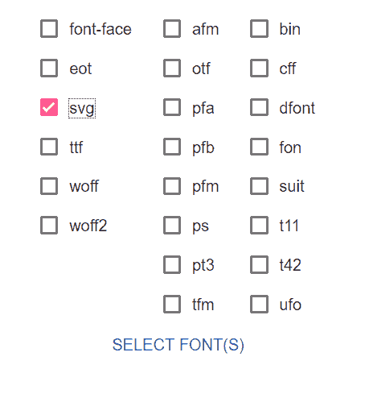](https://res.cloudinary.com/practicaldev/image/fetch/s--5onhOzEk--/c_limit%2Cf_auto%2Cfl_progressive%2Cq_auto%2Cw_880/https://cdn-images-1.medium.com/max/2000/0%2AZTi41AaIPMlE3Hxc.png)

现在提取 zip 文件，并将 svg 图标(SVG 扩展名)文件放在 fonts 文件夹中。将你所有的图标字体转换成 SVG 字体。

## 步骤 2 —构建您的 SVG 图标系统

现在一旦你有了所有的图标。svg”格式，我们就可以开始构建您定制的 SVG 图标系统了。对于这项任务，有多种工具可供我们使用——

1.  [IcoMoon App](https://icomoon.io/app/)

2.  [Fontastic](http://fontastic.me/)

3.  [喷泉](http://fontello.com/)

4.  [字体爆炸](https://www.npmjs.com/package/font-blast)

我推荐的最好的工具是 Fontastic 和 IcoMoon。Fontastic 提供的优于 IcoMoon 的一个优势是我们的 SVG sprite 的永久托管 CDN 链接，也可以免费使用。另一方面，IcoMoon 只提供临时的 24 小时 CDN 托管，永久保留给高级帐户用户。但是 IcoMoon 提供了更大的字体库选择，以及其他流行的第三方字体库。在这篇博客中，我将解释如何使用 IcoMoon 构建你的 Svg 图标系统。

现在您已经准备好构建 SVG 精灵了，上传您的自定义 SVG 图标并按照以下步骤操作

*   进入 IcoMoon 应用程序页面，点击“导入图标”

*   选择。svg 图标文件，您从在线字体转换器或任何其他 SVG 图标下载。选择文件并点击生成 SVG

[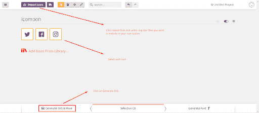](https://res.cloudinary.com/practicaldev/image/fetch/s--Ql1zpQwx--/c_limit%2Cf_auto%2Cfl_progressive%2Cq_auto%2Cw_880/https://cdn-images-1.medium.com/max/2000/0%2A8EVr8vV8J75WL1bk.png)

*   一旦解压了 Zip 文件，我们需要的文件是 **symbol-defs.svg** 和 **svgxuse.js** 。

除了上传自定义字体，您还可以使用现有的库(如 font awesome 和 linea)来选择项目中需要的 svg 图标。这将有助于减少文件大小，因为你不需要将整个库添加到您的项目中，只需进入 IcoMoon 应用程序主页并选择从库中添加图标。

[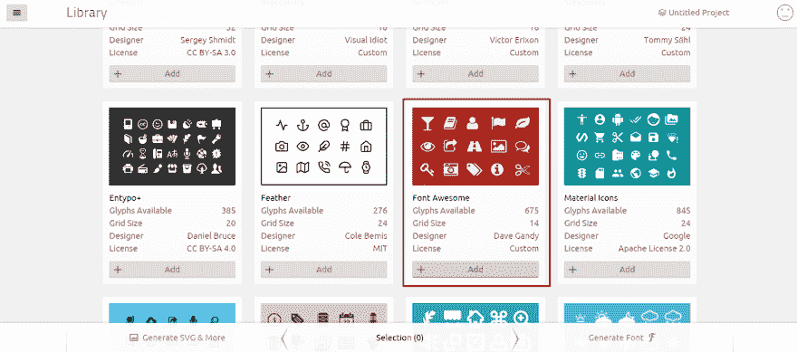](https://res.cloudinary.com/practicaldev/image/fetch/s--E7ZJsd-O--/c_limit%2Cf_auto%2Cfl_progressive%2Cq_auto%2Cw_880/https://cdn-images-1.medium.com/max/3200/0%2AugoINxWFm_nVfeD6.png)

## 步骤 3 —使用您的 SVG 图标系统

*   使用内嵌 SVG 的 SVG 图标系统。

*   要将图标作为内联 SVG(带有元素)插入，请复制< svg >元素(包含符号定义),然后使用带有以下代码的图标

    `<use xlink:href="#icon-twitter"></use>`

以下是使用我们的 SVG 图标系统的示例代码，该系统包含 3 个图标——Twitter、facebook 和 instagram 作为内嵌 SVG—

```
`<!doctype html>
<html>

<head>
   IcoMoon - Inline SVG
</head>

<body>
   <!--This SVG ELEMENT CONTAINS SVG DEFINITION-->
   
       <defs>
           <symbol id="icon-twitter" viewBox="0 0 32 32">
               twitter
               <path d="M32 7.075c-1.175 0.525-2.444 0.875-3.769 1.031 1.356-0.813 2.394-2.1 2.887-3.631-1.269 0.75-2.675 1.3-4.169 1.594-1.2-1.275-2.906-2.069-4.794-2.069-3.625 0-6.563 2.938-6.563 6.563 0 0.512 0.056 1.012 0.169 1.494-5.456-0.275-10.294-2.888-13.531-6.862-0.563 0.969-0.887 2.1-0.887 3.3 0 2.275 1.156 4.287 2.919 5.463-1.075-0.031-2.087-0.331-2.975-0.819 0 0.025 0 0.056 0 0.081 0 3.181 2.263 5.838 5.269 6.437-0.55 0.15-1.131 0.231-1.731 0.231-0.425 0-0.831-0.044-1.237-0.119 0.838 2.606 3.263 4.506 6.131 4.563-2.25 1.762-5.075 2.813-8.156 2.813-0.531 0-1.050-0.031-1.569-0.094 2.913 1.869 6.362 2.95 10.069 2.95 12.075 0 18.681-10.006 18.681-18.681 0-0.287-0.006-0.569-0.019-0.85 1.281-0.919 2.394-2.075 3.275-3.394z"></path>
           </symbol>
           <symbol id="icon-facebook" viewBox="0 0 32 32">
               facebook
               <path d="M29 0h-26c-1.65 0-3 1.35-3 3v26c0 1.65 1.35 3 3 3h13v-14h-4v-4h4v-2c0-3.306 2.694-6 6-6h4v4h-4c-1.1 0-2 0.9-2 2v2h6l-1 4h-5v14h9c1.65 0 3-1.35 3-3v-26c0-1.65-1.35-3-3-3z"></path>
           </symbol>
           <symbol id="icon-instagram" viewBox="0 0 32 32">
               instagram
               <path d="M16 2.881c4.275 0 4.781 0.019 6.462 0.094 1.563 0.069 2.406 0.331 2.969 0.55 0.744 0.288 1.281 0.638 1.837 1.194 0.563 0.563 0.906 1.094 1.2 1.838 0.219 0.563 0.481 1.412 0.55 2.969 0.075 1.688 0.094 2.194 0.094 6.463s-0.019 4.781-0.094 6.463c-0.069 1.563-0.331 2.406-0.55 2.969-0.288 0.744-0.637 1.281-1.194 1.837-0.563 0.563-1.094 0.906-1.837 1.2-0.563 0.219-1.413 0.481-2.969 0.55-1.688 0.075-2.194 0.094-6.463 0.094s-4.781-0.019-6.463-0.094c-1.563-0.069-2.406-0.331-2.969-0.55-0.744-0.288-1.281-0.637-1.838-1.194-0.563-0.563-0.906-1.094-1.2-1.837-0.219-0.563-0.481-1.413-0.55-2.969-0.075-1.688-0.094-2.194-0.094-6.463s0.019-4.781 0.094-6.463c0.069-1.563 0.331-2.406 0.55-2.969 0.288-0.744 0.638-1.281 1.194-1.838 0.563-0.563 1.094-0.906 1.838-1.2 0.563-0.219 1.412-0.481 2.969-0.55 1.681-0.075 2.188-0.094 6.463-0.094zM16 0c-4.344 0-4.887 0.019-6.594 0.094-1.7 0.075-2.869 0.35-3.881 0.744-1.056 0.412-1.95 0.956-2.837 1.85-0.894 0.888-1.438 1.781-1.85 2.831-0.394 1.019-0.669 2.181-0.744 3.881-0.075 1.713-0.094 2.256-0.094 6.6s0.019 4.887 0.094 6.594c0.075 1.7 0.35 2.869 0.744 3.881 0.413 1.056 0.956 1.95 1.85 2.837 0.887 0.887 1.781 1.438 2.831 1.844 1.019 0.394 2.181 0.669 3.881 0.744 1.706 0.075 2.25 0.094 6.594 0.094s4.888-0.019 6.594-0.094c1.7-0.075 2.869-0.35 3.881-0.744 1.050-0.406 1.944-0.956 2.831-1.844s1.438-1.781 1.844-2.831c0.394-1.019 0.669-2.181 0.744-3.881 0.075-1.706 0.094-2.25 0.094-6.594s-0.019-4.887-0.094-6.594c-0.075-1.7-0.35-2.869-0.744-3.881-0.394-1.063-0.938-1.956-1.831-2.844-0.887-0.887-1.781-1.438-2.831-1.844-1.019-0.394-2.181-0.669-3.881-0.744-1.712-0.081-2.256-0.1-6.6-0.1v0zM16 7.781c-4.537 0-8.219 3.681-8.219 8.219s3.681 8.219 8.219 8.219 8.219-3.681 8.219-8.219c0-4.537-3.681-8.219-8.219-8.219zM16 21.331c-2.944 0-5.331-2.387-5.331-5.331s2.387-5.331 5.331-5.331c2.944 0 5.331 2.387 5.331 5.331s-2.387 5.331-5.331 5.331zM26.462 7.456c0 1.060-0.859 1.919-1.919 1.919s-1.919-0.859-1.919-1.919c0-1.060 0.859-1.919 1.919-1.919s1.919 0.859 1.919 1.919z"></path>
           </symbol>
       </defs>
   

<header class="bgc1 clearfix">


           <use xlink:href="#icon-twitter"></use>
       <span class="name"> icon-twitter</span>


           <use xlink:href="#icon-facebook"></use>
       <span class="name"> icon-facebook</span>


           <use xlink:href="#icon-instagram"></use>
       <span class="name"> icon-instagram</span>

<script defer src="svgxuse.js"></script>
</body>

</html>` 
```

Enter fullscreen mode Exit fullscreen mode

*   使用您的 SVG 图标系统与外部 SVG。

如果您喜欢使用外部 SVG(包含)而不是在 HTML 中嵌入 SVG 定义，您将需要使用“svgxuse.js”来支持 IE 9+。不支持引用外部 SVG 的浏览器(比如 IE 9)，这个 polyfill 发送一个 HTTP 请求来获取和缓存所有的符号定义。请注意，它必须托管在 web 服务器上才能工作

```
`
                   <use xlink:href="symbol-defs.svg#icon-twitter"></use>
              <span class="name"> </span>` 
```

Enter fullscreen mode Exit fullscreen mode

下面是一个使用我们的 SVG 图标系统的示例代码，该系统包含 3 个图标——Twitter、facebook 和 instagram 作为内嵌 SVG—

```
 <!doctype html>
    <html>

    <head>
       IcoMoon - EXTERNAL SVG
    </head>

    <body>

    
           <use xlink:href="symbol-defs.svg#icon-twitter"></use>
       <span class="name"> </span>

    
           <use xlink:href="symbol-defs.svg#icon-facebook"></use>
       <span class="name"> </span>

    
           <use xlink:href="symbol-defs.svg#icon-instagram"></use>
       <span class="name"></span>

    <script defer src="svgxuse.js"></script>
       
           <use xlink:href="#icon-twitter"></use>
       

    </body>

    </html> 
```

Enter fullscreen mode Exit fullscreen mode

## 步骤 4 —如何设计 SVG 图标的样式

要设计 SVG 图标的样式，只需使用选择器–

```
`[class^="icon-"]and [class*=" icon-"]to apply styling.` 
```

Enter fullscreen mode Exit fullscreen mode

```
<style>
           [class^="icon-"],
           [class*=" icon-"] {
               display: inline-block;
               width: 1em;
               height: 1em;
               stroke-width: 0;
               stroke: currentColor;
               fill: currentColor;
           }
    </style> 
```

Enter fullscreen mode Exit fullscreen mode

有必要指定 svg 图标的宽度和高度，这样它就不会太大，与周围的文本和其他元素不成比例。这就是为什么我们将宽度和高度设置为 1em，使字体大小等于附近的文本。您可以给它任何您选择的自定义值。

***你知道吗？[文本笔划](https://www.lambdatest.com/web-technologies/text-stroke?utm_source=devto&utm_medium=organic&utm_campaign=jun15_sd&utm_term=sd&utm_content=web_technologies)声明文本的轮廓(笔划)宽度和颜色。***

## 那是我的意见。告诉我你的？！

图标字体与 SVG 图标的争论已经激烈了一段时间，双方都有各自的支持者支持各自的图标系统。然而，在最近一段时间，开发人员社区中出现了采用 SVG 图标的重大转变，并且没有减弱的迹象。就浏览器支持而言，SVG 与 IE9+和 Android 2.3+的图标字体齐头并进，因此覆盖了 99%以上的用户群，同时提供了更好的可访问性、可伸缩性和控制。

SVG 在跨浏览器兼容性方面确实有些困难。为了解决浏览器与 IE6-IE8 的兼容性问题，您可以采取一些补救措施——或者使用专门的文本或 PNG 图像形式的回退，使用 modernizr javascript 特性检测库，或者使用 Polyfill(如 SVG4Everybody)在不受支持的浏览器中添加类似 SVG 的功能。我将在我即将发表的一篇文章中向您展示这些补救措施。敬请期待！哦，别忘了提到你最喜欢的两个辩论，图标字体和 SVG 图标？