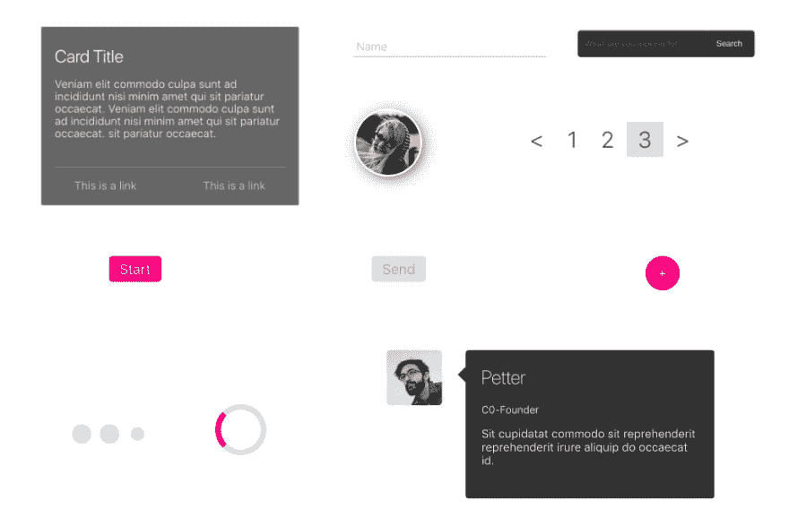
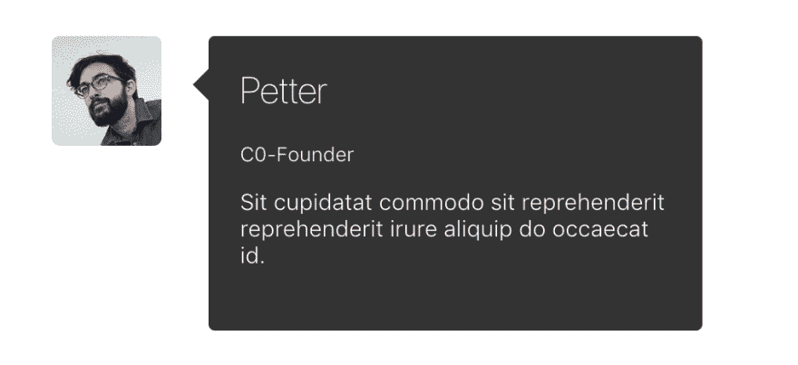
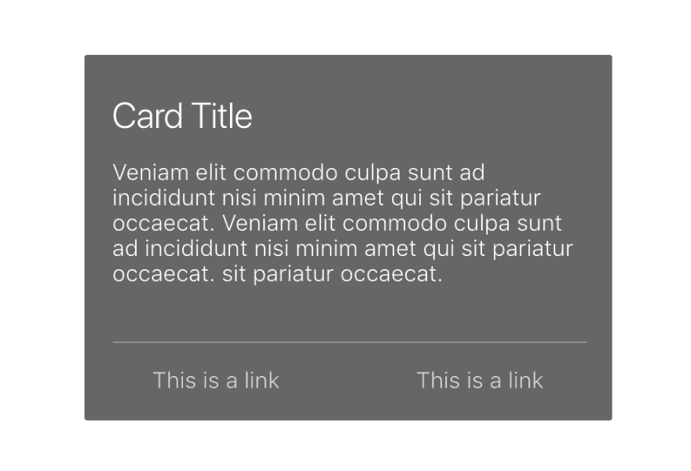
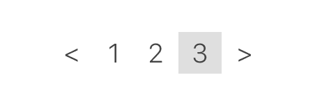

# 我想要的风格

> 原文：<https://dev.to/mariorodeghiero/iwant-style-1o0b>

iwant-style 库使用 JS 中的 CSS 导入现成的样式，以便与 styled-components 结合使用。

## 截图

[](https://res.cloudinary.com/practicaldev/image/fetch/s--nC8Fwz5O--/c_limit%2Cf_auto%2Cfl_progressive%2Cq_auto%2Cw_880/https://thepracticaldev.s3.amazonaws.com/i/qngpuh7xg7y80icfxs0k.png)

## 目录

*   [入门](#getting-started)
*   [用途](#usage)
*   [组件](#components)

## 获取开始

```
npm install iwant-style 
```

```
npm install styled-components 
```

## 用法

```
 import styled from 'styled-components';

  import { inputDark } from 'iwant-style';

  const Dark = styled.form` ${inputDark};
  `;

  ...
     <Dark action='' method=''>
      <input type='search' placeholder='What are you looking for?' />
      <button>Search</button>
    </Dark>
  ... 
```

## 组件

### 注释

[](https://res.cloudinary.com/practicaldev/image/fetch/s--STL0b1dw--/c_limit%2Cf_auto%2Cfl_progressive%2Cq_auto%2Cw_880/https://thepracticaldev.s3.amazonaws.com/i/tulft4p7ra61x9yuglt1.png)

##### 用法

```
 import styled from 'styled-components';

  import { comment } from 'iwant-style';

  const Comments = styled.div` ${comment} `;

  ...
   <Comments>
      <section>
        <h1>Petter</h1>
        <h2>C0-Founder</h2>
        <p>
          Sit cupidatat commodo sit reprehenderit reprehenderit irure aliquip do
          occaecat id.
        </p>
      </section>
      <div>
        
      </div>
    </Comments>
  ... 
```

##### 属性

| 名字 | 参数 | 默认 |
| --- | --- | --- |
| `${comment}` |  | `default` |

### 预加载器

[](https://res.cloudinary.com/practicaldev/image/fetch/s--XWKZbpK3--/c_limit%2Cf_auto%2Cfl_progressive%2Cq_auto%2Cw_880/https://thepracticaldev.s3.amazonaws.com/i/tk4tv227arvcs2qi62ob.png)

##### 用法

```
 import styled from 'styled-components';

  import { preloader } from 'iwant-style';

  const Preloader = styled.div` ${preloader};
  `;

  ...
    <Preloader>
        <div />
        <div />
        <div />
    </Preloader>
  ... 
```

##### 属性

| 名字 | 参数 | 默认 |
| --- | --- | --- |
| `${preloader}` |  | `bubbles` |
| `${preloaderCircle}` |  | `circle` |

## 预装圈

```
 import styled from 'styled-components';

  import { preloaderCircle } from 'iwant-style';

  const Preloader = styled.div` ${preloaderCircle};
  `;

  ...
    <Preloader>
        <div />
    </Preloader>
  ... 
```

### 头像

[](https://res.cloudinary.com/practicaldev/image/fetch/s--Cpd1mVDb--/c_limit%2Cf_auto%2Cfl_progressive%2Cq_auto%2Cw_880/https://thepracticaldev.s3.amazonaws.com/i/620kpnim4d7v6843glkt.png)

##### 用法

```
 import styled from 'styled-components';

  import { avatar } from 'iwant-style';

  const Avatar = styled.img` ${avatar};
  `;

  ...
    <Avatar src='https://s3-us-west-2.amazonaws.com/s.cdpn.io/331810/profile-sample9.jpg' />
  ... 
```

##### 属性

| 名字 | 参数 | 默认 |
| --- | --- | --- |
| `${avatar}` |  | `person` |

### 按钮

[](https://res.cloudinary.com/practicaldev/image/fetch/s--JDpYQXWi--/c_limit%2Cf_auto%2Cfl_progressive%2Cq_auto%2Cw_880/https://thepracticaldev.s3.amazonaws.com/i/kutr5nrqi08cvah9tz1z.png)

##### 用法

```
 import styled from 'styled-components';

  import { btn } from 'iwant-style';

  const Button = styled.button` ${btn};
  `;

  ...
    <Button>Start</Button>
  ... 
```

##### 属性

| 名字 | 参数 | 默认 |
| --- | --- | --- |
| `${btn}` |  | `square` |
| `${btn(param)}` | `"disable"` |  |
| `${btn(param)}` | `"round"` |  |

### 输入

[](https://res.cloudinary.com/practicaldev/image/fetch/s--cXggWnc8--/c_limit%2Cf_auto%2Cfl_progressive%2Cq_auto%2Cw_880/https://thepracticaldev.s3.amazonaws.com/i/sf5xes0d9x8f9ht7jzlq.png)

##### 用法

```
 import styled from 'styled-components';

  import { input } from 'iwant-style';

  const Input = styled.div` ${input};
  `;

  ...
     <Input>
      <input type='text' required />
      <span />
      <label>Name</label>
    </Input>
  ... 
```

## 黑暗

```
 import styled from 'styled-components';

  import { inputDark } from 'iwant-style';

  const Dark = styled.form` ${inputDark};
  `;

  ...
     <Dark action='' method=''>
      <input type='search' placeholder='What are you looking for?' />
      <button>Search</button>
    </Dark>
  ... 
```

##### 属性

| 名字 | 参数 | 默认 |
| --- | --- | --- |
| `${input}` |  | `animation` |

### 卡片

[](https://res.cloudinary.com/practicaldev/image/fetch/s--G141qAOL--/c_limit%2Cf_auto%2Cfl_progressive%2Cq_auto%2Cw_880/https://thepracticaldev.s3.amazonaws.com/i/9yqnv2rlsvot2rwfs1n6.png)

##### 用法

```
 import styled from 'styled-components';

  import { card } from 'iwant-style';

  const Card = styled.div` ${card};
  `;

  ...
     <Card>
       <h1>Card Title</h1>
        <p>
          Veniam elit commodo culpa sunt adincididunt nisi minim amet qui
          sit pariatur occaecat. Veniam elitcommodo culpa sunt ad
          incididunt nisi minim amet qui sitpariatur occaecat. sit pariatur
          occaecat.
        </p>
      <hr />
      <div>
        <a href='#'>This is a link</a>
        <a href='#'>This is a link</a>
      </div>
     </Card>
  ... 
```

##### 属性

| 名字 | 参数 | 默认 |
| --- | --- | --- |
| `${card}` |  | `info` |

### 分页

[](https://res.cloudinary.com/practicaldev/image/fetch/s--vm0zMTgT--/c_limit%2Cf_auto%2Cfl_progressive%2Cq_auto%2Cw_880/https://thepracticaldev.s3.amazonaws.com/i/x12hjkr632c62jqoahp2.png)

##### 用法

```
 import styled from 'styled-components';

  import { pagination } from 'iwant-style';

  const Pagination = styled.ul` ${pagination};
  `;

  ...
     <Pagination>
            <li>
              <a href='#'>&lt;</a>
            </li>
            <li>
              <a href='#'>1</a>
            </li>
            <li>
              <a href='#'>2</a>
            </li>
            <li>
              <a href='#'>3</a>
            </li>
            <li>
              <a href='#'>&gt;</a>
            </li>
    </Pagination>
  ... 
```

##### 属性

| 名字 | 参数 | 默认 |
| --- | --- | --- |
| `${pagination}` |  | `arrow` |

如果你喜欢这个项目，贡献改进或者在 GitHub 上给一个⭐️星。

谢谢！