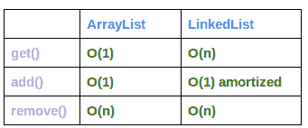
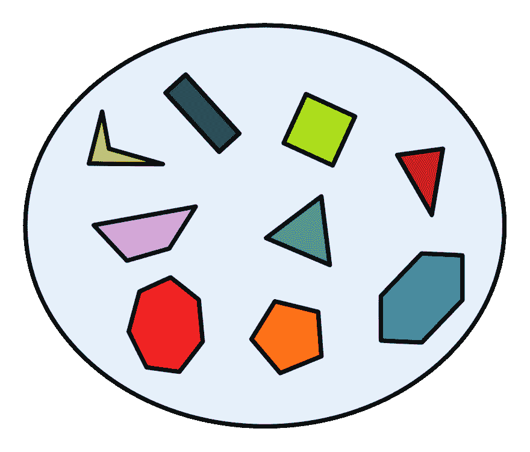
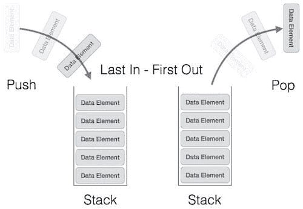
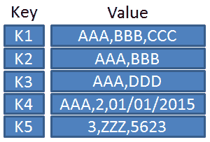

# Java 数据结构

> 原文：<https://dev.to/vrnsky/java-data-structures-417e>

## 界面列表

这个接口存在两个最常用的实现，它是 ArrayList 和 LinkedList。让我们更深入地了解每一项

### [t1 数组列表](#arraylist)

从这个结构的名字我们可以理解，它内部使用简单的数组。
但这种结构有一个动态的尺寸。增加一个使用的简单数组的`ensureCapacity()`方法允许。当此方法调用时，它检查已用数组的加载情况，如果需要，创建一个新数组，其容量等于当前数组的+ 60%。通过调用`System.arraycopy`方法，我们将旧数组中的所有元素复制到新数组中。获取、移除元素需要 O(1) -常数时间，因为我们有一个简单的数组。按索引查找操作需要 O(n)次操作，因为我们必须遍历所有数组。

### 链接列表

此结构基于对象，这些对象链接到列表中的下一个和上一个对象。这种结构从 ArrayList 中只有一个好处，在开始执行时插入比在 ArrayList 中执行要快。所以，这种结构对某些任务来说可能是好的，但是我还没有面对过这种任务。
[T3】](https://res.cloudinary.com/practicaldev/image/fetch/s--dNKvGmUG--/c_limit%2Cf_auto%2Cfl_progressive%2Cq_auto%2Cw_880/http://www.programcreek.com/wp-content/uploads/2013/03/arraylist-vs-linkedlist-complexity.png)

### 堆栈

这个结构为我们提供了下一个方法——推送、弹出、轮询。此外，它实现了后进先出法。例如，如果我们通过调用 pop 或 roll 来放置堆栈元素 10，2，123，我们会得到 123。但是从堆栈中取出 123。轮询不从堆栈中删除元素。在内部它使用一个简单的数组。

## 界面设置

[](https://res.cloudinary.com/practicaldev/image/fetch/s--O3_6iro6--/c_limit%2Cf_auto%2Cfl_progressive%2Cq_auto%2Cw_880/https://upload.wikimedia.org/wikipedia/commons/thumb/3/37/Example_of_a_set.svg/1200px-Example_of_a_set.svg.png) 
这种数据结构只为存储唯一元素而创建。如何检查元素不包含在集合中。为此，我们有一些实现。大家说说吧。第一个 HashSet 实现是通过从对象中调用 equals 来比较元素。第二个树集可能只存储实现 Comparable 接口的元素，或者您必须通过构造器实现为您的树集提供一个比较器。

### HashSet

在它内部使用 HashMap，可能只存储唯一的键。这种结构不保证插入顺序，这意味着在试图遍历这个集合时，我们从插入顺序中得到另一个顺序的元素。这个实现的基本操作——添加、删除、包含、调整大小——都有一个固定的时间。它是由散列函数提供的，散列函数执行一段固定的时间。

### 树集

如果 HashSet 基于 HashMap，那么 TreeSet 基于 TreeMap。这种数据结构保证了添加、删除和包含等操作的时间为 O(log(n))。这是因为在树形图中使用了树。这个集合保证了自然排序。例如:

```
Set numbers = new TreeSet<>();

numbers.add(2);

numbers.add(1);

for(Integer number : numbers) { System.out.println(number);} 
```

将会打印出来

```
1
2 
```

### LinkedHashSet

这个集合因 next 而出名——与以前实现不同，它保证了插入顺序。因此，通过迭代这个数据结构，您将看到元素的插入顺序。像前面的 set 实现一样，在内部使用 LinkedHashMap。当我们试图添加已经添加到集合中的元素时，这个操作不会影响元素的顺序。对于基本操作，它为添加、删除、包含操作提供了一个常数时间 O(n)。允许包含空元素。对于此集合的性能，使用两个变量- initialCapacity 和 loadFactor。首先描述内部使用的 map 的初始容量，其次声明何时必须增加 map 上的桶使用计数。

### 枚举集

这个实现是专门为枚举类型创建的。如果将每个批量操作(如 containsAll、retainAll)传递给此方法 EnumSet 实例，执行速度会更快。当迭代这个集合时，你会看到元素的自然排序。返回的迭代器不抛出 ConcurrenctModificationException。迭代器也可能显示修改，也可能不显示修改。所有基本操作同时执行。

### 可导航集

这个实现有一个很好的选项，如设置导航。这意味着我们可能得到比我们提供的更低或更大的元素。我们也可以得到一组比我们提供的更大或更小的元素。我们也可以通过调用 descendingSet 方法来反转这个集合

## 接口队列

这个集合使用 FIFO 机制，这意味着先入先出。在对其进行某些操作之前，我们可以先存储在这个集合元素中。存在添加、删除等所有基本操作。然而，这种方法存在于两个版本中。如果操作失败，第一个版本抛出异常，另一个版本不抛出异常并返回一个特殊值如`null`。允许将`null`添加到这个结构中。然而，实现这个接口的 LinkedList 允许我们插入`null`元素。这个方法没有提供并发访问它的方法。要在并发环境中使用队列，请使用 BlockingQueue，它提供了阻塞方法。

### 得缺

这种实现允许我们处理队列的两端-开始和结束。DE 是双端的首字母缩略词。可以创建严格大小的队列，也可以创建动态大小的队列。同样作为队列存在两个版本的基本操作方法。如果操作失败，一个版本抛出异常，另一个版本返回特殊值，通知我们操作失败。没有索引访问。

### 数组队列

从名字中我们清楚的了解到，这种队列基于简单的数组。不受大小限制，并根据需要确保阵列的容量。摊销时间内执行更多操作。

### 优先权

这个队列实现的主要工作是，当我们向集合中添加新元素时，将调用 sort 方法来获得集合中的正确顺序。在这种情况下，什么是优先级？很简单，因为 TreeSet 你的元素必须通过一些你必须选择的属性来比较，或者你必须提供一个比较器来比较你的元素在这个集合中的正确顺序。当您调用方法 poll(不是从集合中删除)时，您得到了当前具有最高优先级的元素。该集合为添加/提供、移除/拉取等操作提供了对数速度，为包含等操作提供了线性时间。
[T3】](https://res.cloudinary.com/practicaldev/image/fetch/s--9-9dfsiX--/c_limit%2Cf_auto%2Cfl_progressive%2Cq_auto%2Cw_880/https://www.tutorialspoint.com/data_structures_algorithimg/stack_representation.jpg)

## 界面图

[](https://res.cloudinary.com/practicaldev/image/fetch/s--BJoIdRPb--/c_limit%2Cf_auto%2Cfl_progressive%2Cq_auto%2Cw_880/https://upload.wikimedia.org/wikipedia/commons/5/5b/KeyValue.PNG)

### HashMap

从名字就可以清楚的看出这个结构里面使用了 hash 函数。此外，这种结构允许我们将空元素作为键或值。当迭代这个时，你会看到不在插入顺序的元素。对于这个结构的性能，使用两个通过构造函数传递给它的参数。它是负载系数和初始容量。初始容量决定了存储桶的数量。负载系数确定何时调用方法来确保桶的计数。

### 并发哈希表

此映射实现需要并发使用。相反，哈希映射这是映射的线程安全实现。此映射的实体标记为 volatile，这意味着所有线程必须具有此实体的实际版本。

### 导航地图

该接口扩展了 SortMap 接口，并添加了跨地图元素导航的方法——lower entry、floorEntry、ceilingEntry、higherEntry。这个方法可能会返回`null`。可以通过调用 descendingMap 以顺序和逆序遍历。也有导航方法，它提供用于提取诸如地图之类的部分地图的方法。(子/头/尾)图方法中的上下边界。它有获取最后一个和第一个元素的方法，因为在队列中存在这种方法的两个版本。

### [树图](#treemap)

它是基于可导航地图的红黑树。元素按自然顺序或比较器排序，比较器必须通过构造函数提供。

## 常见

除了 ConcurentHashMap 之外，所有这些结构都不是线程安全的。这意味着如果你想有几个线程必须有一个共享资源。所有这些都不适合你的任务。

我还注意到，当你试图在遍历操作中修改集合时，你得到了`ConcurrentModificationException`，它向你发出了试图在遍历操作中改变集合的信号。这是不允许的！对于这个操作，我们必须使用位于 java 特殊包中的并发数据结构。

UPD:
还注意到，当你在 iterate 的循环中试图移除元素时，会抛出注释`ConcurrentModificationException`。如果您想在迭代中从集合中移除一些元素。应该使用迭代器:

```
while(iterator.hasNext()) {
    if (iterator.next() == 1) {
        iterator.remove();
    }
} 
```

### 谢谢大家！

在推特上关注我:@VoronyanskyE