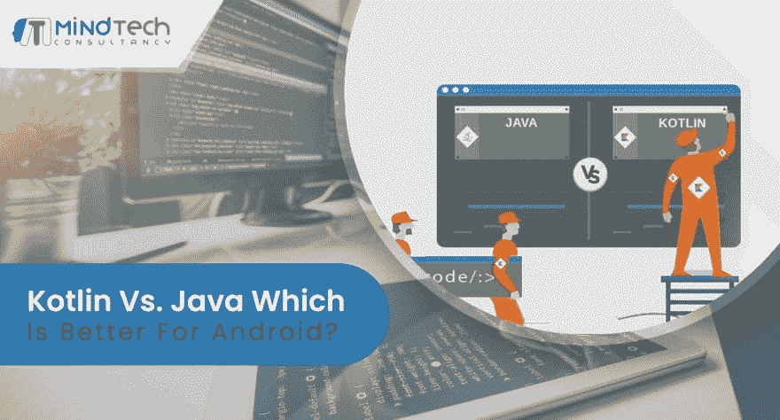

# Java 与 Kotlin 哪个更适合 Android 应用开发？

> 原文：<https://dev.to/mindtechcon/java-vs-kotlin-which-one-is-better-for-android-app-development-2oab>

> MindTech 顾问@ mindtechconsltJava vs . kot Lin:Android App 开发哪个更好？[bit.ly/JavaVSKotlin](https://t.co/3nBmqpU7gP)
> [#科特林](https://twitter.com/hashtag/Kotlin)[# Java](https://twitter.com/hashtag/Java)[#安卓](https://twitter.com/hashtag/Android)[#安卓](https://twitter.com/hashtag/Android) Dev [#appdev](https://twitter.com/hashtag/appdev) 私奔[# app Dev](https://twitter.com/hashtag/appdev)2019 年 3 月 05 日上午 05:300

**Kotlin 和 Java 哪个更适合开发 Android 应用？**
毫无疑问，Java 有自己的竞争对手，但随着时间的推移，我们都需要一些进步，因此我们总是在寻找更好的选择，以防万一。所以问题是应该选择哪种语言；科特林还是爪哇？那么答案就在这里，但同样的，观点是有依据的，因人而异。请记住，每种语言都有其优点和缺点，最后，你必须决定所有这些，哪一个你可以处理得很好。

如果我必须用简单的话来说，那么如果你有 Java 的工作知识，那么你可以从 Kotlin 开始开发 android 应用程序。但是如果你完全是 Android 应用开发的新手，选择 Java，因为它是 Android 开发的基石。

Sun 微系统公司开发了面向对象的编程语言 Java。并且目前归甲骨文所有。它于 1991 年引入，是一种如此古老的语言；它能为你提供更多。即使是 Java 也能给你提供更多的工作机会，因为人们总是不想开发 android 应用程序。我说过，它可以让你张开翅膀，让你飞到另一个领域。但我们是来开发 android 应用程序的，所以我们只谈这个。

Kotlin 于 2016 年推出，当时所有的开发人员都需要一种用于 Android 开发的现代语言，这种语言可以增加 Java 的质量，并有助于移动开发。JetBrains 创建了 Kotlin，这是一种基于 JVM 的开源语言。由于其基于静态 java 的语言，它可以用 Java 编译和解释。它有助于开发人员轻松更新旧的 Java 应用程序，人们可以轻松地将他们的工作从 Java 移植到 Kotlin。

[阅读全文](https://www.mindtechconsultancy.com/kotlin-vs-java-which-is-better-for-android/)