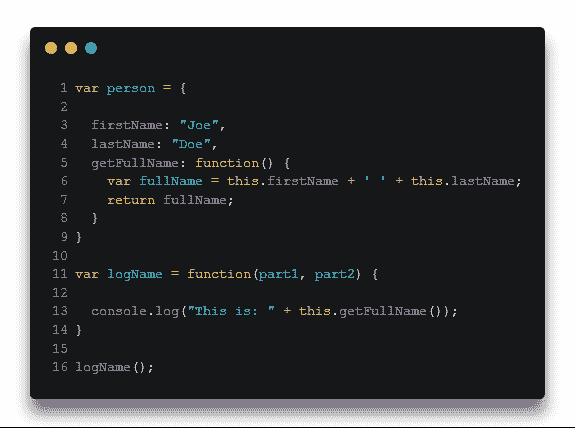
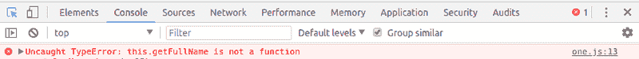
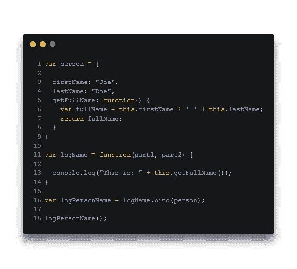
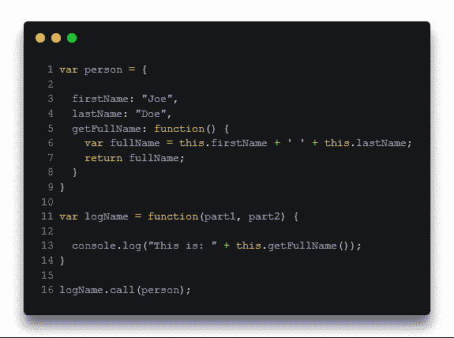
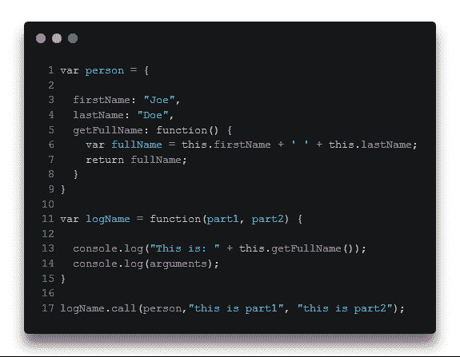
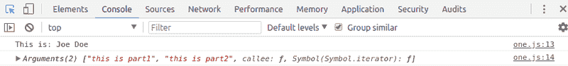
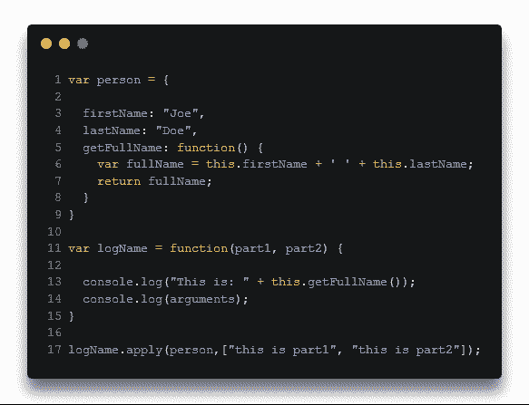
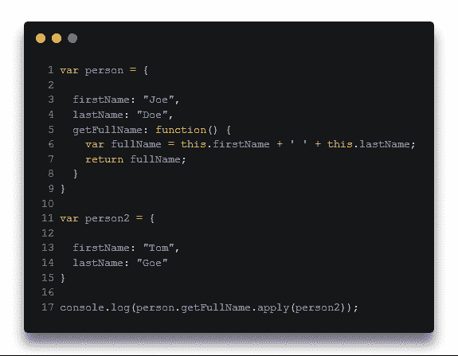
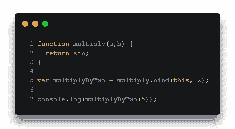

# JavaScript -绑定、调用、应用

> 原文：<https://dev.to/2nit/javascript---bind-call-apply-52ka>

*这实际上是由我们的 dev Bartosz 创建的博客文章系列[“初学者 JavaScript”](https://www.2n.pl/blog?tag=JavaScript+for+beginners_)的 20 个部分。所有的零件都可以在 [2n.pl](https://www.2n.pl/blog) 买到。*

函数是一种特殊类型的对象，有几个属性。我们已经在[的前一部分](https://www.2n.pl/blog/javascript-part-14)中讨论过了。为了更好地理解我们今天要处理的内容，让我们从一个例子开始。

调用函数后，我们将收到:

这里怎么了？
当然，在调用 *logName* 函数时，JavaScript 引擎看不到 *getFullName* 方法，该方法被分配给 *person* 对象。那样的话，能有这样的通路岂不是很好很惬意？

# **绑定**

在上面的例子中，我们使用了*绑定*函数。

多亏了这个函数，我们所做的就是将函数表达式 *logName* 与 *person* 对象结合起来，整个事情被保存在 *logPersonName* 变量中。但是它实际上是如何工作的呢？嗯，bind 函数创建了一个新的 *logName* 函数的副本。通过传递对象 *person* ，我们对我们想要我们的副本与之“组合”的内容产生了影响。 *logName* 函数表达式中的 *this* 变量将引用我们传递的对象。因为它实际上只是一个副本，所以我们可以调用它，就像我们在第十八行中所做的那样。

正如您所看到的，当您想要在对象外部的函数中访问该对象时，这非常有用。

# **谓**

这个函数非常类似于*绑定*。

如你所见，我们在 *logName* 上调用了 *call* 函数，并通过了这个人。结果将是相同的，但是在这种情况下，没有创建*日志名*函数的副本，而是调用了*日志名*函数本身。其实 *logName.call* 和 *logName()* 是一样的，都是调用一个函数。然而，使用*调用*函数，我们有更大的能力来影响我们想要实现的目标，我们可以影响*变量是否为*变量。当然，我们也可以给参数 *part1* 和 *part2* 传递两个实参。

# **敷**

这里我们有另一个类似的函数。使用它，我们还可以控制这个特殊变量应该是什么，但是我们在一个数组中传递参数。大概现在问题来了，它在现实生活中的实际用途是什么？

第一种情况是所谓的*函数借用*。

这里您可以看到，尽管在 person 对象上使用了 *getFullName* 方法，我们还是收到了*“Tom Goe”*。这是因为我们已经操纵了这个是什么特殊变量*。由于 *getFullName* 方法的返回值是变量 *fullName* ，在其中我们通过变量 this 表示 *firstName* 和 *lastName* 是引用它所调用的对象。*

下一种情况是*函数 currying】。*

这个例子与*绑定*相关，因为这样就创建了一个函数的副本。

它也不复杂。在*绑定*函数中，首先，我们传递给这个应该引用的特殊变量*。然后我们永久地设置第一个参数，在我们的例子中是 *a* 。结果是返回 *a * b* ，并且 *a* 总是等于 2。在调用函数的时候，我们只给出 *b* 参数应该等于什么。*

当然，如果我们通过 10 而不是 5，我们将得到 20。以此类推:)。