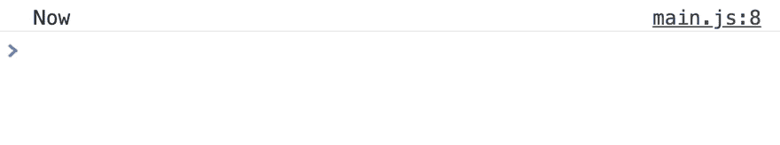
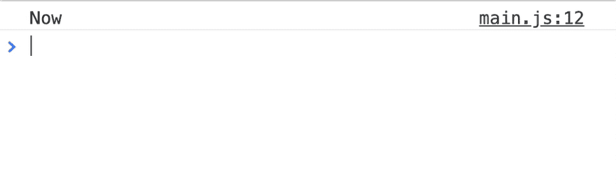
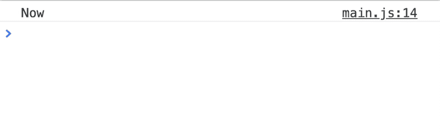

# JavaScript 异步和等待

> 原文：<https://dev.to/zellwk/javascript-async-and-await-561o>

异步 JavaScript 从来都不容易。有一段时间，我们使用回调。然后，我们用承诺。现在，我们有了异步函数。

异步函数使编写异步 JavaScript 变得更容易，但是它有自己的一套陷阱，这使得初学者很难上手。

在这个由两部分组成的系列文章中，我想分享您需要了解的关于异步函数的所有知识。

## 异步功能

异步函数包含`async`关键字。您可以在普通的函数声明中使用它:

```
async function functionName (arguments) {
  // Do something asynchronous
} 
```

您也可以在箭头函数中使用它。

```
const functionName = async (arguments) => {
  // Do something asynchronous
} 
```

## 异步函数总是返回承诺

你做什么`return`都没关系。返回值永远是一个承诺。

```
const getOne = async _ => { 
  return 1 
} 

const promise = getOne()
console.log(promise) // Promise 
```

注意:在继续之前，您应该知道什么是 JavaScript 承诺以及如何使用它们。否则，它会开始变得混乱。使用[这篇文章](https://zellwk.com/blog/js-promises/)来帮助你熟悉 JavaScript promises。

## await 关键字

当你给一个承诺打电话时，你要处理`then`电话中的下一步，就像这样:

```
const getOne = async _ => { 
  return 1 
} 

getOne()
  .then(value => {
    console.log(value) // 1
  }) 
```

关键字`await`让你等待承诺的解决。一旦承诺被解析，它就返回传递给`then`调用的参数。

```
const test = async _ => {
  const one = await getOne()
  console.log(one) // 1
}

test() 
```

### 返回恭候

没有必要在做出承诺之前`await`。你可以直接退回承诺。

(如果你`return await`有事，你先解决当初的承诺。然后，您根据解析的值创建一个新的承诺。`return await`有效地不做任何事情。不需要额外的步骤)。

```
// Don't need to do this 
const test = async _ => {
  return await getOne()
}

test()
  .then(value => {
    console.log(value) // 1
  }) 
```

```
// Do this instead
const test = async _ => {
  return getOne()
}

test()
  .then(value => {
    console.log(value) // 1
  }) 
```

注意:如果不需要`await`，就不需要使用异步函数。上面的例子可以改写如下:

```
// Do this instead
const test = _ => {
  return getOne()
}

test()
  .then(value => {
    console.log(value) // 1
  }) 
```

## 处理错误

如果一个承诺导致了一个错误，你用一个`catch`调用来处理它，就像这样:

```
const getOne = async (success = true) => { 
  if (success) return 1
  throw new Error('Failure!')
} 

getOne(false)
  .catch(error => console.log(error)) // Failure! 
```

如果你想在异步函数中处理一个错误，你需要使用一个`try/catch`调用。

```
const test = async _ => {
  try {
    const one = await getOne(false)
  } catch (error) {
    console.log(error) // Failure!
  }
}

test() 
```

如果你有多个关键字，错误处理会变得很难看...

```
const test = async _ => {
  try {
    const one = await getOne(false)
  } catch (error) {
    console.log(error) // Failure!
  }

  try {
    const two = await getTwo(false)
  } catch (error) {
    console.log(error) // Failure!
  }

  try {
    const three = await getThree(false)
  } catch (error) {
    console.log(error) // Failure!
  }
}

test() 
```

有更好的方法。

我们知道异步函数总是返回一个承诺。当我们调用一个承诺时，我们可以在一个`catch`调用中处理错误。这意味着我们可以通过添加`.catch`来处理来自异步函数的任何错误。

```
const test = async _ => {
  const one = await getOne(false)
  const two = await getTwo(false)
  const three = await getThree(false)
}

test()
  .catch(error => console.log(error))) 
```

注意:Promise `catch`方法只让您捕获一个错误。

## 多重等待

`await`阻止 JavaScript 执行下一行代码，直到一个承诺解决。这可能会降低代码执行速度，这是意料之外的结果。

为了在行动中显示这一点，我们需要在解决承诺之前创建一个延迟。我们可以用`sleep`函数创建一个延迟。

```
const sleep = ms => {
  return new Promise(resolve => setTimeout(resolve, ms))
} 
```

`ms`是解析前等待的毫秒数。如果将`1000`传入`sleep`，JavaScript 将在解析承诺前等待一秒钟。

```
// Using Sleep
console.log('Now')
sleep(1000)
  .then(v => { console.log('After one second') }) 
```

[](https://res.cloudinary.com/practicaldev/image/fetch/s--CfXDz_xB--/c_limit%2Cf_auto%2Cfl_progressive%2Cq_66%2Cw_880/https://zellwk.cimg/2019/async-await/sleep.gif)

假设`getOne`需要一秒钟来解决。为了创建这个延迟，我们将`1000`(一秒钟)传递给`sleep`。在一秒钟过去并且`sleep`承诺完成后，我们返回值 1。

```
const getOne = _ => {
  return sleep(1000).then(v => 1)
} 
```

如果你`await getOne()`，你会看到在`getOne`解决之前需要一秒钟。

```
const test = async _ => {
  console.log('Now')

  const one = await getOne()
  console.log(one)
}

test() 
```

[](https://res.cloudinary.com/practicaldev/image/fetch/s--efVLNNed--/c_limit%2Cf_auto%2Cfl_progressive%2Cq_66%2Cw_880/https://zellwk.cimg/2019/async-await/block-1.gif)

现在假设你需要等待三个承诺。每个承诺都有一秒钟的延迟。

```
const getOne = _ => {
  return sleep(1000).then(v => 1)
}

const getTwo = _ => {
  return sleep(1000).then(v => 2)
}

const getThree = _ => {
  return sleep(1000).then(v => 3)
} 
```

如果你连续说出这三个承诺，你必须等待三秒钟，然后这三个承诺才会被解决。这并不好，因为我们迫使 JavaScript 在做我们需要做的事情之前多等了两秒钟。

```
const test = async _ => {
  const one = await getOne()
  console.log(one)

  const two = await getTwo()
  console.log(two)

  const three = await getThree()
  console.log(three)

  console.log('Done')
}

test() 
```

[](https://res.cloudinary.com/practicaldev/image/fetch/s--5KjRgNR6--/c_limit%2Cf_auto%2Cfl_progressive%2Cq_66%2Cw_880/https://zellwk.cimg/2019/async-await/block-2.gif)

如果可以同时取出`getOne`、`getTwo`和`getThree`，你将节省两秒钟。你可以用`Promise.all`同时获取这三个承诺。

有三个步骤:

1.  创造三个承诺
2.  将所有三个承诺添加到一个数组中
3.  `await`带有`Promise.all`的承诺数组

下面是它的样子:

```
const test = async _ => {
  const promises = [getOne(), getTwo(), getThree()]
  console.log('Now')

  const [one, two, three] = await Promise.all(promises)
  console.log(one)
  console.log(two)
  console.log(three)

  console.log('Done')
}

test() 
```

[](https://res.cloudinary.com/practicaldev/image/fetch/s--qZ5hWaL8--/c_limit%2Cf_auto%2Cfl_progressive%2Cq_66%2Cw_880/https://zellwk.cimg/2019/async-await/block-3.gif)

关于基本的异步函数，你只需要知道这些！我希望这篇文章能为你澄清一些事情。

注:本文是对[学习 JavaScript](https://learnjavascript.today) 的修改摘录。如果你觉得这篇文章有用，你可能想看看。

接下来，我们将看看异步函数及其在循环中的行为。

* * *

感谢阅读。这篇文章最初发表在我的博客上。如果你想要更多的文章来帮助你成为一个更好的前端开发者，请注册[我的时事通讯](https://zellwk.com)。