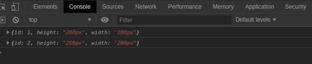
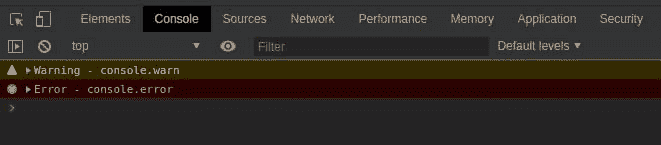
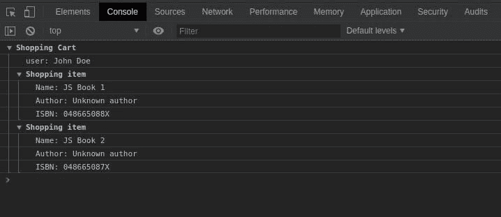
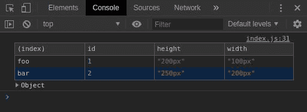
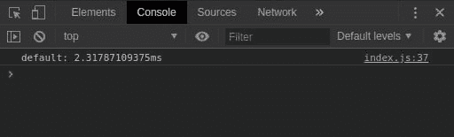

# JavaScript 控制台不仅仅是 console.log()

> 原文：<https://dev.to/grigorkh/javascript-console-is-more-than-console-log-1ddj>

JavaScript 解决任何问题的最直接的方法之一是利用 console.log 记录东西。但是控制台提供了许多其他方法，可以帮助您更好地调试。
就从它开始吧。记录一个字符串或许多 JavaScript 对象是非常基本的用例。
就这样，

```
console.log('Where am I?'); 
```

Enter fullscreen mode Exit fullscreen mode

假设我们有一个场景，我们有很多对象，需要将它们登录到控制台。

```
const foo = { id: 1, height: '200px', width: '100px' };
const bar = { id: 2, height: '250px', width: '200px' }; 
```

Enter fullscreen mode Exit fullscreen mode

只有 console.log(变量)一个接一个才是最直观的记录方式。当我们看到它如何出现在控制台上时，问题就变得更加明显了。
[](https://res.cloudinary.com/practicaldev/image/fetch/s--uR4UhIuE--/c_limit%2Cf_auto%2Cfl_progressive%2Cq_auto%2Cw_880/https://cdn-images-1.medium.com/max/800/1%2AgAa5QYfDbHAFyhmmnCDbGQ.jpeg) 
可以看到，变量名是不可见的。有时，当你有很多输出，并且必须一个接一个地展开它们来理解它是哪个对象或变量时，这变得很困难或者很烦人。
避免这种情况的一个解决方案是使用 console.log，如下所示:

```
console.log({ foo, bar }); 
```

Enter fullscreen mode Exit fullscreen mode

这也减少了我们代码中 console.log 行的数量。

## console . warn()&console . error()

根据具体情况，您可以使用 console.warn()或 console.error()添加日志，以确保您的控制台更具可读性。在某些浏览器中，console.info()还会显示一个“I”图标。
[T3】](https://res.cloudinary.com/practicaldev/image/fetch/s--CixrcMt2--/c_limit%2Cf_auto%2Cfl_progressive%2Cq_auto%2Cw_880/https://cdn-images-1.medium.com/max/800/1%2A2MjDrIUS3osamDcUcY96NQ.jpeg)

## console.group()

这可以在将相关细节分组或嵌套在一起时使用，以便于阅读日志。如果一个函数中有几个 log 语句，并且希望每个语句的范围清晰可见，也可以使用这个方法。
例如，如果你记录了一个购物车的详细信息:

```
console.group('Shopping Cart');
console.log('user: John Doe');
// Group Start
console.group('Shopping item');
console.log('Name: JS Book 1');
console.log('Author: Unknown author');
console.log('ISBN: 048665088X');
console.groupEnd();
// Group strat
console.group('Shopping item');
console.log('Name: JS Book 2');
console.log('Author: Unknown author');
console.log('ISBN: 048665087X');
console.groupEnd();
console.groupEnd(); 
```

Enter fullscreen mode Exit fullscreen mode

[](https://res.cloudinary.com/practicaldev/image/fetch/s--6W-UktsX--/c_limit%2Cf_auto%2Cfl_progressive%2Cq_auto%2Cw_880/https://cdn-images-1.medium.com/max/800/1%2Ay4AU-1nMfEwYQpid3BcdoQ.jpeg)

## 控制台.表()

我们可以更进一步，将所有这些放在一个表格中，使其更具可读性。每当您拥有具有公共属性的对象或对象数组时，请使用 console.table()。这里可以使用 Console.table({foo，bar })，控制台显示:
[](https://res.cloudinary.com/practicaldev/image/fetch/s--n46JFsUF--/c_limit%2Cf_auto%2Cfl_progressive%2Cq_auto%2Cw_880/https://cdn-images-1.medium.com/max/800/1%2AMLxvfr-stJjw5yLBPAH9sw.jpeg)

## console.trace()

这将显示到达您调用 console.trace()的点所采用的调用路径

## console.time()

启动一个计时器，您可以用它来跟踪一个操作需要多长时间。您给每个计时器一个唯一的名称，并且在一个给定的页面上可以运行多达 10，000 个计时器。当您使用相同的名称调用 console.timeEnd()时，浏览器将输出计时器启动后经过的时间(以毫秒为单位)。

```
console.time();
for (let i = 0; i < 100000; i++) {
  // some code
}
console.timeEnd(); 
```

Enter fullscreen mode Exit fullscreen mode

[](https://res.cloudinary.com/practicaldev/image/fetch/s--0bbhy2Yu--/c_limit%2Cf_auto%2Cfl_progressive%2Cq_auto%2Cw_880/https://cdn-images-1.medium.com/max/800/1%2AWtUif7a4ipUZSyt1dSdEDw.jpeg)

## console.clear()

清除控制台。控制台的内容将被替换为类似“控制台已被清除”的信息性消息。

## console.dir()

console.dir 是在控制台中查看指定 JavaScript 对象的所有属性的方法，通过它我们可以很容易地获得对象的属性。

## 喜欢学习？

在 twitter 上关注我，我会在这里发布所有最新最棒的 JavaScript、AI、DevOps、VR/AR、技术和科学！也在 [LinkedIn](https://www.linkedin.com/in/grigorkh/) 上和我联系吧！