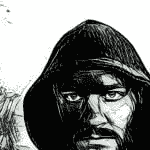

# Javascript 事件，回到基础

> 原文：<https://dev.to/richardj/javascript-events-going-back-to-basics-33p>

在我之前的[帖子](https://dev.to/richardj/javascript-events--868)中，我想讨论一种在文档级别上的单个事件处理程序的方法，它可以监听某些元素或其子元素上的点击事件。通过遍历`event.path`,我将检查路径中是否有一个类，如果是，就调用一个函数。

[](/richardj) [## Javascript 事件

### r☭2 月 21 日 191 分钟阅读

#javascript #discuss #question #optimization](/richardj/javascript-events--868)

虽然这在 Chrome 中有效，`event.path`并没有得到广泛的支持，所以我不得不回过头来实现一个不同的解决方案，这次是通过使用`event.parentElement`。

```
 document.addEventListener('click', function(event) {
        let element = findAncestor(event.target, '.message');

        if (element) {
                  runFunction();
        }
    });

    function findAncestor(element, sel) {
      while ((element = element.parentElement) && !((element.matches || element.matchesSelector).call(element,sel)));
      return element;
    }; 
```

Enter fullscreen mode Exit fullscreen mode

显然可以使用 polyfill，还有类似于`event.composedPath`的东西，在 [Stack Overflow - event.path 中有更多关于 Firefox](https://stackoverflow.com/questions/39245488/event-path-undefined-with-firefox-and-vue-js) 未定义的内容。