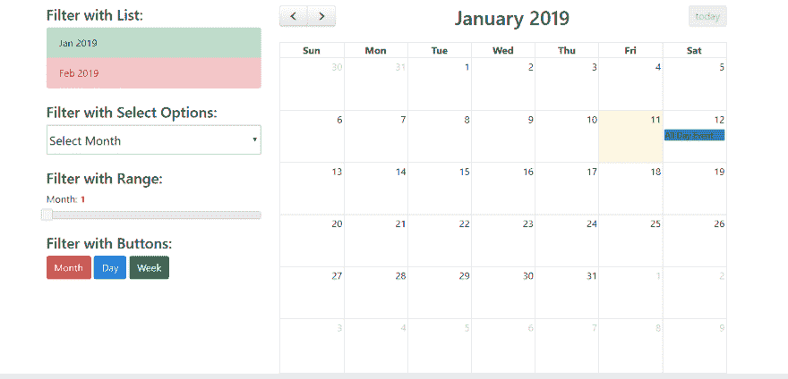

# 带有自定义过滤器的 Javascript FullCalendar

> 原文：<https://dev.to/ajaydeveloper/javascript-fullcalendar-with-custom-filters-lnj>

大家好，欢迎来到 therichpost.com。在这篇文章中，我将告诉你，带有自定义过滤器的 Javascript FullCalendar。

Javascript FullCalendar 非常受欢迎，我已经分享了许多与 [FullCalendar](https://therichpost.com/category/fullcalendar) 相关的帖子。

在这里，我也使用了 Bootstrap，JqueryUI。这只是一个例子，在按钮点击和 jQuery UI 范围选择器事件中，你可以检查整个日历的变化行为。

* * *

[](https://res.cloudinary.com/practicaldev/image/fetch/s--b_EQDyp---/c_limit%2Cf_auto%2Cfl_progressive%2Cq_auto%2Cw_880/https://therichpost.com/wp-content/uploads/2019/01/Javascript-FullCalendar-with-custom-Filters-1.png)

* * *

### **这是工作代码，你可以将它添加到你的 html 或任何其他文件中；**

```
<!DOCTYPE html><html><head><meta charset='utf-8' /><link rel="stylesheet" href="https://maxcdn.bootstrapcdn.com/bootstrap/4.1.3/css/bootstrap.min.css"><link href='https://fullcalendar.io/releases/fullcalendar/3.9.0/fullcalendar.min.css' rel='stylesheet' /><link href='https://fullcalendar.io/releases/fullcalendar/3.9.0/fullcalendar.print.min.css' rel='stylesheet' media='print' /><script src='https://fullcalendar.io/releases/fullcalendar/3.9.0/lib/moment.min.js'></script><script src='https://fullcalendar.io/releases/fullcalendar/3.9.0/lib/jquery.min.js'></script><script src='https://fullcalendar.io/releases/fullcalendar/3.9.0/fullcalendar.min.js'></script><link rel="stylesheet" href="https://code.jquery.com/ui/1.12.1/themes/base/jquery-ui.css"><script src="https://code.jquery.com/ui/1.12.1/jquery-ui.js"></script><script> $(document).ready(function() { /\*Month Range\*/ $( "#slider-range-max" ).slider({ range: "max", min: 1, max: 12, value: 0, slide: function( event, ui ) { $( "#amount" ).val( ui.value ); $('#calendar').fullCalendar('changeView', 'month', ui.value); $('#calendar').fullCalendar('gotoDate', "2019-"+ui.value+"-1"); } }); $( "#amount" ).val( $( "#slider-range-max" ).slider( "value" ) ); /\*Click On Months\*/ $(".months li").on("click", function(event) { $('#calendar').fullCalendar('changeView', 'month', $(this).attr("id")); $('#calendar').fullCalendar('gotoDate', "2019-"+$(this).attr("id")+"-1"); }); /\*Select On Months\*/ $(".select\_month").on("change", function(event) { $('#calendar').fullCalendar('changeView', 'month', this.value); $('#calendar').fullCalendar('gotoDate', "2019-"+this.value+"-1"); }); /\*FullCalendar Implemetation \*/ $('#calendar').fullCalendar({ header: { left: 'prev,next', center: 'title', right: 'today' }, defaultDate: new Date(), navLinks: true, // can click day/week names to navigate views editable: true, eventLimit: true, // allow "more" link when too many events events: [{ title: 'All Day Event', start: '2019-01-12' }] }); /\*Buttons click\*/ $(".btn").on('click', function(event) { $('#calendar').fullCalendar('changeView', $(this).attr("id")); }); });</script><style type="text/css"> .months li, #slider-range-max .ui-state-hover{cursor: pointer;}</style></head><body> <div class="jumbotron text-center"> <h1>Full-Calendar with Filters</h1> <p>Here you can check Full-Calendar with Filters!</p> </div> <div class="container"> <div class="row"> <div class="col-sm-4"> <h4>Filter with List:</h4> <ul class="list-group months"> <li class="list-group-item list-group-item-success" id="1">Jan 2019</li> <li class="list-group-item list-group-item-danger" id="2">Feb 2019</li> </ul> <br> <h4>Filter with Select Options:</h4> <select name="cars" class="custom-select-lg select\_month" style="width: 100%"> <option selected>Select Month</option> <option value="1">Jan 2019</option> <option value="2">Feb 2019</option> </select> <br><br> <h4>Filter with Range:</h4> <label for="amount">Month:</label> <input type="text" id="amount" readonly style="border:0; color:#f6931f; font-weight:bold;"> <div id="slider-range-max"></div> <br> <h4>Filter with Buttons:</h4> <button type="button" class="btn btn-danger" id="month">Month</button> <button type="button" class="btn btn-primary" id="agendaDay">Day</button> <button type="button" class="btn btn-success" id="agendaWeek">Week</button> </div> <div class="col-sm-8"> <div id='calendar'></div> </div> </div> </div> <div class="jumbotron text-center" style="margin-bottom:0"> <p>Footer</p> </div></body></html> 
```

Enter fullscreen mode Exit fullscreen mode

如果你对这篇文章有任何疑问，或者你想要更高级的完整日历，那么你可以在下面评论或者提问。

哈尔哈斯

TheRichPost

带有自定义过滤器的 Javascript FullCalendar 帖子首先出现在[的 therichpost](https://therichpost.com) 上。