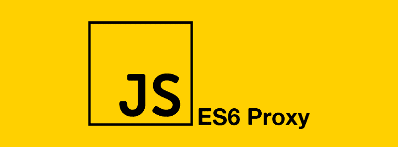

# Javascript:让我们创建一个代理

> 原文：<https://dev.to/dipsaus9/javascript-lets-create-aproxy-19hg>

[](https://res.cloudinary.com/practicaldev/image/fetch/s--kK6pxDCN--/c_limit%2Cf_auto%2Cfl_progressive%2Cq_auto%2Cw_880/https://thepracticaldev.s3.amazonaws.com/i/an69durihrjheclh5wy2.png)

两周前，我和马蒂斯一起参加了 Vue.js 和 Frontend love 会议。我强烈推荐每个人都来参加这个会议，因为在这一周里我学到了很多。激发我写这篇文章的演讲之一是约翰·林德奎斯特的演讲。Egghead.io 的联合创始人 Lindquist 在第一天谈到了 JavaScript 中代理的力量，重点是 Vue.js。

我听说过 JavaScript 中的代理对象，但我从来不知道用它可以实现什么。林德奎斯特创造了一些例子，他称之为:“约翰·林德奎斯特有坏主意”。但是当他提出不好的想法时，你可以清楚地看到代理对象的好处和可能性。更多信息请查看他的回购:[https://github.com/johnlindquist/has-bad-ideas](https://github.com/johnlindquist/has-bad-ideas)

## 有许多赃物的 Getters 和 setters

根据 Chuks El-Gran Opia 的文章《JavaScript 代理快速入门》,简单来说，代理是拥有大量 swag 的 getters 和 setters。代理对象用于定义基本操作的自定义行为。简单来说，代理的行为类似于原始对象，但是现在你可以用一些新的函数来干预原始行为。例如，使用代理对象，您可以:

*   扩展构造函数
*   操作 DOM 节点
*   值检查和额外属性检查
*   跟踪属性访问
*   捕获函数调用
*   还有更多！

代理对象可以包含以下三个属性。

**目标**
提供属性访问的方法。这类似于操作系统中陷阱的概念

**处理程序**
包含补漏白的占位符对象。

**陷阱**
代理虚拟的对象。它通常用作代理的存储后端。针对目标验证关于对象不可扩展性或不可配置属性的不变量(保持不变的语义)。

***来源:[https://developer . Mozilla . org/en-US/docs/Web/JavaScript/Reference/Global _ Objects/Proxy](https://developer.mozilla.org/en-US/docs/Web/JavaScript/Reference/Global_Objects/Proxy)*T5】**

您可以像使用任何其他对象一样使用代理对象。

```
const proxyEl = new Proxy(target, handler); 
```

Enter fullscreen mode Exit fullscreen mode

了解这些属性的最好方法是使用它们。

## 回到未来

第一次听说代理对象时，我将它与对象实例上的 defineProperty 函数进行了比较。静态 defineProperty 函数直接在对象上定义新属性，或者修改对象上的现有属性，并返回该对象。在这个函数中，你还可以在 JavaScript 的低级键上操作对象的 getters 和 setters。例如:

```
const silObject = Object.defineProperty({}, 'condition', {
   get() {
      return 'is crazy';
   },
   set() {
       throw 'You may not change the condition of Sil, Sil is way too crazy and will kill you';
   }
}); 
```

Enter fullscreen mode Exit fullscreen mode

这里我定义了一个名为 silObject 的对象。在这个例子中，我从一个空对象开始，并添加了属性条件，因为我们想知道 Sil 是不是疯了。这个对象的奇怪之处在于，如果我们将 silObject 记录到控制台，我们看不到这个对象的任何属性，这个对象是空的。

```
console.log(silObject) // {} 
```

Enter fullscreen mode Exit fullscreen mode

但是如果我们想检查 silObject 的条件，我们可以调用 condition 属性。

```
console.log(silObject.condition) // is crazy 
```

Enter fullscreen mode Exit fullscreen mode

Sil 向我抱怨了这个例子，因为他想改变自己的状况。

```
silObject.condition = 'Sil is not crazy!' //error: You may not change the condition of Sil, Sil is way too crazy and will kill you 
```

Enter fullscreen mode Exit fullscreen mode

这个例子展示了 JavaScript 在低调层次上的操纵能力。这个例子最糟糕的部分是我们必须为对象中的所有属性定义这些函数。Opia 在他的文章中为此写了一个完美的例子。

```
class Staff {
  constructor(name, age) {
    this._name = name;
    this._age = 25;
  }
  get name() {
    console.log(this._name);
  }
  get age() {
    console.log(this._age);
  }
  set age(newAge) {
    this._age = newAge;
    console.log(this._age)
  }
};

const staff = new Staff("Jane Doe", 25);

staff.name; // "Jane Doe"
staff.age; // 25
staff.age = 30; // 30 
```

Enter fullscreen mode Exit fullscreen mode

这只能在带有 getters 和 setters 的新类方法中实现。但我认为这还是太抽象了，所以让我们在对象层次上写一个函数。

```
const staff = {
  name: "Jane Doe",
  age: 25
};

Object.keys(staff).forEach(key => {
  let internalValue = staff[key];

  Object.defineProperty(staff, key, {
    get() {
      console.log(internalValue);
    },
    set(newVal) {
      internalValue = newVal;
      console.log(internalValue);
    }
  });
});

staff.name; // “Jane Doe”
staff.age; // 25
staff.age = 30; // 30 
```

Enter fullscreen mode Exit fullscreen mode

我们现在在 ES6 的类实例中有了 get 和 set 函数，所以 Object.defineProperty 将不再被经常使用。这个函数的唯一区别是你可以改变一些更深层次的属性。例如，使用 defineProperty 函数，您可以更改对象的可枚举属性。如果你想了解更多，请查阅文档:[https://developer . Mozilla . org/en-US/docs/Web/JavaScript/Enumerability _ and _ ownership _ of _ properties](https://developer.mozilla.org/en-US/docs/Web/JavaScript/Enumerability_and_ownership_of_properties)

## 让我们建立一些代理

代理对象可以实现类似的功能，但是在更抽象的层次上。

```
const sil = {
  condition: 'Super normal'
}

const silObject = new Proxy(sil, {
   get() {
     console.log('Sil is crazy');
   },
   set() {
       throw 'You may not change the condition of Sil, Sil is way too crazy and will kill you';
   }
});

silObject.condition; // Sil is crazy
silObject.condition = 'Super awesome'; // You may not change the condition of Sil, Sil is way too crazy and will kill you 
```

Enter fullscreen mode Exit fullscreen mode

这几乎和之前的例子一样，但是我们没有操作原来的对象，而是定义了一个新的 silObject，它是我们基于 Sil 的代理。此外，我们正在为整个对象创建 get 和 set 属性，而不是当时的单个属性。这意味着我们可以在一个对象上创建一些验证。

```
const validator = {
  set(obj, prop, value) {
    if (prop === 'age') {
      if (!Number.isInteger(value)) {
        throw new TypeError('The age is not an integer');
      }
      if (value > 200) {
        throw new RangeError('The age seems invalid');
      }
    }

    // The default behavior to store the value
    obj[prop] = value;

    // Indicate success
    return true;
  }
};

let person = new Proxy({}, validator);

person.age = 100;
console.log(person.age); // 100
person.age = 'young'; // Throws an exception
person.age = 300; // Throws an exception 
```

Enter fullscreen mode Exit fullscreen mode

这里我们可以看到一个使用代理对象进行验证的例子。

那么现在我们已经看到了大量的例子，我们什么时候才能使用代理来做一些有用的事情呢？你可以用代理来解决很多问题。当你写一个可扩展的插件甚至框架时，这种严格性会非常有用。尤雨溪通过在 Vuemastery 上编写一些观察函数，写了一个如何使用代理的完美例子。这段代码不是我的，而是 Vuemastery 写的。[https://www . vue mastery . com/courses/advanced-components/Evan-you-on-proxy/](https://www.vuemastery.com/courses/advanced-components/evan-you-on-proxies/)

首先，我们从数据集开始。

```
let target = null;
let data = { price: 5, quantity: 2 }; 
```

Enter fullscreen mode Exit fullscreen mode

在这里，我们编写一个依赖类，在其中我们可以存储所有的值，这些值可以在以后用于一个监视函数。我们检查属性是否被定义并且还没有被包含。这样，我们可以为数据对象中的每个属性创建一个依赖项。Dep 类是 Vuemastery 在前面的课程中创建的，我在本文中不做解释([https://www . vue mastery . com/courses/advanced-components/build-a-reactivity-system](https://www.vuemastery.com/courses/advanced-components/build-a-reactivity-system))。根据要求，我将撰写另一篇文章，介绍如何在 JavaScript 中创建反应性的依赖类。

```
// Our simple Dep class

class Dep {
  constructor() {
    this.subscribers = [];
  }
  depend() {
    if (target && !this.subscribers.includes(target)) {
      // Only if there is a target & it's not already subscribed
      this.subscribers.push(target);
    }
  }
  notify() {
    this.subscribers.forEach(sub => sub());
  } 
} 
```

Enter fullscreen mode Exit fullscreen mode

之后，我们可以通过创建一个映射来为所有属性创建一个依赖关系。

```
let deps = new Map(); // Let's store all of our data's deps in a map

Object.keys(data).forEach(key => {
  // Each property gets a dependency instance
  deps.set(key, new Dep());
}); 
```

Enter fullscreen mode Exit fullscreen mode

如果你想了解更多关于布景和地图的知识，可以看看我的另一个博客！

我们现在创建了一个带有两个依赖项的映射，每个属性一个。从这里我们可以写我们的代理！

```
let data_without_proxy = data // Save old data object

data = new Proxy(data_without_proxy, {  // Override data to have a proxy in the middle
  get(obj, key) {
    deps.get(key).depend(); // <-- Remember the target we're running
    return obj[key]; // call original data
  },

  set(obj, key, newVal) {
    obj[key] = newVal; // Set original data to new value
    deps.get(key).notify(); // <-- Re-run stored functions
    return true;
  }
}); 
```

Enter fullscreen mode Exit fullscreen mode

所以现在我们有了一个新的数据对象。这里要记住的最重要的事情是，我们根据之前创建的依赖关系调用了一些钩子。如果我们想调用一个数据属性，它会检查属性是否有依赖关系。

现在我们只需要为我们的依赖关系写一个逻辑。

```
// The code to watch to listen for reactive properties
function watcher(myFunc) {
  target = myFunc;
  target();
  target = null;
}

let total = 0

watcher(() => {
  total = data.price * data.quantity;
}); 
```

Enter fullscreen mode Exit fullscreen mode

和 tadaa，我们有一个依赖于我们的数据的总属性。如果我们现在改变价格或数量，总数也会改变。

```
console.log(total); // 10
data.price = 20;
console.log(total); // 40
data.quantity = 10;
console.log(total); // 200 
```

Enter fullscreen mode Exit fullscreen mode

在这之后，我们可以很容易地创建更多的观察员！

```
deps.set('discount', new Dep())
data['discount'] = 5;

let salePrice = 0;

watcher(() => {
  salePrice = data.price - data.discount;
});

console.log(salePrice); // 15
data.discount = 7.5
console.log(salePrice); // 12.5 
```

Enter fullscreen mode Exit fullscreen mode

查看完整的工作代码签出[https://codepen.io/dipsaus9/pen/EMmevB](https://codepen.io/dipsaus9/pen/EMmevB)

代理对象也可以返回一个函数。在 GitHub 上，Lindquist 有一个名为 createApi 的例子。

```
const createApi = url =>
  new Proxy(
    {},
    {
      get(target, key) {
        return async function(id = "") {
          const response = await fetch(`${url}/${key}/${id}`);
          if (response.ok) {
            return response.json();
          }

          return Promise.resolve({ error: "Malformed Request" });
        }
      }
    }
  );

let api = createApi("https://swapi.co/api"); 
```

Enter fullscreen mode Exit fullscreen mode

api 现在是我们的代理对象，基本 URL 为'[https://swapi.co/api'](https://swapi.co/api%E2%80%99)，因为谁不喜欢星球大战。现在我们来找一些星球大战的人。

```
(async () => {
   //'get' request to https://swapi.co/api/people
   let people = await api.people();

   //'get' request to https://swapi.co/api/people/1
   let person = await api.people(1);
})(); 
```

Enter fullscreen mode Exit fullscreen mode

在这里，我们看到了一些代理对象的例子，以及如何使用它们为自己服务。有创造性地使用它，并记住用例。我要感谢约翰·林德奎斯特、尤雨溪和 Vuemastery，感谢他们精彩的例子和演讲。他们真的帮助我理解了代理的力量。

**来源:**

*   vue mastery-[https://www . vue mastery . com/courses/advanced-components/Evan-you-on-proxy/](https://www.vuemastery.com/courses/advanced-components/evan-you-on-proxies/)
*   约翰·林德奎斯特:有坏主意-[https://github.com/johnlindquist/has-bad-ideas](https://github.com/johnlindquist/has-bad-ideas)
*   chuks El-Gran Opia-[https://medium . freecodecamp . org/a-quick-intro-to-JavaScript-proxy-55695 ddc4 f 98](https://medium.freecodecamp.org/a-quick-intro-to-javascript-proxies-55695ddc4f98)