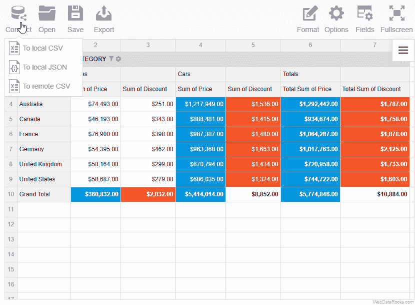

# 用于数据可视化和报告的 JavaScript 库。免费开发工具。你的想法？

> 原文：<https://dev.to/antonina/javascript-library-for-data-visualization-and-reporting-free-dev-tool-your-thoughts--1l8l>

大家好！

想和大家分享一个我们团队正在做的非商业项目。

我们真的相信可视化和分析完全震撼了这个行业。此外，我们的团队相信未来是面向 web 解决方案的。这就是我们将产品命名为 WebDataRocks 的原因:)

这个工具是由开发者创造的，也是为开发者服务的。因此，我们将非常感谢技术社区的意见。

### 简要介绍 WebDataRocks 数据透视表

这是一个免费的可嵌入 JavaScript 库，以聚合的方式可视化数据。

更具体地说，它是一个类似 Excel 的数据透视表，允许在浏览器中创建动态报表。它可以处理高达 1MB 的 CSV 和 JSON 数据。

### 开发者的主要价值

这是一个免费的现成和设计良好的工具。简单地与框架和其他库集成。可定制和可本地化。

因此，任何开发人员都可以将它添加到任何需要数据分析的 web 项目中。

感兴趣吗？-为了让您了解这个工具的功能，让我告诉您更多关于它的核心特性。

### 分析

您有一个非汇总数据，这里您可以使用 web 报告工具来做些什么:

*   通过将所需成员拖动到行和列中，用字段列表组织数据
*   通过选择要在报告中显示的所需成员来过滤数据
*   通过多级层次结构对数据进行分组

WebDataRocks 支持 13 种类型的聚合，如总和、计数、平均值、最小值、最大值、差值等。如果对你的报告来说还不够，还有计算值，你可以在那里设置你自己的函数。

### 可视化

配置好报告后，您还可以:

*   展开、折叠和排序值
*   穿透单元格查看非聚合值
*   格式化单元格以设置所需的数字格式
*   通过设置条件格式为单元格着色，并突出显示所需的值

旋转网格看起来像这样。

[](https://res.cloudinary.com/practicaldev/image/fetch/s--O_qAF-by--/c_limit%2Cf_auto%2Cfl_progressive%2Cq_66%2Cw_880/https://thepracticaldev.s3.amazonaws.com/i/ynyks8aker4n2mofpadk.gif)

**作为奖励**
预定义的主题、本地化文件、现成的集成包装器——所有这些都可以方便开发者的工作。

**Plus:** 报表可以保存、导出(PDF、Excel、HTML)和打印。

**让我们测试它并创建一个报告:**

首先下载 WebDataRocks(有几个选项[怎么做](https://www.webdatarocks.com/doc/download/)，选择最适合你的。我在这个例子中会提到 CDN)

其次，将 WebDatarocks 添加到 HTML 文件中的标记:
之间

```
 <html>
<head></head>
<body>
<div id="wdr-component"></div>
<link href="https://cdn.webdatarocks.com/latest/webdatarocks.min.css" rel="stylesheet"/>
<script src="https://cdn.webdatarocks.com/latest/webdatarocks.toolbar.min.js"></script>
<script src="https://cdn.webdatarocks.com/latest/webdatarocks.js"></script>
<script>
var pivot = new WebDataRocks({
    container: "#wdr-component",
    toolbar: true,
    report: {
        dataSource: {
            filename: "https://cdn.webdatarocks.com/data/data.csv"
        }
    }
});
</script>
</body>
</html> 
```

最后一步-加载您的数据:

将您的 URL 以 CSV 或 JSON 文件的形式直接添加到报告中。只需在*文件名* :
中指定你的文件的网址

```
filename: "URL-to-your-CSV-or-JSON-file" 
```

仅此而已。报告准备好了！

[](https://res.cloudinary.com/practicaldev/image/fetch/s--T3gu32AF--/c_limit%2Cf_auto%2Cfl_progressive%2Cq_66%2Cw_880/https://thepracticaldev.s3.amazonaws.com/i/pusfb0xep2mjvlr4ndgj.gif)

更详细的信息见[文档](https://www.webdatarocks.com/doc/intro/)。

查看完整代码:
[https://codepen.io/webdatarocks/embed/NwYbVm?height=600&default-tab=result&embed-version=2](https://codepen.io/webdatarocks/embed/NwYbVm?height=600&default-tab=result&embed-version=2)

你还在吗？:-) -感谢阅读！

你觉得怎么样？有什么你可以用它的想法或案例吗？
请分享。